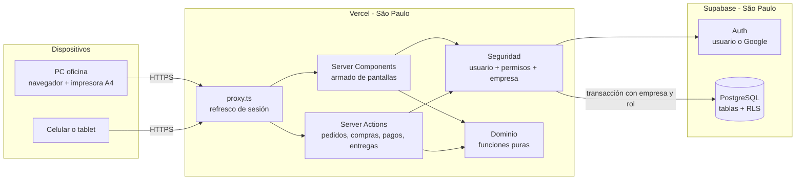
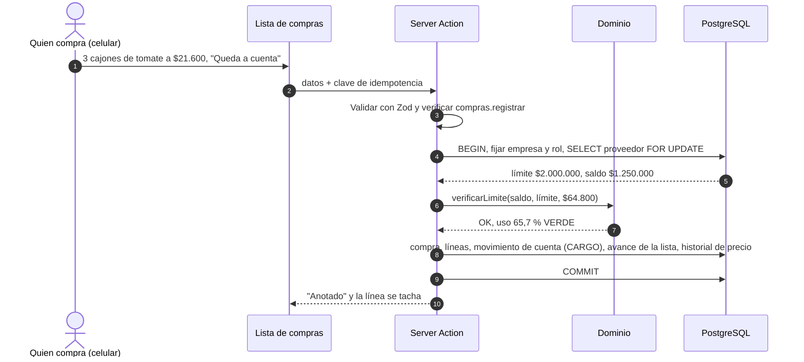

# 01 — Tipo de aplicación y arquitectura

**Propósito:** qué tipo de aplicación es, con qué tecnología está hecha, cómo se organiza el código y qué medidas técnicas cumple (seguridad, respaldos, rendimiento).

**Contenido**

1. [Decisión](#1-decisión)
2. [Dónde se usa](#2-dónde-se-usa)
3. [Tecnología](#3-tecnología)
4. [Arquitectura](#4-arquitectura)
5. [Módulos](#5-módulos)
6. [Estructura del repositorio](#6-estructura-del-repositorio)
7. [Dominio y convenciones de código](#7-dominio-y-convenciones-de-código)
8. [Multi-empresa](#8-multi-empresa)
9. [Seguridad](#9-seguridad)
10. [Auditoría](#10-auditoría)
11. [Respaldos](#11-respaldos)
12. [Entornos y publicación](#12-entornos-y-publicación)
13. [Rendimiento y uso en el celular](#13-rendimiento-y-uso-en-el-celular)
14. [Zona horaria y fecha operativa](#14-zona-horaria-y-fecha-operativa)
15. [Riesgos técnicos](#15-riesgos-técnicos)

Documentos relacionados: 02 (permisos), 03 (tablas y campos), 04 (circuito), 08 (pantallas), 10 (estado y puesta en marcha); la guía técnica está en `docs/tecnico/`.

---

## 1. Decisión

**Aplicación web responsive** con **un solo código y un solo servidor** para computadora y celular. Se abre desde el navegador y se puede agregar a la pantalla de inicio del celular, con su ícono, para abrirla sin la barra del navegador (`app/manifest.ts`). Sin app nativa.

| Pregunta | Respuesta |
|---|---|
| ¿Cómo se abre? | Desde el navegador, en la dirección que dé el hosting, o desde el acceso directo del celular. |
| ¿Los datos son los mismos en la PC y en el celular? | Sí: una compra anotada en el mercado se ve al instante en la oficina. |
| ¿Se puede imprimir? | Sí: cada lista tiene su vista A4 con el botón **Imprimir** (o "Guardar como PDF" del navegador para compartirla). |
| ¿Funciona sin señal? | No: necesita conexión (los datos móviles alcanzan). La lista de compras se puede imprimir antes de ir al mercado. |

---

## 2. Dónde se usa

Lo usan dos personas (el dueño y su esposa), las dos con acceso completo.

| Momento | Lugar | Dispositivo | Qué implica |
|---|---|---|---|
| Tarde o noche anterior | Casa u oficina | Celular (con WhatsApp al lado) o PC | Carga de pedidos rápida y visual, en recuadros grandes. |
| Madrugada | Mercado | Celular, una mano ocupada | Lista de compras con botones grandes y "✓ Lo compré" en un toque; alto contraste. |
| Mañana | Depósito | Celular, tablet o la hoja impresa | Preparación por cliente: "Está todo" o "Falta algo" con el motivo. |
| Mañana | Reparto | Celular | Viaje con el orden de las paradas y GPS; confirmación de cada entrega. |
| Resto del día | Oficina | PC con impresora A4 | Precios, cuentas con proveedores, facturación, balance. |

---

## 3. Tecnología

| Pieza | Para qué |
|---|---|
| **Next.js 16 (App Router)** + React 19 | Interfaz y servidor en un solo proyecto: *Server Components* para leer y armar las pantallas, *Server Actions* para las escrituras. `proxy.ts` refresca la sesión. |
| **TypeScript** | Todo el código, con tipos compartidos entre base, dominio e interfaz. |
| **Tailwind CSS 4** | Estilos, con colores definidos como variables para el modo claro y el oscuro. Los componentes son propios (`src/ui`). |
| **PostgreSQL en Supabase** | Base de datos: transacciones, `numeric` exacto para dinero, restricciones y **Row Level Security**. |
| **Supabase Auth** | Ingreso con usuario y contraseña o con Google; las cuentas nuevas quedan como pedido de acceso (02 §10). |
| **Drizzle ORM** | Esquema tipado, consultas y migraciones. |
| **Zod** | Validación de toda entrada en el servidor. |
| **decimal.js** | Dinero, precios y cantidades (nunca `number`). |
| **date-fns** y `@date-fns/tz` | Fechas en la zona horaria de la empresa. |
| **fflate** | Arma el Excel de la exportación para el contador (siempre el mismo archivo para el mismo período) y la planilla modelo de productos, y lee la planilla que se sube. |
| **Leaflet** + mapas de OpenStreetMap | El mapa incrustado para marcar la ubicación de un cliente o del depósito (se carga solo al abrirlo). |
| **Vistas HTML de impresión** (`@media print`, A4) | Todos los documentos imprimibles. |
| **Vercel** | Hosting, en São Paulo junto a la base. |
| **Vitest** y **PGlite** | Pruebas del dominio y de integración contra PostgreSQL en memoria, sin Docker. |

**Región:** base y funciones en **São Paulo**, para que la ida y vuelta entre el servidor y la base sea mínima.

---

## 4. Arquitectura

### 4.1 Componentes



### 4.2 Responsabilidades

| Capa | Hace | No hace |
|---|---|---|
| Navegador | Muestra pantallas y formularios, imprime (`window.print()`). | Nunca se conecta a la base ni calcula precios definitivos. |
| `proxy.ts` | Refresca la sesión (cookies httpOnly) y manda al ingreso si no hay sesión. | No decide permisos. |
| Server Components | Leen datos **ya filtrados por permiso** y arman la pantalla. | No escriben. |
| Server Actions | Una acción = un caso de uso = **una transacción**: validan con Zod, verifican el permiso, llaman al dominio, graban y auditan. Devuelven un mensaje que dice qué pasó y cómo seguir. | No contienen cálculos (están en el dominio). |
| Dominio (`src/dominio`) | Cálculos puros y probados: precios de venta, unidades, lista de compras, saldos, semáforo, imputación, faltantes, pasos del día. | No accede a la base, la red ni el reloj. |
| PostgreSQL | Persistencia, integridad (claves, `check`, `unique`), inmutabilidad por triggers y aislamiento por empresa (RLS). | No contiene la lógica de precios. |

### 4.3 Una escritura típica: "✓ Lo compré" a cuenta



- El `SELECT … FOR UPDATE` sobre el proveedor **serializa** lo que cambia su saldo: dos compras simultáneas no superan juntas el límite.
- Si la compra supera el límite, no se graba nada y se explica cuánto pagar o cómo seguir (06 §9).
- La clave de idempotencia evita duplicar la compra por un doble toque o un reintento de la red.

---

## 5. Módulos

Cada módulo es dueño de sus tablas (solo él las escribe) y ofrece consultas y acciones al resto. El código está en `src/modulos/<módulo>`.

| Código | Módulo | Carpeta | Tablas |
|---|---|---|---|
| M01 | Catálogo de productos | `catalogo` | categoria, producto, presentacion |
| M02 | Clientes | `clientes` | cliente, punto_entrega |
| M03 | Proveedores | `proveedores` | proveedor |
| M04 | Precios de compra | `precios-compra` | proveedor_producto, historial_precio_compra |
| M05 | Precios de venta y márgenes | `precios-venta` | regla_precio (y los recargos de empresa, categoría, producto y cliente) |
| M06 | Pedidos y tablero | `pedidos` | pedido, pedido_item |
| M07 | Jornada y lista de compras | `jornadas`, `compras/lista-compra` | jornada, lista_compra, lista_compra_item |
| M08 | Compras | `compras` | compra, compra_item |
| M09 | Cuentas con proveedores | `compras/cuenta` | pago_proveedor, imputacion_pago_proveedor, movimiento_cuenta_proveedor |
| M10 | Preparación | `entregas/preparacion` | (actualiza entrega y entrega_item) |
| M11 | Repartos, entregas y viaje | `entregas` | reparto, entrega, entrega_item |
| M12 | Documentos imprimibles | `entregas/documentos` | documento_emitido |
| M13 | Facturación interna | `facturacion` | factura, factura_entrega |
| M16 | Reportes y balance | `reportes` | (solo lectura) |
| M17 | Configuración | `configuracion` | empresa, secuencia |
| M18 | Usuarios y seguridad | `usuarios`, `seguridad` | usuario, rol, usuario_rol |
| M19 | Auditoría | `src/db/auditoria.ts` | auditoria |
| M20 | Colaboración | `colaboracion` | nota, nota_lectura, actividad |

Correspondencia con el circuito:

| Paso del circuito | Módulos |
|---|---|
| 1–2. Pedido del cliente | M02, M06 (precio estimado con M05) |
| 3. Cantidades a comprar | M07 (DOC-01) |
| 4. Proveedores y precios | M04 (DOC-06) |
| 5–6. Compras, contado o a cuenta | M08 |
| 7. Deuda con cada proveedor | M09 (DOC-05) |
| 8. Preparación por cliente | M10 (DOC-07) |
| 9. Lista de entrega sin precios | M11 + M12 (DOC-02, DOC-04) |
| 10. Entrega | M11 |
| 11. Lista contable con precios | M12 + M13 (DOC-03) |
| 12. Venta registrada | M13 (DOC-08), M16 |

El cálculo de precios de venta necesita el costo real de las compras del día: lo lee con una consulta de solo lectura (`compradoPorProducto`), sin que M05 dependa de las acciones de M08.

---

## 6. Estructura del repositorio

Organización por **dominio**, no por tipo técnico. Nombres en español; los propios del framework en inglés (`page.tsx`, `layout.tsx`).

```text
sistema-repartos/
├─ app/
│  ├─ (publico)/        login, crear-cuenta, crear-clave, acceso-pendiente, configuracion-inicial
│  ├─ (app)/            pantallas con sesión y menú según permisos
│  │  ├─ inicio/        tablero de pedidos y el día paso a paso
│  │  ├─ pedidos/  lista-compra/  compras/  preparacion/  repartos/  viaje/  entregas/
│  │  ├─ clientes/  productos/  proveedores/  precios/
│  │  ├─ cuentas-proveedores/  facturacion/  balance/  reportes/  jornadas/
│  │  └─ actividad/  usuarios/  configuracion/  mi-cuenta/
│  ├─ auth/             callback de Google y salida
│  ├─ error.tsx  global-error.tsx
├─ proxy.ts             refresco de sesión
├─ src/
│  ├─ dominio/          funciones puras con pruebas (dinero, precios, compras, entregas, pedidos…)
│  ├─ modulos/          casos de uso por módulo (solo servidor)
│  ├─ db/               esquema Drizzle, migraciones SQL, conexión y transacción con empresa y rol
│  ├─ seguridad/        catálogo de permisos y roles del sistema
│  ├─ ui/               componentes compartidos, menú, etiquetas, gráficos
│  └─ lib/              Supabase (sesión y cuentas), planilla Excel
├─ scripts/             aplicar migraciones
├─ tests/               dominio/, integracion/ (PGlite), seguridad/
└─ docs/                plan/ (este plan) y tecnico/
```

---

## 7. Dominio y convenciones de código

Todo cálculo de dinero, unidades, saldos y estados vive en `src/dominio` como **funciones puras**: reciben datos, devuelven resultados, no leen la base ni usan la fecha del sistema (la reciben como parámetro). Cada una tiene pruebas con los ejemplos numéricos de 04 a 07 y la carpeta está cubierta al 100 %.

1. **Dinero y cantidades:** `decimal.js` en el dominio y `numeric` en la base. Montos redondeados a 2 decimales; precios unitarios a 4 internamente; en pantalla, pesos sin decimales.
2. **Una acción, una transacción:** validar (Zod) → autorizar → abrir la transacción con la empresa y el rol → dominio → grabar → auditar. Si algo falla, no queda nada a medias.
3. **Errores de negocio con código** (`VALIDACION`, `SIN_PERMISO`, `LIMITE_CREDITO_EXCEDIDO`…) y un mensaje en español que dice cómo seguir, con el enlace para arreglarlo cuando lo hay. Los códigos de regla (RN-…) quedan en el mensaje interno y la pantalla los saca.
4. **Idempotencia:** compras, pagos y confirmaciones de entrega llevan una clave y no se duplican.
5. **Consultas sin precios:** las pantallas y documentos de preparación y reparto se arman con consultas que no leen precios (02 §8).
6. **Sin `SELECT *`**; columnas explícitas.
7. **Nombres:** tablas y campos como en 03; funciones en `camelCase` en español (`registrarCompra`, `avisoDeFaltante`).
8. **Antes de dar algo por terminado:** `pnpm typecheck`, `pnpm lint` y `pnpm test`.

---

## 8. Multi-empresa

El sistema está preparado para varias empresas aunque hoy tenga una sola.

1. **Toda tabla de negocio tiene `empresa_id`**, con RLS habilitado y **forzado**:

```sql
create policy aislamiento_empresa on pedido
  using      (empresa_id = interno.empresa_actual())
  with check (empresa_id = interno.empresa_actual());
```

2. **Cómo se fija la empresa:** en cada transacción el servidor verifica al usuario con Supabase Auth, obtiene su empresa y hace `set_config('app.empresa_id', …, true)` (válido solo en esa transacción, compatible con el pool). Sin empresa fijada las políticas no devuelven filas (falla cerrada).
3. **La aplicación se conecta como `app_servidor`**, sin `BYPASSRLS` y sin ser dueño de las tablas; cada transacción cambia a `app_negocio`, `app_operativo` (sin precios) o `app_alta`. La clave secreta de Supabase solo se usa en el servidor para administrar cuentas.
4. **Claves foráneas compuestas** `(empresa_id, id)`: la base impide que un pedido de una empresa apunte a un cliente de otra.
5. **Pruebas automáticas** con dos empresas verifican que nada de una aparezca en la otra.

Detalle de roles y migraciones: `docs/tecnico/base-de-datos.md`.

---

## 9. Seguridad

| Aspecto | Medida |
|---|---|
| Autenticación | Supabase Auth (usuario y contraseña, o Google); sesión en cookies httpOnly y Secure; el servidor verifica al usuario en cada pedido. |
| Acceso | Toda cuenta nueva queda como pedido de acceso hasta que alguien habilitado la aprueba (como mucho 5 pedidos sin responder). |
| Autorización | Permisos `modulo.accion` verificados **en el servidor** en cada acción y página; ocultar botones es solo comodidad. |
| Ocultamiento de precios | Preparación, reparto, DOC-02, DOC-04 y DOC-07 usan consultas sin columnas de precio (02 §8). |
| Aislamiento entre empresas | RLS forzado, claves compuestas y pruebas (§8). |
| Cabeceras | `X-Content-Type-Options: nosniff`, `X-Frame-Options: DENY`, `frame-ancestors 'none'`, `Referrer-Policy`, `Permissions-Policy` (cámara y micrófono apagados), HSTS; sin `X-Powered-By` (`next.config.ts`). |
| Secretos | Variables de entorno (Vercel y `.env.local`); nunca en el repositorio ni en el navegador. |
| Validación | Toda entrada validada con Zod en el servidor (cantidades > 0, precios ≥ 0, porcentajes razonables). |
| Protección web | Server Actions con verificación de origen (CSRF incorporado). |
| Caché | Las páginas con sesión son siempre dinámicas: nunca se comparte entre usuarios una respuesta con precios. |

---

## 10. Auditoría

- **Qué se audita:** cambios de precios de compra, recargos y reglas de precio, cambios de precio de una línea, anulaciones (pedidos, compras, pagos, entregas, documentos, comprobantes), compras que superan el límite, cambios de límite y de configuración, usuarios y accesos, reapertura del día y correcciones de entregas ya emitidas. Campos en 03 (tabla `auditoria`).
- **Cómo:** la fila se escribe **en la misma transacción** que el cambio, con usuario, hora, valores antes y después y el motivo cuando es obligatorio.
- **Inmutable:** el rol de la aplicación solo puede insertar y leer `auditoria`.
- Además, `actividad` guarda lo que hizo cada persona en palabras, para la pantalla "Actividad y notas".

---

## 11. Respaldos

| Elemento | Medida |
|---|---|
| Base de datos | En el plan gratuito de Supabase no hay copias automáticas descargables: una vez por semana se hace una copia con `pg_dump` y se guarda fuera de Supabase. Si el negocio lo justifica, el plan pago agrega copias diarias. |
| Documentos | No hay archivos que respaldar: los documentos se rearman desde la base con la versión emitida (`documento_emitido`). |
| Datos del negocio | La exportación para el contador (Excel o CSV) se puede bajar en cualquier momento. |

---

## 12. Entornos y publicación

| Entorno | Para qué | Base de datos |
|---|---|---|
| Local | Desarrollo | La aplicación usa el proyecto de Supabase de desarrollo (`sistema-juan-dev`); las pruebas usan PGlite en memoria. Para recorrer pantallas con datos de ejemplo se levanta una base PGlite local. |
| Producción | Uso real | Un proyecto de Supabase aparte. |

Para publicar un cambio:

1. `pnpm typecheck`, `pnpm lint` y `pnpm test` en verde.
2. Si hay migraciones nuevas, se aplican primero a la base (`pnpm db:aplicar`), compatibles con el código anterior.
3. Se publica el código (con el repositorio conectado a Vercel, alcanza con subir a `main`).
4. **Nunca entre las 02:00 y las 13:00** (mercado, preparación y reparto).

---

## 13. Rendimiento y uso en el celular

Referencia: Android de gama media con 4G irregular.

1. Server Components para casi todo: el celular recibe HTML listo y poco JavaScript.
2. Las pantallas del mercado, el depósito y el reparto no cargan librerías pesadas; los gráficos del balance son SVG propios.
3. Los montos siempre esperan la confirmación del servidor.
4. Botones de al menos 48 px de alto, letra grande (18 px de base en la computadora y 17 en el celular; ningún texto por debajo de unos 15 px), alto contraste (legible al sol), teclado numérico para cantidades y precios, acciones principales al alcance del pulgar.
5. Índices de 03 para las consultas del día (por jornada, proveedor y cliente).

---

## 14. Zona horaria y fecha operativa

1. Las marcas de tiempo se guardan como `timestamptz` (UTC).
2. `empresa.zona_horaria` (`America/Argentina/Buenos_Aires`) define cómo se muestran y cómo se calcula "hoy": el servidor nunca usa su fecha local, usa `hoyEnEmpresa()`.
3. La **fecha operativa** es `jornada.fecha` = **fecha de entrega**. Las compras de las 04:00 del jueves y los pedidos del miércoles a la noche son de la jornada del jueves porque así se indica (`jornada_id`), no por la hora.
4. Al abrir, se propone el día de trabajo más próximo sin cerrar; se puede elegir otro.
5. Después de `empresa.hora_corte_pedidos` un pedido nuevo para el día siguiente se marca tardío.
6. Formatos: fechas `dd/mm/aaaa`, horas de 24 h, miles con "." y decimales con ",".

---

## 15. Riesgos técnicos

| # | Riesgo | Mitigación |
|---|---|---|
| RT-01 | Sin señal en el mercado. | Pantallas livianas; la lista de compras impresa como respaldo; las compras se pueden anotar después desde la boleta. |
| RT-02 | Un error de RLS expone datos entre empresas. | Una sola función arma las políticas de cada tabla, RLS forzado, rol sin `BYPASSRLS`, pruebas con dos empresas. |
| RT-03 | Se filtran precios en preparación o reparto. | Consultas sin columnas de precio y una prueba que lo verifica. |
| RT-04 | Diferencias de centavos entre pantalla, documento y exportación. | Decimales exactos, redondeo único en el dominio, totales siempre desde las líneas congeladas. |
| RT-05 | Dos compras simultáneas superan el límite del proveedor. | Bloqueo de la fila del proveedor en la transacción (§4.3). |
| RT-06 | Compras duplicadas por doble toque o reintentos. | Clave de idempotencia única por compra y pago. |
| RT-07 | Imprimir desde el celular falla. | "Guardar como PDF" y compartir, o imprimir desde la PC. |
| RT-08 | Dependencia de Vercel y Supabase. | Stack estándar (PostgreSQL, Next.js) que se puede mudar; copia semanal propia de la base. |
| RT-09 | Cambia el factor de un envase ya usado (el cajón de 18 kg pasa a 20 kg). | `factor_a_base` no se modifica una vez usado: se crea un envase nuevo y se desactiva el anterior. |
