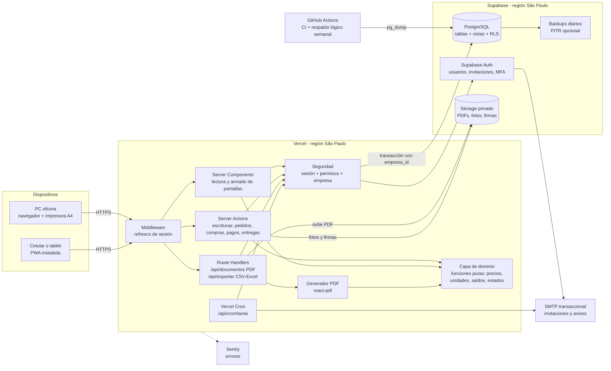
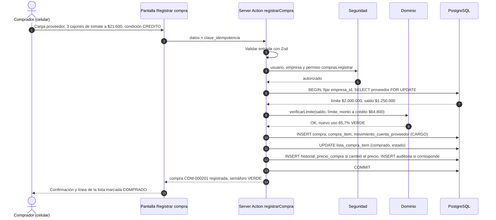
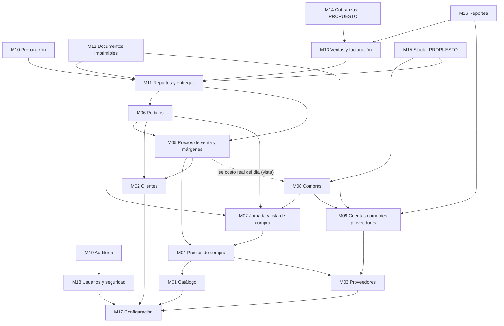

# 01 — Tipo de aplicación y arquitectura

**Propósito:** definir qué tipo de aplicación se construye, con qué tecnología, cómo se organiza en módulos y qué requisitos técnicos (seguridad, respaldos, rendimiento, costos) debe cumplir. Cubre R1, R3, R15 y la parte técnica de R16.

**Contenido**

1. [Decisión en una línea](#1-decisión-en-una-línea)
2. [Contexto de uso real](#2-contexto-de-uso-real)
3. [Alternativas analizadas](#3-alternativas-analizadas)
4. [Conclusión y justificación](#4-conclusión-y-justificación)
5. [Stack tecnológico](#5-stack-tecnológico)
6. [Arquitectura general](#6-arquitectura-general)
7. [Estructura general en módulos](#7-estructura-general-en-módulos)
8. [Dependencias entre módulos](#8-dependencias-entre-módulos)
9. [Estructura del repositorio](#9-estructura-del-repositorio)
10. [Capa de dominio y convenciones de código](#10-capa-de-dominio-y-convenciones-de-código)
11. [Multi-empresa](#11-multi-empresa)
12. [Seguridad](#12-seguridad)
13. [Auditoría](#13-auditoría)
14. [Respaldos y recuperación](#14-respaldos-y-recuperación)
15. [Entornos y despliegue](#15-entornos-y-despliegue)
16. [Rendimiento en celulares de gama media](#16-rendimiento-en-celulares-de-gama-media)
17. [Estrategia offline (fase 2)](#17-estrategia-offline-fase-2)
18. [Zona horaria y fecha operativa](#18-zona-horaria-y-fecha-operativa)
19. [Requisitos no funcionales](#19-requisitos-no-funcionales)
20. [Costos de infraestructura](#20-costos-de-infraestructura)
21. [Riesgos técnicos](#21-riesgos-técnicos)

Documentos relacionados: 02-usuarios-roles-y-permisos.md (quién puede hacer qué), 03-modelo-de-datos.md (tablas y campos), 04-procesos-y-flujos.md (circuito completo), 08-pantallas-y-acciones.md (pantallas), 10-plan-de-implementacion.md (fases).

---

## 1. Decisión en una línea

**Aplicación web responsive, instalable como PWA** (ícono en la pantalla del celular), con **un solo código y un solo servidor** para computadora y celular. Sin app nativa en las primeras fases.

Lo que significa para el dueño del negocio:

| Pregunta | Respuesta |
|---|---|
| ¿Cómo se abre? | Desde el navegador (Chrome, Edge, Safari) en `https://<nombre>.app` o desde un ícono instalado en el celular. |
| ¿Hay que bajarla de Play Store / App Store? | No. Se instala desde el propio navegador ("Agregar a pantalla de inicio"). |
| ¿Los datos son los mismos en la PC y en el celular? | Sí, en tiempo real: una compra registrada en el mercado se ve al instante en la oficina. |
| ¿Se puede imprimir? | Sí, con un botón **Imprimir** en cada lista (lista de compra, lista de entrega, lista contable, etc.) y también descargar/compartir en PDF (por WhatsApp o correo). |
| ¿Funciona sin señal? | En la fase 1 necesita conexión (datos móviles alcanzan). En la fase 2 se agrega un modo sin conexión para la lista de compra y el registro de compras en el mercado. |
| ¿Cuánto cuesta mantenerla en línea? | Del orden de US$ 50 a 70 por mes en la fase 1 (ver sección 20). |

---

## 2. Contexto de uso real

El diseño técnico parte de **dónde y cómo** se usa cada parte del sistema en un día típico (jornada del jueves, entrega el jueves a la mañana):

| Momento | Lugar | Quién (rol) | Dispositivo | Condiciones | Implicancia técnica |
|---|---|---|---|---|---|
| Miércoles 16:00–22:00 | Oficina o casa | VENDEDOR / ADMIN | Celular (WhatsApp al lado) o PC | Pedidos llegan por WhatsApp y teléfono, muchas interrupciones | Carga rápida de pedidos mobile-first; autocompletar de productos; borradores que no se pierden |
| Jueves 03:00–07:00 | Mercado mayorista | COMPRADOR / ADMIN | Celular, una mano ocupada | Poca luz o sol directo, apuro, señal 4G irregular, ruido | Pantallas de lista de compra y registrar compra con botones grandes, alto contraste, máximo 3 toques por línea; offline en fase 2 |
| Jueves 06:00–09:00 | Depósito | PREPARADOR | Tablet/celular o la hoja impresa DOC-07 | Manos ocupadas o sucias, balanza | Botones grandes, cantidades con teclado numérico, impresión de hojas de preparación sin precios |
| Jueves 08:00–13:00 | En la calle / cliente | REPARTIDOR | Celular | Cámara para foto del remito firmado, firma en pantalla, señal variable | Confirmación de entrega en 1 pantalla; subida de foto tolerante a cortes |
| Jueves 10:00–18:00 | Oficina | ADMIN / ADMINISTRATIVO | PC con impresora A4 | Trabajo de escritorio, tablas grandes | Pantallas administrativas desktop-first: precios, márgenes, cuentas corrientes, reportes, exportaciones |

---

## 3. Alternativas analizadas

### 3.1 Descripción breve

| Alternativa | Qué es |
|---|---|
| A. Web solo escritorio | Sistema web pensado para PC; en el celular se ve "achicado". |
| B. Web responsive | Sistema web que se adapta al tamaño de pantalla; se usa desde el navegador. |
| C. Web responsive + PWA | Igual que B, pero instalable como app (ícono, pantalla completa) y con capacidad de funcionar sin conexión (service worker + almacenamiento local). |
| D. App nativa iOS + Android | Dos apps (Swift/Kotlin) publicadas en tiendas, más un sistema web aparte para la oficina. |
| E. Híbrida con Capacitor | La misma app web empaquetada como app de tienda, con acceso a funciones nativas. |
| F. Híbrida React Native / Expo | App móvil con código propio (React Native) más una web separada para la oficina. |
| G. Aplicación de escritorio | Programa instalado en Windows (Electron o nativo); necesita igualmente un servidor para compartir datos. |

### 3.2 Tabla comparativa ponderada

Puntaje de 1 (malo) a 5 (muy bueno). El peso refleja cuánto importa cada criterio para **este** negocio.

| Criterio | Peso | A. Web escritorio | B. Web responsive | C. Responsive + PWA | D. Nativa | E. Capacitor | F. React Native + web | G. Escritorio |
|---|---|---|---|---|---|---|---|---|
| Uso en el mercado de madrugada desde el celular | 5 | 1 | 4 | 5 | 5 | 5 | 5 | 1 |
| Impresión desde la PC (A4, botón Imprimir) | 4 | 5 | 5 | 5 | 3 | 4 | 4 | 5 |
| Costo de desarrollo inicial | 5 | 4 | 4 | 4 | 1 | 3 | 2 | 3 |
| Costo de mantenimiento (cantidad de códigos) | 4 | 4 | 5 | 5 | 1 | 3 | 2 | 3 |
| Distribución de actualizaciones | 3 | 5 | 5 | 5 | 2 | 3 | 3 | 3 |
| Conectividad (tolerancia a falta de señal) | 3 | 1 | 1 | 4 | 5 | 5 | 5 | 4 |
| Instalación en los dispositivos | 2 | 5 | 4 | 5 | 3 | 3 | 3 | 2 |
| Cámara (foto del remito) y firma en pantalla | 2 | 2 | 4 | 4 | 5 | 5 | 5 | 2 |
| Varios usuarios simultáneos con datos en tiempo real | 4 | 5 | 5 | 5 | 5 | 5 | 5 | 4 |
| **Total ponderado (máximo 160)** | | **113** | **134** | **150** | **103** | **128** | **119** | **97** |

### 3.3 Ventajas y desventajas principales

| Alternativa | A favor | En contra (para este negocio) |
|---|---|---|
| A. Web escritorio | Simple; excelente para imprimir. | Inusable en el mercado y en el reparto, que son los momentos críticos. |
| B. Web responsive | Un solo código; se actualiza solo; imprime bien. | Sin modo offline; no se "instala", el usuario debe abrir el navegador y buscar la dirección. |
| **C. Responsive + PWA** | Todo lo de B + ícono instalado, pantalla completa, caché de la lista de compra y cola de compras sin señal (fase 2), cámara vía navegador. | En iPhone el offline tiene límites (el almacenamiento puede borrarse si la app no se usa por semanas; no hay sincronización en segundo plano). Se mitiga sincronizando al abrir la app. |
| D. Nativa | Máxima integración con el teléfono y offline robusto. | Tres códigos (iOS, Android, web de oficina), cuentas de desarrollador, revisión de tiendas en cada actualización; 2 a 3 veces el costo. |
| E. Capacitor | Reutiliza el código web; offline robusto; presencia en tiendas. | Agrega compilación y publicación en tiendas sin un beneficio concreto hoy. Queda como **salida de emergencia**: si en el futuro hiciera falta (p. ej. impresoras térmicas Bluetooth), se empaqueta la misma PWA. |
| F. React Native + web | Buena experiencia móvil. | Dos códigos de interfaz (móvil y web) para las mismas pantallas. |
| G. Escritorio | Funciona sin internet en la oficina. | No sirve en el celular; requiere instalar y actualizar en cada PC; necesita servidor igual. |

---

## 4. Conclusión y justificación

Se adopta **C. Web responsive + PWA** (decisión del contrato de diseño), porque:

1. **Cubre los dos mundos con un solo desarrollo:** el mercado y el reparto (celular) y la oficina (PC con impresora). Es la única opción con puntaje alto en ambos criterios más pesados.
2. **Menor costo total:** un solo código, un solo servidor, una sola base de datos; las correcciones llegan a todos los usuarios al recargar, sin pasar por tiendas.
3. **Impresión nativa del navegador:** las listas imprimibles (R5, R11, R12) se resuelven con vistas HTML A4 y el botón **Imprimir**, y con PDF generado en el servidor para archivar o compartir.
4. **Camino de crecimiento sin reescritura:** la fase 2 agrega offline sobre el mismo código (service worker + IndexedDB) y, si alguna vez hiciera falta, se empaqueta con Capacitor.
5. **Facilidad de uso (R15):** pantallas operativas diseñadas primero para celular y pantallas administrativas primero para PC, con los mismos datos.

Distribución de pantallas por enfoque (el detalle está en 08-pantallas-y-acciones.md):

| Enfoque | Pantallas |
|---|---|
| Mobile-first (operativas) | Carga rápida de pedidos, lista de compra en el mercado, registrar compra, comparador rápido de precios, preparación, hoja de ruta y confirmación de entrega. |
| Desktop-first, usables en celular (administrativas) | Lista general de precios de compra, reglas de precios y márgenes, cuentas corrientes de proveedores, facturación, reportes, configuración, usuarios. |

---

## 5. Stack tecnológico

| Pieza | Para qué se usa en este sistema | Por qué | Alternativas descartadas |
|---|---|---|---|
| **Next.js (App Router)** + React | Interfaz y servidor en un solo proyecto: *Server Components* para leer y armar pantallas, *Server Actions* para escrituras (registrar pedido, compra, pago), *Route Handlers* para PDF, exportaciones y tareas programadas. | Un solo despliegue; el servidor decide qué datos llegan al navegador (clave para ocultar precios); ecosistema y disponibilidad de desarrolladores. | Remix/React Router 7 (válido, menor integración con el hosting elegido); SvelteKit (menos desarrolladores disponibles); Laravel o Django + SPA (dos lenguajes, dos despliegues). |
| **TypeScript** | Todo el código. | Tipos compartidos entre base de datos, dominio e interfaz; menos errores en cálculos de dinero y estados. | JavaScript sin tipos. |
| **Tailwind CSS + shadcn/ui** | Estilos y componentes (tablas, formularios, diálogos, menús). | Componentes accesibles (Radix) copiados al repositorio, sin dependencia de versión; utilidades responsive simples. | MUI (bundle pesado para celulares de gama media); Bootstrap. |
| **PostgreSQL gestionado en Supabase** | Base de datos principal. | Relacional, transacciones, tipo `numeric` exacto para dinero, vistas, restricciones, **Row Level Security** para aislar empresas. | MySQL (sin RLS nativo); MongoDB o Firebase (no aptos para cuentas corrientes y reportes contables). |
| **Supabase Auth** | Inicio de sesión, invitaciones por correo, recuperación de contraseña, MFA (TOTP). | Resuelto y probado; integra con RLS; sin costo por usuario en el volumen esperado. | Auth.js (más código propio); Clerk/Auth0 (costo por usuario, datos fuera de la base). |
| **Supabase Storage** | PDFs emitidos (DOC-01 a DOC-08), fotos de remitos firmados, firmas, logo de la empresa, foto de la boleta del proveedor. | Buckets privados con URLs firmadas de corta duración; misma consola que la base. | Amazon S3 o Vercel Blob (otro proveedor más). |
| **Drizzle ORM** | Esquema tipado, consultas y migraciones. | SQL explícito y predecible; liviano en entorno serverless; soporta vistas, enums y claves compuestas. | Prisma (motor más pesado, menos control del SQL generado); SQL crudo sin tipos. |
| **Zod** | Validación de toda entrada (formularios y server actions) y de las salidas (DTO por perfil de permisos). | Un esquema sirve para el formulario y para el servidor. | Yup, Valibot. |
| **decimal.js** (o big.js) | Aritmética de dinero, precios y cantidades en la capa de dominio. | Evita errores de punto flotante (0,1 + 0,2). | Números JavaScript (prohibidos para dinero). |
| **@react-pdf/renderer** | Generación de PDF en el servidor (archivar, compartir por WhatsApp/correo). | Corre en Node sin navegador; plantillas en React; el servidor controla qué campos se incluyen. | Puppeteer/Chromium (pesado en serverless, arranque lento); jsPDF en el navegador (no garantiza el ocultamiento de precios). |
| **Vistas HTML de impresión** (`@media print`, A4) | Impresión diaria con el botón **Imprimir**. | Inmediata, sin generar archivo; la misma vista funciona en PC y celular. | Solo PDF (más lento para el uso diario). |
| react-hook-form | Formularios rápidos con validación Zod. | Pocas re-renderizaciones en celulares. | Formik. |
| TanStack Table | Tablas administrativas (orden, filtro, columnas). | Liviana, sin estilos impuestos. | AG Grid (pesado, licencia). |
| date-fns + date-fns-tz | Fechas en la zona horaria de la empresa. | Liviana; funciones puras. | Moment (obsoleto). |
| Serwist + Dexie (IndexedDB) | Fase 2: service worker y base local para offline. | Estándar para Next.js; Dexie simplifica IndexedDB. | Workbox manual. |
| **Vercel** | Hosting, despliegues por rama (previews), tareas programadas (Vercel Cron). | Integración directa con Next.js; región São Paulo junto a la base. | Netlify, Railway; VPS propio (más mantenimiento). |
| Sentry (plan gratuito al inicio) | Registro de errores del servidor y del navegador. | Detectar fallas en el mercado sin que el usuario tenga que avisar. | Solo logs de Vercel. |
| Vitest y Playwright | Pruebas unitarias del dominio y pruebas de punta a punta en tamaño celular y PC. | Rápidas; Playwright emula celulares. | Jest, Cypress. |
| GitHub + GitHub Actions | Repositorio, CI (tipos, lint, pruebas, migraciones) y respaldo lógico semanal. | Estándar. | GitLab. |
| SMTP transaccional (p. ej. Resend) | Correos de invitación, recuperación de contraseña y avisos. | El correo incluido en Supabase tiene límites bajos de envío. | — |

**Regiones:** base de datos Supabase en **São Paulo (sa-east-1)** y funciones de Vercel en **São Paulo (gru1)**, para que la latencia entre servidor y base sea mínima (cada pantalla hace varias consultas) y la latencia a Argentina/Uruguay sea baja.

---

## 6. Arquitectura general

### 6.1 Diagrama de componentes



### 6.2 Responsabilidades de cada capa

| Capa | Hace | No hace |
|---|---|---|
| Navegador / PWA | Muestra pantallas, formularios, impresión (`window.print()`), cámara para fotos, firma en canvas; en fase 2 guarda caché local y cola de compras. | Nunca se conecta directo a la base de datos ni calcula precios definitivos. |
| Middleware | Refresca la sesión (cookies httpOnly) y redirige al login si no hay sesión. | No decide permisos de negocio. |
| Server Components | Leen datos **ya filtrados por permiso** y arman la pantalla. | No escriben. |
| Server Actions | Una acción = un caso de uso = **una transacción** (p. ej. "registrar compra"). Validan con Zod, verifican permiso, llaman al dominio, graban, auditan. | No contienen reglas de cálculo (están en el dominio). |
| Route Handlers | PDF de documentos, exportaciones para el contador, endpoints de tareas programadas (protegidos con secreto). | — |
| Capa de dominio | Cálculos puros y testeables: precios de venta, conversiones de unidades, lista de compra, saldos, semáforo, imputación FIFO, transiciones de estado. | No accede a base, red ni reloj. |
| PostgreSQL | Persistencia, integridad (FK, check, unique), vistas derivadas, aislamiento por empresa (RLS). | No contiene la lógica de precios (solo vistas de consulta). |
| Storage | Archivos binarios con rutas `empresa_id/...`. | No es la fuente de verdad de los datos (los PDFs se pueden regenerar desde el snapshot del documento). |

### 6.3 Flujo de una escritura típica: registrar una compra a crédito



Notas de diseño:

- El `SELECT ... FOR UPDATE` sobre la fila del proveedor **serializa** las operaciones que cambian su saldo (dos compradores comprándole al mismo puestero a la vez no pueden superar el límite entre los dos).
- Si la compra superara el límite y el usuario no tiene `compras.exceder_limite`, la acción devuelve el error `LIMITE_CREDITO_EXCEDIDO` y **no graba nada** (ver 06-creditos-y-pagos.md).
- La `clave_idempotencia` (uuid generado en el celular) evita compras duplicadas si el usuario toca dos veces "Guardar" o si la red reintenta.

### 6.4 Tareas programadas

| Tarea | Frecuencia (hora de la empresa) | Qué hace | Fase |
|---|---|---|---|
| `alertas-deuda` | Diaria 00:30 | Detecta compras con `fecha_vencimiento` vencida o por vencer (3 días) y proveedores en ROJO/EXCEDIDO; arma el resumen del tablero y (opcional) envía un correo a ADMIN/ADMINISTRATIVO. | MVP |
| `precios-desactualizados` | Diaria 01:00 | Marca ofertas de proveedor (`proveedor_producto`) sin actualizar hace más de `empresa.dias_alerta_precio_desactualizado` días. | MVP |
| `respaldo-logico` | Semanal (domingo 02:00) | GitHub Actions ejecuta `pg_dump` y copia los archivos de Storage a un almacenamiento externo. | MVP |
| `limpieza-temporales` | Diaria 04:00 | Borra archivos temporales de exportaciones (nunca PDFs emitidos). | MVP |
| `recordatorio-jornada` | Diaria 19:00 | Aviso si hay pedidos CONFIRMADO de la jornada siguiente sin lista de compra generada. | Fase 2 |

Las alertas **no dependen** de la tarea programada para ser correctas: el tablero las calcula al abrirse a partir de vistas (ver 03-modelo-de-datos.md). La tarea solo agrega el aviso por correo. Vercel Cron trabaja en UTC; la configuración traduce la hora local (UTC−3 para Argentina y Uruguay).

---

## 7. Estructura general en módulos

Cada módulo es dueño de sus tablas (solo él las escribe) y expone consultas y acciones al resto. "Depende de" indica qué información necesita leer o qué acciones invoca.

| Código | Módulo | Responsabilidad | Entidades que posee | Depende de | Fase | Imprimibles |
|---|---|---|---|---|---|---|
| M01 | Catálogo de productos | Productos (frutas, verduras, otros), categorías, unidad base y presentaciones de compra/venta; ficha central del producto (R14). | categoria, producto, presentacion | M17 | MVP | — |
| M02 | Clientes | Alta y mantenimiento de clientes y sus puntos de entrega (ej. cocina del hospital), datos fiscales, prioridad para faltantes, periodicidad de facturación. | cliente, punto_entrega | M17 | MVP | — |
| M03 | Proveedores | Alta y mantenimiento de proveedores, ubicación en el mercado, límite de crédito y plazo de pago. | proveedor | M17 | MVP | — |
| M04 | Precios de compra | Qué vende cada proveedor, en qué presentación y a qué precio; actualización individual y masiva; historial; comparador; lista general de precios de compra (R6, R7). | proveedor_producto, historial_precio_compra | M01, M03 | MVP | DOC-06 |
| M05 | Precios de venta y márgenes | Recargos (global, categoría, producto, cliente) y reglas por cliente (RECARGO, PRECIO_FIJO); cálculo del precio de venta con origen de la regla; alertas de margen (R8). | regla_precio (y los campos `recargo_default` de empresa, categoria, producto y cliente) | M01, M02, M04; lee el costo real de M08 | MVP | — |
| M06 | Pedidos | Carga, confirmación, modificación y cancelación de pedidos por cliente y punto de entrega, con precio estimado (R4). | pedido, pedido_item | M01, M02, M05, M07 | MVP | — |
| M07 | Jornada y lista de compra | Fecha operativa; consolidación de pedidos en necesidades; conversión a presentaciones de compra; proveedor sugerido; seguimiento de lo comprado (R5). | jornada, lista_compra, lista_compra_item | M06, M04, M03 | MVP | DOC-01 |
| M08 | Compras | Registro de compras en el mercado (contado, crédito, mixta), vínculo con la lista de compra, costo real del día (R6, R13 pasos 4–6). | compra, compra_item | M07, M03, M04, M09 | MVP | — |
| M09 | Cuentas corrientes de proveedores | Libro de movimientos, pagos, imputaciones FIFO/manual, saldo, crédito disponible, semáforo, vencimientos (R9, R10). | pago_proveedor, imputacion_pago_proveedor, movimiento_cuenta_proveedor | M03, M08 | MVP | DOC-05 |
| M10 | Preparación | Armado de la mercadería por cliente: cantidades preparadas, faltantes y su asignación por prioridad (R13 paso 8). | No posee tablas propias: actualiza `entrega` y `entrega_item` en los estados EN_PREPARACION y PREPARADA (campo `cantidad_preparada`). | M11, M06, M08 | MVP | DOC-07 |
| M11 | Repartos y entregas | Entregas por cliente y punto de entrega, hojas de ruta, confirmación en el celular, diferencias y rechazos, versiones (R11, R13 pasos 9–10). | reparto, entrega, entrega_item | M06, M02, M05 | MVP | DOC-02, DOC-04 |
| M12 | Documentos imprimibles | Vistas de impresión y PDF de todos los documentos; registro de cada emisión con su versión (R5, R11, R12). | documento_emitido | M04, M07, M09, M11, M13 | MVP | DOC-01 a DOC-08 |
| M13 | Ventas y facturación | Registro de la venta por entrega (precios congelados), comprobante interno no fiscal que agrupa entregas, exportación para el contador (R12, R13 pasos 11–12). Facturación fiscal electrónica: PROPUESTO. | factura, factura_entrega | M11, M02 | MVP (interno) | DOC-03, DOC-08 |
| M14 | Cobranzas (PROPUESTO) | Cuenta corriente de clientes, cobros, imputaciones, deuda de clientes. | cobro_cliente, imputacion_cobro_cliente, movimiento_cuenta_cliente | M13, M02 | Fase 2 | — |
| M15 | Stock y sobrantes (PROPUESTO) | Sobrantes previstos y reales, mermas, devoluciones; descuento de sobrantes en la próxima lista de compra. | ajuste_stock | M08, M11, M07 | Fase 2 | — |
| M16 | Reportes | Ventas, compras, márgenes por cliente/producto/jornada, deuda con proveedores, precios desactualizados. | No posee tablas: usa vistas. | Todos (solo lectura) | MVP básico | — |
| M17 | Configuración | Datos de la empresa, moneda, zona horaria, recargo global, estrategia de costo, redondeo, umbrales del semáforo, margen mínimo, numeración. | empresa, secuencia | — | MVP | — |
| M18 | Usuarios y seguridad | Usuarios, roles, permisos, invitaciones, sesiones (ver 02-usuarios-roles-y-permisos.md). | usuario, rol, usuario_rol | M17 | MVP | — |
| M19 | Auditoría | Registro inmutable de cambios sensibles: precios, recargos, overrides, anulaciones, excesos de límite, permisos. | auditoria | M18 (transversal a todos) | MVP | — |

Correspondencia con el circuito del usuario (R3 y R13):

| Paso del circuito | Módulos |
|---|---|
| 1–2. Cliente hace un pedido y el sistema lo registra | M02, M06 (precio estimado con M05) |
| 3. Los pedidos generan las cantidades a comprar | M07 (DOC-01) |
| 4. Se consulta qué proveedores tienen los productos y a qué precio | M04 (comparador, DOC-06) |
| 5–6. Se registran las compras, contado o crédito | M08 |
| 7. Se actualiza lo adeudado a cada proveedor | M09 (DOC-05) |
| 8. Se prepara la mercadería de cada cliente | M10 (DOC-07) |
| 9. Lista de entrega sin precios | M11 + M12 (DOC-02, DOC-04) |
| 10. Se entrega | M11 |
| 11. Lista contable con precios y totales | M12 + M13 (DOC-03) |
| 12. Se actualiza la información de la venta | M13, M16 (M14 en fase 2) |

---

## 8. Dependencias entre módulos



Regla de dependencias (para evitar ciclos en el código):

1. Las flechas llenas son dependencias de **escritura o invocación**: un módulo solo llama acciones de los módulos a los que apunta.
2. La flecha punteada M05 → M08 es de **solo lectura**: el cálculo de precios necesita el costo real de las compras del día, pero M05 no importa código de M08; lee la vista `v_costo_real_jornada` (definida en 03-modelo-de-datos.md). Así se evita el ciclo M05 → M08 → M07 → M06 → M05.
3. M19 Auditoría y M18 Seguridad son transversales: todos los módulos las usan a través de utilidades comunes (`autorizar`, `auditar`).
4. Una herramienta de análisis de dependencias en la CI (p. ej. dependency-cruiser) falla si aparece una importación que no respeta este diagrama o si un módulo sin permisos de precios (vistas operativas de M10 y M11) importa consultas con precios.

---

## 9. Estructura del repositorio

Organización por **dominio/módulo**, no por tipo técnico. Nombres de dominio en español; nombres propios del framework en inglés (`page.tsx`, `layout.tsx`, `route.ts`).

```text
sistema-fruver/
├─ app/                                  Rutas de Next.js (solo interfaz y entrada)
│  ├─ (publico)/login, invitacion, recuperar
│  ├─ (app)/                             Layout autenticado con menú según permisos
│  │  ├─ inicio/                         Tablero: jornada activa, alertas, semáforos
│  │  ├─ productos/  clientes/  proveedores/
│  │  ├─ precios/compra/  precios/venta/
│  │  ├─ pedidos/  pedidos/nuevo/
│  │  ├─ jornadas/[fecha]/lista-compra/
│  │  ├─ compras/  compras/nueva/
│  │  ├─ cuentas-proveedores/[id]/
│  │  ├─ preparacion/[fecha]/            Solo datos operativos (sin precios)
│  │  ├─ repartos/[id]/                  Solo datos operativos (sin precios)
│  │  ├─ entregas/[id]/
│  │  ├─ facturacion/  reportes/  configuracion/  usuarios/  auditoria/
│  ├─ imprimir/                          Vistas A4 sin menú (@media print)
│  │  ├─ lista-compra/[id]/              DOC-01
│  │  ├─ entrega/[id]/sin-precios/       DOC-02 (consulta operativa)
│  │  ├─ entrega/[id]/contable/          DOC-03
│  │  ├─ reparto/[id]/                   DOC-04 (consulta operativa)
│  │  ├─ proveedor/[id]/estado-cuenta/   DOC-05
│  │  ├─ precios-compra/                 DOC-06
│  │  ├─ preparacion/[fecha]/            DOC-07 (consulta operativa)
│  │  └─ factura/[id]/                   DOC-08 (rutas completas en 09-documentos-imprimibles.md)
│  └─ api/
│     ├─ documentos/[tipo]/[id]/pdf/     Genera, guarda y devuelve el PDF
│     ├─ exportar/[tipo]/                CSV/Excel para el contador
│     └─ cron/[tarea]/                   Tareas programadas (protegidas con secreto)
├─ src/
│  ├─ dominio/                           Funciones puras, sin acceso a base ni red
│  │  ├─ dinero/                         Decimal, redondeos
│  │  ├─ unidades/                       Conversiones presentación ↔ unidad base
│  │  ├─ costos/                         Costo por unidad base, costo de referencia, costo real ponderado
│  │  ├─ precios/                        Resolución de precio de venta, margen, alertas
│  │  ├─ lista-compra/                   Consolidación y redondeo a presentaciones
│  │  ├─ cuentas/                        Saldo, crédito disponible, semáforo, FIFO
│  │  ├─ faltantes/                      Asignación por prioridad de cliente
│  │  ├─ estados/                        Máquinas de estado (transiciones permitidas)
│  │  └─ entregas/                       Totales, diferencias, versión
│  ├─ modulos/                           Casos de uso por módulo (solo servidor)
│  │  └─ <modulo>/                       acciones.ts, consultas.ts, consultas-operativas.ts,
│  │                                     esquemas.ts (Zod), dto.ts, errores.ts
│  ├─ db/
│  │  ├─ esquema/                        Tablas Drizzle por dominio
│  │  ├─ migraciones/                    Generadas y revisadas
│  │  ├─ sql/                            Políticas RLS, vistas, triggers, permisos de columnas
│  │  └─ semillas/                       Datos de demostración y roles del sistema
│  ├─ seguridad/                         sesion, catalogo-permisos, autorizar, tenant, auditar
│  ├─ documentos/                        Plantillas PDF y componentes de impresión
│  ├─ ui/                                Componentes compartidos (shadcn/ui)
│  └─ lib/                               Fechas y zona horaria, formato de moneda y números
├─ tests/
│  ├─ dominio/                           Unitarias (Vitest), casos tomados de 05, 06 y 07
│  ├─ integracion/                       Contra Supabase local: RLS, transacciones, vistas
│  └─ e2e/                               Playwright en 390×844 (celular) y 1366×768 (PC)
└─ docs/plan/                            Este plan
```

---

## 10. Capa de dominio y convenciones de código

### 10.1 Funciones puras obligatorias

Todo cálculo de dinero, unidades, saldos y estados vive en `src/dominio` como **funciones puras**: reciben datos, devuelven resultados, no leen la base, no usan la fecha del sistema (la reciben como parámetro) y no tienen efectos secundarios. Cada una tiene pruebas unitarias con los ejemplos numéricos de los documentos 04 a 07.

| Función | Entrada | Salida | Regla definida en |
|---|---|---|---|
| `aUnidadBase` | cantidad, factor_a_base | cantidad_base | 03-modelo-de-datos.md |
| `costoPorUnidadBase` | precio de la presentación, factor_a_base | costo por unidad base (4 decimales) | 05-precios-y-margenes.md |
| `presentacionesNecesarias` | necesidad en unidad base, factor de la presentación de compra | cantidad de presentaciones (redondeo hacia arriba), a comprar en base, sobrante previsto | 04-procesos-y-flujos.md |
| `costoReferencia` | estrategia (PREFERIDO, MINIMO, ULTIMO_COSTO_REAL), ofertas vigentes, último costo real, costo real de la jornada | costo y origen del costo | 05-precios-y-margenes.md |
| `costoRealPonderado` | líneas de compra de la jornada (cantidad_base, subtotal) | costo promedio ponderado | 05-precios-y-margenes.md |
| `resolverPrecioVenta` | cliente, producto, categoría, reglas vigentes, recargos, costo, redondeo, fecha | precio unitario, recargo aplicado, origen de la regla, alertas de margen | 05-precios-y-margenes.md |
| `redondearPrecio` | valor, modo, múltiplo | precio redondeado | 05-precios-y-margenes.md |
| `margenSobreVenta` | precio, costo | porcentaje | 05-precios-y-margenes.md |
| `saldoProveedor` | movimientos | saldo pendiente o a favor | 06-creditos-y-pagos.md |
| `creditoDisponible` y `semaforo` | límite, saldo, umbrales | disponible, porcentaje de uso, color | 06-creditos-y-pagos.md |
| `verificarLimite` | saldo, límite, monto que queda a crédito | OK o EXCEDE (con monto excedido) | 06-creditos-y-pagos.md |
| `imputarFIFO` | importe no imputado de una partida acreedora (pago, ajuste de crédito), partidas deudoras pendientes ordenadas de la más antigua a la más nueva | imputaciones y saldo a favor | 06-creditos-y-pagos.md |
| `estadoPagoCompra` | total, imputado | PAGADA, PARCIAL, PENDIENTE | 06-creditos-y-pagos.md |
| `asignarFaltantes` | cantidad disponible, demandas por cliente con prioridad, política | cantidad asignada por cliente | 07-reglas-de-negocio.md |
| `transicionPermitida` | entidad, estado actual, estado destino, contexto | sí/no y motivo | 04-procesos-y-flujos.md |
| `totalesEntrega` | líneas con cantidad entregada y precio congelado | total por producto y total general | 05-precios-y-margenes.md |

### 10.2 Convenciones

1. **Dinero y cantidades:** siempre `decimal.js` en el dominio y `numeric` en la base. Nunca `number` de JavaScript para montos. Redondeo de montos a 2 decimales "mitad hacia arriba"; precios unitarios a 4 decimales internamente.
2. **Una acción, una transacción:** cada Server Action ejecuta: validar (Zod) → autorizar (permiso) → abrir transacción con la empresa fijada → dominio → grabar → auditar → confirmar. Si algo falla, no queda nada a medias.
3. **Errores con código:** `SIN_PERMISO`, `TRANSICION_INVALIDA`, `LIMITE_CREDITO_EXCEDIDO`, `PRECIO_SIN_COSTO`, `DOCUMENTO_EMITIDO`, `CONFLICTO_VERSION`, etc. La interfaz los traduce a mensajes claros en español.
4. **Idempotencia:** las acciones que se ejecutan desde el celular (compras, pagos, confirmación de entregas) reciben una `clave_idempotencia` y no se duplican.
5. **Concurrencia optimista:** al editar maestros y documentos se envía `actualizado_en`; si otro usuario lo cambió, se responde `CONFLICTO_VERSION` y se muestran los datos nuevos.
6. **Consultas operativas separadas:** las pantallas y documentos sin precios usan exclusivamente archivos `consultas-operativas.ts` que seleccionan columnas explícitas de vistas sin precios (ver 02-usuarios-roles-y-permisos.md).
7. **Sin `SELECT *`** en código de aplicación.
8. **Nombres:** entidades y campos en español y `snake_case` igual que en 03-modelo-de-datos.md; funciones en `camelCase` en español (`registrarCompra`, `resolverPrecioVenta`).
9. **Pruebas mínimas para aceptar un cambio:** tipos sin errores, lint, pruebas del dominio (cobertura 100% de `src/dominio`), pruebas de RLS y de ocultamiento de precios.

---

## 11. Multi-empresa

El sistema nace preparado para varias empresas (por ejemplo, si el dueño abre una segunda distribuidora o si más adelante se ofrece a otros distribuidores), aunque el primer despliegue tenga una sola.

1. **Toda tabla de negocio tiene `empresa_id`** (excepto `empresa`).
2. **Row Level Security (RLS)** activado en todas esas tablas, con una política única por tabla:

```sql
alter table pedido enable row level security;
alter table pedido force row level security;

create policy aislamiento_empresa on pedido
  using      (empresa_id = current_setting('app.empresa_id', true)::uuid)
  with check (empresa_id = current_setting('app.empresa_id', true)::uuid);
```

3. **Cómo se fija la empresa:** en cada transacción, el servidor obtiene el usuario autenticado (verificado con Supabase Auth), busca su `empresa_id` en la tabla `usuario` y ejecuta `select set_config('app.empresa_id', '<uuid>', true)` (válido solo dentro de esa transacción, compatible con el pool de conexiones en modo transacción). Si no se fijó, `current_setting` devuelve nulo y la política **no devuelve filas** (falla cerrada).
4. **Rol de base de datos de la aplicación** sin `BYPASSRLS` y que no es dueño de las tablas; las migraciones usan otro rol. La clave `service_role` de Supabase nunca se usa en código que atienda pedidos de usuarios.
5. **Claves foráneas compuestas** `(empresa_id, id)` en las relaciones principales (ver 03-modelo-de-datos.md): la base impide que un pedido de la empresa A apunte a un cliente de la empresa B, aunque haya un error en el código.
6. **Doble filtro:** además de RLS, las consultas del código filtran por `empresa_id` (defensa en profundidad).
7. **Pruebas automáticas:** con dos empresas de prueba se verifica que ningún listado, vista, PDF ni exportación de la empresa A contenga datos de la B.
8. **Storage:** todas las rutas empiezan con `empresa_id/` y las políticas de Storage verifican ese prefijo.
9. Un usuario pertenece a **una** empresa en el MVP. Que una misma persona trabaje en varias empresas con un solo inicio de sesión queda PROPUESTO.

---

## 12. Seguridad

| Aspecto | Medida |
|---|---|
| Autenticación | Supabase Auth con correo y contraseña (mínimo 10 caracteres); sesión en cookies httpOnly y Secure; el servidor verifica al usuario contra Auth en cada pedido (no confía en datos de sesión sin verificar). MFA con app autenticadora **recomendado** para ADMIN y ADMINISTRATIVO. |
| Autorización | Permisos granulares `modulo.accion` verificados **en el servidor** en cada Server Action, Route Handler, página y PDF. Ocultar botones en la interfaz es solo comodidad (ver 02-usuarios-roles-y-permisos.md). |
| Ocultamiento de precios | Las pantallas y documentos operativos (preparación, reparto, DOC-02, DOC-04, DOC-07) usan consultas y vistas **sin columnas de precio**; para usuarios sin permisos de precios la conexión usa además un rol de base con permisos de columna restringidos. Nada que no deba verse se envía al navegador (tampoco en el payload de React). Detalle en 02-usuarios-roles-y-permisos.md. |
| Aislamiento entre empresas | RLS + claves compuestas + pruebas (sección 11). |
| Datos en tránsito y en reposo | HTTPS obligatorio (HSTS); base y Storage cifrados en reposo por el proveedor. |
| Archivos | Buckets privados; URLs firmadas de 5 minutos; tipos permitidos (PDF, JPG, PNG, WEBP) y tamaño máximo (fotos 5 MB, comprimidas en el celular antes de subir). |
| Secretos | Variables de entorno en Vercel; nunca en el repositorio ni en el navegador. |
| Validación | Toda entrada validada con Zod en el servidor (tipos, rangos: cantidades > 0, precios ≥ 0, porcentajes razonables). |
| Protección web | Server Actions con verificación de origen (protección CSRF incorporada); cabeceras de seguridad (Content-Security-Policy, `frame-ancestors 'none'`, `X-Content-Type-Options`). |
| Caché | Páginas autenticadas siempre dinámicas; nunca se cachea entre usuarios una respuesta con precios. |
| Límites de uso | Límite de intentos de inicio de sesión (Supabase) y de exportaciones por minuto. |
| Datos personales | Solo los necesarios (contacto de clientes, nombre de quien recibe, firma/foto). Acceso restringido y retención configurable. Cumplimiento de la ley de protección de datos del país (Ley 25.326 en Argentina, Ley 18.331 en Uruguay). |
| Errores | Sentry sin datos sensibles (se filtran montos, nombres y contraseñas de los reportes de error). |

---

## 13. Auditoría

- **Qué se audita:** cambios de precios de compra, recargos y reglas de precio, overrides de precio de línea, anulaciones (pedidos cancelados, compras, pagos, entregas, documentos, facturas), compras que exceden el límite de crédito, cambios de límite de crédito, cambios de configuración, cambios de roles y permisos, alta/baja de usuarios, inicios de sesión, reapertura de jornadas, correcciones de entregas ya emitidas y exportaciones. Lista completa y campos en 03-modelo-de-datos.md (tabla `auditoria`).
- **Cómo:** la aplicación escribe la fila de `auditoria` **en la misma transacción** que el cambio (si el cambio se revierte, la auditoría también), con usuario, fecha y hora, valores antes/después y motivo cuando es obligatorio.
- **Inmutable:** el rol de base de la aplicación solo tiene permiso de `INSERT` y `SELECT` sobre `auditoria` (no puede modificar ni borrar).
- **Consulta:** pantalla de auditoría con filtros por fecha, usuario, entidad y acción (permiso `auditoria.ver`); en la ficha de cada producto, proveedor, pedido o entrega se muestra su propio historial.
- **Retención:** indefinida (volumen bajo: se estiman menos de 200.000 filas por año para una distribuidora mediana).

---

## 14. Respaldos y recuperación

| Elemento | Medida | Objetivo |
|---|---|---|
| Base de datos | Backups diarios automáticos de Supabase (plan Pro, retención 7 días). | RPO 24 h en el MVP. |
| Base de datos (opcional) | Point-in-Time Recovery (PITR) de Supabase. | RPO de minutos. Recomendado cuando el sistema sea la única fuente de las cuentas corrientes. |
| Copia independiente | `pg_dump` semanal desde GitHub Actions a un almacenamiento externo (otra nube), cifrado, retención 12 semanas. | No depender de un solo proveedor. |
| Archivos (PDF, fotos) | Copia semanal del bucket a almacenamiento externo (los backups de base no incluyen el contenido de Storage). Los PDF además pueden **regenerarse** desde el snapshot guardado en `documento_emitido`. | Sin pérdida de documentos emitidos. |
| Prueba de restauración | Trimestral, en un entorno aparte, con checklist. | RTO objetivo: 4 horas. |
| Exportación del cliente | El ADMIN puede exportar en cualquier momento clientes, productos, precios, cuentas corrientes y ventas (CSV/Excel). | Los datos son del negocio, no del proveedor de software. |

---

## 15. Entornos y despliegue

| Entorno | Para qué | Base de datos | Datos |
|---|---|---|---|
| Local | Desarrollo | Pruebas de base con PGlite (PostgreSQL en memoria, sin Docker); la aplicación se conecta al proyecto Supabase de desarrollo. Supabase local con Docker es opcional. | Semillas de demostración (productos y clientes de ejemplo) |
| Preview | Revisar cada cambio antes de publicarlo (una URL por rama) | Proyecto Supabase de staging | Datos de prueba, nunca datos reales |
| Producción | Uso real | Proyecto Supabase de producción | Datos reales |

Proceso de publicación:

1. Cada cambio se hace en una rama y abre un Pull Request.
2. La CI ejecuta: tipos, lint, pruebas del dominio, pruebas de integración (RLS, vistas, ocultamiento de precios), pruebas de punta a punta en tamaño celular y PC, verificación de dependencias entre módulos.
3. Vercel crea una URL de preview para que el dueño pruebe.
4. Al aprobar, las migraciones se aplican a producción (primero la base, compatibles hacia atrás) y luego se publica el código.
5. **Ventana de publicación:** nunca entre las 02:00 y las 13:00 (mercado, preparación y reparto). Preferentemente de 15:00 a 18:00.
6. **Módulos habilitables por empresa:** los módulos PROPUESTO (cobranzas, stock, offline, facturación fiscal) se activan con `empresa.modulos_habilitados`, sin publicar otra versión.

---

## 16. Rendimiento en celulares de gama media

Referencia de dispositivo: Android de gama media (4 GB de RAM, CPU de 8 núcleos modesta) con 4G irregular.

| Métrica | Objetivo |
|---|---|
| Primera carga de la PWA instalada (con caché) | < 2 s |
| LCP de pantallas operativas en 4G | < 2,5 s |
| Respuesta a un toque (INP) | < 200 ms |
| Guardar una línea de compra (ida y vuelta al servidor) | < 1 s percibido |
| JavaScript por ruta operativa (comprimido) | < 170 KB |
| Lista de compra de 150 productos | Se muestra completa sin paginar en < 1 s |

Técnicas:

1. Server Components para casi todo: el celular recibe HTML listo y poco JavaScript.
2. Las pantallas operativas no cargan librerías pesadas (tablas avanzadas, gráficos, generador de PDF): esas solo existen en rutas administrativas o en el servidor.
3. Actualización optimista solo para acciones reversibles sin montos (marcar "tildado" en la lista de preparación); los montos siempre esperan confirmación del servidor.
4. Imágenes de productos opcionales y en miniatura; fotos de remitos comprimidas en el celular (máximo 1600 px, calidad 0,7) antes de subir.
5. Paginación o virtualización en listados administrativos de más de 200 filas.
6. Índices definidos en 03-modelo-de-datos.md para las consultas del día (por jornada, por proveedor, por cliente).
7. Medición real con Vercel Speed Insights; presupuesto de rendimiento verificado en la CI con Lighthouse en perfil móvil.

Usabilidad específica para el mercado y el reparto: botones de al menos 48 px de alto, texto base de 16 px, alto contraste (legible al sol), teclado numérico para cantidades y precios, sin menús anidados, acciones principales al alcance del pulgar (parte inferior de la pantalla).

---

## 17. Estrategia offline (fase 2)

Alcance acotado a lo que más sufre la falta de señal: **el mercado**.

| Funcionalidad | Sin conexión |
|---|---|
| Consultar la lista de compra de la jornada | Sí (copia local al abrir la jornada) |
| Consultar precios vigentes y ubicación de proveedores | Sí (copia local de `proveedor_producto` activos) |
| Registrar compras | Sí, quedan **en cola** y se envían al recuperar señal |
| Ver crédito disponible del proveedor | Último valor conocido, marcado "sin actualizar" |
| Confirmar entregas (reparto) | Fase 2b: foto y datos en cola |
| Pantallas administrativas | No (requieren conexión) |

Diseño:

1. **Service worker** (Serwist) cachea el "cascarón" de la aplicación y las pantallas operativas.
2. **IndexedDB** (Dexie) guarda: lista de compra de la jornada, ofertas vigentes y proveedores, y la **cola de salida** de compras.
3. Cada compra en cola tiene un `id` y una `clave_idempotencia` generados en el celular; al sincronizar, el servidor la procesa con la misma Server Action que en línea. Si ya existía, no se duplica.
4. **Límite de crédito al sincronizar:** se verifica en el servidor con el saldo real. Como la compra ya ocurrió en el mercado, si ahora excede el límite **se registra igual** con la marca `compra.exceso_sin_autorizacion` y se avisa al ADMIN (regla de 07-reglas-de-negocio.md). Antes de guardar sin conexión, la pantalla advierte con el último saldo conocido.
5. **Conflictos:** las compras son documentos nuevos (solo altas), por lo que no hay conflictos de edición. Si el precio de lista cambió mientras tanto, vale el precio que el comprador registró (es el real pagado).
6. **iPhone:** no hay sincronización en segundo plano; la cola se envía al abrir o volver a la app, con un indicador visible "3 compras pendientes de enviar". Se recomienda instalar la PWA (el almacenamiento de apps instaladas es más estable).

---

## 18. Zona horaria y fecha operativa

1. Todas las marcas de tiempo se guardan como `timestamptz` (UTC).
2. `empresa.zona_horaria` (ej. `America/Argentina/Buenos_Aires`, `America/Montevideo`) define cómo se muestran y cómo se calcula "hoy". El servidor (que corre en UTC) **nunca** usa su fecha local: usa una función `hoyEnEmpresa()`.
3. La **fecha operativa** es `jornada.fecha` (tipo `date`) = **fecha de entrega**. No se deduce de la hora de una compra: las compras de las 04:00 del jueves y los pedidos tomados el miércoles a la noche pertenecen a la jornada del jueves porque así se indica explícitamente (`jornada_id`).
4. Jornada sugerida al abrir el sistema: la jornada no CERRADA más próxima con fecha mayor o igual a hoy (en la zona de la empresa); el usuario puede cambiarla.
5. `empresa.hora_corte_pedidos` (por defecto 20:00 del día anterior): después de esa hora un pedido nuevo para la jornada se marca tardío (`pedido.es_tardio`); regla en 07-reglas-de-negocio.md.
6. Vencimientos (`compra.fecha_vencimiento`) son `date` en la zona de la empresa.
7. Formatos: fechas `dd/mm/aaaa`, horas de 24 h, números con separador de miles "." y decimales "," (formato es-AR / es-UY), moneda con el símbolo configurado.

---

## 19. Requisitos no funcionales

| ID | Categoría | Requisito | Cómo se verifica |
|---|---|---|---|
| RNF-01 | Disponibilidad | 99,5% mensual; sin publicaciones entre 02:00 y 13:00. | Monitoreo de disponibilidad (chequeo cada 5 min). |
| RNF-02 | Rendimiento | Objetivos de la sección 16. | Speed Insights y Lighthouse en CI. |
| RNF-03 | Capacidad | 30 usuarios simultáneos, 500 pedidos y 5.000 líneas por día, 10 años de historia sin degradación. | Prueba de carga con datos sintéticos antes de producción. |
| RNF-04 | Compatibilidad | Chrome Android 10+, Safari iOS 16.4+, Chrome/Edge/Firefox de escritorio (últimas 2 versiones). | Pruebas e2e en ambos tamaños. |
| RNF-05 | Usabilidad | Registrar una línea de compra en 3 toques o menos; cargar un pedido de 10 líneas en menos de 2 minutos; todo en español. | Pruebas con usuarios reales (dueño y comprador). |
| RNF-06 | Accesibilidad | Contraste WCAG AA, tamaños táctiles de 48 px, navegación con teclado en pantallas administrativas. | Revisión con axe en CI. |
| RNF-07 | Seguridad | Permisos en servidor; RLS; ningún precio en respuestas a PREPARADOR/REPARTIDOR. | Pruebas automáticas de permisos y de ocultamiento. |
| RNF-08 | Integridad | Documentos nunca se borran; cuentas corrientes cuadran (saldo = suma de movimientos). | Restricciones de base y prueba diaria de consistencia. |
| RNF-09 | Trazabilidad | Todo cambio sensible auditado con usuario, hora y motivo. | Pruebas de integración. |
| RNF-10 | Recuperación | RPO 24 h (minutos con PITR), RTO 4 h. | Simulacro trimestral. |
| RNF-11 | Mantenibilidad | Dominio 100% cubierto por pruebas; módulos sin dependencias circulares. | CI. |
| RNF-12 | Impresión | Documentos legibles en A4 (vertical) y en impresora común blanco y negro; PDF idéntico a la vista. | Revisión visual con datos de ejemplo. |
| RNF-13 | Portabilidad de datos | Exportación completa en CSV/Excel por el ADMIN. | Prueba manual por versión. |

---

## 20. Costos de infraestructura

Órdenes de magnitud en dólares estadounidenses (precios de lista públicos; verificarlos al contratar).

| Concepto | Fase 1 (MVP, 1 empresa, hasta ~15 usuarios) | Crecimiento (varias empresas o mayor volumen) |
|---|---|---|
| Vercel Pro (uso comercial; 1 asiento de desarrollador) | US$ 20/mes | US$ 20/mes por desarrollador + excedentes de uso |
| Supabase Pro (base, Auth, Storage, backups diarios) | US$ 25/mes | US$ 25/mes + mayor cómputo (US$ 50–100/mes) |
| PITR (recuperación a un punto en el tiempo) | Opcional, ~US$ 100/mes | Recomendado |
| Dominio propio | ~US$ 15/año | Igual |
| Correo transaccional | Plan gratuito | ~US$ 20/mes |
| Sentry | Plan gratuito | ~US$ 26/mes |
| Almacenamiento externo para respaldos | < US$ 5/mes | < US$ 10/mes |
| **Total estimado** | **~US$ 50–70/mes** (sin PITR) | **~US$ 150–300/mes** |

Notas: los planes gratuitos de Vercel (Hobby) no permiten uso comercial y los de Supabase se pausan por inactividad y no tienen backups: **no sirven para producción**. El costo de desarrollo (personas) no está incluido: ver 10-plan-de-implementacion.md.

---

## 21. Riesgos técnicos

| # | Riesgo | Probabilidad | Impacto | Mitigación |
|---|---|---|---|---|
| RT-01 | Sin señal en el mercado en el MVP (antes del offline). | Media | Alto | Pantallas livianas; DOC-01 impresa como respaldo; registro de compras posterior desde la boleta (foto); offline adelantable a fase 1b si se confirma el problema en la prueba piloto. |
| RT-02 | Error de configuración de RLS que exponga datos entre empresas. | Baja | Muy alto | Política única por tabla generada por plantilla, `force row level security`, pruebas automáticas con dos empresas, rol sin BYPASSRLS. |
| RT-03 | Filtración de precios a PREPARADOR/REPARTIDOR por un error de código (p. ej. enviar el objeto completo al navegador). | Media | Alto | Consultas operativas separadas, DTO estrictos, rol de base con permisos de columna, prueba automática que busca campos de precio en las respuestas. |
| RT-04 | Errores de redondeo en precios y totales (diferencias de centavos entre pantalla, PDF y exportación). | Media | Medio | Dominio con decimales exactos, redondeo único y centralizado, totales siempre calculados desde líneas congeladas. |
| RT-05 | Dos usuarios registran compras simultáneas que superan el límite del proveedor. | Baja | Medio | Bloqueo de la fila del proveedor dentro de la transacción (sección 6.3). |
| RT-06 | Compras duplicadas por doble toque o reintentos de red. | Media | Medio | `clave_idempotencia` única por compra y pago. |
| RT-07 | Tiempo de generación de PDF grande (hoja de ruta con 40 entregas) en funciones serverless. | Baja | Bajo | Impresión diaria por vista HTML; PDF bajo demanda; límite de duración de la función ampliado. |
| RT-08 | Impresión desde el celular poco confiable (drivers). | Media | Bajo | Compartir PDF (WhatsApp/correo) y imprimir desde la PC; en fase 2, evaluar impresoras térmicas vía Capacitor. |
| RT-09 | iOS borra el almacenamiento local de la PWA (fase 2). | Baja | Medio | Sincronizar la cola al abrir; aviso visible de pendientes; recomendar instalar la PWA. |
| RT-10 | Dependencia de proveedores (Vercel, Supabase). | Baja | Medio | Stack estándar (Postgres, Next.js) portable a otro hosting; respaldo lógico propio semanal. |
| RT-11 | Adopción: el personal sigue anotando en papel. | Media | Alto | Pantallas operativas mínimas, piloto con el comprador y un repartidor, documentos impresos que salen del sistema desde el día 1. |
| RT-12 | Cambio de un factor de presentación ya usado (ej. cajón de 18 kg pasa a 20 kg) que altere costos históricos. | Media | Medio | `factor_a_base` inmutable una vez usado: se crea una presentación nueva y se desactiva la anterior (ver 03-modelo-de-datos.md). |
| RT-13 | Crecimiento de requisitos fiscales (factura electrónica obligatoria). | Alta a mediano plazo | Medio | Modelo de `factura` preparado con campos fiscales; integración vía proveedor autorizado (ARCA/AFIP o DGI/CFE) como fase posterior. |
