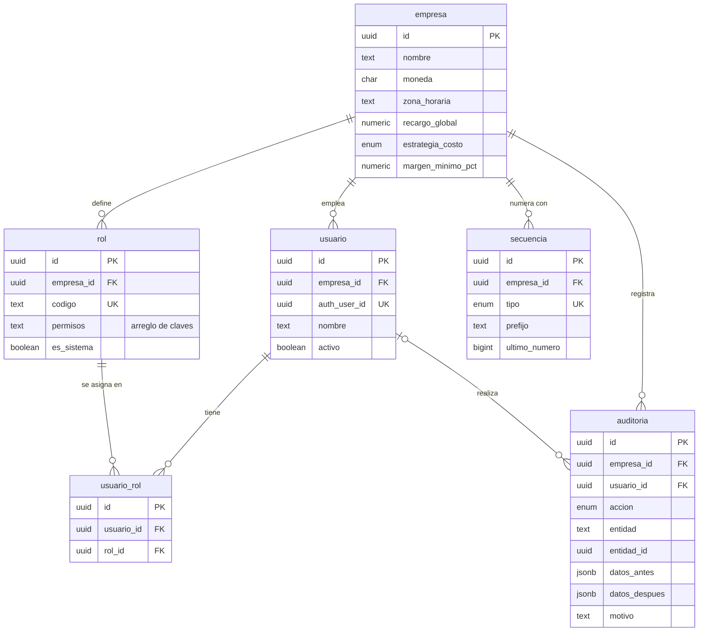
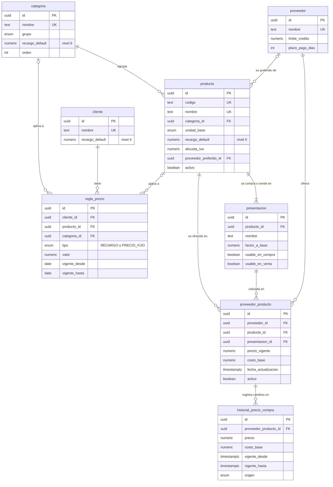
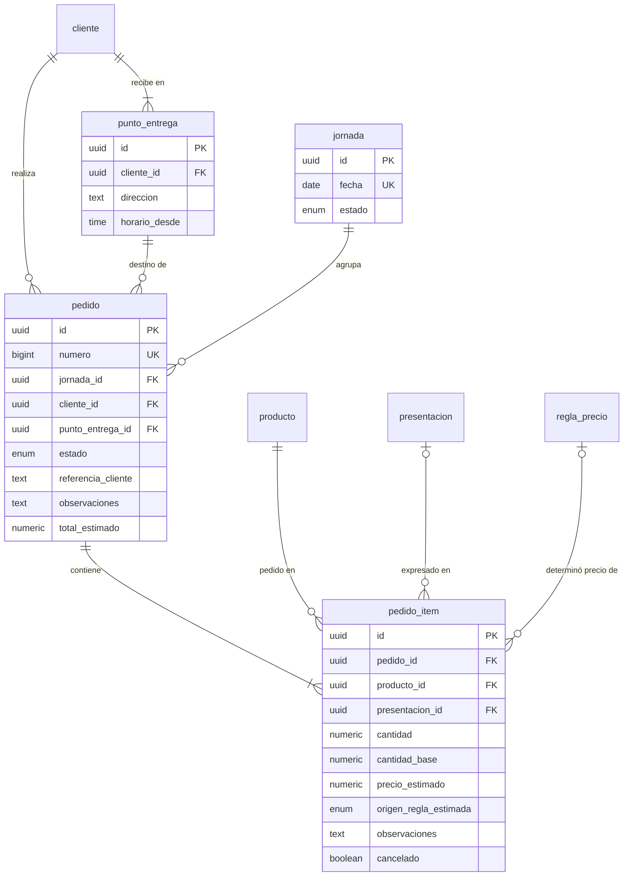
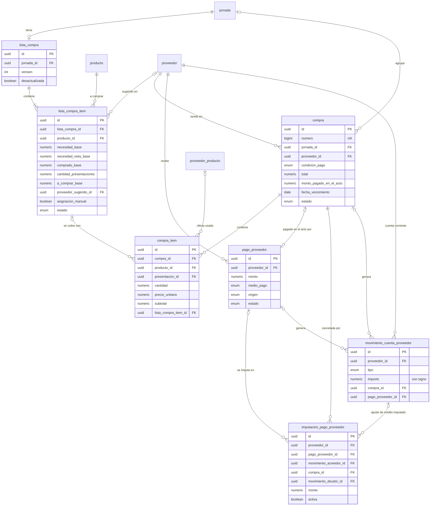
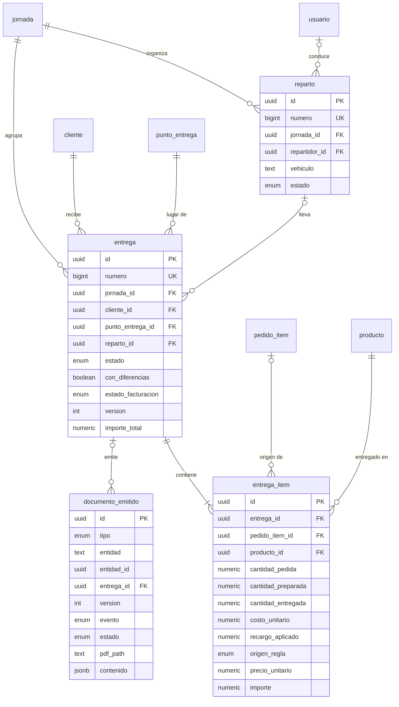
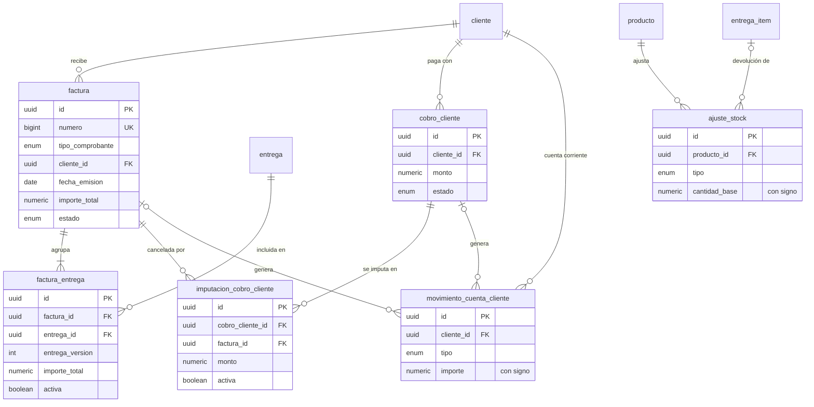
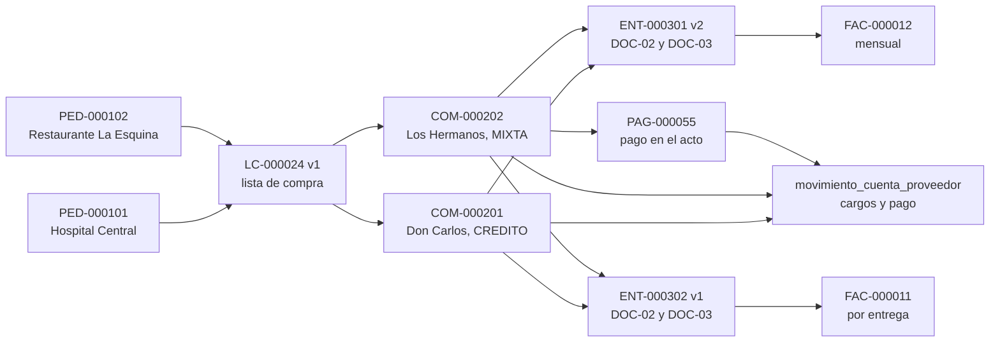

# 03 — Modelo de datos

**Propósito:** definir todas las tablas, campos, tipos, estados, relaciones, restricciones, índices y vistas del sistema. **Es la fuente de verdad de nombres y campos para todo el equipo**: los demás documentos usan exactamente estos nombres. Cubre "base de datos" y "entidades y relaciones" de R16 y da soporte de datos a R4 a R14.

**Contenido**

1. [Convenciones](#1-convenciones)
2. [Mapa de entidades](#2-mapa-de-entidades)
3. [Enumeraciones](#3-enumeraciones)
4. [Configuración, usuarios y seguridad](#4-configuración-usuarios-y-seguridad)
5. [Catálogo de productos](#5-catálogo-de-productos)
6. [Proveedores y precios de compra](#6-proveedores-y-precios-de-compra)
7. [Clientes y reglas de precio de venta](#7-clientes-y-reglas-de-precio-de-venta)
8. [Jornada y pedidos](#8-jornada-y-pedidos)
9. [Lista de compra](#9-lista-de-compra)
10. [Compras y cuentas corrientes de proveedores](#10-compras-y-cuentas-corrientes-de-proveedores)
11. [Repartos, entregas y documentos](#11-repartos-entregas-y-documentos)
12. [Ventas, facturación y cobranzas](#12-ventas-facturación-y-cobranzas)
13. [Stock y sobrantes (PROPUESTO)](#13-stock-y-sobrantes-propuesto)
14. [Relaciones y cardinalidades](#14-relaciones-y-cardinalidades)
15. [Restricciones de integridad](#15-restricciones-de-integridad)
16. [Índices recomendados](#16-índices-recomendados)
17. [Vistas y consultas derivadas](#17-vistas-y-consultas-derivadas)
18. [Snapshots y referencias](#18-snapshots-y-referencias)
19. [Escenario de ejemplo](#19-escenario-de-ejemplo)

Documentos relacionados: 01-tipo-de-aplicacion-y-arquitectura.md (RLS, auditoría técnica), 02-usuarios-roles-y-permisos.md (clases de datos visibles por rol), 04-procesos-y-flujos.md (transiciones de estado), 05-precios-y-margenes.md (cálculo de precios), 06-creditos-y-pagos.md (cuentas corrientes), 07-reglas-de-negocio.md (RN-xxx).

---

## 1. Convenciones

### 1.1 Nombres y claves

| Convención | Regla |
|---|---|
| Tablas | `snake_case`, singular, en español (`pedido_item`, `proveedor_producto`). |
| Clave primaria | `id uuid` con default `gen_random_uuid()`. |
| Claves foráneas | `<entidad>_id` (ej. `cliente_id`). Las relaciones principales usan **clave compuesta** `(empresa_id, <entidad>_id)` → `<entidad>(empresa_id, id)` para impedir referencias entre empresas; por eso cada tabla tiene además `unique (empresa_id, id)`. |
| Enumeraciones | Tipos `enum` de PostgreSQL (sección 3), valores en MAYÚSCULAS con guion bajo. |
| Numeración visible | Los documentos tienen `numero bigint` correlativo por empresa y tipo (tabla `secuencia`); se muestra con prefijo y ceros: `PED-000101`, `COM-000201`. |

### 1.2 Campos comunes (presentes en toda tabla de negocio)

En las tablas de las secciones 4 a 13 se indican como **"+ campos comunes"** y no se repiten.

| Campo | Tipo | Nulo | Default | Descripción |
|---|---|---|---|---|
| id | uuid | No | `gen_random_uuid()` | Clave primaria. |
| empresa_id | uuid | No | — | FK `empresa`. Base del aislamiento con RLS. (No existe en la tabla `empresa`.) |
| creado_en | timestamptz | No | `now()` | Momento de alta. |
| creado_por | uuid | Sí | — | FK `usuario`. Nulo solo para procesos automáticos y datos iniciales. |
| actualizado_en | timestamptz | No | `now()` | Actualizado por trigger en cada `UPDATE`. Se usa para concurrencia optimista. |
| actualizado_por | uuid | Sí | — | FK `usuario`. |

### 1.3 Campos de anulación (documentos)

Documentos: `pedido` (usa cancelación), `lista_compra` (no se anula), `compra`, `pago_proveedor`, `reparto`, `entrega`, `documento_emitido`, `factura`, `cobro_cliente`, `ajuste_stock`. Se indican como **"+ campos de anulación"**.

| Campo | Tipo | Nulo | Descripción |
|---|---|---|---|
| anulado_en | timestamptz | Sí | Momento de la anulación. |
| anulado_por | uuid | Sí | FK `usuario`. |
| motivo_anulacion | text | Sí | Obligatorio (check) cuando el estado es ANULADA/ANULADO; mínimo 5 caracteres. |

### 1.4 Tipos de datos

| Concepto | Tipo PostgreSQL | Ejemplo | Nota |
|---|---|---|---|
| Montos (totales, subtotales, pagos, saldos, límites) | `numeric(14,2)` | `64800.00` | Hasta 999.999.999.999,99. |
| Precios y costos unitarios | `numeric(14,4)` | `1200.0000` | Se muestran con 2 decimales. |
| Cantidades | `numeric(12,3)` | `36.000` | Kilos con gramos; unidades enteras si el producto no admite fracción. |
| Factores de conversión | `numeric(12,3)` | `18.000` | Cajón 18 kg. |
| Porcentajes | `numeric(7,3)` | `22.000` | Se guarda el porcentaje, no la fracción: 22,000 = 22%. |
| Fechas operativas y vencimientos | `date` | `2026-09-24` | En la zona horaria de la empresa. |
| Instantes | `timestamptz` | `2026-09-24 05:10-03` | Guardados en UTC. |
| Textos | `text` | | Largo controlado con `check (char_length(...) <= n)` donde importa. |
| Moneda | `char(3)` | `ARS`, `UYU` | ISO 4217, una por empresa. |
| Datos flexibles | `jsonb` | | Solo para snapshots de documentos, auditoría y preferencias de interfaz; nunca para datos de negocio consultables. |

### 1.5 Anulación, desactivación y borrado

| Tipo de tabla | Qué se hace en lugar de borrar | Tablas |
|---|---|---|
| Maestros | `activo = false` (desaparece de las búsquedas nuevas; sigue en la historia). | categoria, producto, presentacion, proveedor, proveedor_producto, cliente, punto_entrega, regla_precio, rol, usuario |
| Documentos | Estado ANULADA/ANULADO (o CANCELADO en pedido) con motivo, usuario y fecha. | pedido, compra, pago_proveedor, reparto, entrega, documento_emitido, factura, cobro_cliente, ajuste_stock |
| Libros (movimientos) | Nunca se modifican ni se borran: se agrega un movimiento compensatorio. | movimiento_cuenta_proveedor, movimiento_cuenta_cliente, historial_precio_compra, auditoria |
| Imputaciones | `activa = false` con fecha y motivo (al anular el pago, la compra o la factura, o al reimputar); se crean imputaciones nuevas. | imputacion_pago_proveedor, imputacion_cobro_cliente, factura_entrega |
| Líneas | Pedido: en BORRADOR se pueden eliminar físicamente; desde CONFIRMADO solo `cancelado = true`. Resto de líneas: siguen el estado de su documento. | pedido_item, compra_item, entrega_item, lista_compra_item |
| Asignaciones | Se eliminan físicamente y el cambio queda en `auditoria`. | usuario_rol |

El rol de base de datos de la aplicación **no tiene permiso `DELETE`** sobre documentos, libros ni auditoría (ver sección 15).

### 1.6 Snapshots vs referencias

- **Referencia** (`producto_id`, `cliente_id`): se guarda siempre, para reportes y navegación.
- **Snapshot** (copia del valor en ese momento): se guarda cuando un cambio posterior en el maestro **no debe alterar** un hecho ya ocurrido o un documento ya emitido (precio pagado, precio de venta congelado, nombre del cliente en un remito). Detalle en la sección 18.

---

## 2. Mapa de entidades

| Entidad | Dominio | Tipo | Módulo dueño (ver 01) | Fase |
|---|---|---|---|---|
| empresa | Configuración | Configuración | M17 | MVP |
| usuario | Seguridad | Maestro | M18 | MVP |
| rol | Seguridad | Maestro | M18 | MVP |
| usuario_rol | Seguridad | Asignación | M18 | MVP |
| secuencia | Configuración | Configuración | M17 | MVP |
| auditoria | Seguridad | Libro | M19 | MVP |
| categoria | Catálogo | Maestro | M01 | MVP |
| producto | Catálogo | Maestro | M01 | MVP |
| presentacion | Catálogo | Maestro | M01 | MVP |
| proveedor | Proveedores | Maestro | M03 | MVP |
| proveedor_producto | Precios de compra | Maestro (oferta vigente) | M04 | MVP |
| historial_precio_compra | Precios de compra | Libro | M04 | MVP |
| cliente | Clientes | Maestro | M02 | MVP |
| punto_entrega | Clientes | Maestro | M02 | MVP |
| regla_precio | Precios de venta | Maestro | M05 | MVP |
| jornada | Operación | Agrupador | M07 | MVP |
| pedido | Pedidos | Documento | M06 | MVP |
| pedido_item | Pedidos | Línea | M06 | MVP |
| lista_compra | Compras | Documento | M07 | MVP |
| lista_compra_item | Compras | Línea | M07 | MVP |
| compra | Compras | Documento | M08 | MVP |
| compra_item | Compras | Línea | M08 | MVP |
| pago_proveedor | Cuentas proveedores | Documento | M09 | MVP |
| imputacion_pago_proveedor | Cuentas proveedores | Imputación | M09 | MVP |
| movimiento_cuenta_proveedor | Cuentas proveedores | Libro | M09 | MVP |
| reparto | Entregas | Documento | M11 | MVP |
| entrega | Entregas | Documento | M11 (M10 actualiza preparación) | MVP |
| entrega_item | Entregas | Línea | M11 (M10 actualiza preparación) | MVP |
| documento_emitido | Documentos | Documento | M12 | MVP |
| factura | Ventas | Documento | M13 | MVP (comprobante interno); fiscal PROPUESTO |
| factura_entrega | Ventas | Imputación | M13 | MVP |
| cobro_cliente | Cobranzas | Documento | M14 | PROPUESTO |
| imputacion_cobro_cliente | Cobranzas | Imputación | M14 | PROPUESTO |
| movimiento_cuenta_cliente | Cobranzas | Libro | M14 | PROPUESTO |
| ajuste_stock | Stock | Documento | M15 | PROPUESTO (fase 2) |
| nota | Colaboración | Documento | M20 (agregado) | MVP |
| nota_lectura | Colaboración | Registro | M20 (agregado) | MVP |
| actividad | Colaboración | Libro | M20 (agregado) | MVP |

---

## 3. Enumeraciones

### 3.1 Estados (canónicos del contrato)

| Enum | Valores | Usado en | Notas |
|---|---|---|---|
| `estado_jornada` | `ABIERTA`, `COMPRANDO`, `PREPARANDO`, `REPARTIENDO`, `CERRADA` | jornada.estado | Orden lineal; reapertura (CERRADA → REPARTIENDO) con `jornada.reabrir`. |
| `estado_pedido` | `BORRADOR`, `CONFIRMADO`, `EN_COMPRA`, `EN_PREPARACION`, `PREPARADO`, `EN_REPARTO`, `ENTREGADO`, `CANCELADO` | pedido.estado | CANCELADO solo desde BORRADOR, CONFIRMADO o EN_COMPRA. La facturación se sigue en entrega/factura. |
| `estado_lista_compra_item` | `PENDIENTE`, `PARCIAL`, `COMPRADO`, `NO_CONSEGUIDO` | lista_compra_item.estado | |
| `estado_compra` | `REGISTRADA`, `ANULADA` | compra.estado | |
| `condicion_pago` | `CONTADO`, `CREDITO`, `MIXTA` | compra.condicion_pago, proveedor.condicion_pago_habitual | |
| `estado_pago_compra` (calculado) | `PAGADA`, `PARCIAL`, `PENDIENTE` | vista `v_compra_estado_pago` | No se guarda: se calcula de las imputaciones activas (de pagos y de ajustes de crédito). |
| `estado_entrega` | `BORRADOR`, `EN_PREPARACION`, `PREPARADA`, `EN_REPARTO`, `ENTREGADA`, `ANULADA` | entrega.estado | Más el flag `con_diferencias`. |
| `estado_facturacion` | `SIN_FACTURAR`, `FACTURADA` | entrega.estado_facturacion | |
| `estado_factura` | `EMITIDA`, `ANULADA` | factura.estado | |
| `estado_cobro` (calculado) | `COBRADA`, `PARCIAL`, `PENDIENTE` | vista `v_factura_estado_cobro` | Requiere el módulo Cobranzas (PROPUESTO). |

### 3.2 Estados agregados por este diseño

| Enum | Valores | Usado en | Motivo |
|---|---|---|---|
| `estado_reparto` | `PLANIFICADO`, `EN_CURSO`, `FINALIZADO`, `ANULADO` | reparto.estado | La hoja de ruta necesita saber si salió y si volvió. |
| `estado_registro` | `REGISTRADO`, `ANULADO` | pago_proveedor, cobro_cliente, ajuste_stock | Documentos simples anulables. |
| `estado_documento` | `VIGENTE`, `REEMPLAZADO`, `ANULADO` | documento_emitido.estado | REEMPLAZADO cuando se emite una versión nueva de la misma entrega. |
| `semaforo_credito` (calculado) | `SIN_LIMITE`, `VERDE`, `AMARILLO`, `ROJO`, `EXCEDIDO` | vista `v_saldo_proveedor` | SIN_LIMITE cuando `limite_credito` es nulo. |

### 3.3 Precios y costos

| Enum | Valores | Significado |
|---|---|---|
| `tipo_regla_precio` | `RECARGO`, `PRECIO_FIJO` | RECARGO: `valor` es un porcentaje sobre costo. PRECIO_FIJO: `valor` es el precio por unidad base. |
| `origen_precio_venta` | `PRECIO_FIJO_CLIENTE_PRODUCTO` (1), `RECARGO_CLIENTE_PRODUCTO` (2), `RECARGO_CLIENTE_CATEGORIA` (3), `RECARGO_CLIENTE` (4), `RECARGO_PRODUCTO` (5), `RECARGO_CATEGORIA` (6), `RECARGO_GLOBAL` (7), `MANUAL` | Qué regla de la precedencia (número entre paréntesis) determinó el precio. MANUAL = override con permiso. |
| `estrategia_costo` | `PREFERIDO`, `MINIMO`, `ULTIMO_COSTO_REAL` | Cómo se obtiene el costo de referencia antes de que haya compras en la jornada. |
| `origen_costo` | `PREFERIDO`, `MINIMO`, `ULTIMO_COSTO_REAL`, `REAL_JORNADA`, `SIN_DATO` | De dónde salió el costo usado en una línea. REAL_JORNADA = promedio ponderado de las compras del producto en la jornada. SIN_DATO = no hay costo (alertas SIN_COSTO / SIN_PRECIO; orden de respaldo en 05-precios-y-margenes.md). |
| `modo_redondeo` | `NINGUNO`, `CERCANO`, `ARRIBA`, `ABAJO` | Se combina con `empresa.redondeo_multiplo`. En CERCANO la mitad va hacia arriba. |
| `origen_precio_compra` | `MANUAL`, `COMPRA`, `IMPORTACION` | Cómo cambió un precio de compra: carga manual (en línea, en el puesto o actualización masiva por porcentaje, con observación), al registrar una compra, planilla. "Sin cambios" no genera historial. |

### 3.4 Catálogo, clientes y operación

| Enum | Valores |
|---|---|
| `unidad_medida` | `KG`, `UNIDAD`, `ATADO`, `MAPLE`, `BANDEJA`, `DOCENA`, `PAQUETE`, `LITRO` |
| `grupo_producto` | `FRUTA`, `VERDURA`, `OTRO` |
| `tipo_cliente` | `HOSPITAL`, `RESTAURANTE`, `COMERCIO`, `INSTITUCION`, `OTRO` |
| `periodicidad_facturacion` | `POR_ENTREGA`, `SEMANAL`, `QUINCENAL`, `MENSUAL` |
| `canal_pedido` | `TELEFONO`, `WHATSAPP`, `EMAIL`, `PRESENCIAL`, `PORTAL` (PORTAL = PROPUESTO, portal de clientes) |
| `politica_faltantes` | `PRIORIDAD_CLIENTE`, `PROPORCIONAL`, `MANUAL` |
| `prioridad_pedido` | `ALTA` ("Urgente" en el tablero), `NORMAL`, `BAJA` ("Sin apuro"). Ordena las tarjetas y pesa en el reparto de faltantes (07, RN-115). |
| `motivo_diferencia` | `RECHAZO_CALIDAD`, `FALTANTE`, `NO_CONSEGUIDO`, `ERROR_PREPARACION`, `CAMBIO_CLIENTE`, `OTRO` (con detalle en texto). Se usa tanto en preparación (faltantes) como en la confirmación de la entrega (rechazos). |

### 3.5 Compras, pagos y cuentas

| Enum | Valores | Signo del importe en el libro |
|---|---|---|
| `tipo_compra` | `MERCADERIA`, `SALDO_INICIAL` | SALDO_INICIAL = deuda anterior al uso del sistema, sin líneas ni jornada. |
| `medio_pago` | `EFECTIVO`, `TRANSFERENCIA`, `CHEQUE`, `TARJETA`, `OTRO` | TARJETA se reserva para cobros de clientes (PROPUESTO). |
| `origen_pago` | `EN_COMPRA`, `POSTERIOR` | EN_COMPRA = pago automático de una compra CONTADO o MIXTA. |
| `modo_imputacion` | `FIFO`, `MANUAL` | |
| `tipo_movimiento_proveedor` | `SALDO_INICIAL` (+), `CARGO_COMPRA` (+), `PAGO` (−), `ANULACION_COMPRA` (−), `ANULACION_PAGO` (+), `AJUSTE_DEBITO` (+), `AJUSTE_CREDITO` (−) | + aumenta la deuda con el proveedor; − la disminuye. Un saldo a favor previo al sistema se carga como AJUSTE_CREDITO. |
| `tipo_movimiento_cliente` (PROPUESTO) | `SALDO_INICIAL` (+), `CARGO_FACTURA` (+), `COBRO` (−), `ANULACION_FACTURA` (−), `ANULACION_COBRO` (+), `AJUSTE_DEBITO` (+), `AJUSTE_CREDITO` (−) | + aumenta lo que el cliente debe. |

### 3.6 Documentos, ventas, stock y sistema

| Enum | Valores |
|---|---|
| `tipo_documento` | `DOC_01` Lista de compra, `DOC_02` Lista de entrega (sin precios), `DOC_03` Lista contable (remito valorizado), `DOC_04` Hoja de ruta de reparto, `DOC_05` Estado de cuenta de proveedor, `DOC_06` Lista general de precios de compra, `DOC_07` Hoja de preparación por cliente (sin precios), `DOC_08` Comprobante interno de venta (definido en 09-documentos-imprimibles.md). Reservados PROPUESTO: `DOC_09` Estado de cuenta de cliente, `DOC_10` Recibo de cobro. |
| `evento_documento` | `EMISION` (nueva versión), `REIMPRESION` (misma versión, otra copia) |
| `tipo_comprobante` | `INTERNO` (MVP, no fiscal), `FISCAL` (PROPUESTO), `SALDO_INICIAL` (PROPUESTO, deuda previa de clientes) |
| `tipo_ajuste_stock` (PROPUESTO) | `SOBRANTE` (+), `MERMA` (−), `DEVOLUCION_CLIENTE` (+), `USO_SOBRANTE` (−), `CORRECCION` (±) |
| `tipo_secuencia` | `PEDIDO`, `LISTA_COMPRA`, `COMPRA`, `PAGO_PROVEEDOR`, `REPARTO`, `ENTREGA`, `FACTURA`, `COBRO_CLIENTE`, `AJUSTE_STOCK` |
| `tipo_entidad` | `PEDIDO`, `CLIENTE`, `PROVEEDOR`, `PRODUCTO`, `COMPRA`, `PAGO`, `ENTREGA`, `REPARTO`, `JORNADA`, `LISTA_COMPRA`, `FACTURA`, `USUARIO`: a qué se refiere una nota o una entrada de actividad (§13b). |
| `accion_auditoria` | `CREAR`, `MODIFICAR`, `CAMBIO_ESTADO`, `CANCELAR`, `ANULAR`, `CAMBIO_PRECIO_COMPRA`, `CAMBIO_RECARGO`, `CAMBIO_REGLA_PRECIO`, `OVERRIDE_PRECIO`, `EXCESO_LIMITE`, `CAMBIO_LIMITE_CREDITO`, `CORRECCION_ENTREGA`, `EMISION_DOCUMENTO`, `REAPERTURA_JORNADA`, `CAMBIO_CONFIGURACION`, `CAMBIO_PERMISOS`, `INICIO_SESION`, `EXPORTACION` |

---

## 4. Configuración, usuarios y seguridad



### 4.1 empresa

Configuración del negocio. Una fila por empresa. No tiene `empresa_id`; sí tiene `id`, `creado_en`, `actualizado_en`, `actualizado_por`.

| Campo | Tipo | Nulo | Default | Descripción / regla |
|---|---|---|---|---|
| nombre | text | No | — | Nombre comercial (encabezado de documentos). |
| razon_social | text | Sí | — | |
| identificacion_fiscal | text | Sí | — | CUIT (AR) / RUT (UY). |
| condicion_fiscal | text | Sí | — | Ej. "Responsable Inscripto". |
| direccion, telefono, email | text | Sí | — | Para encabezados. |
| logo_path | text | Sí | — | Ruta en Storage. |
| pais | char(2) | No | `'AR'` | ISO 3166-1. |
| moneda | char(3) | No | `'ARS'` | ISO 4217. Una sola moneda por empresa. |
| simbolo_moneda | text | No | `'$'` | |
| zona_horaria | text | No | `'America/Argentina/Buenos_Aires'` | Define "hoy" y la visualización de horas. |
| recargo_global | numeric(7,3) | No | `30.000` | Nivel 7 de la precedencia de precios. `> -100`. |
| estrategia_costo | estrategia_costo | No | `'PREFERIDO'` | Costo de referencia antes de que haya compras en la jornada. |
| redondeo_modo | modo_redondeo | No | `'CERCANO'` | Redondeo del precio de venta, aplicado en la unidad en que se vende (ver 05-precios-y-margenes.md). |
| redondeo_multiplo | numeric(14,4) | No | `1.0000` | Múltiplo del redondeo (ej. `10` → precios múltiplos de $10; `0.50`; `0.01` → centavos). `> 0`. |
| precios_incluyen_iva | boolean | No | `false` | Si los precios de venta (y los precios fijos) se expresan con IVA incluido. |
| precios_compra_incluyen_iva | boolean | No | `false` | Propuesto en 07-reglas-de-negocio.md: si los precios de compra incluyen IVA (el costo neto se calcula quitándolo). |
| alicuota_iva_default | numeric(7,3) | No | `0.000` | Valor sugerido al crear productos. |
| margen_minimo_pct | numeric(7,3) | No | `15.000` | Margen **sobre venta** mínimo; por debajo, alerta MARGEN_BAJO. |
| semaforo_amarillo_pct | numeric(7,3) | No | `70.000` | Desde este % de uso del límite: AMARILLO. |
| semaforo_rojo_pct | numeric(7,3) | No | `90.000` | Desde este % de uso: ROJO. Por encima de 100%: EXCEDIDO. Check: `0 < amarillo < rojo <= 100`. |
| dias_alerta_precio_desactualizado | int | No | `7` | Ofertas sin actualizar ni confirmar hace más días se marcan "desactualizado". |
| variacion_brusca_pct | numeric(7,3) | No | `30.000` | Un cambio de precio de compra mayor pide confirmación. |
| preferido_caro_pct | numeric(7,3) | No | `10.000` | Aviso si el proveedor preferido supera en este % al mejor precio. |
| dias_aviso_precio_fijo | int | No | `15` | Aviso PRECIO_FIJO_POR_VENCER. |
| dias_aviso_vencimiento | int | No | `3` | Anticipación del aviso de deudas por vencer. |
| hora_corte_pedidos | time | Sí | — | Opcional (ej. 20:00 del día anterior a la entrega): después de esta hora un pedido nuevo se marca tardío (`pedido.es_tardio`). Nulo = sin corte. |
| cantidad_atipica_multiplicador | numeric(7,3) | No | `3.000` | Aviso si una cantidad pedida supera N veces el promedio del cliente. |
| cantidad_atipica_semanas | int | No | `8` | Semanas que se promedian para el aviso anterior. |
| tolerancia_peso_pct | numeric(7,3) | No | `3.000` | Diferencia entre preparado y pedido que no se considera diferencia. |
| politica_faltantes | politica_faltantes | No | `'PRIORIDAD_CLIENTE'` | Cómo se reparte un faltante entre clientes. |
| imputacion_pagos_default | modo_imputacion | No | `'FIFO'` | |
| aplicar_saldo_a_favor_auto | boolean | No | `true` | Al registrar una compra CREDITO o MIXTA se imputa automáticamente el saldo a favor. |
| emitir_documentos_al_preparar | boolean | No | `true` | Emitir DOC-02 y DOC-03 al marcar la entrega PREPARADA. |
| facturar_automatico_por_entrega | boolean | No | `true` | Clientes POR_ENTREGA: comprobante interno automático al confirmar la entrega. |
| latitud, longitud | numeric(9,6) | Sí | — | Agregado: de dónde salen los repartos (depósito o mercado), para calcular el viaje. Ambas o ninguna, en rango válido (check `empresa_coordenadas`). |
| modulos_habilitados | text[] | No | `'{}'` | Módulos PROPUESTO activados: `COBRANZAS`, `STOCK`, `OFFLINE`, `FACTURACION_FISCAL`, `PORTAL_CLIENTES`. "Usa stock de sobrantes" = contiene `STOCK`. |
| activa | boolean | No | `true` | |

Los parámetros coinciden con la tabla de parámetros configurables de 07-reglas-de-negocio.md, sección 4. Los valores por defecto son propuestas del plan pendientes de confirmación del dueño (PARAMETROS-DEL-PROYECTO.md §11). La empresa de los ejemplos de 04 a 07 usa `recargo_global` 25 y redondeo ARRIBA a $10.

### 4.2 usuario

Persona que usa el sistema. Vinculada 1 a 1 con el usuario de Supabase Auth. En el MVP pertenece a una sola empresa.

| Campo | Tipo | Nulo | Default | Descripción / regla |
|---|---|---|---|---|
| + campos comunes | | | | |
| auth_user_id | uuid | No | — | `unique`. Id en `auth.users`. |
| nombre | text | No | — | Nombre visible ("Pedro Gómez"). |
| email | text | No | — | `unique (lower(email))`. Para personal sin correo: identificador interno no entregable (ver 02-usuarios-roles-y-permisos.md). |
| nombre_usuario | text | Sí | — | `unique (empresa_id, lower(nombre_usuario))`. Para ingresar sin correo. |
| telefono | text | Sí | — | |
| activo | boolean | No | `true` | Desactivar bloquea el acceso y cierra sesiones. |
| invitacion_enviada_en | timestamptz | Sí | — | |
| invitacion_aceptada_en | timestamptz | Sí | — | Nulo = invitación pendiente. |
| debe_cambiar_clave | boolean | No | `false` | |
| ultimo_acceso_en | timestamptz | Sí | — | Actualizado como máximo una vez por hora. |
| preferencias | jsonb | No | `'{}'` | Solo interfaz (tamaño de letra, vista compacta, última jornada). `color`: color del avatar elegido en "Mi cuenta" (uno de la paleta); sin elegir, se asigna el primero libre sin repetir. |

### 4.3 rol

| Campo | Tipo | Nulo | Default | Descripción / regla |
|---|---|---|---|---|
| + campos comunes | | | | |
| codigo | text | No | — | `unique (empresa_id, codigo)`. Roles de sistema: `ADMIN`, `VENDEDOR`, `COMPRADOR`, `PREPARADOR`, `REPARTIDOR`, `ADMINISTRATIVO`. |
| nombre | text | No | — | Nombre visible. |
| descripcion | text | Sí | — | |
| permisos | text[] | No | `'{}'` | Claves `modulo.accion` del catálogo de 02-usuarios-roles-y-permisos.md; validadas por la aplicación. ADMIN = `{*}`. |
| es_sistema | boolean | No | `false` | No se borra; ADMIN no se edita; PREPARADOR y REPARTIDOR no aceptan permisos prohibidos. |
| activo | boolean | No | `true` | |

### 4.4 usuario_rol

| Campo | Tipo | Nulo | Default | Descripción / regla |
|---|---|---|---|---|
| + campos comunes | | | | |
| usuario_id | uuid | No | — | FK `usuario`. |
| rol_id | uuid | No | — | FK `rol`. `unique (usuario_id, rol_id)`. |

### 4.5 secuencia

Numeración correlativa sin huecos por empresa y tipo de documento.

| Campo | Tipo | Nulo | Default | Descripción / regla |
|---|---|---|---|---|
| + campos comunes | | | | |
| tipo | tipo_secuencia | No | — | `unique (empresa_id, tipo)`. |
| prefijo | text | No | — | `PED-`, `LC-`, `COM-`, `PAG-`, `REP-`, `ENT-`, `FAC-`, `COB-`, `AJS-`. |
| ultimo_numero | bigint | No | `0` | |
| relleno | smallint | No | `6` | Cantidad de dígitos al mostrar. |

Asignación de número (dentro de la misma transacción que crea el documento; el bloqueo de fila evita duplicados y, si la transacción se revierte, el número no se consume):

```sql
update secuencia
   set ultimo_numero = ultimo_numero + 1
 where empresa_id = :empresa_id and tipo = 'COMPRA'
returning ultimo_numero;
```

### 4.6 auditoria

Registro inmutable de cambios sensibles. Sin `actualizado_en`/`actualizado_por` (nunca se actualiza).

| Campo | Tipo | Nulo | Default | Descripción / regla |
|---|---|---|---|---|
| id | uuid | No | `gen_random_uuid()` | |
| empresa_id | uuid | No | — | |
| ocurrido_en | timestamptz | No | `now()` | |
| usuario_id | uuid | Sí | — | Nulo = proceso automático. |
| accion | accion_auditoria | No | — | |
| entidad | text | No | — | Nombre de tabla (`proveedor_producto`, `compra`...). |
| entidad_id | uuid | Sí | — | Fila afectada. |
| resumen | text | No | — | Texto legible: "Precio Lechuga jaula 12 u (Los Hermanos): $7.200 → $7.500". |
| datos_antes | jsonb | Sí | — | Solo los campos que cambiaron. |
| datos_despues | jsonb | Sí | — | |
| motivo | text | Sí | — | Obligatorio para ANULAR, CANCELAR, OVERRIDE_PRECIO, EXCESO_LIMITE, CORRECCION_ENTREGA, REAPERTURA_JORNADA. |
| ip | inet | Sí | — | |
| user_agent | text | Sí | — | Dispositivo. |
| request_id | uuid | Sí | — | Agrupa filas de una misma acción. |

Eventos auditados obligatorios:

| Acción | Cuándo |
|---|---|
| CAMBIO_PRECIO_COMPRA | Alta o cambio de `proveedor_producto.precio_vigente` (además queda en `historial_precio_compra`). |
| CAMBIO_RECARGO | Cambio de `recargo_default` en empresa (`recargo_global`), categoría, producto o cliente. |
| CAMBIO_REGLA_PRECIO | Alta, cambio o desactivación de `regla_precio`. |
| OVERRIDE_PRECIO | Precio manual en `pedido_item` o `entrega_item`. |
| EXCESO_LIMITE | Compra confirmada por encima del límite de crédito. |
| CAMBIO_LIMITE_CREDITO | Cambio de `limite_credito` o `plazo_pago_dias`. |
| ANULAR / CANCELAR | Anulación de cualquier documento; cancelación de pedidos y líneas confirmadas. |
| CORRECCION_ENTREGA | Nueva versión de una entrega con documentos emitidos. |
| EMISION_DOCUMENTO | Emisión de DOC-02 y DOC-03 (y reimpresiones de DOC-03). |
| REAPERTURA_JORNADA | Jornada CERRADA reabierta. |
| CAMBIO_CONFIGURACION | Cualquier cambio en `empresa`. |
| CAMBIO_PERMISOS | Alta/desactivación de usuarios, cambios de roles o de permisos de un rol. |
| INICIO_SESION | Cada ingreso. |
| EXPORTACION | Exportaciones para el contador y reportes exportados. |

---

## 5. Catálogo de productos

Diagrama del dominio **catálogo y precios** (incluye las tablas de precios de compra y de venta, detalladas en las secciones 6 y 7):



### 5.1 categoria

Agrupa productos (ej. "Hortalizas de hoja", "Tubérculos", "Cítricos") y define su recargo por defecto.

| Campo | Tipo | Nulo | Default | Descripción / regla |
|---|---|---|---|---|
| + campos comunes | | | | |
| nombre | text | No | — | `unique (empresa_id, lower(nombre))`. |
| grupo | grupo_producto | No | `'VERDURA'` | FRUTA, VERDURA u OTRO (R14). |
| recargo_default | numeric(7,3) | Sí | — | Nivel 6 de la precedencia. `> -100`. |
| orden | int | No | `0` | Orden en listas (recorrido del mercado y del depósito). |
| activo | boolean | No | `true` | |

### 5.2 producto

Ficha central del producto (R14). Todo cálculo interno se hace en `unidad_base`.

| Campo | Tipo | Nulo | Default | Descripción / regla |
|---|---|---|---|---|
| + campos comunes | | | | |
| codigo | text | No | — | Código corto, `unique (empresa_id, upper(codigo))`. Ej. `TOM-R`. |
| nombre | text | No | — | `unique (empresa_id, lower(nombre))`. Ej. "Tomate redondo". Calidades distintas se modelan como productos distintos ("Tomate redondo primera" / "segunda"). |
| nombre_corto | text | Sí | — | Para pantallas de celular y documentos angostos. |
| categoria_id | uuid | No | — | FK `categoria`. |
| unidad_base | unidad_medida | No | — | KG, UNIDAD, ATADO, MAPLE, BANDEJA... Inmutable si el producto tiene movimientos. |
| admite_fraccion | boolean | No | `true` | `false` → cantidades en unidad base enteras (ej. lechuga por unidad). También define el paso al repartir faltantes (0,1 si admite fracción; 1 si no; ver 04-procesos-y-flujos.md). |
| recargo_default | numeric(7,3) | Sí | — | Nivel 5 de la precedencia. |
| alicuota_iva | numeric(7,3) | No | `0.000` | Se sugiere desde `empresa.alicuota_iva_default`. |
| proveedor_preferido_id | uuid | Sí | — | FK `proveedor`. Base de la estrategia PREFERIDO y del proveedor sugerido. |
| presentacion_venta_default_id | uuid | Sí | — | FK `presentacion` (del mismo producto, `usable_en_venta`). Se propone al cargar pedidos. |
| presentacion_compra_default_id | uuid | Sí | — | FK `presentacion` (del mismo producto, `usable_en_compra`). Se usa en la lista de compra si el proveedor sugerido no tiene oferta. |
| observaciones | text | Sí | — | Ej. "Para hospitales, pedir bien firme". |
| imagen_path | text | Sí | — | Miniatura opcional. |
| activo | boolean | No | `true` | |

### 5.3 presentacion

Forma de comprar o vender un producto. Al crear un producto se crea automáticamente su presentación de unidad base (`es_unidad_base = true`, factor 1).

| Campo | Tipo | Nulo | Default | Descripción / regla |
|---|---|---|---|---|
| + campos comunes | | | | |
| producto_id | uuid | No | — | FK `producto`. |
| nombre | text | No | — | `unique (producto_id, lower(nombre))`. Ej. "Cajón 18 kg", "Bolsa 25 kg", "Jaula 12 u", "kg". |
| factor_a_base | numeric(12,3) | No | — | Cuántas unidades base contiene. `> 0`. **Inmutable** una vez usada en pedidos, compras u ofertas: si cambia (el cajón pasa a 20 kg) se crea otra presentación y se desactiva la anterior. Es un valor **nominal**: el peso real se registra en la preparación. |
| usable_en_compra | boolean | No | `true` | Aparece al registrar compras y ofertas. |
| usable_en_venta | boolean | No | `true` | Aparece al cargar pedidos. Check: al menos uno de los dos flags en `true`. |
| es_unidad_base | boolean | No | `false` | `true` solo en una presentación por producto (índice único parcial), con factor 1. |
| orden | int | No | `0` | |
| activo | boolean | No | `true` | |

Ejemplos:

| Producto (unidad base) | Presentación | factor_a_base | Compra | Venta |
|---|---|---|---|---|
| Tomate redondo (KG) | kg | 1 | No | Sí |
| Tomate redondo (KG) | Cajón 18 kg | 18 | Sí | Sí |
| Papa negra (KG) | Bolsa 25 kg | 25 | Sí | Sí |
| Banana (KG) | Caja 20 kg | 20 | Sí | Sí |
| Lechuga criolla (UNIDAD) | Jaula 12 u | 12 | Sí | No |
| Huevos (MAPLE) | Cajón 12 maples | 12 | Sí | No |

---

## 6. Proveedores y precios de compra

### 6.1 proveedor

| Campo | Tipo | Nulo | Default | Descripción / regla |
|---|---|---|---|---|
| + campos comunes | | | | |
| codigo | text | Sí | — | `unique (empresa_id, upper(codigo))` cuando no es nulo. |
| nombre | text | No | — | `unique (empresa_id, lower(nombre))`. Ej. "Puesto Don Carlos". |
| razon_social | text | Sí | — | |
| identificacion_fiscal | text | Sí | — | |
| telefono | text | Sí | — | Habitualmente WhatsApp. |
| email | text | Sí | — | |
| contacto_nombre | text | Sí | — | |
| ubicacion_mercado | text | Sí | — | Ej. "Nave 2, puesto 14". Se muestra en la lista de compra. |
| direccion | text | Sí | — | |
| datos_bancarios | text | Sí | — | CBU/alias o cuenta para transferencias. |
| limite_credito | numeric(14,2) | Sí | — | Máximo que se le puede deber. **Nulo = sin límite.** `>= 0`. Cambios auditados. |
| plazo_pago_dias | int | Sí | — | Días para calcular `compra.fecha_vencimiento`. Nulo = sin plazo. `>= 0`. |
| condicion_pago_habitual | condicion_pago | No | `'CREDITO'` | Valor propuesto al registrar una compra. |
| observaciones | text | Sí | — | |
| saldo_actual | numeric(14,2) | No | `0` | **Caché opcional** del saldo neto (suma del libro), actualizado en la misma transacción que cada movimiento y conciliado por el control nocturno. La fuente de verdad es siempre `movimiento_cuenta_proveedor`. |
| activo | boolean | No | `true` | Un proveedor con saldo distinto de cero puede desactivarse, pero se advierte; se le puede seguir pagando. |

El crédito disponible y el semáforo **no se guardan**: se calculan en la vista `v_saldo_proveedor` (sección 17).

### 6.2 proveedor_producto

Oferta vigente: qué producto vende un proveedor, en qué presentación y a qué precio. Es la base de la **lista general de productos para compra** (R7, DOC-06) y del comparador (R6).

| Campo | Tipo | Nulo | Default | Descripción / regla |
|---|---|---|---|---|
| + campos comunes | | | | `actualizado_por` = quién cargó el último precio. |
| proveedor_id | uuid | No | — | FK `proveedor`. |
| producto_id | uuid | No | — | FK `producto`. |
| presentacion_id | uuid | No | — | FK `presentacion` del mismo producto con `usable_en_compra = true`. `unique (empresa_id, proveedor_id, producto_id, presentacion_id)`. |
| precio_vigente | numeric(14,4) | No | — | Precio de **la presentación** (ej. $21.600 el cajón). `>= 0`. |
| costo_base | numeric(14,4) | No | — | `= precio_vigente / presentacion.factor_a_base` (ej. $1.200/kg). Lo calcula la capa de dominio en la misma transacción; es consistente porque el factor es inmutable. |
| precio_anterior | numeric(14,4) | Sí | — | Precio previo, para mostrar la variación. |
| fecha_actualizacion | timestamptz | No | `now()` | Última vez que se cargó **o confirmó** el precio ("Sin cambios" / "Confirmar vigente" actualiza esta fecha sin cambiar el precio). |
| fuente_actualizacion | origen_precio_compra | No | `'MANUAL'` | Fuente del último cambio de precio (MANUAL, COMPRA, IMPORTACION), para mostrarla en la lista sin consultar el historial. |
| disponible | boolean | No | `true` | `false` = el proveedor hoy no lo tiene; queda fuera del mínimo y de las sugerencias sin desactivar la oferta. |
| codigo_proveedor | text | Sí | — | Código que usa el proveedor. |
| observaciones | text | Sí | — | Ej. "Calidad primera, cajón bien lleno". |
| activo | boolean | No | `true` | |

Información para actualizar el precio (R7) que muestra la lista general, calculada con la vista `v_oferta_vigente`: precio vigente, precio anterior y variación %, costo por unidad base, fecha de actualización y días transcurridos, quién lo actualizó, si es el preferido, si es el más barato, y la marca "desactualizado".

### 6.3 historial_precio_compra

Libro de precios de compra: una fila por cada cambio de precio de una oferta. No se modifica, salvo el cierre de `vigente_hasta` de la fila anterior.

| Campo | Tipo | Nulo | Default | Descripción / regla |
|---|---|---|---|---|
| + campos comunes | | | | |
| proveedor_producto_id | uuid | No | — | FK `proveedor_producto`. |
| proveedor_id | uuid | No | — | Copia para consultas por proveedor. |
| producto_id | uuid | No | — | Copia para consultas por producto. |
| presentacion_id | uuid | No | — | |
| precio | numeric(14,4) | No | — | Precio de la presentación. |
| costo_base | numeric(14,4) | No | — | Precio / factor. |
| variacion_pct | numeric(7,3) | Sí | — | Respecto del precio anterior. Nulo en el primer precio. |
| vigente_desde | timestamptz | No | `now()` | |
| vigente_hasta | timestamptz | Sí | — | Nulo = vigente. Se completa cuando llega el precio siguiente. |
| origen | origen_precio_compra | No | — | MANUAL, COMPRA o IMPORTACION. La actualización masiva por porcentaje se registra como MANUAL con observación. |
| compra_item_id | uuid | Sí | — | FK `compra_item` cuando `origen = COMPRA`. |
| lote_id | uuid | Sí | — | Agrupa las filas de una misma actualización masiva o importación (el evento único queda en `auditoria` con el filtro y el porcentaje). |
| referencia | text | Sí | — | Texto visible: "COM-000202", "Masiva +8 % Hnos. García", nombre del archivo importado. |
| observacion | text | Sí | — | |

---

## 7. Clientes y reglas de precio de venta

### 7.1 cliente

| Campo | Tipo | Nulo | Default | Descripción / regla |
|---|---|---|---|---|
| + campos comunes | | | | |
| codigo | text | Sí | — | `unique (empresa_id, upper(codigo))` cuando no es nulo. |
| nombre | text | No | — | `unique (empresa_id, lower(nombre))`. Ej. "Hospital Central". |
| tipo_cliente | tipo_cliente | No | `'OTRO'` | HOSPITAL, RESTAURANTE, COMERCIO, INSTITUCION, OTRO. |
| razon_social | text | Sí | — | Dato fiscal. |
| identificacion_fiscal | text | Sí | — | CUIT/RUT. |
| condicion_fiscal | text | Sí | — | |
| direccion_fiscal | text | Sí | — | |
| telefono, email | text | Sí | — | Contacto general. |
| email_contable | text | Sí | — | Destinatario de la lista contable (DOC-03) y comprobantes. |
| contacto_nombre | text | Sí | — | |
| recargo_default | numeric(7,3) | Sí | — | Nivel 4 de la precedencia ("recargo general del cliente"). Nulo = no aplica. |
| prioridad_faltantes | smallint | No | `3` | 1 (máxima) a 5 (mínima). Si falta mercadería, se abastece primero a prioridad más alta (ej. hospital = 1). Check `between 1 and 5`. |
| periodicidad_facturacion | periodicidad_facturacion | No | `'POR_ENTREGA'` | Cada cuánto se agrupan entregas en un comprobante. |
| requiere_orden_compra | boolean | No | `false` | Si `true`, el pedido exige `referencia_cliente` (número de orden de compra, habitual en hospitales). |
| acepta_sustituciones | boolean | No | `true` | Si `false`, una sustitución en preparación exige registrar quién la autorizó. |
| requiere_firma | boolean | No | `false` | Si `true`, la confirmación de entrega exige firma o foto del remito firmado. |
| plazo_cobro_dias | int | Sí | — | PROPUESTO (Cobranzas): vencimiento de comprobantes. |
| limite_credito | numeric(14,2) | Sí | — | PROPUESTO (Cobranzas): deuda máxima del cliente. |
| observaciones | text | Sí | — | |
| activo | boolean | No | `true` | |

### 7.2 punto_entrega

Dirección o servicio donde se entrega (ej. "Cocina central" y "Cocina pediatría" del mismo hospital). Todo cliente tiene al menos uno, marcado como principal.

| Campo | Tipo | Nulo | Default | Descripción / regla |
|---|---|---|---|---|
| + campos comunes | | | | |
| cliente_id | uuid | No | — | FK `cliente`. |
| nombre | text | No | — | `unique (cliente_id, lower(nombre))`. |
| direccion | text | No | — | |
| localidad | text | Sí | — | |
| referencias | text | Sí | — | "Ingreso por calle lateral, andén 2". |
| latitud, longitud | numeric(9,6) | Sí | — | Para abrir el mapa y el GPS y calcular el viaje de entrega. Ambas o ninguna, en rango válido (check `punto_entrega_coordenadas`). Se marcan desde la ficha del cliente o el viaje: con el GPS del celular, buscando la dirección o pegando un enlace de Google Maps. |
| contacto_nombre | text | Sí | — | Quien recibe habitualmente (ej. jefa de cocina). |
| contacto_telefono | text | Sí | — | |
| horario_desde, horario_hasta | time | Sí | — | Franja de recepción. |
| dias_entrega | smallint[] | Sí | — | 1 = lunes ... 7 = domingo. |
| instrucciones_entrega | text | Sí | — | Se imprimen en DOC-02 y DOC-04. |
| es_principal | boolean | No | `false` | Exactamente uno activo por cliente (índice único parcial). |
| activo | boolean | No | `true` | |

### 7.3 regla_precio

Condiciones de precio pactadas **por cliente** (niveles 1 a 3 de la precedencia). Los niveles 4 a 7 están en `cliente.recargo_default`, `producto.recargo_default`, `categoria.recargo_default` y `empresa.recargo_global`.

| Campo | Tipo | Nulo | Default | Descripción / regla |
|---|---|---|---|---|
| + campos comunes | | | | |
| cliente_id | uuid | No | — | FK `cliente`. |
| producto_id | uuid | Sí | — | FK `producto`. |
| categoria_id | uuid | Sí | — | FK `categoria`. Check: exactamente uno de `producto_id` / `categoria_id` informado. |
| tipo | tipo_regla_precio | No | — | RECARGO o PRECIO_FIJO. Check: PRECIO_FIJO exige `producto_id`. |
| valor | numeric(14,4) | No | — | RECARGO: porcentaje sobre costo (`> -100`). PRECIO_FIJO: precio por **unidad base** (`>= 0`). |
| vigente_desde | date | No | `current_date` | |
| vigente_hasta | date | Sí | — | Nulo = sin vencimiento. Check `vigente_hasta >= vigente_desde`. |
| referencia | text | Sí | — | Ej. "Licitación 45/2026". |
| observaciones | text | Sí | — | |
| activo | boolean | No | `true` | |

Qué nivel representa cada combinación:

| cliente_id | producto_id | categoria_id | tipo | Nivel | `origen_precio_venta` |
|---|---|---|---|---|---|
| Sí | Sí | — | PRECIO_FIJO | 1 | PRECIO_FIJO_CLIENTE_PRODUCTO |
| Sí | Sí | — | RECARGO | 2 | RECARGO_CLIENTE_PRODUCTO |
| Sí | — | Sí | RECARGO | 3 | RECARGO_CLIENTE_CATEGORIA |
| (cliente.recargo_default) | | | | 4 | RECARGO_CLIENTE |
| (producto.recargo_default) | | | | 5 | RECARGO_PRODUCTO |
| (categoria.recargo_default) | | | | 6 | RECARGO_CATEGORIA |
| (empresa.recargo_global) | | | | 7 | RECARGO_GLOBAL |

No puede haber dos reglas activas del mismo tipo para el mismo cliente y producto (o cliente y categoría) con vigencias superpuestas (restricción de exclusión, sección 15). El algoritmo completo está en 05-precios-y-margenes.md.

---

## 8. Jornada y pedidos

Diagrama del dominio **clientes y pedidos**:



### 8.1 jornada

Fecha operativa (= fecha de entrega). Agrupa pedidos, lista de compra, compras, preparación, repartos y entregas del día. Se crea automáticamente la primera vez que se carga un pedido para esa fecha. No se anula ni se borra.

| Campo | Tipo | Nulo | Default | Descripción / regla |
|---|---|---|---|---|
| + campos comunes | | | | |
| fecha | date | No | — | `unique (empresa_id, fecha)`. |
| estado | estado_jornada | No | `'ABIERTA'` | ABIERTA → COMPRANDO → PREPARANDO → REPARTIENDO → CERRADA. |
| compra_iniciada_en | timestamptz | Sí | — | Paso a COMPRANDO. |
| preparacion_iniciada_en | timestamptz | Sí | — | Paso a PREPARANDO. |
| reparto_iniciado_en | timestamptz | Sí | — | Paso a REPARTIENDO. |
| cerrada_en | timestamptz | Sí | — | |
| cerrada_por | uuid | Sí | — | FK `usuario`. |
| resumen | jsonb | Sí | — | Resumen del día **congelado al cerrar** (comprado, pagado en el momento, deuda generada, vendido, costo de lo vendido, margen, sobrantes, saldos a proveedores, alertas; ver 04-procesos-y-flujos.md, cierre de jornada). Si se reabre, se recalcula al volver a cerrar. |
| observaciones | text | Sí | — | Ej. "Feriado: el mercado abre 05:00". |

### 8.2 pedido

| Campo | Tipo | Nulo | Default | Descripción / regla |
|---|---|---|---|---|
| + campos comunes | | | | `creado_por` = quien tomó el pedido. |
| numero | bigint | No | — | `unique (empresa_id, numero)`. Visible como `PED-000101`. |
| jornada_id | uuid | No | — | FK `jornada` (fecha de entrega). |
| cliente_id | uuid | No | — | FK `cliente`. |
| punto_entrega_id | uuid | No | — | FK `punto_entrega` **del mismo cliente** (se propone el principal). |
| fecha_pedido | timestamptz | No | `now()` | Cuándo lo hizo el cliente. |
| canal | canal_pedido | Sí | — | TELEFONO, WHATSAPP, EMAIL, PRESENCIAL. |
| referencia_cliente | text | Sí | — | Orden de compra del cliente. Obligatoria si `cliente.requiere_orden_compra`. |
| estado | estado_pedido | No | `'BORRADOR'` | Ver 04-procesos-y-flujos.md. |
| es_tardio | boolean | No | `false` | Cargado después de `empresa.hora_corte_pedidos` o con la lista de compra ya generada. |
| entrega_desde, entrega_hasta | time | Sí | — | Franja especial para este pedido (si no, la del punto de entrega). En el tablero es el "plazo" de la tarjeta: vencido, pronto (faltan 2 h o menos) o a tiempo. |
| prioridad | prioridad_pedido | No | `'NORMAL'` | Agregado (tablero). |
| responsable_id | uuid | Sí | — | Agregado: quién se encarga (FK `usuario` de la misma empresa). Nulo = quien lo cargó. |
| observaciones | text | Sí | — | Para preparación y entrega; se imprimen en DOC-07 y DOC-02. |
| observaciones_internas | text | Sí | — | No se imprimen. |
| total_estimado | numeric(14,2) | No | `0` | Suma de `subtotal_estimado` de líneas no canceladas. Recalculado por el dominio. |
| confirmado_en | timestamptz | Sí | — | |
| confirmado_por | uuid | Sí | — | |
| cancelado_en | timestamptz | Sí | — | |
| cancelado_por | uuid | Sí | — | |
| motivo_cancelacion | text | Sí | — | Obligatorio si `estado = CANCELADO`. |
| clave_idempotencia | uuid | Sí | — | `unique` cuando no es nula. |

### 8.3 pedido_item

Cada línea guarda lo que pidió el cliente y el **precio estimado** (se recalcula hasta que se congela en `entrega_item`).

| Campo | Tipo | Nulo | Default | Descripción / regla |
|---|---|---|---|---|
| + campos comunes | | | | |
| pedido_id | uuid | No | — | FK `pedido`. |
| linea | smallint | No | — | Orden dentro del pedido. |
| producto_id | uuid | No | — | FK `producto` activo. |
| presentacion_id | uuid | Sí | — | FK `presentacion` del mismo producto con `usable_en_venta`. Nulo = cantidad en unidad base. |
| cantidad | numeric(12,3) | No | — | En la presentación elegida (ej. 2 cajones). `> 0`. |
| cantidad_base | numeric(12,3) | No | — | `= cantidad × factor_a_base` (ej. 36 kg). Entera si el producto no admite fracción. |
| costo_estimado | numeric(14,4) | Sí | — | Costo por unidad base usado en el cálculo. |
| origen_costo_estimado | origen_costo | Sí | — | PREFERIDO, MINIMO, ULTIMO_COSTO_REAL, REAL_JORNADA o SIN_DATO. |
| recargo_estimado | numeric(7,3) | Sí | — | Nulo si el origen es PRECIO_FIJO o MANUAL (el recargo equivalente de un precio fijo se calcula al mostrar, es informativo). |
| origen_regla_estimada | origen_precio_venta | Sí | — | Qué nivel de la precedencia aplicó. |
| regla_precio_id | uuid | Sí | — | FK `regla_precio` si aplicó una regla de nivel 1 a 3. |
| precio_estimado | numeric(14,4) | Sí | — | Precio por unidad base (neto de IVA), 4 decimales; el redondeo se aplica en la unidad en que se vende (si la línea usa una presentación, se redondea el precio de la presentación y se divide por el factor). Nulo si no hay costo ni precio fijo (alerta SIN_PRECIO). |
| subtotal_estimado | numeric(14,2) | Sí | — | `round(cantidad_base × precio_estimado, 2)`. |
| alertas | text[] | No | `'{}'` | Alertas de precio de la línea: SIN_PRECIO, SIN_COSTO, MARGEN_NEGATIVO, MARGEN_BAJO, COSTO_DESACTUALIZADO, PRECIO_FIJO_POR_VENCER. |
| precio_manual | numeric(14,4) | Sí | — | Override (permiso `precios.override_linea`). Si existe, `precio_estimado = precio_manual` y el origen es MANUAL. |
| motivo_precio_manual | text | Sí | — | Obligatorio si hay `precio_manual`. |
| precio_calculado_en | timestamptz | Sí | — | Último recálculo del estimado. |
| observaciones | text | Sí | — | Ej. "bien maduro para el jueves", "lechuga sin raíz". Se imprime en DOC-07 y DOC-02. |
| cancelado | boolean | No | `false` | Línea cancelada después de confirmar. |
| motivo_cancelacion | text | Sí | — | Obligatorio si `cancelado`. |

---

## 9. Lista de compra

Diagrama del dominio **compras y proveedores** (lista de compra, compras y cuentas corrientes):



### 9.1 lista_compra

Una por jornada. Se genera desde los pedidos confirmados y se **regenera** (misma fila, `version + 1`) cuando entran o cambian pedidos, conservando lo ya comprado; antes de recalcular se toma una foto de las líneas para mostrar las diferencias (y registrarlas en `auditoria`). Es un documento: no se borra ni se anula.

| Campo | Tipo | Nulo | Default | Descripción / regla |
|---|---|---|---|---|
| + campos comunes | | | | |
| numero | bigint | No | — | `unique (empresa_id, numero)`. `LC-000024`. |
| jornada_id | uuid | No | — | `unique (empresa_id, jornada_id)`. |
| version | int | No | `1` | Se incrementa en cada regeneración. |
| desactualizada | boolean | No | `false` | Se marca cuando cambian pedidos de la jornada después de generarla (aviso "regenerar"); vuelve a `false` al regenerar. |
| generada_en | timestamptz | No | `now()` | Última generación. |
| generada_por | uuid | Sí | — | |
| costo_estimado_total | numeric(14,2) | No | `0` | Suma de `lista_compra_item.costo_estimado`. |
| observaciones | text | Sí | — | |

### 9.2 lista_compra_item

Una línea por producto: cuánto se necesita, cuánto ya se compró, cuánto comprar (en presentaciones), a quién y cuánto costará. Los nombres coinciden con el algoritmo de generación de 04-procesos-y-flujos.md.

| Campo | Tipo | Nulo | Default | Descripción / regla |
|---|---|---|---|---|
| + campos comunes | | | | |
| lista_compra_id | uuid | No | — | FK `lista_compra`. |
| producto_id | uuid | No | — | `unique (lista_compra_id, producto_id)`. |
| necesidad_base | numeric(12,3) | No | — | Suma de `pedido_item.cantidad_base` (líneas no canceladas de pedidos CONFIRMADO o EN_COMPRA de la jornada; vista `v_necesidad_jornada`). |
| sobrante_disponible_base | numeric(12,3) | No | `0` | PROPUESTO (fase 2, stock): sobrante utilizable que se descuenta. |
| necesidad_neta_base | numeric(12,3) | No | — | `max(necesidad_base − sobrante_disponible_base, 0)`. |
| comprado_base | numeric(12,3) | No | `0` | Suma de `compra_item.cantidad_base` de compras REGISTRADA de la jornada para el producto (se cuenta por jornada y producto, no por el vínculo de la línea). Mantenido por el dominio al registrar o anular compras. |
| presentacion_sugerida_id | uuid | Sí | — | Presentación de compra de la oferta sugerida (o `producto.presentacion_compra_default_id`). |
| cantidad_presentaciones | numeric(12,3) | Sí | — | `techo(pendiente / factor_a_base)` con `pendiente = max(necesidad_neta_base − comprado_base, 0)`, salvo ajuste manual. Ej. 46 kg / 18 = 2,56 → **3 cajones**. |
| a_comprar_base | numeric(12,3) | Sí | — | `cantidad_presentaciones × factor_a_base` (ej. 54 kg). |
| sobrante_previsto_base | numeric(12,3) | No | `0` | `a_comprar_base − pendiente + max(0, comprado_base − necesidad_neta_base)` (ej. 8 kg). |
| ajuste_manual | boolean | No | `false` | El comprador cambió `cantidad_presentaciones` (ej. llevar un cajón más). Una regeneración no lo pisa: marca `necesidad_modificada` si la necesidad cambió. |
| motivo_ajuste | text | Sí | — | Obligatorio si `ajuste_manual`. |
| proveedor_sugerido_id | uuid | Sí | — | FK `proveedor` (según estrategia y crédito disponible; 04-procesos-y-flujos.md). |
| proveedor_producto_sugerido_id | uuid | Sí | — | FK `proveedor_producto` usada para sugerir. |
| asignacion_manual | boolean | No | `false` | Propuesto en 04: el comprador eligió el proveedor a mano; se respeta al regenerar. |
| precio_sugerido | numeric(14,4) | Sí | — | Precio de la presentación al generar (snapshot, para comparar estimado vs real). |
| costo_estimado | numeric(14,2) | Sí | — | `cantidad_presentaciones × precio_sugerido`. Nulo si no hay oferta (alerta SIN_PROVEEDOR). |
| estado | estado_lista_compra_item | No | `'PENDIENTE'` | PENDIENTE (nada comprado), PARCIAL (`0 < comprado_base < necesidad_neta_base`), COMPRADO (`comprado_base >= necesidad_neta_base`), NO_CONSEGUIDO (marcado a mano, con motivo; se revierte si luego se completa la compra). |
| motivo_no_conseguido | text | Sí | — | Obligatorio si NO_CONSEGUIDO. |
| sin_pedido | boolean | No | `false` | Producto comprado sin necesidad en los pedidos (necesidad 0: todo es sobrante previsto). |
| alertas | text[] | No | `'{}'` | SIN_PROVEEDOR, CREDITO_INSUFICIENTE, PRECIO_DESACTUALIZADO. |
| comprador_asignado_id | uuid | Sí | — | FK `usuario`, para repartir la lista entre dos compradores (en 04 aparece como `comprador_asignado`). |
| necesidad_modificada | boolean | No | `false` | Alerta: la necesidad cambió después de comprar o de un ajuste manual. |
| justificacion | text | Sí | — | Explicación de diferencias al cerrar la jornada (ej. "cerrada al cierre de jornada"). |
| observaciones | text | Sí | — | Resumen de observaciones de los pedidos ("2 clientes piden bien maduro"). |

---

## 10. Compras y cuentas corrientes de proveedores

### 10.1 compra

Compra a un proveedor. Genera un CARGO en su cuenta corriente y, si es CONTADO o MIXTA, un pago automático.

| Campo | Tipo | Nulo | Default | Descripción / regla |
|---|---|---|---|---|
| + campos comunes | | | | |
| + campos de anulación | | | | |
| numero | bigint | No | — | `unique (empresa_id, numero)`. `COM-000201`. |
| tipo | tipo_compra | No | `'MERCADERIA'` | SALDO_INICIAL solo para deuda previa al sistema (sin líneas, sin jornada). |
| jornada_id | uuid | Sí | — | FK `jornada` (no CERRADA). Check: obligatorio si `tipo = MERCADERIA`. |
| proveedor_id | uuid | No | — | FK `proveedor`. |
| fecha_compra | timestamptz | No | `now()` | Fecha y hora real de la compra (en pseudocódigo de 06 aparece como `compra.fecha`). En SALDO_INICIAL, la fecha de origen de la deuda. |
| condicion_pago | condicion_pago | No | — | CONTADO, CREDITO o MIXTA (SALDO_INICIAL: CREDITO). |
| total | numeric(14,2) | No | — | Suma de `compra_item.subtotal` (o importe de la deuda previa si SALDO_INICIAL). `>= 0` (una compra solo con bonificación puede valer 0). |
| monto_pagado_en_el_acto | numeric(14,2) | No | `0` | Check: CONTADO → `= total`; CREDITO → `= 0`; MIXTA → `> 0 y < total`. |
| medio_pago_en_el_acto | medio_pago | Sí | — | Obligatorio si `monto_pagado_en_el_acto > 0`; se copia al pago automático. |
| fecha_vencimiento | date | Sí | — | Fecha de la compra (zona de la empresa) + `proveedor.plazo_pago_dias`. Se congela al registrar. Nulo si el proveedor no tiene plazo. |
| numero_comprobante_proveedor | text | Sí | — | Boleta o remito del puestero. |
| foto_comprobante_path | text | Sí | — | Foto de la boleta (Storage). |
| estado | estado_compra | No | `'REGISTRADA'` | REGISTRADA o ANULADA. |
| excede_limite | boolean | No | `false` | La compra hizo superar el límite de crédito. |
| motivo_exceso_limite | text | Sí | — | Obligatorio si `excede_limite` y fue autorizada. |
| exceso_autorizado_por | uuid | Sí | — | Usuario con `compras.exceder_limite`. |
| exceso_sin_autorizacion | boolean | No | `false` | Fase 2 (offline): la compra encolada sin conexión superó el límite al sincronizar; se registra igual y se avisa al ADMIN (07-reglas-de-negocio.md). |
| registrada_sin_conexion | boolean | No | `false` | Fase 2: vino de la cola offline. |
| observaciones | text | Sí | — | |
| clave_idempotencia | uuid | Sí | — | `unique` cuando no es nula. Evita duplicados (doble toque, reintentos, cola offline). |

Las deudas anteriores al uso del sistema se cargan como compra `tipo = SALDO_INICIAL` (una sola por proveedor, o una por cada compra pendiente si se quieren controlar vencimientos) con su movimiento `SALDO_INICIAL`; así quedan como partidas imputables por FIFO.

El **estado de pago** (PAGADA, PARCIAL, PENDIENTE) no se guarda: se calcula en `v_compra_estado_pago`.

### 10.2 compra_item

| Campo | Tipo | Nulo | Default | Descripción / regla |
|---|---|---|---|---|
| + campos comunes | | | | |
| compra_id | uuid | No | — | FK `compra`. |
| linea | smallint | No | — | |
| producto_id | uuid | No | — | FK `producto`. |
| presentacion_id | uuid | No | — | FK `presentacion` del producto con `usable_en_compra`. |
| factor_a_base | numeric(12,3) | No | — | Snapshot del factor de la presentación. |
| cantidad | numeric(12,3) | No | — | Presentaciones compradas (ej. 3 cajones). `> 0`. |
| cantidad_base | numeric(12,3) | No | — | `cantidad × factor_a_base` (ej. 54 kg). |
| precio_unitario | numeric(14,4) | No | — | Precio pagado **por presentación** (snapshot). `>= 0` (0 = bonificación). |
| costo_base | numeric(14,4) | No | — | `precio_unitario / factor_a_base`, 4 decimales (en 04 y 07 se lo nombra `costo_unitario_base`). |
| subtotal | numeric(14,2) | No | — | `round(cantidad × precio_unitario, 2)`. |
| lista_compra_item_id | uuid | Sí | — | FK `lista_compra_item` de la misma jornada y producto (trazabilidad). Nulo = compra fuera de la lista. El comprado de la lista se calcula por jornada + producto. |
| sin_pedido | boolean | No | `false` | Producto que no estaba en la lista (oportunidad, reposición): se agrega a la lista con necesidad 0. |
| proveedor_producto_id | uuid | Sí | — | Oferta usada (si existía). |
| actualizo_precio_lista | boolean | No | `false` | `true` si el precio pagado se tomó como nuevo `precio_vigente` (genera historial con `origen = COMPRA`). |
| observaciones | text | Sí | — | Ej. "calidad regular, se negoció $500 menos". |

### 10.3 pago_proveedor

| Campo | Tipo | Nulo | Default | Descripción / regla |
|---|---|---|---|---|
| + campos comunes | | | | |
| + campos de anulación | | | | |
| numero | bigint | No | — | `unique (empresa_id, numero)`. `PAG-000055`. |
| proveedor_id | uuid | No | — | FK `proveedor`. |
| fecha_pago | timestamptz | No | `now()` | No futura. Cheque diferido: la fecha en que se entrega el cheque. |
| monto | numeric(14,2) | No | — | `> 0`. |
| medio_pago | medio_pago | No | — | |
| referencia | text | Sí | — | Número de operación, de cheque o descripción (medio OTRO). |
| cheque_banco | text | Sí | — | Solo CHEQUE. |
| cheque_fecha_cobro | date | Sí | — | Solo CHEQUE (informativo). |
| origen | origen_pago | No | `'POSTERIOR'` | EN_COMPRA = generado automáticamente por una compra CONTADO o MIXTA. |
| compra_id | uuid | Sí | — | Compra que lo originó. Check: obligatorio si `origen = EN_COMPRA`. |
| modo_imputacion | modo_imputacion | No | `'FIFO'` | EN_COMPRA siempre se imputa a su propia compra. |
| comprobante_path | text | Sí | — | Foto o PDF del comprobante de transferencia. |
| estado | estado_registro | No | `'REGISTRADO'` | |
| observaciones | text | Sí | — | |
| clave_idempotencia | uuid | Sí | — | `unique` cuando no es nula. |

Monto imputado y **saldo a favor** del pago (`monto − imputaciones activas`) se calculan en consulta.

### 10.4 imputacion_pago_proveedor

Qué parte de cada partida acreedora cancela qué partida deudora (06-creditos-y-pagos.md §2.2).

- **Partidas deudoras** (lo que se debe): compras REGISTRADA (incluidas las de tipo SALDO_INICIAL, que representan la deuda anterior al sistema) y movimientos AJUSTE_DEBITO.
- **Partidas acreedoras** (lo que cancela deuda): pagos REGISTRADO y movimientos AJUSTE_CREDITO (incluido el saldo a favor anterior al sistema). Un ajuste de crédito con compra relacionada se imputa a esa compra (así un ajuste por mercadería devuelta baja su pendiente); sin compra relacionada, se imputa FIFO.

| Campo | Tipo | Nulo | Default | Descripción / regla |
|---|---|---|---|---|
| + campos comunes | | | | |
| proveedor_id | uuid | No | — | FK `proveedor`. Las dos partidas son de este proveedor (trigger). |
| pago_proveedor_id | uuid | Sí | — | FK `pago_proveedor` REGISTRADO (caso normal). |
| movimiento_acreedor_id | uuid | Sí | — | FK `movimiento_cuenta_proveedor` de tipo AJUSTE_CREDITO. Check: exactamente uno de `pago_proveedor_id` / `movimiento_acreedor_id`. |
| compra_id | uuid | Sí | — | FK `compra` REGISTRADA (caso normal). |
| movimiento_deudor_id | uuid | Sí | — | FK `movimiento_cuenta_proveedor` de tipo AJUSTE_DEBITO. Check: exactamente uno de `compra_id` / `movimiento_deudor_id`. |
| monto | numeric(14,2) | No | — | `> 0`. |
| modo | modo_imputacion | No | `'FIFO'` | FIFO automático o MANUAL. |
| activa | boolean | No | `true` | `false` si se anula alguna de las dos partidas o si se reimputa. |
| desactivada_en | timestamptz | Sí | — | |
| motivo_desactivacion | text | Sí | — | Obligatorio si `activa = false`. |

Invariantes (verificadas por el dominio y por trigger diferido): suma de imputaciones activas de una partida acreedora `<=` su importe; suma de imputaciones activas de una partida deudora `<=` su importe. Índice único parcial `(coalesce(pago_proveedor_id, movimiento_acreedor_id), coalesce(compra_id, movimiento_deudor_id)) where activa`.

### 10.5 movimiento_cuenta_proveedor

Libro de la cuenta corriente de cada proveedor. **Inmutable**: nunca se edita ni se borra; los errores se corrigen con movimientos compensatorios.

| Campo | Tipo | Nulo | Default | Descripción / regla |
|---|---|---|---|---|
| + campos comunes | | | | |
| proveedor_id | uuid | No | — | FK `proveedor`. |
| fecha | timestamptz | No | `now()` | |
| tipo | tipo_movimiento_proveedor | No | — | Ver sección 3.5. |
| importe | numeric(14,2) | No | — | **Con signo**: positivo aumenta la deuda, negativo la disminuye. Check de signo según `tipo`. |
| compra_id | uuid | Sí | — | Obligatorio en SALDO_INICIAL, CARGO_COMPRA y ANULACION_COMPRA; opcional en ajustes ("compra relacionada": un AJUSTE_CREDITO con compra se imputa a ella). |
| pago_proveedor_id | uuid | Sí | — | Obligatorio en PAGO y ANULACION_PAGO. |
| movimiento_compensado_id | uuid | Sí | — | FK al movimiento que revierte (en ANULACION_*). `unique` cuando no es nulo (un movimiento se compensa una sola vez). |
| fecha_vencimiento | date | Sí | — | Copia de `compra.fecha_vencimiento` en los cargos; opcional en AJUSTE_DEBITO. |
| fecha_origen | date | Sí | — | Fecha en que se originó la deuda (SALDO_INICIAL) o el hecho que motiva un ajuste; ordena la partida en FIFO. |
| descripcion | text | No | — | "Compra COM-000201", "Pago PAG-000055 (efectivo)". |
| motivo | text | Sí | — | Obligatorio en ajustes y anulaciones. |

Movimientos que genera cada operación:

| Operación | Movimientos |
|---|---|
| Compra CREDITO por $64.800 | CARGO_COMPRA +64.800 |
| Compra CONTADO por $30.000 | CARGO_COMPRA +30.000 y PAGO −30.000 (saldo sin cambio) |
| Compra MIXTA por $87.000 con $40.000 en el acto | CARGO_COMPRA +87.000 y PAGO −40.000 |
| Pago posterior de $100.000 | PAGO −100.000 |
| Anulación de la compra de $64.800 | ANULACION_COMPRA −64.800 (y se anulan sus imputaciones) |
| Anulación de un pago de $100.000 | ANULACION_PAGO +100.000 |
| Nota de crédito del proveedor por mercadería devuelta | AJUSTE_CREDITO −N (con motivo y, si se indica, compra relacionada) |
| Diferencia de precio reclamada por el proveedor | AJUSTE_DEBITO +N (partida deudora con vencimiento) |
| Deuda anterior al sistema | Compra `tipo = SALDO_INICIAL` y su movimiento SALDO_INICIAL +N (con `fecha_origen`); una sola carga por proveedor (una compra por boleta pendiente) |
| Saldo a favor anterior al sistema | AJUSTE_CREDITO −N con motivo "saldo a favor al …" |

**Saldo neto** del proveedor = **suma de `importe`** (= cargos − pagos, contrato H). `saldo_pendiente` (= crédito utilizado) = `max(saldo neto, 0)`; `saldo_a_favor` = `max(−saldo neto, 0)`. Detalle del circuito en 06-creditos-y-pagos.md.

---

## 11. Repartos, entregas y documentos

Diagrama del dominio **entregas y documentos**:



### 11.1 reparto

Hoja de ruta: jornada + repartidor + vehículo.

| Campo | Tipo | Nulo | Default | Descripción / regla |
|---|---|---|---|---|
| + campos comunes | | | | |
| + campos de anulación | | | | |
| numero | bigint | No | — | `unique (empresa_id, numero)`. `REP-000031`. |
| jornada_id | uuid | No | — | FK `jornada`. |
| repartidor_id | uuid | Sí | — | FK `usuario` (con rol REPARTIDOR o ADMIN). Obligatorio para pasar a EN_CURSO. |
| vehiculo | text | Sí | — | Ej. "Kangoo AB123CD". |
| estado | estado_reparto | No | `'PLANIFICADO'` | PLANIFICADO → EN_CURSO → FINALIZADO (derivable de sus entregas); ANULADO (solo sin entregas ENTREGADA). |
| salida_prevista_en | timestamptz | Sí | — | Hora de salida prevista (DOC-04). |
| salida_en | timestamptz | Sí | — | Salida real ("Salir": exige documentos emitidos de la versión vigente de todas sus entregas). |
| regreso_en | timestamptz | Sí | — | |
| observaciones | text | Sí | — | |

### 11.2 entrega

Mercadería para un cliente y punto de entrega en una jornada; puede agrupar varios pedidos del mismo cliente y punto. De la misma entrega (misma `version`) salen DOC-02 y DOC-03.

| Campo | Tipo | Nulo | Default | Descripción / regla |
|---|---|---|---|---|
| + campos comunes | | | | |
| + campos de anulación | | | | |
| numero | bigint | No | — | `unique (empresa_id, numero)`. `ENT-000301`. Es el número de remito que figura en DOC-02 y DOC-03. |
| jornada_id | uuid | No | — | FK `jornada`. |
| cliente_id | uuid | No | — | FK `cliente`. |
| punto_entrega_id | uuid | No | — | FK `punto_entrega` del mismo cliente. |
| reparto_id | uuid | Sí | — | FK `reparto` de la misma jornada. |
| orden_en_reparto | smallint | Sí | — | Orden de visita. |
| estado | estado_entrega | No | `'BORRADOR'` | BORRADOR → EN_PREPARACION → PREPARADA → EN_REPARTO → ENTREGADA; ANULADA. |
| con_diferencias | boolean | No | `false` | `true` si alguna línea entregada difiere de la pedida fuera de la tolerancia, hubo sustitución o rechazo (07-reglas-de-negocio.md). |
| estado_facturacion | estado_facturacion | No | `'SIN_FACTURAR'` | FACTURADA cuando está incluida en una `factura` EMITIDA. |
| version | int | No | `0` | 0 = sin documentos emitidos. La primera emisión la lleva a 1 y **cada** cambio posterior a una emisión (corrección de preparación, sustitución, pedido tardío, diferencias en la entrega, corrección administrativa) la incrementa y reemite DOC-02 y DOC-03. |
| precios_congelados_en | timestamptz | Sí | — | Momento de la primera emisión: desde entonces los precios de `entrega_item` no se recalculan (una línea nueva se congela en su primera emisión). |
| cantidad_bultos | smallint | Sí | — | Bultos cargados (lo informa el preparador; se imprime en DOC-04). |
| referencia_cliente | text | Sí | — | Órdenes de compra de los pedidos incluidos. |
| observaciones | text | Sí | — | Observaciones de los pedidos más las propias. |
| cliente_nombre | text | Sí | — | **Snapshot** al emitir documentos. |
| cliente_razon_social | text | Sí | — | Snapshot. |
| cliente_identificacion_fiscal | text | Sí | — | Snapshot. |
| punto_entrega_nombre | text | Sí | — | Snapshot. |
| direccion_entrega | text | Sí | — | Snapshot (dirección + localidad). |
| importe_neto | numeric(14,2) | No | `0` | Suma de `entrega_item.importe` netos (ver IVA en 05-precios-y-margenes.md). |
| importe_iva | numeric(14,2) | No | `0` | Suma del IVA por alícuota. |
| importe_total | numeric(14,2) | No | `0` | `importe_neto + importe_iva`. Total general de DOC-03. |
| costo_total | numeric(14,2) | No | `0` | Suma de `round(cantidad × costo_unitario, 2)` con la misma cantidad que el importe. Solo reportes de margen. |
| recibido_por | text | Sí | — | Nombre de quien recibió (obligatorio al confirmar). |
| recibido_cargo | text | Sí | — | Cargo de quien recibió (opcional; ej. "jefa de cocina"). |
| recibido_en | timestamptz | Sí | — | Hora de recepción (la registra el servidor). |
| firma_path | text | Sí | — | Firma en pantalla (Storage). Obligatoria (firma o foto) si `cliente.requiere_firma`. |
| foto_remito_path | text | Sí | — | Foto del remito firmado (Storage). |
| observaciones_recepcion | text | Sí | — | Comentarios del cliente o del repartidor. |
| confirmada_por | uuid | Sí | — | Usuario que confirmó (repartidor). |

Restricción: una entrega FACTURADA no puede corregirse ni anularse sin anular antes el comprobante (ver 07-reglas-de-negocio.md).

### 11.3 entrega_item

Línea de la entrega. **Todas las cantidades en unidad base del producto.** Los campos de precio son el **snapshot congelado** al emitir los documentos.

| Campo | Tipo | Nulo | Default | Descripción / regla |
|---|---|---|---|---|
| + campos comunes | | | | |
| entrega_id | uuid | No | — | FK `entrega`. |
| linea | smallint | No | — | |
| pedido_item_id | uuid | Sí | — | FK `pedido_item` de origen (mismo cliente, punto y jornada). Un `pedido_item` pertenece a una sola entrega no ANULADA; dentro de ella puede tener dos líneas: la original y su sustituto (verificado por el dominio y por trigger). |
| producto_id | uuid | No | — | FK `producto` (en una sustitución, el producto realmente entregado). |
| es_sustitucion | boolean | No | `false` | Línea que reemplaza a un producto faltante (ej. lechuga mantecosa por criolla). Los documentos muestran "en reemplazo de …". |
| sustituye_producto_id | uuid | Sí | — | Producto original reemplazado. Obligatorio si `es_sustitucion`. |
| sustitucion_autorizada_por | text | Sí | — | Quién autorizó y por qué medio, obligatorio si el cliente no acepta sustituciones ("jefe de cocina, por WhatsApp"). |
| presentacion_id | uuid | Sí | — | Presentación en que se pidió (para mostrar "36 kg (2 cajones)"). |
| factor_a_base | numeric(12,3) | Sí | — | Snapshot. |
| producto_nombre | text | No | — | Snapshot del nombre (el documento no cambia si se renombra el producto). |
| unidad_base | unidad_medida | No | — | Snapshot. |
| cantidad_pedida | numeric(12,3) | No | — | Copia de `pedido_item.cantidad_base` (0 en una línea de sustitución). |
| cantidad_propuesta | numeric(12,3) | Sí | — | Propuesta del sistema al iniciar la preparación (completa o según el reparto de faltantes). |
| cantidad_preparada | numeric(12,3) | Sí | — | Peso de balanza o unidades contadas. Nulo hasta preparar; 0 con motivo si no hay. `>= 0`. |
| motivo_faltante | motivo_diferencia | Sí | — | Preparación: obligatorio si lo preparado es menor a lo pedido fuera de tolerancia (habitualmente NO_CONSEGUIDO, FALTANTE, ERROR_PREPARACION u OTRO; enum de la sección 3.4). |
| cantidad_entregada | numeric(12,3) | Sí | — | Nulo hasta confirmar la entrega; "Entregado completo" la iguala a `cantidad_preparada`. Nunca mayor que la preparada. `>= 0`. **Es la cantidad de la lista contable definitiva.** |
| motivo_diferencia | motivo_diferencia | Sí | — | Entrega: obligatorio si `cantidad_entregada < cantidad_preparada` (RECHAZO_CALIDAD, FALTANTE, NO_CONSEGUIDO, ERROR_PREPARACION, CAMBIO_CLIENTE, OTRO; RN-126). "Cliente cerrado" se registra como OTRO con detalle. |
| detalle_diferencia | text | Sí | — | Ej. "2 lechugas con hojas quemadas". Obligatorio con motivo OTRO. |
| costo_unitario | numeric(14,4) | Sí | — | Costo por unidad base usado (congelado). |
| origen_costo | origen_costo | Sí | — | Normalmente REAL_JORNADA. |
| recargo_aplicado | numeric(7,3) | Sí | — | Recargo usado; en PRECIO_FIJO o MANUAL, el recargo equivalente (informativo). |
| origen_regla | origen_precio_venta | Sí | — | Congelado. |
| regla_precio_id | uuid | Sí | — | |
| precio_unitario | numeric(14,4) | Sí | — | Precio por unidad base (congelado). Obligatorio desde la emisión. |
| alicuota_iva | numeric(7,3) | Sí | — | Snapshot de `producto.alicuota_iva`. |
| es_override | boolean | No | `false` | Precio fijado manualmente (permiso `precios.override_linea`). |
| motivo_override | text | Sí | — | Obligatorio si `es_override`. |
| importe | numeric(14,2) | Sí | — | `round(coalesce(cantidad_entregada, cantidad_preparada) × precio_unitario, 2)`: antes de confirmar se usa lo preparado; después, lo entregado. "Total por producto" de DOC-03 (en el pseudocódigo de 04 aparece como `total`). |
| alertas | text[] | No | `'{}'` | Alertas de precio al emitir (MARGEN_NEGATIVO requiere confirmación explícita; MARGEN_BAJO; SIN_COSTO). |
| observaciones | text | Sí | — | Copia de la observación del pedido más las de preparación. |

Estados del precio a lo largo del tiempo:

| Momento | Dónde está el precio | ¿Cambia? |
|---|---|---|
| Carga del pedido | `pedido_item.precio_estimado` (costo de referencia) | Sí, se recalcula al editar o al pedir "recalcular". |
| Compras registradas en la jornada | `pedido_item.precio_estimado` recalculado con el costo real (`origen_costo` = `REAL_JORNADA`) | Sí. |
| Emisión de documentos de la entrega | `entrega_item.precio_unitario` y demás campos de snapshot | **Se congela.** |
| Corrección posterior (nueva versión) | Mismos precios congelados; cambian cantidades | Solo con override auditado. |

### 11.4 documento_emitido

Registro de cada emisión o reimpresión de un documento imprimible. Permite saber qué se entregó y reproducirlo exactamente.

| Campo | Tipo | Nulo | Default | Descripción / regla |
|---|---|---|---|---|
| + campos comunes | | | | |
| + campos de anulación | | | | |
| tipo | tipo_documento | No | — | DOC_01 a DOC_08 (y siguientes). |
| entidad | text | No | — | `entrega`, `reparto`, `lista_compra`, `jornada`, `proveedor`, `empresa`, `factura`. |
| entidad_id | uuid | No | — | Id de la entidad documentada. |
| entrega_id | uuid | Sí | — | FK explícita cuando `entidad = entrega` (DOC-02, DOC-03). |
| version | int | No | `1` | Versión de la entidad cuando la tiene (`entrega.version`, `lista_compra.version`); para las demás, número correlativo de emisión por entidad (09-documentos-imprimibles.md §4.1). |
| evento | evento_documento | No | `'EMISION'` | EMISION (versión nueva) o REIMPRESION (otra copia de la misma versión). |
| numero_visible | text | No | — | Ej. "ENT-000301 v2". |
| estado | estado_documento | No | `'VIGENTE'` | REEMPLAZADO al emitirse una versión nueva; ANULADO si se anula la entrega o el documento. |
| emitido_en | timestamptz | No | `now()` | |
| emitido_por | uuid | Sí | — | FK `usuario`. |
| pdf_path | text | Sí | — | Ruta en Storage: `empresa_id/DOC_03/2026/ENT-000301-v2.pdf`. |
| pdf_sha256 | text | Sí | — | Huella del PDF para verificar que no se alteró. |
| contenido | jsonb | No | — | Snapshot exacto de los datos impresos. Para DOC-02, DOC-04 y DOC-07 **no contiene precios**. |
| enviado_a | text | Sí | — | Correo o teléfono si se compartió desde el sistema. |

Restricción: `unique (empresa_id, tipo, entidad_id, version) where evento = 'EMISION'`. Emitir los documentos de una entrega crea **en la misma transacción** las filas de DOC_02 y DOC_03 con la misma versión y congela los precios (la plantilla de DOC-03 se guarda aunque quien emite no tenga permiso para verla). El contenido de cada documento se define en 09-documentos-imprimibles.md.

---

## 12. Ventas, facturación y cobranzas

Diagrama del dominio **ventas y cobranzas** (incluye stock, PROPUESTO):



### 12.1 factura

Comprobante de venta que agrupa una o más entregas del mismo cliente. En el MVP es un **comprobante interno no fiscal** (`tipo_comprobante = INTERNO`) que registra la venta y se exporta para el contador. Los campos fiscales quedan preparados para la facturación electrónica (PROPUESTO).

| Campo | Tipo | Nulo | Default | Descripción / regla |
|---|---|---|---|---|
| + campos comunes | | | | |
| + campos de anulación | | | | |
| numero | bigint | No | — | `unique (empresa_id, numero)`. `FAC-000011`. |
| tipo_comprobante | tipo_comprobante | No | `'INTERNO'` | |
| cliente_id | uuid | No | — | FK `cliente`. |
| fecha_emision | date | No | — | |
| periodo_desde, periodo_hasta | date | Sí | — | Período que cubre (clientes con facturación semanal, quincenal o mensual). |
| fecha_vencimiento | date | Sí | — | PROPUESTO (Cobranzas): `fecha_emision + cliente.plazo_cobro_dias`. |
| cliente_nombre, cliente_razon_social, cliente_identificacion_fiscal, cliente_condicion_fiscal, cliente_direccion_fiscal | text | Sí | — | **Snapshot** de datos del cliente al emitir. |
| importe_neto | numeric(14,2) | No | — | Suma de las entregas incluidas. |
| importe_iva | numeric(14,2) | No | `0` | |
| importe_total | numeric(14,2) | No | — | Check: `= importe_neto + importe_iva`. Además, el dominio verifica que sea igual a la suma de `factura_entrega.importe_total` activas. |
| estado | estado_factura | No | `'EMITIDA'` | EMITIDA o ANULADA. Al anular, sus entregas vuelven a SIN_FACTURAR. |
| exportada_en | timestamptz | Sí | — | Última exportación para el contador. |
| pdf_path | text | Sí | — | |
| observaciones | text | Sí | — | |
| punto_venta | int | Sí | — | PROPUESTO (fiscal). |
| tipo_fiscal | text | Sí | — | PROPUESTO. Ej. "A", "B" (AR); "e-Factura", "e-Ticket" (UY). |
| numero_fiscal | bigint | Sí | — | PROPUESTO. |
| cae | text | Sí | — | PROPUESTO. Código de autorización (CAE en AR; en UY, datos del CFE). |
| cae_vencimiento | date | Sí | — | PROPUESTO. |
| datos_fiscales | jsonb | Sí | — | PROPUESTO. Respuesta completa del organismo o del proveedor de facturación. |

El **estado de cobro** (COBRADA, PARCIAL, PENDIENTE) se calcula en `v_factura_estado_cobro` y solo se muestra si el módulo Cobranzas está habilitado.

### 12.2 factura_entrega

| Campo | Tipo | Nulo | Default | Descripción / regla |
|---|---|---|---|---|
| + campos comunes | | | | |
| factura_id | uuid | No | — | FK `factura`. |
| entrega_id | uuid | No | — | FK `entrega` del mismo cliente, en estado ENTREGADA. |
| entrega_version | int | No | — | Versión de la entrega facturada (debe tener documentos emitidos de esa versión). |
| importe_total | numeric(14,2) | No | — | Snapshot de `entrega.importe_total`. |
| activa | boolean | No | `true` | `false` al anular la factura. Índice único parcial `(entrega_id) where activa`: una entrega está en un solo comprobante vigente. |

### 12.3 cobro_cliente (PROPUESTO)

| Campo | Tipo | Nulo | Default | Descripción / regla |
|---|---|---|---|---|
| + campos comunes | | | | |
| + campos de anulación | | | | |
| numero | bigint | No | — | `COB-000001`. |
| cliente_id | uuid | No | — | FK `cliente`. |
| fecha_cobro | timestamptz | No | `now()` | |
| monto | numeric(14,2) | No | — | `> 0`. |
| medio_pago | medio_pago | No | — | |
| referencia | text | Sí | — | |
| modo_imputacion | modo_imputacion | No | `'FIFO'` | |
| comprobante_path | text | Sí | — | |
| estado | estado_registro | No | `'REGISTRADO'` | |
| observaciones | text | Sí | — | |
| clave_idempotencia | uuid | Sí | — | |

### 12.4 imputacion_cobro_cliente (PROPUESTO)

| Campo | Tipo | Nulo | Default | Descripción / regla |
|---|---|---|---|---|
| + campos comunes | | | | |
| cobro_cliente_id | uuid | No | — | FK `cobro_cliente`. |
| factura_id | uuid | No | — | FK `factura` EMITIDA del mismo cliente. |
| monto | numeric(14,2) | No | — | `> 0`. |
| activa | boolean | No | `true` | Igual que en `imputacion_pago_proveedor`. |
| desactivada_en | timestamptz | Sí | — | |
| motivo_desactivacion | text | Sí | — | Obligatorio si `activa = false`. |

### 12.5 movimiento_cuenta_cliente (PROPUESTO)

Misma lógica que `movimiento_cuenta_proveedor`, desde el lado del cliente. Inmutable.

| Campo | Tipo | Nulo | Default | Descripción / regla |
|---|---|---|---|---|
| + campos comunes | | | | |
| cliente_id | uuid | No | — | |
| fecha | timestamptz | No | `now()` | |
| tipo | tipo_movimiento_cliente | No | — | |
| importe | numeric(14,2) | No | — | Con signo: + aumenta lo que el cliente debe. |
| factura_id | uuid | Sí | — | En SALDO_INICIAL, CARGO_FACTURA y ANULACION_FACTURA. |
| cobro_cliente_id | uuid | Sí | — | En COBRO y ANULACION_COBRO. |
| movimiento_compensado_id | uuid | Sí | — | |
| fecha_vencimiento | date | Sí | — | |
| descripcion | text | No | — | |
| motivo | text | Sí | — | |

---

## 13. Stock y sobrantes (PROPUESTO)

### 13.1 ajuste_stock (fase 2)

Registra sobrantes (lo comprado de más por el redondeo a presentaciones), mermas, devoluciones y uso de sobrantes. El stock de un producto es la suma de `cantidad_base` de ajustes REGISTRADO. En el MVP el sobrante solo se **informa** (`lista_compra_item.sobrante_previsto_base`).

| Campo | Tipo | Nulo | Default | Descripción / regla |
|---|---|---|---|---|
| + campos comunes | | | | |
| + campos de anulación | | | | |
| numero | bigint | No | — | `AJS-000001`. |
| jornada_id | uuid | Sí | — | Jornada en que se produjo. |
| producto_id | uuid | No | — | |
| fecha | timestamptz | No | `now()` | |
| tipo | tipo_ajuste_stock | No | — | SOBRANTE (+), MERMA (−), DEVOLUCION_CLIENTE (+), USO_SOBRANTE (−), CORRECCION (±). |
| cantidad_base | numeric(12,3) | No | — | Con signo según el tipo. |
| costo_unitario | numeric(14,4) | Sí | — | Costo por unidad base (para valorizar mermas). |
| entrega_item_id | uuid | Sí | — | Para devoluciones y rechazos. |
| lista_compra_item_id | uuid | Sí | — | Para uso de sobrantes en una lista de compra. |
| motivo | text | Sí | — | |
| estado | estado_registro | No | `'REGISTRADO'` | |

---

## 13b. Colaboración: notas y actividad (agregado)

Las dos personas que usan el sistema se dejan notas en las tarjetas y fichas y ven qué hizo cada una. Las tres tablas tienen RLS por empresa (migración 0014).

### 13b.1 nota

Nota que alguien deja en un pedido, cliente, proveedor, producto, compra, entrega, reparto, etc. Solo la puede borrar quien la escribió; no se edita.

| Campo | Tipo | Nulo | Default | Descripción / regla |
|---|---|---|---|---|
| + campos comunes | | | | `creado_por` = autor. |
| entidad_tipo | tipo_entidad | No | — | A qué se refiere. |
| entidad_id | uuid | No | — | Id de esa entidad. Para verla hace falta poder ver la entidad (02 §4). |
| texto | text | No | — | Entre 1 y 2000 caracteres. |
| para_usuario_id | uuid | Sí | — | A quién va dirigida (aparece en su campanita). Nulo = para todos. |

Índices: `(empresa_id, entidad_tipo, entidad_id, creado_en)` y `(empresa_id, para_usuario_id, creado_en desc)`.

### 13b.2 nota_lectura

Quién ya leyó cada nota (para el contador de la campanita). `unique (nota_id, usuario_id)`; se borra con la nota.

| Campo | Tipo | Nulo | Default | Descripción / regla |
|---|---|---|---|---|
| empresa_id, id | uuid | No | — | |
| nota_id | uuid | No | — | FK `nota` (cascade). |
| usuario_id | uuid | No | — | FK `usuario`. |
| leida_en | timestamptz | No | `now()` | |

### 13b.3 actividad

Libro de lo que hizo cada persona, en palabras ("María confirmó el pedido PED-000012 de Restaurante La Esquina"). Solo se agrega: no admite `UPDATE` ni `DELETE` (trigger `impedir_modificacion`). No reemplaza a `auditoria`, que guarda los datos antes y después de los cambios sensibles.

| Campo | Tipo | Nulo | Default | Descripción / regla |
|---|---|---|---|---|
| empresa_id, id | uuid | No | — | |
| ocurrida_en | timestamptz | No | `now()` | |
| usuario_id | uuid | No | — | Quién. |
| accion | text | No | — | CREAR, CONFIRMAR, CANCELAR, PRIORIDAD, ASIGNAR, PLAZO, ARMAR_LISTA, COMPRAR, PAGAR, PREPARAR, ENTREGAR, SALIR, CERRAR, FACTURAR, UBICAR, etc. |
| entidad_tipo | tipo_entidad | No | — | |
| entidad_id | uuid | Sí | — | |
| jornada_id | uuid | Sí | — | Día al que pertenece, si corresponde. |
| resumen | text | No | — | La frase que se muestra. |

Índices: por fecha, por entidad y por persona (todos con `ocurrida_en desc`).

---

## 14. Relaciones y cardinalidades

| Relación | Cardinalidad | Explicación |
|---|---|---|
| empresa → toda tabla de negocio | 1 a N | Cada fila pertenece a una empresa (`empresa_id`). |
| usuario ↔ rol (vía usuario_rol) | N a M | Una persona puede tener varios roles; un rol, muchas personas. |
| categoria → producto | 1 a N | Todo producto tiene una categoría. |
| producto → presentacion | 1 a N (mínimo 1) | Siempre existe la presentación de unidad base; se agregan cajones, bolsas, jaulas. |
| proveedor ↔ producto (vía proveedor_producto) | N a M | Muchos proveedores venden el mismo producto, cada uno con su precio; un proveedor puede cotizar el mismo producto en varias presentaciones (una fila por presentación). |
| proveedor_producto → historial_precio_compra | 1 a N | Una fila por cambio de precio. |
| proveedor → producto (preferido) | 0..1 a N | Un producto tiene como máximo un proveedor preferido. |
| cliente → punto_entrega | 1 a N (mínimo 1) | Uno es el principal. |
| cliente → regla_precio | 1 a N | Cada regla apunta a un producto **o** a una categoría (exactamente uno). |
| jornada → pedido | 1 a N | El pedido pertenece a la jornada de su fecha de entrega. |
| cliente / punto_entrega → pedido | 1 a N | El punto de entrega debe ser del mismo cliente. |
| pedido → pedido_item | 1 a N | Un pedido confirmado tiene al menos una línea no cancelada. |
| jornada → lista_compra | 1 a 0..1 | Una lista por jornada; cada regeneración incrementa su `version` (sección 9.1). |
| lista_compra → lista_compra_item | 1 a N | Una línea por producto; la regeneración actualiza las líneas existentes. |
| pedido_item → lista_compra_item | N a 1 (derivada) | No hay FK: la línea de la lista suma los `pedido_item` de la misma jornada y producto (vista `v_necesidad_jornada`). |
| jornada → compra | 1 a N | |
| proveedor → compra | 1 a N | |
| compra → compra_item | 1 a N | Mínimo 1 línea. |
| lista_compra_item → compra_item | 0..1 a N | Una necesidad puede cubrirse con varias compras (p. ej. 2 cajones a un proveedor y 1 a otro). |
| partidas acreedoras ↔ partidas deudoras (vía imputacion_pago_proveedor) | N a M | Un pago (o ajuste de crédito) cancela varias compras (FIFO); una compra se paga con varios pagos. |
| compra → movimiento_cuenta_proveedor | 1 a 1..2 | Cargo y, si se anula, su compensación. |
| pago_proveedor → movimiento_cuenta_proveedor | 1 a 1..2 | Pago y, si se anula, su compensación. |
| compra → pago_proveedor (EN_COMPRA) | 1 a 0..1 | El pago automático de una compra CONTADO o MIXTA. |
| jornada → reparto | 1 a N | Uno por vehículo/repartidor. |
| usuario → reparto | 0..1 a N | Repartidor asignado. |
| reparto → entrega | 0..1 a N | Una entrega viaja en un reparto; `orden_en_reparto` define la secuencia. |
| cliente / punto_entrega / jornada → entrega | 1 a N | Normalmente una entrega por cliente, punto y jornada. |
| entrega → entrega_item | 1 a N | |
| pedido_item → entrega_item | 1 a 0..2 (en una sola entrega vigente) | Cada línea de pedido va a una sola entrega no anulada: su línea original y, si hubo, la de sustitución. Así, pedido ↔ entrega es N a M (una entrega puede agrupar varios pedidos del mismo cliente y punto). |
| entrega → documento_emitido | 1 a N | Por versión: una emisión de DOC-02 y una de DOC-03, más reimpresiones. |
| factura ↔ entrega (vía factura_entrega) | 1 a N / N a 0..1 vigente | Un comprobante agrupa entregas; una entrega está en un solo comprobante vigente (histórico: varios si se anularon). |
| cobro_cliente ↔ factura (vía imputacion_cobro_cliente) | N a M | PROPUESTO. |
| producto → ajuste_stock | 1 a N | PROPUESTO. |

---

## 15. Restricciones de integridad

### 15.1 Claves compuestas por empresa

Cada tabla declara `unique (empresa_id, id)` y las FK principales incluyen `empresa_id`, de modo que la base rechaza referencias cruzadas entre empresas. Se aprovecha el mismo mecanismo para relaciones "del mismo padre":

| Regla | Implementación |
|---|---|
| El punto de entrega de un pedido o entrega es del mismo cliente | `punto_entrega` declara `unique (empresa_id, cliente_id, id)`; `pedido` y `entrega` usan FK `(empresa_id, cliente_id, punto_entrega_id)` → `punto_entrega (empresa_id, cliente_id, id)`. |
| La presentación de una línea es del mismo producto | `presentacion` declara `unique (producto_id, id)`; `pedido_item`, `compra_item`, `proveedor_producto` y `entrega_item` usan FK `(producto_id, presentacion_id)` → `presentacion (producto_id, id)` (con `presentacion_id` nulo la FK no se evalúa). |

### 15.2 Ejemplo de DDL: libro de cuenta corriente

```sql
create table movimiento_cuenta_proveedor (
  id                        uuid primary key default gen_random_uuid(),
  empresa_id                uuid not null references empresa (id),
  proveedor_id              uuid not null,
  fecha                     timestamptz not null default now(),
  tipo                      tipo_movimiento_proveedor not null,
  importe                   numeric(14,2) not null,
  compra_id                 uuid,
  pago_proveedor_id         uuid,
  movimiento_compensado_id  uuid unique,
  fecha_vencimiento         date,
  fecha_origen              date,
  descripcion               text not null,
  motivo                    text,
  creado_en                 timestamptz not null default now(),
  creado_por                uuid references usuario (id),
  actualizado_en            timestamptz not null default now(),
  actualizado_por           uuid references usuario (id),
  unique (empresa_id, id),
  foreign key (empresa_id, proveedor_id)      references proveedor (empresa_id, id),
  foreign key (empresa_id, compra_id)         references compra (empresa_id, id),
  foreign key (empresa_id, pago_proveedor_id) references pago_proveedor (empresa_id, id),
  foreign key (empresa_id, movimiento_compensado_id)
                                              references movimiento_cuenta_proveedor (empresa_id, id),
  constraint signo_segun_tipo check (
       (tipo in ('CARGO_COMPRA','ANULACION_PAGO','AJUSTE_DEBITO','SALDO_INICIAL') and importe > 0)
    or (tipo in ('PAGO','ANULACION_COMPRA','AJUSTE_CREDITO')                     and importe < 0)
  ),
  constraint referencia_segun_tipo check (
       (tipo in ('CARGO_COMPRA','ANULACION_COMPRA','SALDO_INICIAL') and compra_id is not null)
    or (tipo in ('PAGO','ANULACION_PAGO')                           and pago_proveedor_id is not null)
    or (tipo in ('AJUSTE_DEBITO','AJUSTE_CREDITO')                  and motivo is not null)
  ),
  constraint anulacion_compensa check (
    tipo not in ('ANULACION_COMPRA','ANULACION_PAGO')
    or (movimiento_compensado_id is not null and motivo is not null)
  )
);
```

### 15.3 Checks principales de documentos

```sql
alter table compra add constraint pago_segun_condicion check (
     (condicion_pago = 'CONTADO' and monto_pagado_en_el_acto = total)
  or (condicion_pago = 'CREDITO' and monto_pagado_en_el_acto = 0)
  or (condicion_pago = 'MIXTA'   and monto_pagado_en_el_acto > 0 and monto_pagado_en_el_acto < total)
);
alter table compra add constraint exceso_con_motivo
  check (not excede_limite or exceso_sin_autorizacion
         or (motivo_exceso_limite is not null and exceso_autorizado_por is not null));

alter table imputacion_pago_proveedor add constraint una_partida_acreedora
  check (num_nonnulls(pago_proveedor_id, movimiento_acreedor_id) = 1);
alter table imputacion_pago_proveedor add constraint una_partida_deudora
  check (num_nonnulls(compra_id, movimiento_deudor_id) = 1);
alter table imputacion_pago_proveedor add constraint desactivada_con_motivo
  check (activa or (desactivada_en is not null and motivo_desactivacion is not null));
alter table compra add constraint anulacion_con_motivo
  check (estado <> 'ANULADA' or (anulado_en is not null and anulado_por is not null
                                  and char_length(motivo_anulacion) >= 5));

alter table pedido add constraint cancelacion_con_motivo
  check (estado <> 'CANCELADO' or char_length(motivo_cancelacion) >= 5);

alter table pedido_item add constraint cantidades_positivas
  check (cantidad > 0 and cantidad_base > 0);
alter table pedido_item add constraint override_con_motivo
  check (precio_manual is null or motivo_precio_manual is not null);

alter table entrega_item add constraint cantidades_no_negativas
  check (coalesce(cantidad_preparada, 0) >= 0 and coalesce(cantidad_entregada, 0) >= 0);
alter table entrega_item add constraint entregada_no_mayor_a_preparada
  check (cantidad_entregada is null or cantidad_entregada <= cantidad_preparada);
alter table entrega_item add constraint sustitucion_completa
  check (not es_sustitucion or sustituye_producto_id is not null);
alter table entrega_item add constraint override_con_motivo
  check (not es_override or motivo_override is not null);

alter table proveedor add constraint limite_no_negativo
  check (limite_credito is null or limite_credito >= 0);

alter table empresa add constraint umbrales_semaforo
  check (semaforo_amarillo_pct > 0 and semaforo_amarillo_pct < semaforo_rojo_pct
         and semaforo_rojo_pct <= 100);
```

### 15.4 Reglas de precio sin superposición

```sql
create extension if not exists btree_gist;

alter table regla_precio add constraint un_solo_objetivo
  check (num_nonnulls(producto_id, categoria_id) = 1);
alter table regla_precio add constraint precio_fijo_por_producto
  check (tipo <> 'PRECIO_FIJO' or producto_id is not null);
alter table regla_precio add constraint valor_valido
  check ((tipo = 'RECARGO' and valor > -100) or (tipo = 'PRECIO_FIJO' and valor >= 0));

alter table regla_precio add constraint sin_superposicion_precio_fijo
  exclude using gist (
    cliente_id with =,
    producto_id with =,
    daterange(vigente_desde, vigente_hasta, '[]') with &&
  ) where (activo and tipo = 'PRECIO_FIJO');

alter table regla_precio add constraint sin_superposicion_recargo
  exclude using gist (
    cliente_id with =,
    (coalesce(producto_id, categoria_id)) with =,
    daterange(vigente_desde, vigente_hasta, '[]') with &&
  ) where (activo and tipo = 'RECARGO');
```

(`daterange` con `vigente_hasta` nulo es un rango abierto: "sin vencimiento".)

### 15.5 Unicidad

| Tabla | Único |
|---|---|
| usuario | `auth_user_id`; `lower(email)`; `(empresa_id, lower(nombre_usuario))` |
| rol | `(empresa_id, codigo)` |
| usuario_rol | `(usuario_id, rol_id)` |
| secuencia | `(empresa_id, tipo)` |
| categoria | `(empresa_id, lower(nombre))` |
| producto | `(empresa_id, upper(codigo))`, `(empresa_id, lower(nombre))` |
| presentacion | `(producto_id, lower(nombre))`; `(producto_id) where es_unidad_base` |
| proveedor | `(empresa_id, lower(nombre))` |
| proveedor_producto | `(empresa_id, proveedor_id, producto_id, presentacion_id)` |
| cliente | `(empresa_id, lower(nombre))` |
| punto_entrega | `(cliente_id, lower(nombre))`; `(cliente_id) where es_principal and activo` |
| jornada | `(empresa_id, fecha)` |
| lista_compra | `(empresa_id, jornada_id)`; `(empresa_id, numero)` |
| lista_compra_item | `(lista_compra_id, producto_id)` |
| Documentos numerados (pedido, compra, pago_proveedor, reparto, entrega, factura, cobro_cliente, ajuste_stock) | `(empresa_id, numero)` |
| pedido, compra, pago_proveedor, cobro_cliente | `clave_idempotencia` (cuando no es nula) |
| imputacion_pago_proveedor | `(coalesce(pago_proveedor_id, movimiento_acreedor_id), coalesce(compra_id, movimiento_deudor_id)) where activa` |
| factura_entrega | `(entrega_id) where activa` |
| documento_emitido | `(empresa_id, tipo, entidad_id, version) where evento = 'EMISION'` |
| movimiento_cuenta_proveedor / movimiento_cuenta_cliente | `movimiento_compensado_id` |

### 15.6 Integridad entre tablas (triggers y dominio)

| # | Regla | Dónde se verifica |
|---|---|---|
| 1 | `compra_item.lista_compra_item_id` pertenece a una lista de la **misma jornada** que la compra y al mismo producto. | Trigger + dominio. |
| 2 | `entrega_item.pedido_item_id` pertenece a un pedido del **mismo cliente, punto de entrega y jornada** que la entrega. | Trigger + dominio. |
| 3 | Un `pedido_item` está en una sola entrega no ANULADA (con a lo sumo una línea original y una de sustitución). | Trigger. |
| 4 | Las dos partidas de una imputación son del **mismo proveedor** que `imputacion_pago_proveedor.proveedor_id`; la compra está REGISTRADA, el pago REGISTRADO; `movimiento_acreedor_id` apunta a un AJUSTE_CREDITO y `movimiento_deudor_id` a un AJUSTE_DEBITO. (La deuda anterior al sistema es una compra SALDO_INICIAL; el saldo a favor anterior, un AJUSTE_CREDITO.) | Trigger. |
| 5 | Suma de imputaciones activas: por partida acreedora `<=` su importe; por partida deudora `<=` su importe. | Trigger de restricción diferido (al final de la transacción). |
| 6 | `proveedor_producto.costo_base = round(precio_vigente / factor_a_base, 4)`. | Trigger de verificación. |
| 6b | Un solo `SALDO_INICIAL` por proveedor; una segunda carga solo con rol ADMIN y fila en `auditoria`. | Dominio. |
| 7 | `presentacion.factor_a_base` no cambia si la presentación ya fue usada en ofertas, pedidos, compras o entregas. | Trigger. |
| 8 | `factura_entrega`: la entrega es del mismo cliente que la factura, está ENTREGADA y tiene documentos emitidos de `entrega_version`. | Dominio + trigger. |
| 9 | Transiciones de estado válidas (pedido, entrega, jornada, reparto, lista_compra_item). | Dominio (`transicionPermitida`); trigger opcional como red de seguridad. |
| 10 | `entrega.importe_*` y `costo_total` = suma de sus líneas. | Recalculado por trigger `SECURITY DEFINER` al cambiar cantidades (así el rol operativo actualiza cantidades sin leer precios). |
| 11 | Saldo neto del proveedor = suma de su libro = Σ pendiente de partidas deudoras − Σ no imputado de partidas acreedoras; `proveedor.saldo_actual` coincide con la suma del libro. | Control nocturno (tarea programada) y pruebas automáticas. |

### 15.7 Inmutabilidad y no borrado

| Objeto | Regla | Implementación |
|---|---|---|
| Documentos, libros, auditoría | Sin `DELETE`. | El rol de la aplicación no tiene privilegio `DELETE` sobre esas tablas; además, trigger `impedir_borrado` que lanza error. |
| pedido_item | `DELETE` solo si el pedido está en BORRADOR. | Privilegio `DELETE` + trigger que verifica el estado. |
| movimiento_cuenta_proveedor, movimiento_cuenta_cliente, auditoria | Sin `UPDATE`. | Solo `SELECT, INSERT` para el rol de la aplicación. |
| historial_precio_compra | Solo se actualiza `vigente_hasta`. | `GRANT UPDATE (vigente_hasta)` por columna. |
| compra y compra_item REGISTRADA | Solo cambian `estado` y campos de anulación. | Trigger `bloquear_documento_registrado`. |
| pago_proveedor, cobro_cliente | Ídem. | Ídem. |
| factura EMITIDA | Solo cambian `estado`, anulación, `exportada_en`, `pdf_path`. | Trigger. |
| entrega_item con `entrega.precios_congelados_en` no nulo | Los campos de precio solo cambian con `es_override = true` (y fila en `auditoria`). | Trigger. |
| documento_emitido | Solo cambian `estado` y anulación. | Trigger. |

### 15.8 Efecto de cada anulación en los datos

Las reglas de negocio completas (quién puede, en qué estados) están en 07-reglas-de-negocio.md; aquí, qué filas se tocan:

| Documento anulado | Efecto en datos |
|---|---|
| compra | `estado = ANULADA` + campos de anulación; movimiento `ANULACION_COMPRA` por −total que compensa el cargo; imputaciones activas de esa compra → `activa = false` (el dinero queda como saldo a favor y se reimputa FIFO si la empresa lo tiene activado); `lista_compra_item.comprado_base` y `estado`, y el costo real de la jornada, recalculados. Compra CONTADO: si el proveedor devolvió el dinero, también se anula el pago automático (06-creditos-y-pagos.md). |
| pago_proveedor | `estado = ANULADO`; movimiento `ANULACION_PAGO` por +monto; imputaciones del pago → `activa = false` (las compras vuelven a PENDIENTE o PARCIAL). |
| pedido (cancelación) | `estado = CANCELADO` + motivo; sus líneas dejan de sumar en `v_necesidad_jornada`; la lista de compra queda marcada para regenerar. |
| entrega | Requiere SIN_FACTURAR. `estado = ANULADA`; sus `documento_emitido` → ANULADO; los `pedido_item` quedan libres para otra entrega. |
| reparto | `estado = ANULADO`; sus entregas quedan con `reparto_id` nulo. |
| factura | `estado = ANULADA`; `factura_entrega.activa = false`; entregas → SIN_FACTURAR. Con Cobranzas: movimiento `ANULACION_FACTURA` e imputaciones de cobros → `activa = false`. |
| documento_emitido | `estado = ANULADO`; la fila y el PDF se conservan. |
| cobro_cliente (PROPUESTO) | `estado = ANULADO`; movimiento `ANULACION_COBRO`; imputaciones → `activa = false`. |

---

## 16. Índices recomendados

PostgreSQL no indexa automáticamente las claves foráneas: **toda FK lleva índice**. Además:

| Tabla | Índice | Para qué consulta |
|---|---|---|
| producto | `gin (nombre gin_trgm_ops)` (extensión `pg_trgm`) | Autocompletar productos al cargar pedidos y compras ("tom" → Tomate). |
| cliente | `gin (nombre gin_trgm_ops)` | Búsqueda de clientes. |
| proveedor_producto | `(empresa_id, producto_id) where activo` | Comparador y lista general de precios. |
| proveedor_producto | `(empresa_id, proveedor_id) where activo` | Productos de un proveedor. |
| proveedor_producto | `(empresa_id, fecha_actualizacion)` | Precios desactualizados. |
| historial_precio_compra | `(proveedor_producto_id, vigente_desde desc)`, `(empresa_id, producto_id, vigente_desde desc)` | Historial por oferta y por producto. |
| regla_precio | `(empresa_id, cliente_id) where activo` | Resolución de precio por cliente. |
| pedido | `(empresa_id, jornada_id, estado)` | Pedidos del día. |
| pedido | `(empresa_id, cliente_id, fecha_pedido desc)` | Historial del cliente. |
| pedido_item | `(pedido_id)`, `(empresa_id, producto_id)` | Detalle; necesidad por producto. |
| lista_compra_item | `(lista_compra_id, estado)` | Lista en el mercado (pendientes primero). |
| compra | `(empresa_id, jornada_id)`, `(empresa_id, proveedor_id, fecha_compra desc)` | Compras del día; compras del proveedor. |
| compra | `(empresa_id, proveedor_id, fecha_vencimiento) where estado = 'REGISTRADA'` | Vencimientos y FIFO. |
| compra_item | `(compra_id)`, `(empresa_id, producto_id)`, `(lista_compra_item_id)` | Costo real y último costo. |
| imputacion_pago_proveedor | `(compra_id) where activa`, `(pago_proveedor_id) where activa`, `(movimiento_deudor_id) where activa`, `(movimiento_acreedor_id) where activa` | Estado de pago, saldo a favor, FIFO. |
| lista_compra | `unique (empresa_id, jornada_id)` | Lista de la jornada. |
| movimiento_cuenta_proveedor | `(proveedor_id, fecha) include (importe)` | Saldo y estado de cuenta (DOC-05). |
| entrega | `(empresa_id, jornada_id, estado)`, `(empresa_id, cliente_id, estado_facturacion)`, `(reparto_id, orden_en_reparto)` | Preparación, facturación pendiente, hoja de ruta. |
| entrega_item | `(entrega_id)`, `(pedido_item_id)`, `(empresa_id, producto_id)` | Detalle, trazabilidad, ventas por producto. |
| documento_emitido | `(empresa_id, entidad, entidad_id, version)` | Documentos de una entrega. |
| factura | `(empresa_id, cliente_id, fecha_emision desc)` | Comprobantes del cliente. |
| auditoria | `(empresa_id, entidad, entidad_id, ocurrido_en desc)`, `(empresa_id, ocurrido_en desc)`, `(usuario_id, ocurrido_en desc)` | Historial de una ficha; auditoría por fecha y usuario. |

---

## 17. Vistas y consultas derivadas

Todas las vistas se crean con `with (security_invoker = true)` para que respeten el RLS de las tablas (sin esa opción, una vista se ejecuta con los privilegios de su dueño y podría saltear el aislamiento por empresa). Las vistas **consultan**; los cálculos que deciden precios y saldos a registrar los hace la capa de dominio (ver 01-tipo-de-aplicacion-y-arquitectura.md, sección 10). Las columnas de cada vista pertenecen a una clase de datos (O, V, C, M, F de 02-usuarios-roles-y-permisos.md) y el servidor las filtra por permiso antes de enviarlas.

| Vista | Qué responde | Requisito |
|---|---|---|
| `v_oferta_vigente` | Precio de compra vigente por producto y proveedor, normalizado a unidad base, con datos para actualizarlo. | R6, R7 |
| `v_costo_referencia_producto` | Costo preferido, mínimo y último costo real por producto; costo de referencia según la estrategia. | R6, R8 |
| `v_costo_real_jornada` | Costo real (promedio ponderado) de cada producto en una jornada. | R8, R13 |
| `v_necesidad_jornada` | Necesidad consolidada de una jornada (qué y cuánto comprar). | R5 |
| `v_comparador_precios` | Comparación de precios entre proveedores, con crédito disponible. | R6 |
| `v_compra_estado_pago` | Pagado, pendiente, estado de pago y vencimiento por compra. | R9 |
| `v_partida_deudora_proveedor` | Todo lo que se debe y es imputable (compras, ajustes de débito, saldo inicial deudor) con su pendiente y vencimiento: base de FIFO y deuda vencida. | R9 |
| `v_saldo_proveedor` | Saldo, crédito utilizado, disponible, % de uso, semáforo y deuda vencida por proveedor. | R9, R10 |
| `v_margen_entrega_item`, `v_venta_entrega` | Venta, costo y margen por línea y por entrega. | R8, R12, R13 |
| `v_producto_clientes` | Clientes que compran cada producto y cantidades. | R14 |
| `v_ficha_producto` | Resumen central de un producto. | R14 |
| `v_factura_estado_cobro` | Cobrado, pendiente y estado de cobro por comprobante (PROPUESTO). | — |
| `v_op_*` | Vistas operativas sin precios para preparación, reparto y documentos DOC-02, DOC-04, DOC-07. | R11 |

### 17.1 v_oferta_vigente — precio de compra vigente normalizado a unidad base

```sql
create view v_oferta_vigente with (security_invoker = true) as
select
  pp.empresa_id,
  pp.id                                   as proveedor_producto_id,
  pp.producto_id,
  p.nombre                                as producto,
  p.unidad_base,
  pp.proveedor_id,
  pv.nombre                               as proveedor,
  pv.ubicacion_mercado,
  pp.presentacion_id,
  pr.nombre                               as presentacion,
  pr.factor_a_base,
  pp.precio_vigente,                      -- $ por presentación
  pp.costo_base,                          -- $ por unidad base
  pp.precio_anterior,
  round(100 * (pp.precio_vigente - pp.precio_anterior)
            / nullif(pp.precio_anterior, 0), 1)             as variacion_pct,
  pp.fecha_actualizacion,
  pp.fuente_actualizacion,
  pp.actualizado_por,
  (now() at time zone e.zona_horaria)::date
    - (pp.fecha_actualizacion at time zone e.zona_horaria)::date as dias_sin_actualizar,
  ((now() at time zone e.zona_horaria)::date
    - (pp.fecha_actualizacion at time zone e.zona_horaria)::date)
    > e.dias_alerta_precio_desactualizado                  as desactualizado,
  pp.disponible,
  coalesce(p.proveedor_preferido_id = pp.proveedor_id, false) as es_preferido,
  min(pp.costo_base) filter (where pp.disponible)
      over (partition by pp.producto_id)                   as costo_minimo_producto,
  rank() over (partition by pp.producto_id
               order by (not pp.disponible), pp.costo_base) as ranking_costo
from proveedor_producto pp
join producto     p  on p.id  = pp.producto_id  and p.activo
join proveedor    pv on pv.id = pp.proveedor_id and pv.activo
join presentacion pr on pr.id = pp.presentacion_id
join empresa      e  on e.id  = pp.empresa_id
where pp.activo;
```

Es la base de la **lista general de productos para compra** (DOC-06): producto, proveedor, presentación, precio, costo por unidad base, fecha de actualización, días sin actualizar, variación y marca de desactualizado.

### 17.2 v_costo_referencia_producto

```sql
create view v_costo_referencia_producto with (security_invoker = true) as
with preferido as (
  select producto_id, min(costo_base) as costo       -- si el preferido cotiza varias presentaciones, la más barata por unidad base
  from v_oferta_vigente
  where es_preferido and disponible
  group by producto_id
),
minimo as (
  select producto_id, min(costo_base) as costo
  from v_oferta_vigente
  where disponible
  group by producto_id
),
ultimo_real as (                                     -- costo real ponderado de la última jornada con compras
  select distinct on (cr.producto_id) cr.producto_id, cr.costo_real_base as costo, j.fecha
  from v_costo_real_jornada cr
  join jornada j on j.id = cr.jornada_id
  order by cr.producto_id, j.fecha desc
)
select
  p.empresa_id,
  p.id                    as producto_id,
  e.estrategia_costo,
  pf.costo                as costo_preferido,
  mn.costo                as costo_minimo,
  ur.costo                as ultimo_costo_real,
  ur.fecha                as ultimo_costo_real_jornada,
  case e.estrategia_costo
    when 'PREFERIDO'         then pf.costo
    when 'MINIMO'            then mn.costo
    when 'ULTIMO_COSTO_REAL' then ur.costo
  end                     as costo_referencia
from producto p
join empresa e            on e.id = p.empresa_id
left join preferido   pf  on pf.producto_id = p.id
left join minimo      mn  on mn.producto_id = p.id
left join ultimo_real ur  on ur.producto_id = p.id
where p.activo;
```

Es una vista de **consulta** (ficha de producto, lista general). El costo que se usa para calcular precios lo decide la función de dominio `costoReferencia` de 05-precios-y-margenes.md: primero el costo real de la jornada; después la estrategia; si falta, los respaldos (MINIMO, último costo real) y, para ULTIMO_COSTO_REAL, la última jornada **anterior** a la que se está calculando. Por eso la vista expone los tres costos por separado.

### 17.3 v_costo_real_jornada — costo real ponderado

```sql
create view v_costo_real_jornada with (security_invoker = true) as
select
  c.empresa_id,
  c.jornada_id,
  ci.producto_id,
  sum(ci.cantidad_base)                                           as cantidad_base_comprada,
  sum(ci.subtotal)                                                as importe_comprado,
  round(sum(ci.subtotal) / nullif(sum(ci.cantidad_base), 0), 4)  as costo_real_base
from compra c
join compra_item ci on ci.compra_id = c.id
where c.estado = 'REGISTRADA'
group by c.empresa_id, c.jornada_id, ci.producto_id;
```

Ejemplo: 2 cajones de tomate a $21.600 y 1 cajón a $22.500 → (43.200 + 22.500) / 54 kg = **$1.216,67/kg**.

### 17.4 v_necesidad_jornada — necesidad consolidada

```sql
create view v_necesidad_jornada with (security_invoker = true) as
select
  pe.empresa_id,
  pe.jornada_id,
  pi.producto_id,
  sum(pi.cantidad_base)                 as necesidad_base,
  count(distinct pe.cliente_id)         as clientes,
  count(*)                              as lineas,
  string_agg(distinct pi.observaciones, ' / ')
    filter (where pi.observaciones is not null) as observaciones
from pedido pe
join pedido_item pi on pi.pedido_id = pe.id
where pe.estado in ('CONFIRMADO','EN_COMPRA','EN_PREPARACION','PREPARADO','EN_REPARTO','ENTREGADO')
  and not pi.cancelado
group by pe.empresa_id, pe.jornada_id, pi.producto_id;
```

La generación de la lista de compra (04-procesos-y-flujos.md) toma esta vista, descuenta lo ya comprado en la jornada (`v_costo_real_jornada.cantidad_base_comprada`), aplica `presentacionesNecesarias` (redondeo hacia arriba a presentaciones de compra) y escribe la nueva versión de `lista_compra_item`. Los pedidos en BORRADOR no cuentan. (La generación en 04 filtra CONFIRMADO y EN_COMPRA, que son los únicos estados posibles mientras se compra; la vista incluye los posteriores para los reportes del día.)

### 17.5 v_comparador_precios

```sql
create view v_comparador_precios with (security_invoker = true) as
select
  o.empresa_id, o.producto_id, o.producto, o.unidad_base,
  o.proveedor_id, o.proveedor, o.ubicacion_mercado,
  o.presentacion, o.factor_a_base, o.precio_vigente, o.costo_base,
  o.costo_minimo_producto,
  round(100 * (o.costo_base - o.costo_minimo_producto)
            / nullif(o.costo_minimo_producto, 0), 1)  as pct_sobre_minimo,
  o.ranking_costo, o.es_preferido, o.disponible,
  o.fecha_actualizacion, o.dias_sin_actualizar, o.desactualizado,
  sp.semaforo, sp.credito_disponible                  -- clase F: solo con proveedores.ver_credito
from v_oferta_vigente o
left join v_saldo_proveedor sp on sp.proveedor_id = o.proveedor_id;
```

Ejemplo de resultado para Tomate redondo:

| Proveedor | Presentación | Precio | $/kg | % sobre mínimo | Ranking | Preferido | Semáforo |
|---|---|---|---|---|---|---|---|
| Puesto Don Carlos (Nave 2, puesto 14) | Cajón 18 kg | $21.600 | $1.200,00 | 0,0% | 1 | Sí | VERDE |
| Hortícola Los Hermanos (Nave 4, puesto 31) | Cajón 18 kg | $22.500 | $1.250,00 | 4,2% | 2 | No | AMARILLO |

### 17.6 v_compra_estado_pago

```sql
create view v_compra_estado_pago with (security_invoker = true) as
select
  c.empresa_id, c.id as compra_id, c.numero, c.proveedor_id,
  c.fecha_compra, c.fecha_vencimiento, c.condicion_pago, c.total,
  x.pagado,
  c.total - x.pagado                                  as pendiente,
  case when c.total - x.pagado <= 0 then 'PAGADA'
       when x.pagado > 0            then 'PARCIAL'
       else 'PENDIENTE' end                           as estado_pago,
  (c.fecha_vencimiento < (now() at time zone e.zona_horaria)::date
     and c.total - x.pagado > 0)                      as vencida
from compra c
join empresa e on e.id = c.empresa_id
cross join lateral (
  select coalesce(sum(i.monto), 0) as pagado          -- pagos y ajustes de crédito imputados
  from imputacion_pago_proveedor i
  where i.compra_id = c.id and i.activa
) x
where c.estado = 'REGISTRADA';
```

### 17.6b v_partida_deudora_proveedor — partidas imputables (FIFO y deuda vencida)

```sql
create view v_partida_deudora_proveedor with (security_invoker = true) as
select cp.empresa_id, cp.proveedor_id, 'COMPRA' as tipo_partida,
       cp.compra_id as partida_id, cp.fecha_compra::date as fecha, cp.numero,
       cp.total as importe, cp.pendiente, cp.fecha_vencimiento, cp.vencida
from v_compra_estado_pago cp
union all
select m.empresa_id, m.proveedor_id, m.tipo::text,
       m.id, coalesce(m.fecha_origen, m.fecha::date), null,
       m.importe, m.importe - x.imputado,
       m.fecha_vencimiento,
       (m.fecha_vencimiento < (now() at time zone e.zona_horaria)::date and m.importe - x.imputado > 0)
from movimiento_cuenta_proveedor m
join empresa e on e.id = m.empresa_id
cross join lateral (
  select coalesce(sum(i.monto), 0) as imputado
  from imputacion_pago_proveedor i
  where i.movimiento_deudor_id = m.id and i.activa
) x
where m.tipo = 'AJUSTE_DEBITO';
```

La imputación FIFO recorre esta vista con `pendiente > 0` ordenada por `fecha` y `numero` (la más antigua primero). La deuda anterior al sistema entra por la primera parte de la unión (es una compra de tipo SALDO_INICIAL); por eso el movimiento SALDO_INICIAL no se suma aparte, lo que la contaría dos veces.

### 17.7 v_saldo_proveedor — saldo, crédito disponible y semáforo

```sql
create view v_saldo_proveedor with (security_invoker = true) as
select
  p.empresa_id, p.id as proveedor_id, p.nombre, p.limite_credito, p.plazo_pago_dias,
  s.saldo                                             as saldo_neto,           -- cargos − pagos
  greatest(s.saldo, 0)                                as saldo_pendiente,      -- = crédito utilizado
  greatest(s.saldo, 0)                                as credito_utilizado,
  greatest(-s.saldo, 0)                               as saldo_a_favor,
  case when p.limite_credito is null then null
       else p.limite_credito - s.saldo end            as credito_disponible,
  case when p.limite_credito is null or p.limite_credito = 0 then null
       else round(100 * greatest(s.saldo, 0) / p.limite_credito, 1) end as porcentaje_uso,
  case when p.limite_credito is null                                   then 'SIN_LIMITE'
       when s.saldo > p.limite_credito                                 then 'EXCEDIDO'
       when s.saldo <= 0                                               then 'VERDE'
       when s.saldo >= p.limite_credito * e.semaforo_rojo_pct / 100     then 'ROJO'
       when s.saldo >= p.limite_credito * e.semaforo_amarillo_pct / 100 then 'AMARILLO'
       else 'VERDE' end                               as semaforo,
  v.deuda_vencida,
  v.proximo_vencimiento
from proveedor p
join empresa e on e.id = p.empresa_id
cross join lateral (
  select coalesce(sum(m.importe), 0) as saldo
  from movimiento_cuenta_proveedor m
  where m.proveedor_id = p.id
) s
cross join lateral (
  select coalesce(sum(d.pendiente) filter (where d.vencida), 0)            as deuda_vencida,
         min(d.fecha_vencimiento) filter (where d.pendiente > 0
               and d.fecha_vencimiento >= (now() at time zone e.zona_horaria)::date) as proximo_vencimiento
  from v_partida_deudora_proveedor d
  where d.proveedor_id = p.id
) v;
```

Umbrales por defecto: VERDE < 70%, AMARILLO 70% a < 90%, ROJO 90% a 100%, EXCEDIDO > 100% (configurables en `empresa`). Con `limite_credito = 0` (solo contado) cualquier deuda es EXCEDIDO. Para verificar si una compra **nueva** supera el límite, el dominio usa el saldo proyectado `saldo_neto + (total − monto_pagado_en_el_acto)` dentro de la transacción con bloqueo de la fila del proveedor (ver 06-creditos-y-pagos.md). Para listados rápidos puede usarse `proveedor.saldo_actual` (caché) en lugar de sumar el libro.

### 17.8 v_margen_entrega_item y v_venta_entrega — ventas y margen

```sql
create view v_margen_entrega_item with (security_invoker = true) as
select
  ei.empresa_id, ei.entrega_id, ei.id as entrega_item_id, ei.producto_id,
  q.cantidad, ei.precio_unitario, ei.costo_unitario, ei.origen_regla,
  ei.importe                                                         as venta,
  round(q.cantidad * ei.costo_unitario, 2)                           as costo,
  ei.importe - round(q.cantidad * ei.costo_unitario, 2)              as margen,
  round(100 * (ei.precio_unitario - ei.costo_unitario)
            / nullif(ei.precio_unitario, 0), 1)                      as margen_sobre_venta_pct,
  round(100 * (ei.precio_unitario - ei.costo_unitario)
            / nullif(ei.costo_unitario, 0), 1)                       as recargo_efectivo_pct,
  (ei.precio_unitario < ei.costo_unitario)                           as margen_negativo,
  (100 * (ei.precio_unitario - ei.costo_unitario)
       / nullif(ei.precio_unitario, 0)) < e.margen_minimo_pct         as margen_bajo
from entrega_item ei
join empresa e on e.id = ei.empresa_id
cross join lateral (select coalesce(ei.cantidad_entregada, ei.cantidad_preparada, 0) as cantidad) q
where ei.precio_unitario is not null;

create view v_venta_entrega with (security_invoker = true) as
select
  en.empresa_id, en.id as entrega_id, en.numero, en.version, j.fecha,
  en.cliente_id, c.nombre as cliente, en.estado, en.estado_facturacion,
  sum(m.venta)                                            as venta,
  sum(m.costo)                                            as costo,
  sum(m.margen)                                           as margen,
  round(100 * sum(m.margen) / nullif(sum(m.venta), 0), 1) as margen_sobre_venta_pct,
  bool_or(m.margen_negativo)                              as tiene_margen_negativo,
  bool_or(m.margen_bajo)                                  as tiene_margen_bajo
from entrega en
join jornada j on j.id = en.jornada_id
join cliente c on c.id = en.cliente_id
join v_margen_entrega_item m on m.entrega_id = en.id
where en.estado <> 'ANULADA'
group by en.empresa_id, en.id, en.numero, en.version, j.fecha, en.cliente_id, c.nombre,
         en.estado, en.estado_facturacion;
```

### 17.9 v_producto_clientes — clientes que compran cada producto y cantidades

```sql
create view v_producto_clientes with (security_invoker = true) as
select
  en.empresa_id, ei.producto_id, en.cliente_id, c.nombre as cliente,
  count(distinct en.id)                                         as entregas,
  sum(ei.cantidad_entregada)                                    as cantidad_total_base,
  sum(ei.cantidad_entregada) filter (where j.fecha >= current_date - 30) as cantidad_30_dias_base,
  round(avg(ei.cantidad_entregada), 3)                          as promedio_por_entrega_base,
  max(j.fecha)                                                  as ultima_entrega,
  (array_agg(ei.precio_unitario order by j.fecha desc))[1]      as ultimo_precio_unitario,  -- clase V
  sum(ei.importe)                                               as venta_total              -- clase V
from entrega en
join jornada j        on j.id = en.jornada_id
join cliente c        on c.id = en.cliente_id
join entrega_item ei  on ei.entrega_id = en.id
where en.estado = 'ENTREGADA'
group by en.empresa_id, ei.producto_id, en.cliente_id, c.nombre;
```

Se complementa con los pedidos pendientes del producto (pedidos CONFIRMADO a EN_REPARTO, suma de `cantidad_base` por cliente) para mostrar en la ficha "vendido" y "pedido para próximas jornadas".

### 17.10 v_ficha_producto — administración central del producto (R14)

```sql
create view v_ficha_producto with (security_invoker = true) as
select
  p.empresa_id, p.id as producto_id, p.codigo, p.nombre,
  cat.nombre as categoria, cat.grupo, p.unidad_base, p.activo,
  pv.nombre                                                   as proveedor_preferido,
  (select count(*) from v_oferta_vigente o
    where o.producto_id = p.id and o.disponible)              as proveedores_con_oferta,
  cr.costo_preferido, cr.costo_minimo, cr.ultimo_costo_real, cr.costo_referencia,
  coalesce(p.recargo_default, cat.recargo_default, e.recargo_global) as recargo_general,
  case when p.recargo_default   is not null then 'RECARGO_PRODUCTO'
       when cat.recargo_default is not null then 'RECARGO_CATEGORIA'
       else 'RECARGO_GLOBAL' end                              as origen_recargo_general,
  (select count(*) from v_producto_clientes pc
    where pc.producto_id = p.id)                              as clientes_que_lo_compran,
  (select sum(pc.cantidad_30_dias_base) from v_producto_clientes pc
    where pc.producto_id = p.id)                              as vendido_30_dias_base
from producto p
join categoria cat           on cat.id = p.categoria_id
join empresa e               on e.id = p.empresa_id
left join proveedor pv       on pv.id = p.proveedor_preferido_id
left join v_costo_referencia_producto cr on cr.producto_id = p.id;
```

El **precio de venta general** (para un cliente sin reglas propias) y el precio para cada cliente se calculan en el servidor con `resolverPrecioVenta` sobre `costo_referencia` (misma función que usan los pedidos), para no duplicar la lógica de precedencia y redondeo en SQL.

### 17.11 v_factura_estado_cobro (PROPUESTO)

Igual que `v_compra_estado_pago`, sumando `imputacion_cobro_cliente` activas por `factura` EMITIDA: cobrado, pendiente, estado de cobro (COBRADA, PARCIAL, PENDIENTE) y vencida.

### 17.12 Vistas operativas sin precios (`v_op_*`)

Son las **únicas** fuentes de datos de las pantallas de preparación y reparto y de DOC-02, DOC-04 y DOC-07. No contienen ninguna columna de clase V, C, M o F.

```sql
create view v_op_entrega with (security_invoker = true) as
select
  en.empresa_id, en.id, en.numero, en.jornada_id, j.fecha,
  en.cliente_id, coalesce(en.cliente_nombre, c.nombre)            as cliente,
  en.punto_entrega_id, coalesce(en.punto_entrega_nombre, pe.nombre) as punto_entrega,
  coalesce(en.direccion_entrega, pe.direccion)                     as direccion,
  pe.referencias, pe.contacto_nombre, pe.contacto_telefono,
  pe.horario_desde, pe.horario_hasta, pe.instrucciones_entrega, pe.latitud, pe.longitud,
  en.reparto_id, en.orden_en_reparto, en.estado, en.con_diferencias, en.version,
  en.cantidad_bultos, en.referencia_cliente, en.observaciones,
  en.recibido_por, en.recibido_cargo, en.recibido_en
from entrega en
join jornada j        on j.id  = en.jornada_id
join cliente c        on c.id  = en.cliente_id
join punto_entrega pe on pe.id = en.punto_entrega_id;

create view v_op_entrega_item with (security_invoker = true) as
select
  ei.empresa_id, ei.id, ei.entrega_id, ei.linea, ei.pedido_item_id, ei.producto_id, ei.producto_nombre,
  ei.unidad_base, ei.presentacion_id, pr.nombre as presentacion_nombre, ei.factor_a_base,
  ei.es_sustitucion, ei.sustituye_producto_id, ps.nombre as sustituye_producto_nombre,
  ei.cantidad_pedida, ei.cantidad_propuesta, ei.cantidad_preparada, ei.motivo_faltante,
  ei.cantidad_entregada, ei.motivo_diferencia, ei.detalle_diferencia, ei.observaciones
from entrega_item ei
left join presentacion pr on pr.id = ei.presentacion_id
left join producto ps     on ps.id = ei.sustituye_producto_id;

create view v_op_hoja_preparacion with (security_invoker = true) as
select
  oe.empresa_id, oe.jornada_id, oe.fecha, oe.id as entrega_id, oe.numero,
  oe.cliente, oe.punto_entrega, oe.observaciones as observaciones_entrega,
  oi.linea, oi.producto_id, oi.producto_nombre, oi.unidad_base, oi.presentacion_nombre,
  oi.factor_a_base, oi.es_sustitucion, oi.sustituye_producto_nombre,
  oi.cantidad_pedida, oi.cantidad_propuesta, oi.cantidad_preparada, oi.motivo_faltante, oi.observaciones,
  cat.orden as orden_categoria
from v_op_entrega oe
join v_op_entrega_item oi on oi.entrega_id = oe.id
join producto p           on p.id = oi.producto_id
join categoria cat        on cat.id = p.categoria_id;

create view v_op_reparto with (security_invoker = true) as
select
  r.empresa_id, r.id, r.numero, r.jornada_id, j.fecha, r.repartidor_id,
  u.nombre as repartidor, r.vehiculo, r.estado, r.salida_en, r.regreso_en, r.observaciones,
  (select count(*) from entrega en where en.reparto_id = r.id and en.estado <> 'ANULADA') as entregas
from reparto r
join jornada j       on j.id = r.jornada_id
left join usuario u  on u.id = r.repartidor_id;
```

Permisos del rol de base restringido (`app_operativo`, ver 02-usuarios-roles-y-permisos.md, sección 8):

```sql
grant select on v_op_entrega, v_op_entrega_item, v_op_hoja_preparacion, v_op_reparto to app_operativo;

-- permisos por columna: solo columnas operativas de las tablas base (necesario con security_invoker)
grant select (id, empresa_id, numero, jornada_id, cliente_id, punto_entrega_id, reparto_id,
              orden_en_reparto, estado, con_diferencias, version, cantidad_bultos, referencia_cliente,
              observaciones, cliente_nombre, punto_entrega_nombre, direccion_entrega,
              recibido_por, recibido_cargo, recibido_en)
  on entrega to app_operativo;
grant select (id, empresa_id, entrega_id, linea, pedido_item_id, producto_id, presentacion_id,
              factor_a_base, producto_nombre, unidad_base, es_sustitucion, sustituye_producto_id,
              cantidad_pedida, cantidad_propuesta, cantidad_preparada, motivo_faltante,
              cantidad_entregada, motivo_diferencia, detalle_diferencia, observaciones)
  on entrega_item to app_operativo;
grant update (cantidad_preparada, motivo_faltante, cantidad_entregada, motivo_diferencia,
              detalle_diferencia, observaciones, actualizado_en, actualizado_por)
  on entrega_item to app_operativo;
-- Las altas de líneas de sustitución y el pase de estados los hace una función SECURITY DEFINER
-- que calcula el precio del sustituto sin devolverlo.
-- (análogo para jornada, cliente, punto_entrega, presentacion, producto, categoria, reparto, usuario:
--  solo columnas sin precios, recargos, límites ni saldos)
```

Los importes de la entrega se recalculan con un trigger `SECURITY DEFINER` cuando cambian cantidades, de modo que el rol operativo actualiza cantidades **sin leer precios**. La emisión de DOC-03 y la reemisión por una nueva versión las ejecuta un proceso del servidor con el rol normal de la aplicación, que guarda el PDF y **no devuelve** su contenido a un usuario sin `documentos.imprimir_contable`.

---

## 18. Snapshots y referencias

| Qué se copia | Dónde | Cuándo | Por qué |
|---|---|---|---|
| Precio pagado por presentación, factor, costo por unidad base | `compra_item.precio_unitario`, `factor_a_base`, `costo_base` | Al registrar la compra | Es un hecho: lo que se pagó no cambia aunque cambie el precio de lista. Base del costo real y de la deuda. |
| Precio de lista en el momento de sugerir | `lista_compra_item.precio_sugerido` | Al generar la lista | Comparar estimado vs real (cuánto se desvió la compra). |
| Precio estimado de venta, costo y regla usados | `pedido_item.precio_estimado`, `costo_estimado`, `recargo_estimado`, `origen_regla_estimada` | Al cargar o recalcular | Informar al cliente y explicar de dónde salió el precio. Todavía puede cambiar. |
| **Precio de venta congelado** y su explicación | `entrega_item.costo_unitario`, `recargo_aplicado`, `origen_regla`, `regla_precio_id`, `precio_unitario`, `alicuota_iva` | Al emitir los documentos de la entrega | La lista contable (DOC-03) debe coincidir para siempre con lo entregado; cambios de precios posteriores no alteran documentos emitidos (contrato G). |
| Nombre del producto y unidad | `entrega_item.producto_nombre`, `unidad_base`, `factor_a_base` | Al crear la línea | El remito no cambia si se renombra el producto o se reemplaza una presentación. |
| Datos del cliente y del lugar de entrega | `entrega.cliente_nombre`, `cliente_razon_social`, `cliente_identificacion_fiscal`, `punto_entrega_nombre`, `direccion_entrega` | Al emitir documentos | Un remito es un documento: debe mostrar los datos vigentes cuando se emitió. |
| Datos fiscales del cliente | `factura.cliente_*` | Al emitir el comprobante | Requisito contable/fiscal. |
| Importe facturado por entrega | `factura_entrega.importe_total`, `entrega_version` | Al emitir el comprobante | Trazar exactamente qué versión se facturó. |
| Contenido completo impreso | `documento_emitido.contenido` + `pdf_path` + `pdf_sha256` | En cada emisión | Reproducir o probar exactamente qué se entregó a cocina y a contaduría. |
| Cantidad pedida | `entrega_item.cantidad_pedida` | Al armar la entrega | Detectar diferencias aunque luego se modifique el pedido. |

Lo que **no** se copia (se consulta siempre al maestro): datos de contacto y horario del punto de entrega para la hoja de ruta de hoy, ubicación del proveedor, nombre del usuario.

---

## 19. Escenario de ejemplo

Jornada del **jueves 24/09/2026**: 2 proveedores, 3 productos, 2 clientes. Para simplificar, el ejemplo omite el IVA (alícuota 0). Configuración de la empresa (valores por defecto): `recargo_global` 25%, `estrategia_costo` PREFERIDO, redondeo ARRIBA con paso $10, semáforo 70/90, `margen_minimo_pct` 15%, `emitir_documentos_al_preparar` sí, `facturar_automatico_por_entrega` sí.



### 19.1 Datos maestros

**categoria**

| id | nombre | grupo | recargo_default |
|---|---|---|---|
| CAT-V | Verduras | VERDURA | 35 |

**producto y presentacion**

| producto | unidad_base | admite_fraccion | recargo_default | proveedor_preferido | Presentaciones (factor, compra/venta) |
|---|---|---|---|---|---|
| TOM Tomate redondo | KG | Sí | — | Don Carlos | kg (1, venta); Cajón 18 kg (18, compra y venta) |
| PAP Papa negra | KG | Sí | 25 | Don Carlos | kg (1, venta); Bolsa 25 kg (25, compra y venta) |
| LEC Lechuga criolla | UNIDAD | No | — | Los Hermanos | Unidad (1, venta); Jaula 12 u (12, compra) |

**proveedor**

| id | nombre | ubicacion_mercado | limite_credito | plazo_pago_dias | Saldo previo (`saldo_actual`) | Semáforo previo |
|---|---|---|---|---|---|---|
| PV1 | Puesto Don Carlos | Nave 2, puesto 14 | $2.000.000 | 7 | $1.250.000 | VERDE (62,5%) |
| PV2 | Hortícola Los Hermanos | Nave 4, puesto 31 | $400.000 | 15 | $330.000 | AMARILLO (82,5%) |

**proveedor_producto** (antes de la jornada)

| id | proveedor | producto | presentación | precio_vigente | costo_base | fuente_actualizacion |
|---|---|---|---|---|---|---|
| OF1 | Don Carlos | Tomate | Cajón 18 kg | $21.600 | $1.200/kg | MANUAL |
| OF2 | Don Carlos | Papa | Bolsa 25 kg | $15.000 | $600/kg | MANUAL (confirmado sin cambios el 23/09) |
| OF3 | Los Hermanos | Tomate | Cajón 18 kg | $22.500 | $1.250/kg | MANUAL |
| OF4 | Los Hermanos | Papa | Bolsa 25 kg | $14.250 | $570/kg | MANUAL |
| OF5 | Los Hermanos | Lechuga | Jaula 12 u | $7.200 | $600/u | COMPRA |

**cliente, punto_entrega y regla_precio**

| cliente | tipo | recargo_default | prioridad_faltantes | periodicidad | requiere_orden_compra | Punto de entrega |
|---|---|---|---|---|---|---|
| CL1 Hospital Central | HOSPITAL | 22 | 1 | MENSUAL | Sí | PE1 "Cocina central", 07:00–09:00 |
| CL2 Restaurante La Esquina | RESTAURANTE | — | 3 | POR_ENTREGA | No | PE2 "Local", 09:00–11:00 |

| regla | cliente | objetivo | tipo | valor | vigencia | referencia |
|---|---|---|---|---|---|---|
| RP1 | Hospital Central | Papa (producto) | PRECIO_FIJO | $750/kg | 01/03/2026 – 28/02/2027 | Licitación 45/2026 |
| RP2 | La Esquina | Lechuga (producto) | RECARGO | 40% | desde 01/01/2026 | — |

### 19.2 Pedidos (miércoles 23/09) — `pedido` y `pedido_item`

Costo estimado con estrategia PREFERIDO (todavía no hay compras): tomate $1.200/kg y papa $600/kg (Don Carlos), lechuga $600/u (Los Hermanos). Jornada 24/09 en estado ABIERTA.

**PED-000101** — Hospital Central, Cocina central, `referencia_cliente` "OC 8812", CONFIRMADO.

| linea | producto | presentación | cantidad | cantidad_base | costo_estimado | origen_regla_estimada | recargo_estimado | precio_estimado | subtotal_estimado |
|---|---|---|---|---|---|---|---|---|---|
| 1 | Tomate | kg | 36 | 36 kg | $1.200 | RECARGO_CLIENTE | 22 | 1.200 × 1,22 = 1.464 → **$1.470** | $52.920 |
| 2 | Papa | Bolsa 25 kg | 3 | 75 kg | $600 | PRECIO_FIJO_CLIENTE_PRODUCTO | 25 (equivalente) | **$750** (sin redondeo) | $56.250 |
| 3 | Lechuga | Unidad | 30 | 30 u | $600 | RECARGO_CLIENTE | 22 | 732 → **$740** | $22.200 |

`total_estimado` = **$131.370**.

**PED-000102** — Restaurante La Esquina, Local, CONFIRMADO.

| linea | producto | presentación | cantidad | cantidad_base | costo_estimado | origen_regla_estimada | recargo_estimado | precio_estimado | subtotal_estimado |
|---|---|---|---|---|---|---|---|---|---|
| 1 | Tomate | kg | 10 | 10 kg | $1.200 | RECARGO_CATEGORIA | 35 | **$1.620** | $16.200 |
| 2 | Lechuga | Unidad | 12 | 12 u | $600 | RECARGO_CLIENTE_PRODUCTO | 40 | **$840** | $10.080 |
| 3 | Papa | kg | 20 | 20 kg | $600 | RECARGO_PRODUCTO | 25 | **$750** | $15.000 |

`total_estimado` = **$41.280**.

### 19.3 Lista de compra — `lista_compra` LC-000024 versión 1 y `lista_compra_item`

Generada el miércoles a las 22:00. Los pedidos pasan a EN_COMPRA y la jornada a COMPRANDO.

| producto | necesidad_base | comprado_base | pendiente_base | presentación sugerida | cantidad_presentaciones | a_comprar_base | sobrante_previsto_base | proveedor_sugerido | precio_sugerido | costo_estimado | estado |
|---|---|---|---|---|---|---|---|---|---|---|---|
| Tomate | 46 kg | 0 | 46 kg | Cajón 18 kg | ⌈46/18⌉ = 3 | 54 kg | 8 kg | Don Carlos (preferido) | $21.600 | $64.800 | PENDIENTE |
| Papa | 95 kg | 0 | 95 kg | Bolsa 25 kg | ⌈95/25⌉ = 4 | 100 kg | 5 kg | Don Carlos (preferido) | $15.000 | $60.000 | PENDIENTE |
| Lechuga | 42 u | 0 | 42 u | Jaula 12 u | ⌈42/12⌉ = 4 | 48 u | 6 u | Los Hermanos (preferido) | $7.200 | $28.800 | PENDIENTE |

`costo_estimado_total` = **$153.600**. Control de crédito de la sugerencia: Don Carlos tiene $750.000 disponibles (≥ $124.800 de sus dos líneas) y Los Hermanos $70.000 (≥ $28.800): no hay alertas CREDITO_INSUFICIENTE.

### 19.4 Compras (jueves 24/09) — `compra`, `compra_item`, `pago_proveedor`, `imputacion_pago_proveedor`

El comprador consulta el comparador: la papa está más barata en Los Hermanos ($570/kg contra $600/kg del preferido) y decide comprarla ahí. La lechuga subió a $7.500 la jaula y el precio de lista se actualiza.

| compra | hora | proveedor | condicion_pago | total | monto_pagado_en_el_acto | fecha_vencimiento | Control de límite (saldo proyectado) |
|---|---|---|---|---|---|---|---|
| COM-000201 | 05:10 | Don Carlos | CREDITO | $64.800 | $0 | 01/10/2026 | 1.250.000 + 64.800 = 1.314.800 ≤ 2.000.000 → OK |
| COM-000202 | 05:40 | Los Hermanos | MIXTA | $87.000 | $40.000 (EFECTIVO) | 09/10/2026 | 330.000 + (87.000 − 40.000) = 377.000 ≤ 400.000 → OK, queda en ROJO |

| compra | linea | producto | presentación | cantidad | cantidad_base | precio_unitario | costo_base | subtotal | actualizo_precio_lista |
|---|---|---|---|---|---|---|---|---|---|
| COM-000201 | 1 | Tomate | Cajón 18 kg | 3 | 54 kg | $21.600 | $1.200 | $64.800 | No |
| COM-000202 | 1 | Papa | Bolsa 25 kg | 4 | 100 kg | $14.250 | $570 | $57.000 | No |
| COM-000202 | 2 | Lechuga | Jaula 12 u | 4 | 48 u | $7.500 | $625 | $30.000 | Sí |

Efectos derivados, en la misma transacción de cada compra:

- `proveedor_producto` OF5: `precio_anterior` $7.200, `precio_vigente` $7.500, `costo_base` $625, `fecha_actualizacion` 24/09 05:40, `fuente_actualizacion` COMPRA.
- `historial_precio_compra`: se cierra la fila de $7.200 (`vigente_hasta` 24/09 05:40) y se agrega $7.500, `variacion_pct` 4,167, `origen` COMPRA, `referencia` "COM-000202". `auditoria`: CAMBIO_PRECIO_COMPRA.
- `lista_compra_item` (versión 1, vigente): Tomate `comprado_base` 54 → COMPRADO; Papa 100 → COMPRADO (comprada a otro proveedor que el sugerido: no cambia nada, lo comprado se cuenta por producto); Lechuga 48 → COMPRADO. `pendiente_base` 0 en las tres.
- `pago_proveedor` PAG-000055: Los Hermanos, $40.000, EFECTIVO, `origen` EN_COMPRA, `compra_id` COM-000202.
- `imputacion_pago_proveedor`: `pago_proveedor_id` PAG-000055 → `compra_id` COM-000202, $40.000, VIGENTE.
- `proveedor.saldo_actual` (caché): Don Carlos $1.314.800; Los Hermanos $377.000.

### 19.5 Cuenta corriente — `movimiento_cuenta_proveedor` y vistas

| proveedor | fecha | tipo | importe | referencia | saldo acumulado |
|---|---|---|---|---|---|
| Don Carlos | (anteriores) | — | — | — | $1.250.000 |
| Don Carlos | 24/09 05:10 | CARGO_COMPRA | +$64.800 | COM-000201 | $1.314.800 |
| Los Hermanos | (anteriores) | — | — | — | $330.000 |
| Los Hermanos | 24/09 05:40 | CARGO_COMPRA | +$87.000 | COM-000202 | $417.000 |
| Los Hermanos | 24/09 05:40 | PAGO | −$40.000 | PAG-000055 | $377.000 |

(El saldo intermedio de $417.000 existe solo dentro de la transacción: cargo y pago se graban juntos.)

`v_saldo_proveedor`:

| proveedor | limite_credito | saldo_neto | saldo_pendiente | credito_disponible | porcentaje_uso | semaforo |
|---|---|---|---|---|---|---|
| Don Carlos | $2.000.000 | $1.314.800 | $1.314.800 | $685.200 | 65,7% | VERDE |
| Los Hermanos | $400.000 | $377.000 | $377.000 | $23.000 | 94,3% | ROJO |

`v_compra_estado_pago`:

| compra | total | pagado | pendiente | estado_pago | fecha_vencimiento |
|---|---|---|---|---|---|
| COM-000201 | $64.800 | $0 | $64.800 | PENDIENTE | 01/10/2026 |
| COM-000202 | $87.000 | $40.000 | $47.000 | PARCIAL | 09/10/2026 |

`v_costo_real_jornada`: Tomate 64.800 / 54 = **$1.200/kg**; Papa 57.000 / 100 = **$570/kg**; Lechuga 30.000 / 48 = **$625/u**. Con estos costos se recalculan los precios estimados de los pedidos (`origen_costo_estimado` = REAL_JORNADA): el total estimado del hospital pasa a $132.270 (lechuga $770) y el del restaurante a $41.160 (lechuga $880, papa $720).

### 19.6 Preparación y entrega — `entrega` y `entrega_item`

A las 06:30 se inicia la preparación (jornada PREPARANDO): se crea una `entrega` BORRADOR por cliente y punto de entrega, con `cantidad_propuesta` = `cantidad_pedida` (lo comprado alcanza). A las 07:50 la preparadora marca ambas entregas PREPARADA; como `emitir_documentos_al_preparar` está activo, se emiten los documentos: `version` pasa de 0 a 1, se congelan los precios con el **costo real** y se crean las filas de `documento_emitido` (DOC_02 y DOC_03, versión 1).

**ENT-000301** — Hospital Central, Cocina central, reparto REP-000031 (orden 1), `cantidad_bultos` 7.

| producto | cantidad_pedida | cantidad_preparada | cantidad_entregada | costo_unitario | origen_regla | recargo_aplicado | precio_unitario | importe v1 | importe v2 |
|---|---|---|---|---|---|---|---|---|---|
| Tomate | 36 kg | 36 kg | 36 kg | $1.200 | RECARGO_CLIENTE | 22 | $1.470 | $52.920 | $52.920 |
| Papa | 75 kg | 75 kg | 75 kg | $570 | PRECIO_FIJO_CLIENTE_PRODUCTO | 31,579 (equivalente) | $750 | $56.250 | $56.250 |
| Lechuga | 30 u | 30 u | **28 u** | $625 | RECARGO_CLIENTE | 22 | 625 × 1,22 = 762,5 → $770 | $23.100 | **$21.560** |
| **Total** | | | | | | | | **$132.270** | **$130.730** |

- Versión 1 (07:50): `cantidad_entregada` nula; los importes usan `cantidad_preparada`; `importe_total` $132.270.
- 08:20: la cocina rechaza 2 lechugas. El repartidor confirma "Con diferencias": `cantidad_entregada` 28, `motivo_diferencia` RECHAZO_CALIDAD, `detalle_diferencia` "2 lechugas con hojas quemadas", `recibido_por` "Graciela López", `recibido_cargo` "jefa de cocina", `recibido_en` 08:20 (hora del servidor), foto del remito firmado. Resultado: entrega ENTREGADA, `con_diferencias` = true, `version` = 2, `importe_total` **$130.730**; se reemiten DOC-02 y DOC-03 versión 2 y los de versión 1 pasan a REEMPLAZADO.
- Los precios **no cambian** en la versión 2 (siguen congelados); solo la cantidad.

**ENT-000302** — Restaurante La Esquina, Local, reparto REP-000031 (orden 2), `cantidad_bultos` 3.

| producto | cantidad_pedida | cantidad_preparada | cantidad_entregada | costo_unitario | origen_regla | recargo_aplicado | precio_unitario | importe |
|---|---|---|---|---|---|---|---|---|
| Tomate | 10 kg | 10 kg | 10 kg | $1.200 | RECARGO_CATEGORIA | 35 | $1.620 | $16.200 |
| Lechuga | 12 u | 12 u | 12 u | $625 | RECARGO_CLIENTE_PRODUCTO | 40 | 875 → $880 | $10.560 |
| Papa | 20 kg | 20 kg | 20 kg | $570 | RECARGO_PRODUCTO | 25 | 712,5 → $720 | $14.400 |
| **Total** | | | | | | | | **$41.160** |

A las 09:40 el repartidor confirma "Entregado completo" (`cantidad_entregada` = `cantidad_preparada`): sin diferencias, la versión 1 de DOC-02 y DOC-03 es la definitiva.

**documento_emitido**

| tipo | numero_visible | version | evento | emitido_en | estado final |
|---|---|---|---|---|---|
| DOC_02 | ENT-000301 v1 | 1 | EMISION | 24/09 07:50 | REEMPLAZADO |
| DOC_03 | ENT-000301 v1 | 1 | EMISION | 24/09 07:50 | REEMPLAZADO |
| DOC_02 | ENT-000301 v2 | 2 | EMISION | 24/09 08:20 | VIGENTE |
| DOC_03 | ENT-000301 v2 | 2 | EMISION | 24/09 08:20 | VIGENTE |
| DOC_02 | ENT-000302 v1 | 1 | EMISION | 24/09 07:50 | VIGENTE |
| DOC_03 | ENT-000302 v1 | 1 | EMISION | 24/09 07:50 | VIGENTE |

Estados finales: pedidos ENTREGADO (pasaron por EN_COMPRA, EN_PREPARACION, PREPARADO y EN_REPARTO); jornada REPARTIENDO desde la salida del reparto (08:00) y CERRADA a las 18:00.

### 19.7 Venta, margen, cierre y facturación

`v_venta_entrega`:

| entrega | venta | costo | margen | margen sobre venta | alertas |
|---|---|---|---|---|---|
| ENT-000301 v2 | $130.730 | $103.450 | $27.280 | 20,9% | Ninguna (tomate 18,4%, papa 24,0%, lechuga 18,8%: todas ≥ 15%) |
| ENT-000302 v1 | $41.160 | $30.900 | $10.260 | 24,9% | Ninguna |
| **Jornada** | **$171.890** | **$134.350** | **$37.540** | **21,8%** | |

`jornada.resumen` congelado al cerrar:

| Concepto | Monto |
|---|---|
| Comprado | $151.800 (Don Carlos $64.800 · Los Hermanos $87.000) |
| · pagado en el momento | $40.000 |
| · deuda generada | $111.800 |
| Vendido (entregas confirmadas) | $171.890 |
| Costo de lo vendido | $134.350 |
| Margen bruto | $37.540 (21,8% sobre la venta) |
| Sobrantes y devoluciones al costo | $17.450 (tomate 8 kg × $1.200 = $9.600 · papa 5 kg × $570 = $2.850 · lechuga 6 u sobrantes + 2 rechazadas = 8 u × $625 = $5.000) |
| Resultado del día (vendido − comprado) | $20.090 (= $37.540 − $17.450) |
| Saldo total adeudado a proveedores | $1.691.800 (Don Carlos $1.314.800 · Los Hermanos $377.000) |
| Alertas | Los Hermanos en ROJO (94,3%) |

En la fase 2 el sobrante se registra en `ajuste_stock` y se descuenta de la lista de compra siguiente.

Ejemplo de alerta: si el costo real de la papa hubiera sido $780/kg, la línea del hospital (precio fijo $750) tendría la alerta MARGEN_NEGATIVO y la emisión de documentos pediría confirmación explícita.

Facturación (`factura` + `factura_entrega`):

| comprobante | tipo | cliente | fecha_emision | entregas incluidas | importe_total |
|---|---|---|---|---|---|
| FAC-000011 | INTERNO | La Esquina (POR_ENTREGA, automático al confirmar) | 24/09/2026 | ENT-000302 v1 ($41.160) | $41.160 |
| FAC-000012 | INTERNO | Hospital Central (MENSUAL) | 30/09/2026 | ENT-000301 v2 ($130.730) y las demás entregas de septiembre | suma de las entregas |

Al emitirse cada comprobante, sus entregas pasan a `estado_facturacion` FACTURADA. La ficha del producto Lechuga (`v_producto_clientes`) muestra ahora: Hospital Central 28 u (último precio $770) y La Esquina 12 u (último precio $880).
