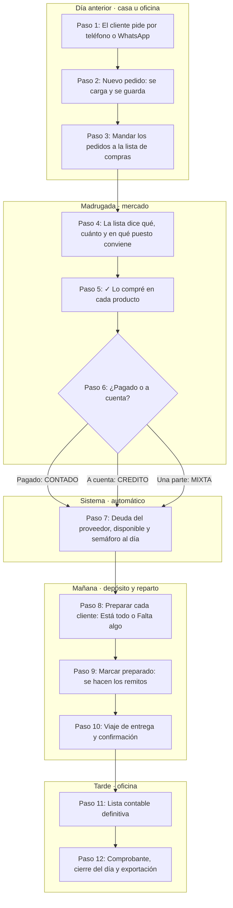
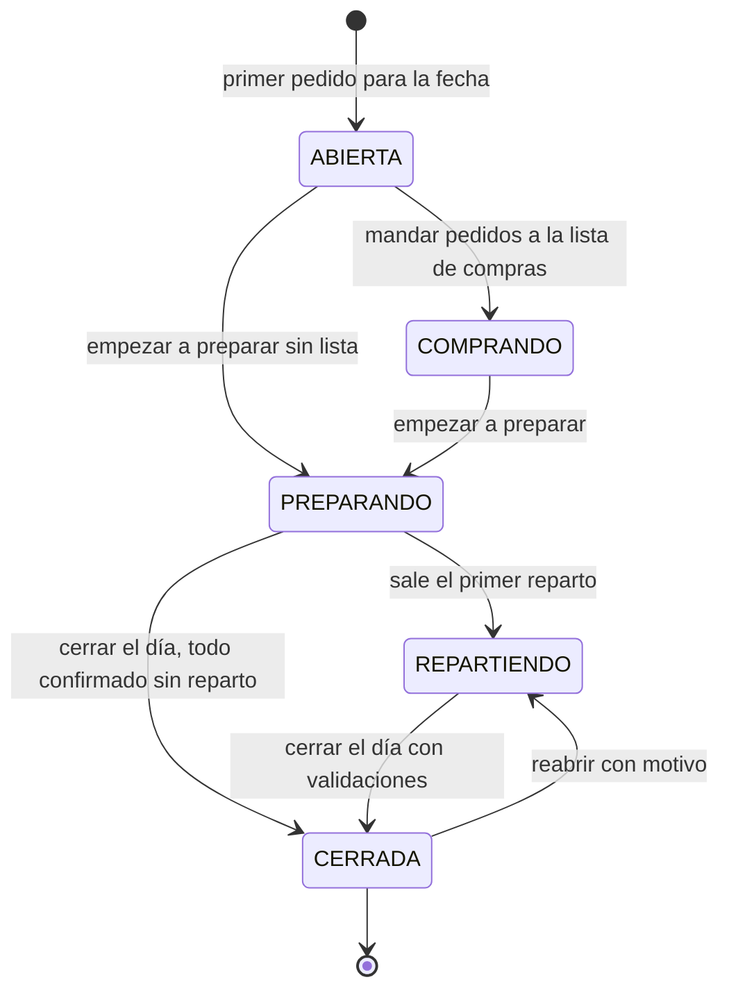
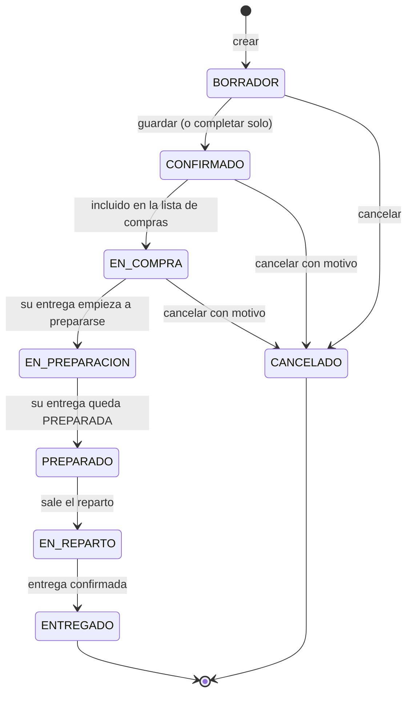
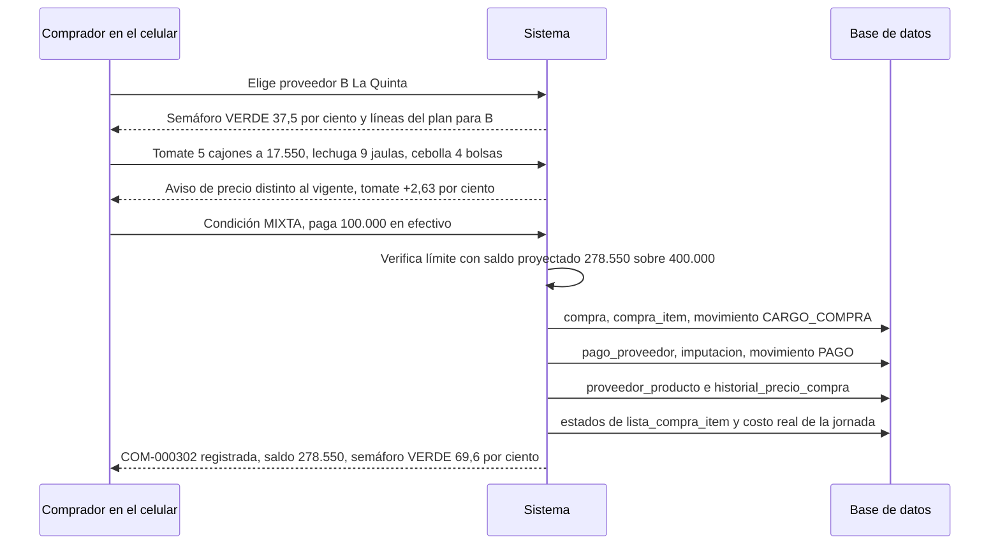
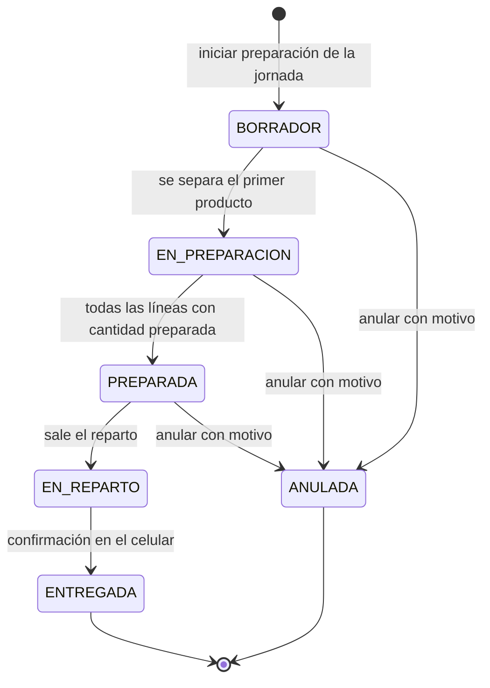
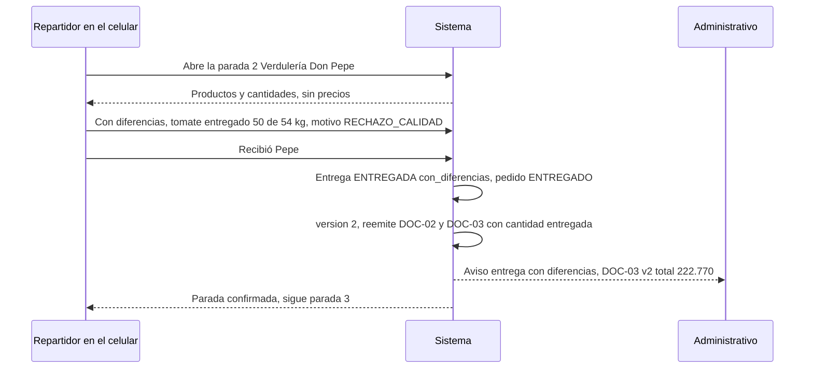
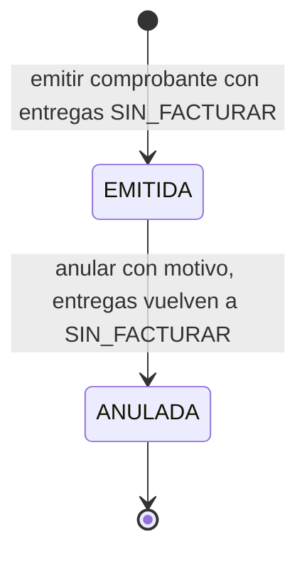

# 04 · Procesos y flujos

> **Propósito:** describir paso a paso cómo circula el trabajo en el sistema, desde que un cliente hace un pedido hasta que la venta queda registrada para el contador: quién hace cada cosa, qué datos cambian, en qué estado queda cada documento y qué pasa cuando algo sale distinto de lo planeado.

## Contenido

1. [Cómo leer este documento](#1-cómo-leer-este-documento)
2. [Escenario de ejemplo](#2-escenario-de-ejemplo)
3. [Flujo completo de punta a punta](#3-flujo-completo-de-punta-a-punta)
4. [La jornada: ciclo de vida y día típico](#4-la-jornada-ciclo-de-vida-y-día-típico)
5. [Procesos en detalle](#5-procesos-en-detalle)
   - [5.a Clientes y puntos de entrega](#5a-alta-y-gestión-de-clientes-y-puntos-de-entrega)
   - [5.b Sistema de pedidos](#5b-sistema-de-pedidos)
   - [5.c Generación de la lista de compras](#5c-generación-de-la-lista-de-compras)
   - [5.d Sistema de compras](#5d-sistema-de-compras)
   - [5.e Preparación](#5e-preparación-de-la-mercadería)
   - [5.f Sistema de entregas](#5f-sistema-de-entregas)
   - [5.g Venta, facturación y contabilidad](#5g-venta-facturación-y-contabilidad)
   - [5.h Cierre de jornada](#5h-cierre-de-jornada)
   - [5.i La plata: a cobrar, a pagar, gastos y balance](#5i-la-plata-a-cobrar-a-pagar-gastos-y-balance)
6. [Referencias cruzadas](#6-referencias-cruzadas)

---

## 1. Cómo leer este documento

| Elemento | Convención |
|---|---|
| Roles | ADMIN, VENDEDOR, COMPRADOR, PREPARADOR, REPARTIDOR, ADMINISTRATIVO (detalle y permisos en `02-usuarios-roles-y-permisos.md`). Hoy las dos personas que lo usan son ADMIN y hacen todos los pasos. |
| Entidades | Nombres de tabla del modelo de datos (`03-modelo-de-datos.md`), en `formato_codigo`. |
| Estados | En MAYÚSCULAS, exactamente como en `PARAMETROS-DEL-PROYECTO.md` §6 (ej.: `EN_COMPRA`, `PREPARADA`). |
| Reglas | `RN-xxx`, catálogo completo en `07-reglas-de-negocio.md`. |
| Precios y márgenes | Fórmulas y algoritmos en `05-precios-y-margenes.md`. |
| Créditos y pagos | Cuenta corriente de proveedores en `06-creditos-y-pagos.md`. |
| Pantallas y documentos | Pantallas en `08-pantallas-y-acciones.md`; documentos imprimibles `DOC-01`…`DOC-08` en `09-documentos-imprimibles.md`. |
| Permisos | Claves `modulo.accion` (ej.: `compras.exceder_limite`). |

Cada proceso de la sección 5 sigue el mismo formato: **objetivo, actores, disparador, precondiciones, pasos, estados, datos que se crean/modifican, resultados, excepciones y cómo se resuelven**.

---

## 2. Escenario de ejemplo

Todos los ejemplos de los documentos 04 a 07 usan estos datos, para que los números se puedan seguir de un documento a otro.

**Clientes**

| Cliente | Tipo | Punto de entrega | Ventana de recepción | Prioridad | Precio | Facturación |
|---|---|---|---|---|---|---|
| Hospital San Martín | HOSPITAL | Cocina central | 06:30–08:00 | 1 (máxima) | Precios fijos por licitación | MENSUAL |
| Restaurante La Esquina | RESTAURANTE | Local (puerta de servicio) | 09:00–11:00 | 2 | Recargo del cliente 35 % | SEMANAL |
| Verdulería Don Pepe | COMERCIO | Local | 07:00–10:00 | 2 | Usa el recargo de cada producto | POR_ENTREGA |

**Productos** (todo cálculo interno en unidad base)

| Producto | Categoría | Unidad base | Presentaciones de compra | Recargo del producto |
|---|---|---|---|---|
| Tomate redondo | Verduras | kg | Cajón 18 kg | 25 % |
| Papa | Verduras | kg | Bolsa 25 kg (también se vende por bolsa) | 30 % |
| Lechuga criolla | Verduras | unidad | Jaula 12 u | 35 % |
| Banana | Frutas | kg | Caja 20 kg | 35 % |
| Cebolla | Verduras | kg | Cajón 18 kg, Bolsa 20 kg, Bolsa 10 kg | 30 % |

**Proveedores** (ofertas vigentes al 23/09)

| Proveedor | Límite de crédito | Saldo actual | Plazo | Ofertas vigentes |
|---|---|---|---|---|
| A · Hnos. García (Puesto 14) | $500.000 | $15.000 | 7 días | Tomate cajón 18 kg $16.200 (preferido) · Papa bolsa 25 kg $13.000 · Cebolla cajón 18 kg $12.600 |
| B · La Quinta (Puesto 32) | $400.000 | $150.000 | 15 días | Tomate cajón 18 kg $17.100 · Lechuga jaula 12 u $9.600 · Cebolla bolsa 20 kg $13.600 |
| C · Papas del Sur | sin límite (`null`) | $0 | — | Papa bolsa 25 kg $12.500 |
| D · Frutas Tropicales | $150.000 | $60.000 | 10 días | Banana caja 20 kg $24.000 (preferido) |
| E · Mayorista Norte | $300.000 | $40.000 | 7 días | Banana caja 20 kg $25.000 · Cebolla bolsa 10 kg $7.300 |

**Pedidos de la jornada del jueves 24/09** (todos `CONFIRMADO` a las 20:00 del 23/09)

| Pedido | Cliente | Tomate | Papa | Lechuga | Banana | Cebolla |
|---|---|---|---|---|---|---|
| PED-000245 | Hospital San Martín | 180 kg | 140 kg | 48 u | 60 kg | 40 kg |
| PED-000246 | Restaurante La Esquina | 36 kg | 50 kg | 20 u | — | 15 kg |
| PED-000247 | Verdulería Don Pepe | 54 kg | 3 bolsas 25 kg (= 75 kg) | 30 u | 40 kg | 18 kg |

---

## 3. Flujo completo de punta a punta

### 3.1 Diagrama general

Lo usan dos personas con acceso completo; el diagrama agrupa los pasos por momento del día. Las dos trabajan sobre lo mismo a la vez: lo que guarda una le aparece a la otra en unos segundos, sin recargar (RN-183), y el día que cada una elige en el tablero es el que ve en las demás pantallas del día y en las etapas del menú (RN-182). En el mercado, lo comprado se marca pagado o a cuenta desde el mismo renglón de la lista de compras (RN-179).



### 3.2 Los 12 pasos del circuito, mapeados al sistema

| # | Paso del negocio | Acción del sistema | Rol | Entidades que cambian | Estado resultante |
|---|---|---|---|---|---|
| 1 | Un cliente hace un pedido | **Nuevo pedido** (carga visual): cliente, día, productos y cantidades. Se crea o se reutiliza la `jornada` de esa fecha. | ADMIN (los dos operadores) | `pedido`, `pedido_item`, `jornada` (si no existía) | jornada `ABIERTA` |
| 2 | El sistema lo registra | **✓ Guardar el pedido**: guarda todo junto, valida (RN-017, RN-018), calcula `cantidad_base` y precio estimado y asigna el número `PED-xxxxxx`. No hay un paso de "confirmar": el pedido queda en la columna **Pedidos** del tablero. | ADMIN | `pedido`, `pedido_item`, `secuencia` | pedido `CONFIRMADO` (internamente) |
| 3 | Los pedidos generan las cantidades a comprar | **🛒 Mandar a la lista de compras** (desde el tablero, con los pedidos elegidos o todos): consolida por producto en unidad base y convierte a envases de compra (algoritmo en 5.c). | ADMIN | `lista_compra`, `lista_compra_item`, `pedido` | ítems `PENDIENTE` · pedidos `EN_COMPRA` · jornada `COMPRANDO` |
| 4 | Se consulta qué proveedores tienen los productos y a qué precio | La **Lista de compras**, todo junto o por puesto, dice en qué puesto conviene cada producto (por costo y crédito disponible) y cuánto se calcula gastar; se imprime `DOC-01`, y `DOC-06` es la lista general de precios. | ADMIN | Ninguna (consulta). | Sin cambio de estado |
| 5 | Se registran las compras | En la lista de compras, **✓ Lo compré** en cada producto: puesto, cuántos y a cuánto; o una compra suelta con varios productos de un puesto. Actualiza el precio del puesto y su historial; cuando está todo lo de un pedido, su tarjeta queda toda tildada en **Lista de compras**, lista para pasar a Preparando (la columna Retiro está guardada por ahora, RN-195). | ADMIN | `compra`, `compra_item`, `proveedor_producto`, `historial_precio_compra`, `lista_compra_item` | compra `REGISTRADA` · ítems `PARCIAL`/`COMPRADO` |
| 6 | Se pagan en el momento o a crédito | Condición de pago de la compra: `CONTADO` genera un pago automático por el total; `CREDITO` deja todo pendiente; `MIXTA` registra el pago parcial. Pagos posteriores desde la cuenta corriente. | ADMIN (en el momento o después, desde **A pagar**) | `pago_proveedor`, `imputacion_pago_proveedor` | estado de pago de la compra `PAGADA`, `PARCIAL` o `PENDIENTE` |
| 7 | Se actualiza lo adeudado a cada proveedor | Cada compra genera un movimiento `CARGO_COMPRA`; cada pago un movimiento `PAGO`. Se recalculan saldo pendiente, crédito disponible y semáforo (ver `06-creditos-y-pagos.md`). | Sistema (automático) | `movimiento_cuenta_proveedor` | Semáforo `VERDE`/`AMARILLO`/`ROJO`/`EXCEDIDO` |
| 8 | Se prepara la mercadería de cada cliente | **Empezar a preparar**: se crea una `entrega` por cliente y punto de entrega con lo que hay que separarle; si lo comprado no alcanza, se reparte por prioridad. Por cada producto: **✓ Está todo** o **Falta algo** (cuánto se manda y por qué). | ADMIN | `entrega`, `entrega_item` (`cantidad_preparada`), `pedido` | jornada `PREPARANDO` · entrega `EN_PREPARACION` → `PREPARADA` · pedidos `EN_PREPARACION` → `PREPARADO` |
| 9 | Se genera la lista de entrega sin precios | **📦 Marcar como preparado**: congela precios en `entrega_item` y hace, de la misma entrega y versión, `DOC-02` Lista de entrega (sin precios) y `DOC-03` Lista contable. | ADMIN | `entrega_item` (precios congelados), `documento_emitido` ×2 | Documentos versión 1 |
| 10 | Se entrega | Viaje de entrega con el mejor orden y GPS, hoja de ruta `DOC-04`. En el celular: quién recibió, hora, diferencias o rechazos. | ADMIN | `reparto`, `entrega` (`cantidad_entregada`, receptor), `pedido` | jornada `REPARTIENDO` · entrega `EN_REPARTO` → `ENTREGADA` · pedidos `ENTREGADO` |
| 11 | Se genera la lista contable con precios y totales | Si no hubo diferencias, la versión 1 de `DOC-03` es la definitiva. Si las hubo, el sistema incrementa `entrega.version` y reemite `DOC-02` y `DOC-03` con `cantidad_entregada`. | Sistema (la rehace solo) | `entrega.version`, `documento_emitido` | Lista contable definitiva |
| 12 | Se actualiza la información de la venta | La entrega confirmada queda registrada como venta (`SIN_FACTURAR`). Según la periodicidad del cliente se agrupa en una `factura` (comprobante interno) y se exporta para el contador. | Sistema · ADMIN | `entrega` (estado de facturación), `factura`, `factura_entrega` | entrega `SIN_FACTURAR` → `FACTURADA` · factura `EMITIDA` · jornada `CERRADA` al terminar el día |

### 3.3 Secuencia resumida

```mermaid
sequenceDiagram
    participant CL as Cliente
    participant US as Quien usa el sistema
    participant SI as Sistema
    participant PV as Proveedor
    CL->>US: Pedido por WhatsApp para mañana
    US->>SI: Nuevo pedido y guardar
    SI-->>US: PED-000246 en la columna Pedidos, con precio estimado
    US->>SI: Mandar a la lista de compras
    SI-->>US: Lista con qué, cuánto y en qué puesto conviene
    US->>PV: Compra en el puesto
    US->>SI: ✓ Lo compré: puesto, cuántos, a cuánto, pagado o a cuenta
    SI->>SI: Cargo y pago en la cuenta del proveedor, semáforo, costo real
    US->>SI: Empezar a preparar y separar cada cliente
    SI-->>US: Lo que falta y por qué, a la vista en el tablero
    US->>SI: Marcar como preparado
    SI-->>US: DOC-02 sin precios y DOC-03 valorizado de la misma entrega
    US->>CL: Entrega con DOC-02
    US->>SI: Confirma quién recibió y las diferencias
    SI->>SI: Venta registrada; remitos rehechos si hubo diferencias
    US->>SI: Comprobante, cierre del día y exportación al contador
```

---

## 4. La jornada: ciclo de vida y día típico

La `jornada` es la fecha operativa (fecha de entrega). Agrupa los pedidos, la lista de compras, las compras, la preparación, los repartos y las entregas de ese día. Hay **una sola jornada por fecha y empresa** (RN-035) y pueden convivir varias abiertas: mientras se reparte la del jueves ya se cargan pedidos para el viernes.

### 4.1 Diagrama de estados



### 4.2 Transiciones

| Transición | Disparador | Validaciones | Efectos |
|---|---|---|---|
| (nueva) → `ABIERTA` | Primer pedido cargado para esa fecha | Fecha ≥ hoy; una sola jornada por fecha (RN-035) | Se crea la jornada |
| `ABIERTA` → `COMPRANDO` | **🛒 Mandar a la lista de compras** (tablero) o "Armar la lista" (paso a paso), con `lista_compra.generar` | Al menos un pedido con productos (RN-037); los que quedaron sin terminar se completan solos (RN-034) | Crea la `lista_compra`; los pedidos incluidos → `EN_COMPRA`; registra `compra_iniciada_en` |
| `ABIERTA` o `COMPRANDO` → `PREPARANDO` | **📦 Empezar a preparar**, con `preparacion.registrar` | Se puede aunque falte comprar algo (RN-038) | Crea una `entrega` por cliente y punto de entrega y propone las cantidades (5.e); registra `preparacion_iniciada_en` |
| `PREPARANDO` → `REPARTIENDO` | Automático cuando sale el primer reparto (RN-039) | El reparto tiene los remitos al día (RN-122) | Registra `reparto_iniciado_en` |
| `PREPARANDO` o `REPARTIENDO` → `CERRADA` | **🔒 Cerrar el día**, con `jornada.cerrar` | Validaciones de 5.h (RN-040) | Guarda el resumen del día; queda de solo lectura (RN-041) |
| `CERRADA` → `REPARTIENDO` | "Reabrir el día", con `jornada.reabrir`: desde la pantalla de cierre o con un toque en el cartel del tablero | El motivo se escribe en el cierre; desde el tablero queda "Reabierto desde el tablero" | Registro en `auditoria` (`REAPERTURA_JORNADA`) |

### 4.3 Qué se puede hacer en cada estado

Las operaciones de fases anteriores siguen permitidas en fases posteriores cuando tiene sentido (por ejemplo, una compra adicional durante la preparación). Esta tabla es la regla RN-042.

| Operación | ABIERTA | COMPRANDO | PREPARANDO | REPARTIENDO | CERRADA |
|---|---|---|---|---|---|
| Cargar pedidos | Sí | Sí (pedido tardío, RN-029) | Con `pedidos.editar_en_curso` | Con `pedidos.editar_en_curso` | No |
| Modificar pedidos `CONFIRMADO` / `EN_COMPRA` / `EN_PREPARACION` | Sí | Con `pedidos.editar_en_curso` si está `EN_COMPRA` | Con `pedidos.editar_en_curso` si está `EN_COMPRA` o `EN_PREPARACION` | No | No |
| Generar o regenerar la lista de compras | Sí (la primera vez) | Sí | Sí (para tardíos) | No | No |
| Registrar compras | Sí (compra anticipada) | Sí | Sí | Sí | No |
| Preparar entregas | No | No | Sí | Sí | No |
| Emitir y reemitir documentos | No | No | Sí | Sí | No (reabrir) |
| Armar repartos y confirmar entregas | No | No | Sí | Sí | No |
| Pagos a proveedores y facturación | Independiente de la jornada | ← | ← | ← | ← |

### 4.4 Un día típico

Ejemplo con la jornada del jueves 24/09 (la hora de corte es configurable).

| Momento | Qué pasa | Estado de la jornada 24/09 |
|---|---|---|
| Mié 23/09, 08:00–19:30 | Llegan pedidos por WhatsApp y teléfono; se cargan en **Nuevo pedido** (los productos frecuentes del cliente arriba, y su historial de pedidos). Quedan en la columna **Pedidos** del tablero. | `ABIERTA` |
| Mié 23/09, 20:00 | Hora de corte. Desde el tablero se mandan los pedidos a la **Lista de compras** (se puede imprimir, `DOC-01`). | `COMPRANDO` |
| Mié 23/09, 21:30 | Pedido tardío: el restaurante agrega 10 kg de cebolla. La lista avisa que quedó desactualizada y se vuelve a calcular mostrando la diferencia. | `COMPRANDO` |
| Jue 24/09, 04:30–06:00 | Compra en el mercado con la lista en el celular: en cada renglón, **💲 Precio y puesto** (a quién se le compró, a cuánto y si quedó a cuenta) o la compra producto por producto (o, sin anotar precios, se tilda en la tarjeta o se la pasa directo a Preparando, 5.d.5b). La lista se va tachando, el semáforo de cada proveedor se actualiza y los pedidos con todo comprado quedan tildados, listos para preparar. Arriba del tablero, el **resumen balance** va diciendo lo gastado (pagado y a crédito) frente a la **caja inicial** del día, y avisa si se la supera (RN-180, RN-194). Lo que no hubo se marca "No lo conseguí". | `COMPRANDO` |
| Jue 24/09, 06:00–07:30 | **Empezar a preparar**: cada cliente con su lista, siguiendo los tres pasos a la vista (separar → marcar preparado → sale). Se tilda ✓ cada producto separado, en la tarjeta del tablero o en Preparación (es el mismo checklist), o se anota lo que falta con el motivo; al **marcar como preparado** se hacen `DOC-02` y `DOC-03`. Los remitos se ven e imprimen en **Remitos** (menú). | `PREPARANDO` |
| Jue 24/09, 07:00 | **Viaje de entrega**: el mejor orden de las paradas, se arma el reparto, se imprimen los remitos y la hoja de ruta `DOC-04` y sale ("Salir" en el reparto, o arrastrando las tarjetas de Preparando a En camino en el tablero: "🚚 Sale ahora"). | `REPARTIENDO` |
| Jue 24/09, 07:15–11:00 | Entregas: "✅ Ya se entregó" en la tarjeta del tablero (entrega completa) o la confirmación en el celular con quién recibió y las diferencias. Si hay diferencias se rehacen los remitos. | `REPARTIENDO` |
| Jue 24/09, 14:00–16:00 | Lo que pagaron los clientes se anota en **A cobrar**, lo que se les pagó a los proveedores en **A pagar** y la nafta del reparto en **Gastos e ingresos** (5.i); los comprobantes de los clientes que facturan por entrega salen solos; **cierre del día** con su resumen. | `CERRADA` |

---

## 5. Procesos en detalle

### 5.a Alta y gestión de clientes y puntos de entrega

| Campo | Detalle |
|---|---|
| Objetivo | Tener cada cliente con los datos necesarios para tomar pedidos, calcular precios, preparar, entregar y facturar sin volver a preguntar. |
| Actores | ADMIN (alta, datos, ganancia propia y precios pactados). |
| Disparador | Cliente nuevo, cambio de datos, nuevo lugar de entrega (ej.: el hospital abre una segunda cocina). |
| Precondiciones | Permiso `clientes.editar`. Para editar recargos y reglas de precio: `precios.editar_reglas`. |

**Pasos (alta)**

1. El usuario abre "Nuevo cliente" y carga los datos mínimos: nombre o razón social, tipo (`HOSPITAL`, `RESTAURANTE`, `COMERCIO`, `INSTITUCION`, `OTRO`), teléfono o WhatsApp de pedidos.
2. Carga al menos un `punto_entrega` (RN-010): nombre ("Cocina central"), dirección y localidad, franja de recepción (`horario_desde`–`horario_hasta`, ej. 06:30–08:00), días de entrega, contacto de recepción, referencias e instrucciones ("ingresar por la puerta de proveedores, calle lateral, andén 2"). El primero queda como principal.
3. Datos comerciales (opcionales en el alta, necesarios antes de facturar): identificador fiscal (CUIT/RUT; único por empresa, RN-011), `email_contable` (destino de `DOC-03`), periodicidad de facturación (`POR_ENTREGA` por defecto, RN-014), `prioridad_faltantes` (1 a 5, por defecto 3, RN-013), `requiere_orden_compra` (habitual en hospitales: el pedido exige el número de orden de compra). Además: acepta sustituciones (`acepta_sustituciones`) y requiere firma o foto en la entrega (`requiere_firma`).
4. Precio: `recargo_default` del cliente (opcional) y reglas especiales (`regla_precio`: precio fijo o recargo por producto o categoría, con vigencia). Ver `05-precios-y-margenes.md`.
5. Guardar. El cliente queda `activo = true` y disponible para pedidos.

**Gestión**

- Editar datos: cambios de recargo, prioridad y datos fiscales se registran en `auditoria` (RN-015).
- Agregar, editar o desactivar puntos de entrega. Un punto con entregas en curso no se desactiva (RN-016).
- Desactivar cliente (`activo = false`): no admite pedidos nuevos; los pedidos en curso siguen su circuito y el sistema lista los pedidos futuros para que se decida si se cancelan (RN-012). Nunca se borra.
- Consulta: ficha del cliente con puntos de entrega, pedidos recientes, productos que compra habitualmente con cantidades promedio, reglas de precio vigentes.

**Datos que se crean o modifican:** `cliente`, `punto_entrega`, `regla_precio`, `auditoria`.

**Resultado:** cliente activo con al menos un punto de entrega, listo para recibir pedidos.

**Excepciones**

| Excepción | Resolución |
|---|---|
| Ya existe un cliente con el mismo identificador fiscal | Bloquea (RN-011) y ofrece abrir el existente; si es otra sucursal, se agrega como `punto_entrega` del mismo cliente. |
| Cliente sin punto de entrega | Se puede guardar como ficha, pero no se le pueden cargar pedidos hasta cargar uno (RN-010). |
| Desactivar un cliente con pedidos futuros | Advierte con la lista de pedidos `BORRADOR`/`CONFIRMADO`; el usuario decide cancelarlos (con motivo) o mantenerlos. |
| Un mismo cliente con varias cocinas o locales | Un cliente, varios `punto_entrega`. Cada punto genera su propia entrega y sus propios documentos. |

---

### 5.b Sistema de pedidos

| Campo | Detalle |
|---|---|
| Objetivo | Registrar rápido y sin errores lo que cada cliente necesita, para qué fecha y dónde, de modo que alimente la compra y la entrega. |
| Actores | ADMIN (siempre las mismas dos personas). |
| Disparador | Mensaje de WhatsApp, llamada o pedido en persona. |
| Precondiciones | Cliente activo con punto de entrega activo; jornada de destino no `CERRADA` y con fecha ≥ hoy (RN-017, RN-031). Permiso `pedidos.crear` (guardar deja el pedido confirmado internamente, `pedidos.confirmar`). |

**Qué registra un pedido**

| Nivel | Datos |
|---|---|
| `pedido` | Número `PED-xxxxxx`, cliente, punto de entrega, jornada (fecha de entrega), canal (`TELEFONO`, `WHATSAPP`, `EMAIL`, `PRESENCIAL`), referencia del cliente (número de orden de compra, obligatoria si el cliente la requiere), franja especial de entrega (opcional), observaciones para preparación y entrega ("dejar en cámara de frío"), observaciones internas, estado, total estimado. "Pedido tardío" no se guarda: se deriva (confirmado después de `jornada.compra_iniciada_en`). |
| `pedido_item` | Producto, presentación elegida (opcional, debe ser `usable_en_venta`, RN-019), cantidad pedida, `cantidad_base` calculada (RN-008), observación de la línea ("si no hay redondo, perita"), precio estimado con su costo, recargo y origen de regla (visibles según `precios.ver_venta`, `precios.ver_costos` y `precios.ver_margenes`, RN-032), marca de línea cancelada. |

**Estados del pedido**



Los estados desde `EN_PREPARACION` en adelante los mueve la entrega: el pedido refleja el estado de la entrega a la que pertenecen sus líneas. La facturación se sigue en la entrega y la factura, no en el pedido.

#### 5.b.1 Nuevo pedido (carga visual)

Meta de diseño: un pedido de 10 productos en menos de dos minutos desde el celular. Detalle de la pantalla en `08-pantallas-y-acciones.md` P-41.

1. **¿Para quién es?** Recuadros de clientes con buscador; si tiene varios lugares de entrega se elige uno.
2. **¿Para qué día?** Los próximos 7 días; se propone mañana (o pasado mañana después de la hora de corte). Si el cliente ya tiene un pedido ese día y lugar, se avisa y se ofrece sumarle los productos (RN-022).
3. **¿Qué lleva?** Una sola lista de productos: arriba los **productos frecuentes** del cliente y, debajo, todos los demás del más reciente al menos reciente; además, su historial de pedidos para repetir uno. La cantidad se cambia con − y + o escribiéndola. Va en la medida del producto; solo si el producto tiene varias (por kilo y además por cajón o bolsa) se elige en cuál, y entonces el sistema la pasa a unidad base ("3 bolsas = 75 kg"). Una nota por producto.
4. Prioridad, horario y nota del pedido.
5. **✓ Guardar el pedido** guarda todo junto, directamente en `CONFIRMADO` (RN-018, RN-018b): nunca queda un pedido vacío. No hay borradores a mano; un pedido queda `BORRADOR` solo si algo impidió completarlo (por ejemplo, le falta la orden de compra), y se completa solo al mandarlo a la lista o al empezar a preparar si ya tiene productos.

Ejemplo: WhatsApp de Restaurante La Esquina a las 17:40 del 23/09: *"Para mañana: 2 cajones de tomate, 50 de papa, 20 lechugas y 15 kg de cebolla"*. Se carga tomate `36 kg` (o 2 × `Cajón 18 kg` si esa presentación se vende), papa `50 kg`, lechuga `20 u`, cebolla `15 kg` y se guarda: PED-000246.

#### 5.b.2 Duplicar un pedido anterior

1. Desde el detalle de un pedido: "Duplicar" (en la carga visual, "Repetir su último pedido" hace lo mismo).
2. Elegir la jornada de destino.
3. El sistema crea un pedido `BORRADOR` con las mismas líneas y cantidades; omite productos desactivados y lo avisa (RN-033). Los precios **no** se copian: se recalculan para la nueva fecha.
4. Se ajustan las cantidades y se guarda.

#### 5.b.3 Validación y precio estimado

- Al guardar se valida el pedido completo, se asigna el número desde `secuencia` y se calcula para cada línea el **precio estimado** con `calcularPrecioVenta` (`05-precios-y-margenes.md` §5.8), usando el costo de referencia de la empresa porque todavía no hay compras.
- El precio estimado y el total estimado solo se muestran a quien tiene `precios.ver_venta`; el costo requiere `precios.ver_costos` y el recargo, el origen detallado y el margen, `precios.ver_margenes`. Se rotula siempre "estimado": se recalcula con el costo real después de comprar y se congela recién al emitir los documentos de entrega.
- Si una línea queda con alerta de margen (bajo o negativo) o sin precio, el pedido se guarda igual, pero la alerta queda visible.

#### 5.b.4 Modificación y cancelación según estado

| Estado del pedido | ¿Se puede modificar? | ¿Se puede cancelar? | Efecto en el resto del circuito |
|---|---|---|---|
| `BORRADOR` | Sí (`pedidos.editar`) | Sí, sin motivo | Ninguno (no participa de la lista de compras). |
| `CONFIRMADO` | Sí (`pedidos.editar`) | Sí, con motivo (`pedidos.cancelar`) | Si la lista ya existe, se marca "desactualizada" (RN-052). |
| `EN_COMPRA` | Solo con `pedidos.editar_en_curso` (RN-026) | Sí, con motivo (`pedidos.cancelar`). También se puede cancelar una sola línea (`pedido_item.cancelado` con motivo). | La lista se marca "desactualizada"; al volver a calcularla se ven las diferencias. Si se reduce o cancela algo ya comprado, queda como **sobrante previsto**. |
| `EN_PREPARACION` | Solo con `pedidos.editar_en_curso` (RN-027): el cambio se traslada a la línea de la entrega (`cantidad_pedida`); si la entrega ya tenía documentos emitidos, se reemiten con nueva versión. | No (D-05): se confirma la entrega con cantidad 0 (07, caso 33). | Afecta la preparación en curso; puede requerir compra adicional o generar sobrante. |
| `PREPARADO` | No (RN-027). Las diferencias se registran en la entrega (cantidad preparada o entregada distinta). Para agregar productos: pedido complementario. | No (D-05). | — |
| `EN_REPARTO`, `ENTREGADO` | No | No | Rechazos y diferencias se registran al confirmar la entrega. |
| `CANCELADO` | No | — | Sale de la lista de compras en la próxima regeneración. |

Toda cancelación desde `CONFIRMADO` o `EN_COMPRA` y toda modificación en `EN_COMPRA` o `EN_PREPARACION` se registra en `auditoria` con usuario, fecha, motivo y valores anteriores (RN-028).

#### 5.b.5 Pedidos tardíos (después de generada la lista de compras)

| Estado de la jornada | Qué pasa con el pedido tardío |
|---|---|
| `COMPRANDO` | Se acepta con marca `tardío` (RN-029). La lista de compras avisa que quedó desactualizada; al volver a calcularla aparece la diferencia ("Cebolla: 73 → 83") y el pedido pasa a `EN_COMPRA`. |
| `PREPARANDO` o `REPARTIENDO` | Solo con `pedidos.editar_en_curso` (RN-030). Si no alcanza con lo comprado, se vuelve a calcular la lista y se hace una compra adicional. Si la entrega del cliente todavía no salió, las líneas se suman a esa entrega (si ya tenía documentos emitidos, se reemiten con nueva versión); si ya salió, se crea una entrega nueva para la misma jornada. |
| `CERRADA` | Bloqueado (RN-031): el sistema propone la próxima jornada. |

**Datos que se crean o modifican:** `pedido`, `pedido_item`, `jornada`, `secuencia`, `auditoria`; indirectamente `lista_compra` (marca de desactualizada).

**Resultados:** pedidos `CONFIRMADO` en la jornada correcta, con cantidades en unidad base y precio estimado.

**Excepciones**

| Excepción | Resolución |
|---|---|
| El cliente pide un producto que no está en el catálogo | Se da de alta en el momento (**＋ Nuevo producto**: tres preguntas) y se vuelve al pedido. |
| El cliente pide en una unidad que no existe como presentación de venta ("un cajón de lechuga") | Se carga en unidad base con la equivalencia que indique el cliente, o el ADMIN habilita la presentación (`usable_en_venta`). |
| Las dos personas cambian el mismo pedido a la vez | No hay bloqueo: vale el último que guarda; el historial del pedido muestra quién cambió qué. |
| Pedido cargado en el día equivocado | Si todavía no está en la lista de compras, se pasa a otro día desde el detalle del pedido. Si ya está, primero se lo saca de la lista desde el tablero. |
| Pedido sin precio calculable (producto sin costo ni precio fijo) | Se guarda igual con alerta "sin precio"; debe resolverse antes de emitir `DOC-03` (RN-087). |

#### 5.b.6 Pedidos desde una planilla de Excel

Para quien arma los pedidos en una planilla (o los recibe así). Desde el tablero, **📊 Excel** (08 P-43):

1. Se baja la **planilla modelo** (trae los títulos y, en otras hojas, los clientes y los productos con su código y sus envases).
2. Se escribe una fila por producto: cliente, código (o nombre) del producto y cantidad; opcionalmente la fecha de entrega, el envase y una nota. Las filas del mismo cliente y día forman un pedido; el cliente y la fecha vacíos valen los de la fila de arriba.
3. Se sube el archivo. El sistema **primero muestra lo que entendió**: los pedidos que saldrían, y si un cliente ya tiene un pedido para ese día. Si alguna fila no se entiende (un cliente o un código que no existe, una cantidad con coma en un producto que va por unidad, una fecha que ya pasó, un día cerrado), lo dice fila por fila y no carga nada: se corrige la planilla y se vuelve a subir.
4. **Cargar** los guarda todos juntos, o ninguno. Quedan en la columna Pedidos, cada uno con su número y su registro en la actividad, como los cargados a mano.

Al revés, **Bajar los pedidos a Excel** da los pedidos de un día con las mismas columnas (más el número de pedido y la etapa), para revisarlos, compartirlos o volver a subirlos otro día cambiando la fecha.

---

### 5.c Generación de la lista de compras

| Campo | Detalle |
|---|---|
| Objetivo | Convertir todos los pedidos de la jornada en **qué comprar, cuánto, en qué presentación, a quién y cuánto va a costar**, en una lista imprimible (`DOC-01`) y utilizable en el celular. |
| Actores | ADMIN (`lista_compra.generar`). |
| Disparador | **🛒 Mandar a la lista de compras** desde el tablero (con los pedidos elegidos o todos), "Armar la lista" en el paso a paso, o "Volver a calcular la lista con los pedidos de ahora" (cuando cambian los pedidos). |
| Precondiciones | Jornada `ABIERTA`, `COMPRANDO` o `PREPARANDO`; al menos un pedido `CONFIRMADO` (RN-037). |

**Pasos**

1. Los pedidos que quedaron sin terminar pero tienen productos se completan solos; los que no se pueden completar (sin productos, sin orden de compra) quedan afuera con el motivo (RN-034).
2. Consolida la necesidad por producto en unidad base (algoritmo 5.c.1).
3. Descuenta lo ya comprado para la jornada.
4. Convierte lo pendiente a presentaciones de compra redondeando hacia arriba.
5. Sugiere proveedor por línea según la estrategia de costo de la empresa y el crédito disponible.
6. Calcula costo estimado por línea, por proveedor y total.
7. Guarda la nueva versión de `lista_compra` con sus `lista_compra_item` y las diferencias contra la versión anterior.
8. Pedidos `CONFIRMADO` incluidos → `EN_COMPRA`; si la jornada estaba `ABIERTA` → `COMPRANDO`.
9. La **Lista de compras** queda lista para el mercado: todo junto o por puesto, con el puesto que conviene para cada producto; se puede imprimir (`DOC-01`).

#### 5.c.1 Algoritmo de consolidación (pseudocódigo)

```text
función generarListaCompra(jornada, usuario):
    requiere jornada.estado ∈ {ABIERTA, COMPRANDO, PREPARANDO}

    // 1. Necesidad bruta por producto, en unidad base (RN-043, RN-044)
    necesidad = mapa producto_id → 0
    para cada it en pedido_item no cancelados de pedidos de la jornada con estado ∈ {CONFIRMADO, EN_COMPRA}:
        necesidad[it.producto_id] += it.cantidad_base

    // 2. Descuento de sobrantes en stock (FASE 2, RN-045)
    para cada p en necesidad:
        sobrante[p]       = ('STOCK' ∈ empresa.modulos_habilitados) ? stockDisponible(p) : 0
        necesidad_neta[p] = max(0, necesidad[p] − sobrante[p])

    lista = lista_compra de la jornada; si no existe se crea (version 1), si existe version += 1
    foto_anterior = copia de sus lista_compra_item antes de recalcular (para mostrar diferencias)
    disponible_proyectado = mapa proveedor_id → creditoDisponible(proveedor)   // ver 06 §8
    productos = unión(claves de necesidad_neta, productos con compras en la jornada, productos de foto_anterior)

    para cada p en productos (ordenado por categoría y nombre):
        linea     = lista_compra_item de (lista, p), o nueva
        comprado  = Σ compra_item.cantidad_base de compras REGISTRADA de la jornada para p
        pendiente = max(0, necesidad_neta[p] − comprado)
        si linea ya existía y cambió su necesidad después de comprar o de un ajuste: linea.necesidad_modificada = true

        // 3. Proveedor: se respeta la asignación manual previa (RN-050)
        si linea tiene proveedor asignado a mano:
            oferta = oferta vigente de ese proveedor para p
        sino:
            oferta = sugerirProveedor(p, pendiente, disponible_proyectado)   // ver 5.c.2

        // 4. Conversión a presentaciones de compra, redondeo hacia arriba (RN-046)
        si oferta existe:
            factor = oferta.presentacion.factor_a_base
            n      = linea.ajuste_manual ? linea.cantidad_presentaciones : techo(pendiente / factor)
            costo_estimado = n × oferta.precio_vigente
            disponible_proyectado[oferta.proveedor_id] −= costo_estimado
        sino:
            factor = producto.presentacion_compra_default (o 1)
            n      = techo(pendiente / factor)
            costo_estimado = null ; alerta SIN_PROVEEDOR (RN-048)

        a_comprar_base    = n × factor
        sobrante_previsto = a_comprar_base − pendiente + max(0, comprado − necesidad_neta[p])

        guardar linea: necesidad_base = necesidad[p], sobrante_disponible_base = sobrante[p],
            necesidad_neta_base = necesidad_neta[p], comprado_base = comprado,
            presentacion_sugerida, cantidad_presentaciones = n, a_comprar_base,
            sobrante_previsto_base = sobrante_previsto, proveedor_sugerido, proveedor_producto_sugerido,
            precio_sugerido = oferta.precio_vigente, costo_estimado,
            estado = estadoLinea(necesidad_neta[p], comprado, linea.estado = NO_CONSEGUIDO)

    lista.costo_estimado_total = Σ costo_estimado ; lista.generada_en = ahora ; lista.generada_por = usuario

    // 5. Diferencias contra la versión anterior (se muestran y se registran en auditoria; no se pierde lo comprado)
    diferencias = comparar(foto_anterior, lista) por producto: antes, ahora, delta, ya comprado
    marcar pedidos incluidos CONFIRMADO → EN_COMPRA
    si jornada.estado = ABIERTA: jornada.estado = COMPRANDO
    devolver lista, diferencias

función estadoLinea(necesidad, comprado, marca_no_conseguido):   // RN-051
    si marca_no_conseguido y comprado < necesidad: NO_CONSEGUIDO
    si comprado = 0:          PENDIENTE
    si comprado < necesidad:  PARCIAL
    sino:                     COMPRADO
```

Notas de implementación:

- `techo` opera sobre `numeric`, nunca sobre flotantes (98 / 12 = 8,1667 → 9).
- Un producto que ya no tiene necesidad y del que nada se compró queda en la nueva versión con necesidad 0, oculto en la vista normal y visible en "diferencias". Si ya se compró algo, queda visible como excedente (sobrante previsto).
- La regeneración **nunca** modifica ni anula compras (RN-049): solo recalcula lo pendiente. La lista es una sola fila por jornada que incrementa su `version` (ver `03-modelo-de-datos.md`).
- Cambiar a mano la cantidad a comprar o marcar `NO_CONSEGUIDO` requiere `lista_compra.editar`. El ajuste manual de cantidad (`ajuste_manual` con motivo) se conserva al volver a calcular la lista y, si la necesidad cambió, se marca `necesidad_modificada`.

#### 5.c.2 Sugerencia de proveedor

```text
función sugerirProveedor(producto, pendiente, disponible_proyectado):
    candidatos = proveedor_producto del producto con activo y disponible, proveedor.activo,
                 presentacion.usable_en_compra y precio_vigente > 0
    ordenar candidatos según empresa.estrategia_costo:
        PREFERIDO         → primero producto.proveedor_preferido; luego menor costo_base (precio / factor)
        MINIMO            → menor costo_base;
                            desempate: preferido, luego precio actualizado más recientemente
        ULTIMO_COSTO_REAL → primero el proveedor de la última compra real del producto; luego menor costo_base
    para cada c en candidatos:
        costo_linea = techo(pendiente / c.factor_a_base) × c.precio_vigente
        si c.proveedor.limite_credito es null
           o c.proveedor.condicion_pago_habitual = CONTADO
           o disponible_proyectado[c.proveedor_id] ≥ costo_linea:
            devolver c                                   // alcanza el crédito
        sino:
            registrar alerta CREDITO_INSUFICIENTE(c.proveedor, disponible, costo_linea)
    si candidatos no vacío:
        devolver candidatos[0] con alerta "ningún proveedor tiene crédito suficiente: pagar contado o parcial"
    devolver null
```

Las ofertas con precio desactualizado (más de N días, RN-069) siguen siendo candidatas, pero la línea muestra el aviso. La sugerencia no obliga: al anotar la compra ("✓ Lo compré") se elige el puesto donde se compró, sea o no el sugerido.

#### 5.c.3 Ejemplo de la jornada 24/09

Consolidación (estrategia de la empresa: `PREFERIDO`):

| Producto | Hospital | Restaurante | Verdulería | Necesidad | Presentación | Cant. | A comprar | Sobrante previsto | Proveedor sugerido | Precio | Costo estimado |
|---|---|---|---|---|---|---|---|---|---|---|---|
| Tomate | 180 kg | 36 kg | 54 kg | 270 kg | Cajón 18 kg | 15 | 270 kg | 0 kg | A · Hnos. García (preferido) | $16.200 | $243.000 |
| Papa | 140 kg | 50 kg | 75 kg | 265 kg | Bolsa 25 kg | 11 | 275 kg | 10 kg | C · Papas del Sur ($500/kg vs $520/kg de A) | $12.500 | $137.500 |
| Lechuga | 48 u | 20 u | 30 u | 98 u | Jaula 12 u | 9 | 108 u | 10 u | B · La Quinta | $9.600 | $86.400 |
| Banana | 60 kg | — | 40 kg | 100 kg | Caja 20 kg | 5 | 100 kg | 0 kg | E · Mayorista Norte ⚠ | $25.000 | $125.000 |
| Cebolla | 40 kg | 15 kg | 18 kg | 73 kg | Bolsa 20 kg | 4 | 80 kg | 7 kg | B · La Quinta ($680/kg) | $13.600 | $54.400 |
| **Total** | | | | | | | | | | | **$646.300** |

⚠ Banana: el preferido es D · Frutas Tropicales ($1.200/kg), pero la línea cuesta 5 × $24.000 = $120.000 y su crédito disponible es $150.000 − $60.000 = $90.000. El sistema sugiere E ($1.250/kg, disponible $260.000) y muestra: *"D no tiene crédito suficiente (disponible $90.000). Pagando contado a D ahorrás $5.000."*

**La lista por puesto** (vista "Por puesto" de la lista de compras y orden de `DOC-01`):

| Proveedor | Líneas | Subtotal | Disponible hoy | Disponible después | Uso proyectado | Semáforo proyectado |
|---|---|---|---|---|---|---|
| A · Hnos. García | Tomate 15 cajones | $243.000 | $485.000 | $242.000 | 51,6 % | VERDE |
| B · La Quinta | Lechuga 9 jaulas · Cebolla 4 bolsas 20 kg | $140.800 | $250.000 | $109.200 | 72,7 % | AMARILLO |
| C · Papas del Sur | Papa 11 bolsas | $137.500 | sin límite | sin límite | — | — |
| E · Mayorista Norte | Banana 5 cajas | $125.000 | $260.000 | $135.000 | 55,0 % | VERDE |
| **Total** | | **$646.300** | | | | |

(Uso proyectado de B = ($150.000 + $140.800) / $400.000 = 72,7 %; de A = ($15.000 + $243.000) / $500.000 = 51,6 %.)

#### 5.c.4 Regeneración cuando cambian los pedidos

Continuación del ejemplo: a las 21:30 el restaurante agrega 10 kg de cebolla (pedido tardío). La lista muestra la marca "desactualizada" (RN-052). Al regenerar (versión 2):

| Producto | Necesidad v1 | Necesidad v2 | Diferencia | Ya comprado | A comprar v2 | Efecto |
|---|---|---|---|---|---|---|
| Cebolla | 73 kg | 83 kg | +10 kg | 0 kg | 5 bolsas 20 kg (100 kg), sobrante previsto 17 kg | +1 bolsa, +$13.600 |

Si la regeneración ocurre después de haber comprado (por ejemplo, ya se compraron 4 bolsas = 80 kg), lo pendiente es 83 − 80 = 3 kg → 1 bolsa más; lo comprado no se toca. Si en cambio la necesidad **baja** por debajo de lo comprado, la línea queda `COMPRADO` y la diferencia aparece como sobrante previsto.

**Datos que se crean o modifican:** `lista_compra` (nueva versión), `lista_compra_item`, `pedido` (estado), `jornada` (estado).

**Resultados:** lista vigente, plan por proveedor con costos y crédito, `DOC-01` imprimible (con o sin precios según el permiso `precios.ver_costos`, RN-053).

**Excepciones**

| Excepción | Resolución |
|---|---|
| Producto sin ninguna oferta vigente | Línea "sin proveedor / sin precio" resaltada (RN-048); se compra igual y el precio se toma de la compra registrada. |
| Ningún proveedor con crédito suficiente | Se sugiere el mejor por costo con aviso "pagar contado o parcial". El control definitivo ocurre al registrar la compra (`06-creditos-y-pagos.md` §9). |
| Pedidos modificados mientras se está en el mercado | La lista avisa que quedó desactualizada; volver a calcularla no pierde lo comprado. |
| Se generó la lista con un pedido cargado por error | Cancelar el pedido y regenerar; si ya se compró, queda sobrante previsto. |

---

### 5.d Sistema de compras

| Campo | Detalle |
|---|---|
| Objetivo | Registrar en el momento, desde el celular, cada compra hecha en el mercado (a quién, qué, cuánto, a qué precio y cómo se paga) para conocer el costo real, lo que se debe a cada proveedor y lo que falta comprar. |
| Actores | ADMIN (quien va al mercado). |
| Disparador | Se cierra el trato en un puesto. |
| Precondiciones | Proveedor activo; jornada no `CERRADA` (RN-054). Permiso `compras.registrar`. Requiere conexión. |

**Qué registra una compra**

| Nivel | Datos |
|---|---|
| `compra` | Número `COM-xxxxxx`, proveedor, jornada, fecha y hora (`fecha_compra`), condición de pago (`CONTADO`, `CREDITO`, `MIXTA`; se propone la `condicion_pago_habitual` del proveedor), monto pagado en el acto y su medio, total, fecha de vencimiento (fecha + `plazo_pago_dias`), número de boleta del puestero (opcional), marca de exceso de límite autorizado, observaciones, estado (`REGISTRADA`/`ANULADA`). |
| `compra_item` | Producto, presentación (`usable_en_compra`, RN-055), cantidad de presentaciones, `precio_unitario` por presentación, `cantidad_base` = cantidad × factor, `costo_base` = precio / factor, subtotal = cantidad × precio (RN-057), línea de la lista de compras a la que corresponde (nula si es compra sin pedido), marca `actualizo_precio_lista`. |

**Estados:** `REGISTRADA` → `ANULADA` (sin otros estados). El **estado de pago** (`PAGADA`, `PARCIAL`, `PENDIENTE`) se calcula a partir de los pagos imputados (`06-creditos-y-pagos.md` §8).

#### 5.d.1 Registro rápido en el mercado

**Desde la lista de compras (lo habitual):** a la derecha de cada renglón, **💲 Precio y puesto** → el puesto en una lista (primero los que lo venden; se puede elegir cualquier otro), cuántos envases y a cuánto cada uno, y **Pagado** o **A cuenta** → **✓ Guardar la compra**. La misma carga se puede hacer producto por producto, a pantalla completa, con **🛒 Empezar la compra**. Es una compra de un producto (`CREDITO` o `CONTADO`) con todos los efectos de abajo (pasos 3, 5 y 6); la línea pasa a "Ya resuelto" y, cuando está todo lo de un pedido, su tarjeta pasa a **Retiro** en el tablero.

**Compra suelta con varios productos de un puesto:**

1. "Anotar otra compra" → elegir el puesto (los que tienen algo de la lista, arriba). El sistema muestra de inmediato el **semáforo de crédito**, lo que se le debe y el disponible.
2. Aparece lo que la lista dice comprarle ahí, con cantidad y último precio; se corrige lo que cambió y se suman otros productos con "＋ Agregar otro producto".
3. Si el precio cargado difiere del vigente, el sistema lo muestra ("vigente $17.100 → cargado $17.550, +2,63 %"). Si la variación supera el umbral de variación brusca (30 % por defecto), pide confirmación explícita para evitar errores de tipeo (RN-058).
4. **¿Cómo pagaste?** Pagué todo (`CONTADO`), Queda a cuenta (`CREDITO`) o Pagué una parte (`MIXTA`, 0 < pagado < total, RN-062). Si el proveedor tiene saldo a favor, se aplica solo (RN-098).
5. Control de límite de crédito sobre el saldo proyectado (RN-063): si la compra hace superar el límite se bloquea; solo un usuario con `compras.exceder_limite` puede confirmarla indicando motivo (queda en `auditoria`). Detalle en `06-creditos-y-pagos.md` §9.
6. "Anotar la compra": en **una sola transacción** se crean la compra y sus ítems, el movimiento `CARGO_COMPRA`, el pago automático o parcial con su imputación y movimiento `PAGO`, se actualiza la oferta vigente del proveedor con su historial (RN-059), se recalculan los estados de la lista de compras y el **costo real** de la jornada de cada producto (y con él los precios estimados de los pedidos, `05-precios-y-margenes.md` §7).
7. Se ve el número de compra, lo que se le debe ahora al proveedor y el semáforo actualizado.



#### 5.d.2 Un producto comprado a varios proveedores

Cada puesto es una compra distinta. La línea de la lista acumula lo comprado de todas las compras de la jornada, sin importar proveedor ni presentación, porque todo se suma en unidad base. Ejemplo de la jornada 24/09: el proveedor A solo tenía 10 cajones de tomate.

| Hora | Compra | Proveedor | Tomate | Comprado acumulado | Pendiente | Estado de la línea |
|---|---|---|---|---|---|---|
| 05:10 | COM-000301 | A · Hnos. García | 10 cajones × $16.200 = $162.000 | 180 kg | 90 kg (5 cajones) | `PARCIAL` |
| 05:25 | COM-000302 | B · La Quinta | 5 cajones × $17.550 = $87.750 | 270 kg | 0 kg | `COMPRADO` |

Costo real del tomate en la jornada = ($162.000 + $87.750) / 270 kg = **$925/kg** (promedio ponderado; ver `05-precios-y-margenes.md` §4.2).

Compras completas del 24/09:

| Compra | Proveedor | Detalle | Total | Condición | Pagado en el momento | A crédito |
|---|---|---|---|---|---|---|
| COM-000301 | A · Hnos. García | Tomate 10 cajones | $162.000 | CREDITO | $0 | $162.000 |
| COM-000302 | B · La Quinta | Tomate 5 cajones $87.750 · Lechuga 9 jaulas $86.400 · Cebolla 4 bolsas 20 kg $54.400 | $228.550 | MIXTA | $100.000 | $128.550 |
| COM-000303 | C · Papas del Sur | Papa 11 bolsas × $12.500 | $137.500 | CONTADO | $137.500 | $0 |
| COM-000304 | E · Mayorista Norte | Banana 5 cajas × $25.000 | $125.000 | CREDITO | $0 | $125.000 |
| **Total** | | | **$653.050** | | **$237.500** | **$415.550** |

La diferencia con el costo estimado de la lista ($646.300) es $6.750: tomate +$6.750 (5 cajones a B a $17.550 en vez de 5 a A a $16.200 = 5 × $1.350). Todo lo demás se compró al precio estimado.

#### 5.d.3 Compras sin pedido

Compra de un producto que no está en la lista (oportunidad de precio, reposición de un cliente que suele pedir tarde). Se registra igual; el sistema la marca "sin pedido" (RN-060) y la agrega a la lista con necesidad 0: todo lo comprado aparece como sobrante previsto. En la preparación está disponible para pedidos tardíos.

#### 5.d.4 Actualización automática del precio del proveedor

Al registrar la compra, por cada ítem (RN-059):

- Si el precio difiere de la oferta vigente (`proveedor_producto`) de ese proveedor, producto y presentación: se actualizan `precio_vigente`, `precio_anterior`, `costo_base`, `fecha_actualizacion` y el usuario, y se agrega una fila en `historial_precio_compra` con origen `COMPRA` y referencia al `compra_item`.
- Si no existía oferta: se crea.
- Si el precio es igual: solo se actualiza `fecha_actualizacion` (el precio deja de figurar como desactualizado).

Detalle del sistema de actualización de precios en `05-precios-y-margenes.md` §2.

#### 5.d.5 Lo que no se consiguió

En la misma lista de compras, cada producto tiene **No lo conseguí / cambiar la cantidad** (plegado):

- **No lo conseguí** con motivo ("no había en el mercado", "precio muy alto") (RN-051): la línea pasa a "Ya resuelto" y la preparación reparte lo que haya (5.e).
- **Cambiar la cantidad** con motivo, si se decide comprar otra cantidad (RN-050).

Lo que queda sin tachar se puede comprar más tarde (otro puesto o entrega del proveedor en el depósito). Las líneas con excedente mayor a un bulto se destacan (RN-061).

#### 5.d.5b Tildar sin anotar la compra

No siempre se quiere anotar cada compra en el momento (por ejemplo, si se compró con la lista impresa). Para eso están los tildes (RN-051b):

- **En la tarjeta del tablero** (columna Lista de compras), cada producto tiene ✓ "ya se compró" y ✕ "no se consiguió". En la lista de compras, **☑ Solo tildar** hace lo mismo que el ✓.
- **Pasar la tarjeta a Preparando** (arrastrándola o con su botón verde, "✓ Comprado: a preparar") tilda de una vez todo lo que le faltaba, sin tildar producto por producto, y empieza a prepararla (RN-195). Si se la vuelve atrás desde Preparando, queda en Lista de compras con sus tildes.
- El tilde es del producto en la lista del día: si el tomate se tildó en la tarjeta del hospital, también queda tildado en la del restaurante.
- Un producto tildado **cuenta como comprado** para el tablero y para preparar (se propone separar lo pedido, RN-115b), pero **no genera compra**: no suma deuda con ningún proveedor, no actualiza precios y el costo del día sigue siendo el de referencia. Para que quede la compra con su puesto y su precio, sigue estando **✓ Lo compré** (antes o después de tildar).
- Si después de tildar entra otro pedido que lleva ese producto, al rearmar la lista el tilde se pierde y el producto vuelve a quedar por comprar, con el aviso "cambió un pedido después de comprar".

#### 5.d.6 Anulación y corrección

- Una compra registrada **no se edita** (RN-064): se corrige anulándola con motivo y anotando otra.
- La anulación (`compras.anular`, motivo obligatorio, RN-065) genera en la cuenta corriente el movimiento compensatorio `ANULACION_COMPRA`, libera los pagos imputados (quedan como saldo a favor y se reimputan según `06-creditos-y-pagos.md` §6), recalcula la lista y el costo real, y si el precio vigente del proveedor provenía de esa compra y no hubo cambios posteriores, lo revierte al valor anterior del historial.

**Datos que se crean o modifican:** `compra`, `compra_item`, `movimiento_cuenta_proveedor`, `pago_proveedor`, `imputacion_pago_proveedor`, `proveedor_producto`, `historial_precio_compra`, `lista_compra_item`, `auditoria` (excesos de límite, anulaciones).

**Resultados:** lo comprado queda registrado con su costo real; la deuda con cada proveedor está al día; la lista muestra qué falta.

**Excepciones**

| Excepción | Resolución |
|---|---|
| Precio mal tipeado (ej. $1.620 en vez de $16.200) | La confirmación por variación brusca lo detecta; si igual se registró, se anula y se anota de nuevo. |
| Compra al proveedor equivocado | Anular y registrar con el proveedor correcto; ambas cuentas corrientes quedan bien por los movimientos compensatorios. |
| Se compró en otra presentación que la sugerida (cajón 18 kg en vez de bolsa 20 kg) | Sin problema: la conciliación es en unidad base. |
| Compra que supera el límite de crédito | Bloqueo; confirmación solo con `compras.exceder_limite` y motivo; alternativa: pasar a `MIXTA` o `CONTADO`. |
| Sin conexión en el mercado | Anotar en la lista impresa (`DOC-01`) y cargar al volver. |
| Bonificación del proveedor (regala un cajón) | Ítem con precio $0 (advierte, RN-056): suma cantidad y baja el costo promedio. |

---

### 5.e Preparación de la mercadería

| Campo | Detalle |
|---|---|
| Objetivo | Armar el pedido de cada cliente con lo comprado, registrar lo que realmente se prepara (peso real) y resolver faltantes, sustituciones y sobrantes antes de salir. |
| Actores | ADMIN (las pantallas de preparación nunca muestran precios, RN-119). |
| Disparador | **📦 Empezar a preparar** (la jornada pasa a `PREPARANDO`). |
| Precondiciones | Jornada `ABIERTA`, `COMPRANDO` o `PREPARANDO` (se puede preparar sin haber armado la lista); permiso `preparacion.registrar`. |

**Estados de la entrega durante la preparación**



(Una entrega `PREPARADA` todavía puede corregirse antes de salir sin cambiar de estado: se edita la cantidad preparada y, si ya tenía documentos emitidos, se reemiten con nueva versión, RN-128.)

**Pasos**

1. Al tocar **Empezar a preparar** el sistema completa los pedidos sin terminar que tienen productos y crea una `entrega` `BORRADOR` por cada combinación cliente + punto de entrega con pedidos `CONFIRMADO` o `EN_COMPRA` en la jornada (RN-111); en el tablero esos pedidos pasan a **Preparando**. Cada `entrega_item` referencia su `pedido_item` y copia `cantidad_pedida` (en unidad base). Dos pedidos del mismo cliente y punto van a la misma entrega.
2. Para cada producto el sistema calcula **disponible** = comprado en la jornada y lo compara con la necesidad (si en la jornada no se registró ninguna compra, se propone lo pedido: no hay con qué comparar). Si alcanza, propone `cantidad_preparada` = `cantidad_pedida`; si no, aplica el algoritmo de faltantes (5.e.1).
3. Se trabaja en una de dos vistas (sin precios):
   - **Por cliente**: cada cliente es una tarjeta con todo lo que hay que separarle en un checklist (se tilda ✓ ahí mismo; es el mismo que se ve y se tilda en la tarjeta del tablero) y lo que no alcanzó. Se abre el pedido del hospital, luego el del restaurante, etc. Se puede imprimir `DOC-07` Hoja de preparación por cliente.
   - **Por producto**: pesa todo el tomate y lo reparte entre los clientes (más rápido con productos a granel).
4. En cada producto: el tilde **✓** (un toque: queda separado con lo propuesto) o, en el pedido del cliente, **Falta algo o pesa distinto**: la **cantidad real** (peso de la balanza o unidades contadas, RN-112) y, si falta, **por qué** (no se consiguió, no alcanzó lo comprado, estaba en mal estado, error al preparar, el cliente lo sacó, otro). Lo que falta queda a la vista en la tarjeta del cliente y en el tablero ("Va 30 kg de 36 kg · no se consiguió") para avisarle. Si la diferencia con lo pedido está dentro de la tolerancia (3 % por defecto) no se considera diferencia (RN-113); si está fuera, pide confirmación y la línea queda marcada.
5. Registra sustituciones si corresponde (5.e.2).
6. Cuando todas las líneas tienen cantidad preparada (0 con motivo si no hay), marca la entrega `PREPARADA` (RN-118). Los pedidos pasan a `PREPARADO`. En ese momento se **emiten los documentos** de la entrega (5.f.2); si falta un precio, quedan pendientes hasta completarlo.
7. **🚚 Sale ahora** (RN-153): cuando el pedido se va a entregar, desde la preparación, la tarjeta abierta o arrastrando la tarjeta de Preparando a En camino en el tablero, pasa a `EN_REPARTO` en un paso (5.f.1). Si todavía hay productos sin tildar, primero pide confirmar que salen con lo propuesto.
8. Al terminar todas las entregas, el sistema muestra los **sobrantes** por producto: comprado − Σ preparado.

La pantalla muestra siempre los tres pasos (separar → marcar preparado → sale) con el que toca resaltado, y agrupa a los clientes en "Por separar", "Listos para salir" y "En camino y entregados".

**Ejemplo de peso real:** el restaurante pidió 36 kg de tomate; si la balanza marca 36,4 kg, la diferencia es 1,1 % (< 3 %), se registra 36,4 kg y la lista contable cobra 36,4 kg.

#### 5.e.1 Faltantes: reparto por prioridad y prorrateo

Cuando lo disponible de un producto no alcanza para todos: primero se cubre completo a los clientes de mayor prioridad (`cliente.prioridad_faltantes`, 1 = máxima); en el primer grupo de prioridad que no alcanza a cubrirse, se prorratea proporcionalmente a lo pedido; los grupos de menor prioridad quedan en 0 (RN-115). Es la política `PRIORIDAD_CLIENTE` de `empresa.politica_faltantes` (por defecto). Con `PROPORCIONAL` se aplica el mismo algoritmo con todos los clientes en un único grupo; con `MANUAL` el sistema no propone nada y el usuario asigna. Quien tenga `preparacion.asignar_faltantes` puede ajustar a mano el resultado (RN-116).

```text
función distribuirFaltante(producto, disponible, lineas):
    // lineas: entrega_item del producto en la jornada, con cantidad_pedida y cliente.prioridad_faltantes
    paso = producto.admite_fraccion ? 0,1 : 1  // unidad base (RN-009)
    restante = disponible
    para cada grupo en agrupar(lineas por prioridad ascendente):
        demanda = Σ l.cantidad_pedida del grupo
        si restante ≥ demanda:
            cada l.propuesta = l.cantidad_pedida ; restante −= demanda
        sino si restante > 0:
            factor = restante / demanda
            para cada l del grupo:
                ideal        = l.cantidad_pedida × factor
                l.propuesta  = piso(ideal / paso) × paso
                l.resto      = ideal − l.propuesta
            sobra = restante − Σ l.propuesta
            mientras sobra ≥ paso:
                l = línea del grupo con mayor resto (desempate: mayor cantidad pedida, luego pedido más antiguo)
                l.propuesta += paso ; l.resto = −1 ; sobra −= paso
            restante = sobra                    // menos de un paso: queda como sobrante
        sino:
            cada l.propuesta = 0
    marcar cada línea con propuesta < cantidad_pedida con motivo_diferencia NO_CONSEGUIDO
        (si la línea de la lista está NO_CONSEGUIDO) o FALTANTE (si se compró menos de lo necesario)
```

**Ejemplo (variante del 24/09):** supongamos que solo se consiguieron 7 jaulas de lechuga (84 u) y se necesitaban 98 u.

| Cliente | Prioridad | Pedido | Cálculo | Propuesta | Faltante |
|---|---|---|---|---|---|
| Hospital San Martín | 1 | 48 u | Grupo 1: demanda 48 ≤ 84 → completo; restante 36 | 48 u | 0 |
| Restaurante La Esquina | 2 | 20 u | Grupo 2: demanda 50 > 36 → factor 0,72 → ideal 14,4 → piso 14 (resto 0,4) | 14 u | 6 u |
| Verdulería Don Pepe | 2 | 30 u | ideal 21,6 → piso 21 (resto 0,6); sobra 36 − 35 = 1 u → va al mayor resto (0,6) → 22 | 22 u | 8 u |
| **Total** | | 98 u | | **84 u** | **14 u** |

#### 5.e.2 Sustituciones

1. En la línea con faltante, "Sustituir": elegir producto sustituto (ej. lechuga mantecosa por lechuga criolla) y cantidad.
2. Si el cliente no acepta sustituciones (`cliente.acepta_sustituciones = false`), el sistema advierte y pide registrar quién autorizó (nombre y medio: "confirmado por WhatsApp con el jefe de cocina") (RN-117).
3. Se crea un `entrega_item` para el sustituto que referencia el mismo `pedido_item` de origen, con marca de sustitución (`es_sustitucion` y `sustituye_producto_id`); la línea original queda con la cantidad que se pudo cubrir (o 0) y motivo `NO_CONSEGUIDO` o `FALTANTE`.
4. El precio del sustituto se calcula con sus propias reglas (`05-precios-y-margenes.md`). Los documentos muestran el producto realmente entregado, con la leyenda "en reemplazo de …".

#### 5.e.3 Sobrantes

- Sobrante de la jornada por producto = comprado − Σ `cantidad_preparada` (+ devoluciones del reparto, 5.f.4).
- El sobrante se informa en la preparación y en el resumen del cierre (cantidad y costo al costo real de la jornada). El costo de lo sobrante queda como costo del día.

**Datos que se crean o modifican:** `entrega`, `entrega_item` (`cantidad_preparada`, sustituciones, motivos), `pedido` (estado), `jornada` (estado).

**Resultados:** cada cliente tiene su mercadería armada y registrada con cantidades reales; faltantes y sustituciones documentados; documentos listos para emitir.

**Excepciones**

| Excepción | Resolución |
|---|---|
| Se prepara más de lo comprado (Σ preparado > comprado) | Advierte (RN-114): posible error de pesaje o mercadería de otro día; se confirma con motivo. |
| Producto `NO_CONSEGUIDO` | Todas sus líneas quedan con propuesta 0 y motivo; se ofrece sustituir. |
| Llega un pedido tardío durante la preparación | Se suma a la entrega del cliente si no salió (ver 5.b.5). |
| Se separó para el cliente equivocado | Corrige la cantidad; si la entrega ya estaba `PREPARADA` con documentos emitidos, sigue `PREPARADA` y los documentos se reemiten con nueva versión (RN-128). |
| El cliente cancela después de iniciada la preparación | El pedido no se puede cancelar en ese estado (D-05). Se registra la entrega con cantidades 0 y motivo `CAMBIO_CLIENTE` (ver caso borde 33 en `07-reglas-de-negocio.md`). |

---

### 5.f Sistema de entregas

| Campo | Detalle |
|---|---|
| Objetivo | Llevar a cada cliente su mercadería con dos documentos de la misma entrega (uno sin precios para quien recibe y uno valorizado para su contabilidad), confirmar qué se entregó realmente y dejar la venta lista para facturar. |
| Actores | ADMIN (arma el viaje y los repartos, prepara y confirma); si algún día hay un REPARTIDOR, entrega y confirma sin ver precios. |
| Disparador | Entregas `PREPARADA`. |
| Precondiciones | Jornada `PREPARANDO` o `REPARTIENDO`; según el paso: `repartos.gestionar` (armar repartos), `entregas.gestionar` (armar entregas y pasarlas a `EN_REPARTO`), `entregas.emitir_documentos` (emitir y reemitir `DOC-02` y `DOC-03`), `documentos.imprimir_entrega` (`DOC-02`, `DOC-04`, `DOC-07`), `documentos.imprimir_contable` (`DOC-03`), `entregas.confirmar`, `entregas.corregir`, `entregas.anular`. |

#### 5.f.1 El recorrido y el reparto

1. **Logística** (el recorrido del día): una sola lista con lo que está en camino, en el orden en que se va a ir, con los kilómetros entre un destino y el siguiente. Los destinos se arrastran y el orden queda guardado al soltar; **Calcular el mejor recorrido** los acomoda con menos kilómetros desde el depósito o el mercado (o desde donde está el celular) y después se puede seguir cambiando a mano (RN-176). Con **＋ Agregar destino** se suman lugares que no son entregas (el banco, un taller), de los favoritos o nuevos (RN-177).
2. **Armar el reparto con este orden** (en "Todavía no salieron", para las entregas sin reparto): crea el reparto `REP-xxxxxx` a cargo de quien lo arma, con las paradas en ese orden. Una entrega está en un solo reparto a la vez (RN-123).
3. Desde "Todavía no salieron" se abre el reparto: se cambia el orden si hace falta, se hacen los remitos que falten y se imprime `DOC-04` Hoja de ruta (orden, cliente, dirección, horario, contacto, instrucciones, bultos; sin precios).
4. **Salir** (en el reparto o en "Todavía no salieron" de Logística): exige que todas las entregas del reparto estén preparadas y tengan los remitos de su versión vigente (RN-122); si no se eligió quién lo hace, queda a cargo de quien toca Salir. Reparto → `EN_CURSO` (registra `salida_en`), entregas y pedidos → `EN_REPARTO`, jornada → `REPARTIENDO` si era el primer reparto (RN-039).
   - **Atajo "🚚 Sale ahora"** (RN-153): arrastrar una tarjeta de Preparando a En camino en el tablero (o elegir varias y "🚚 Salen ahora", o el botón en la tarjeta abierta y en la preparación) hace todo junto: completa lo que falte separar (si se confirma), marca preparado, hace el remito si falta y sale. Si la entrega ya estaba en un reparto armado, sale ese reparto con todas sus paradas (que tienen que estar listas); si no, sale en un reparto nuevo a cargo de quien la manda (las sueltas elegidas juntas van en el mismo). Si falta un precio para el remito no sale nada y el aviso lleva a cargarlo.
5. En el camino, cada destino del recorrido tiene **Ir** (Google Maps), **Waze**, llamar y **✅ Entregar**.
6. Al confirmar la última parada (o con "Regresé"), el reparto pasa a `FINALIZADO` y registra `regreso_en`.

Estados del reparto (definidos en `03-modelo-de-datos.md`): `PLANIFICADO` → `EN_CURSO` → `FINALIZADO`; `ANULADO` solo si no tiene entregas `ENTREGADA`.

Ejemplo 24/09 — REP-000088, salida 07:00 desde el depósito: (1) Hospital San Martín, cocina central, 06:30–08:00 · (2) Verdulería Don Pepe, 07:00–10:00 · (3) Restaurante La Esquina, 09:00–11:00.

#### 5.f.2 Emisión de los dos documentos de la misma entrega

```text
función emitirDocumentos(entrega, usuario):
    requiere entrega.estado ∈ {PREPARADA, EN_REPARTO, ENTREGADA} y jornada.estado ≠ CERRADA
    requiere entrega.estado_facturacion = SIN_FACTURAR                         // RN-138
    si entrega.version > 0 y ya hay DOC_02 emitido para entrega.version: es una REIMPRESION (RN-133)
    // entrega.version = 0 hasta la primera emisión, que la lleva a 1; cada cambio posterior
    // a una emisión la incrementa y reemite en la misma transacción (RN-128; 09 §4.2)
    si entrega.version = 0: entrega.version = 1
    para cada item de la entrega:
        si item no tiene precio congelado:
            r = calcularPrecioVenta(empresa, cliente, item.producto, jornada.fecha, jornada)   // ver 05
            si el pedido_item tiene precio_manual: usar ese precio, es_override = true (RN-090)
            si r.precio_unitario es null y no hay override: BLOQUEAR "línea sin precio" (RN-087)
            congelar en item: costo_unitario, origen_costo, recargo_aplicado, origen_regla,
                              regla_precio_id, precio_unitario, alicuota_iva        // RN-089
        item.importe = redondear2(item.cantidad_entregada × item.precio_unitario)
        // cantidad_entregada = cantidad_preparada hasta que se confirma la entrega
    si alguna línea tiene margen negativo: pedir confirmación explícita (RN-086)
    si entrega.precios_congelados_en es null: entrega.precios_congelados_en = ahora
    recalcular entrega.importe_neto, importe_iva, importe_total, costo_total; guardar snapshots de cliente y dirección
    pdf_sin_precios = renderDOC02(entrega)                   // consulta que NO lee campos de precio (RN-124)
    pdf_valorizado  = renderDOC03(entrega)                   // cantidad, precio unitario, total por producto, total general
    insertar documento_emitido(DOC_02, entrega, entrega.version, EMISION, ahora, usuario, pdf_sin_precios)
    insertar documento_emitido(DOC_03, entrega, entrega.version, EMISION, ahora, usuario, pdf_valorizado)
    marcar documentos de versiones anteriores como REEMPLAZADO
```

- Los dos documentos salen **siempre juntos**, de la misma entrega y la misma versión (RN-120).
- Los precios se congelan en la primera emisión; las reemisiones posteriores mantienen esos precios (cambian las cantidades). Una línea nueva (sustituto, pedido tardío) se congela en su primera emisión.
- La emisión la dispara **📦 Marcar como preparado**, o "Hacer los remitos que faltan" (con `entregas.emitir_documentos`). En los dos casos se generan los dos documentos.
- `DOC-02` se imprime con `documentos.imprimir_entrega`; `DOC-03`, solo con `documentos.imprimir_contable`.
- Reimprimir una versión ya emitida no genera versión nueva (RN-133).

Ejemplo — la misma entrega del Restaurante La Esquina (24/09, versión 1):

| Producto | DOC-02: cantidad | DOC-03: cantidad | DOC-03: precio unitario | DOC-03: total por producto |
|---|---|---|---|---|
| Tomate redondo | 36 kg | 36 kg | $1.250,00 | $45.000,00 |
| Papa | 50 kg | 50 kg | $680,00 | $34.000,00 |
| Lechuga criolla | 20 u | 20 u | $1.080,00 | $21.600,00 |
| Cebolla | 15 kg | 15 kg | $920,00 | $13.800,00 |
| **Total general** | — | — | — | **$114.400,00** |

`DOC-02` muestra solo cliente, punto de entrega, producto y cantidad; `DOC-03` agrega precio unitario, total por producto y total general. Ambos llevan el mismo número de entrega y la misma versión.

(Precios: costo real × 1,35 del recargo del cliente, redondeado a $10 hacia arriba; ver `05-precios-y-margenes.md` §10.)

#### 5.f.3 Confirmación en el celular



1. Se abre la parada con **✅ Entregar** desde el recorrido de Logística ("Ver recorrido" en la columna En camino del tablero) o desde la parada del reparto (también desde **Mi reparto** (el reparto a cargo de cada uno; un REPARTIDOR solo ve los suyos, RN-131) o desde la entrega, "Confirmar desde la oficina").
2. "Entregado completo" (un toque: `cantidad_entregada` = `cantidad_preparada` en todas las líneas) o "Con diferencias".
3. Con diferencias: por línea, cantidad entregada (≤ preparada, RN-126), motivo (`motivo_diferencia`: `RECHAZO_CALIDAD`, `FALTANTE`, `NO_CONSEGUIDO`, `ERROR_PREPARACION`, `CAMBIO_CLIENTE`, `OTRO`) y detalle en texto ("4 kg golpeados", "cliente cerrado").
4. Datos de recepción: nombre y cargo de quien recibe (`recibido_por`, obligatorio; se elige con un toque entre quienes recibieron las últimas entregas de ese cliente, o se escribe, RN-178), hora (`recibido_en`, la registra el servidor), y observaciones de la recepción.
5. "Confirmar": entrega `ENTREGADA`; pedidos `ENTREGADO`; `con_diferencias` según RN-127; la venta queda registrada (5.g).
6. Si hubo diferencias, el sistema incrementa la versión y reemite `DOC-02` y `DOC-03` con `cantidad_entregada` (RN-128, RN-129).

#### 5.f.4 Rechazos y diferencias

| Situación | Registro | Efecto |
|---|---|---|
| Rechazo parcial (4 kg de tomate golpeado) | `cantidad_entregada` = 50 de 54, motivo `RECHAZO_CALIDAD` | Versión 2 de ambos documentos; `DOC-03` v2 = $222.770 (antes $227.410; 4 kg × $1.160 = $4.640 menos). Los 4 kg vuelven como devolución (sobrante) (RN-130). |
| Rechazo total (cliente cerrado o cancela en la puerta) | Todas las líneas en 0, motivo `CAMBIO_CLIENTE` (cancela) u `OTRO` con detalle "cliente cerrado" | Entrega `ENTREGADA` con diferencias y total $0 (RN-134); toda la mercadería vuelve. Si el cliente la quiere al día siguiente: nuevo pedido (duplicar). |
| Entrega de más (el cliente se queda con un cajón extra) | No se permite cantidad entregada > preparada (RN-126): se registra un pedido complementario en la misma jornada con `pedidos.editar_en_curso` y se suma a la entrega | Nueva versión de documentos. |
| Error detectado después de confirmar (el hospital llama: faltó 1 caja de banana) | Si la entrega está `SIN_FACTURAR` y la jornada no está cerrada: se corrige `cantidad_entregada` con motivo (`entregas.corregir`) | Nueva versión y reemisión; `auditoria`. Si la jornada está cerrada: reabrir (ADMIN). Si está `FACTURADA`: ver 5.g. |

#### 5.f.5 Versión y reemisión de documentos

- `entrega.version` empieza en 1 con la primera emisión y aumenta con cada cambio posterior (corrección de preparación, sustitución, pedido tardío, diferencias en la entrega, corrección administrativa).
- Cada emisión deja dos filas en `documento_emitido` (tipo `DOC-02`/`DOC-03`, versión, fecha, usuario, PDF). Las versiones anteriores quedan visibles como "reemplazadas", nunca se borran.
- El documento vigente para facturar es siempre el `DOC-03` de la última versión.

**Datos que se crean o modifican:** `reparto`, `entrega` (estado, versión, receptor, `con_diferencias`), `entrega_item` (precios congelados, `cantidad_entregada`, motivos), `documento_emitido`, `pedido` (estado), `jornada` (estado).

**Resultados:** mercadería entregada con constancia; `DOC-02` y `DOC-03` coherentes y versionados; venta registrada.

**Excepciones**

| Excepción | Resolución |
|---|---|
| Intento de salir con una entrega sin documentos | Bloqueado (RN-122): emitir primero. |
| Línea sin precio al emitir | Bloqueado (RN-087): cargar precio de compra, regla de precio u override con permiso. |
| Se pierde la señal en el reparto | Se confirma al recuperar señal (la hora registrada es la de confirmación; puede ajustarse con motivo). |
| Entrega cargada al cliente equivocado | Anular la entrega con motivo (si no está `FACTURADA`, RN-132); sus líneas se reasignan a la entrega correcta, que se emite de nuevo. |

---

### 5.g Venta, facturación y contabilidad

| Campo | Detalle |
|---|---|
| Objetivo | Que cada entrega confirmada quede registrada como venta con precios congelados, se agrupe en comprobantes según cómo factura cada cliente y se entregue al contador sin reescribir nada. |
| Actores | Sistema (registro automático), ADMIN (facturación y exportación). |
| Disparador | Entrega `ENTREGADA`; fin del período de facturación del cliente; pedido del contador. |
| Precondiciones | Permisos `facturacion.emitir`, `facturacion.anular`, `facturacion.exportar`. |

**Alcance:** registro de la venta por entrega + comprobante interno no fiscal + exportación para el contador. No hay facturación fiscal. Lo que paga cada cliente se anota aparte, en "A cobrar" (5.i): cobrar no depende de haber hecho el comprobante.

#### 5.g.1 Registro de la venta

Al confirmar la entrega (RN-135): la entrega con sus `entrega_item` (cantidad entregada × precio congelado) **es** el registro de la venta. Queda con estado de facturación `SIN_FACTURAR` y alimenta los reportes de ventas, márgenes por cliente y producto, y el resumen de la jornada.

#### 5.g.2 Comprobante interno y agrupación según periodicidad



| Periodicidad del cliente | Cómo se factura | Ejemplo |
|---|---|---|
| `POR_ENTREGA` | Automático al confirmar la entrega (configurable, RN-143): una `factura` por entrega. | Verdulería Don Pepe: FAC-000512 del 24/09 por $222.770 (versión 2 de la entrega). |
| `SEMANAL` | Se ejecuta "Facturar período": el sistema propone una factura por cliente con todas sus entregas `SIN_FACTURAR` de la semana (RN-141). | Restaurante La Esquina: el lunes 28/09 se agrupan sus 5 entregas del 21/09 al 26/09. |
| `QUINCENAL` / `MENSUAL` | Igual que semanal, con el período correspondiente. | Hospital San Martín: el 30/09 una factura con sus 22 entregas de septiembre. |

Pasos de "Facturar período":

1. Elegir período y, opcionalmente, periodicidad o cliente.
2. El sistema lista por cliente las entregas `ENTREGADA` y `SIN_FACTURAR` del período (RN-136), con su total de la última versión.
3. El usuario revisa, excluye alguna si corresponde y confirma.
4. Por cada cliente: `factura` `EMITIDA` con número `FAC-xxxxxx` (secuencia), filas en `factura_entrega`, total = Σ totales de las entregas (RN-137); entregas → `FACTURADA`.
5. Comprobante interno imprimible (`DOC-08`) con la leyenda "Documento no válido como factura" (RN-140), el detalle por entrega y el total (formato en `09-documentos-imprimibles.md`).

Una entrega `FACTURADA` ya no se puede modificar ni reemitir (RN-138). Para corregirla: anular la factura con motivo (`facturacion.anular`, RN-139), corregir la entrega (nueva versión) y volver a facturar. En la fase fiscal, la corrección se hará con nota de crédito.


#### 5.g.3 Exportación para el contador

"Exportar período" genera un archivo XLSX (y los mismos datos en CSV) con estas hojas (RN-142):

| Hoja | Una fila por | Columnas principales |
|---|---|---|
| Ventas | factura (comprobante interno) | fecha, número, cliente, identificador fiscal, neto, IVA por alícuota, total, estado (incluye anuladas marcadas) |
| Ventas detalle | línea de entrega facturada | fecha de entrega, número de entrega y versión, factura, cliente, producto, cantidad, unidad, precio unitario, total, alícuota IVA |
| Entregas sin facturar | entrega `ENTREGADA` y `SIN_FACTURAR` | fecha, cliente, total (para devengamiento) |
| Compras | compra | fecha, número, proveedor, identificador fiscal, total, condición de pago, estado |
| Pagos a proveedores | pago | fecha, número, proveedor, medio, referencia, monto, estado |
| Saldos de proveedores | proveedor | saldo al cierre del período, deuda vencida |

**Datos que se crean o modifican:** `entrega` (estado de facturación), `factura`, `factura_entrega`, `secuencia`, `auditoria`.

**Resultados:** ventas registradas y agrupadas en comprobantes internos; exportación lista para el contador.

**Excepciones**

| Excepción | Resolución |
|---|---|
| Corregir una entrega ya facturada | Anular el comprobante (RN-139), corregir y volver a facturar. |
| Cliente sin identificador fiscal al facturar | El comprobante interno se emite igual. |
| Entrega con total $0 (rechazo total) | No se incluye en facturas; queda registrada con su motivo. |
| El contador pide el detalle de un mes ya exportado | Se vuelve a exportar: el resultado es idéntico porque los precios están congelados y los documentos no se editan. |

---

### 5.h Cierre de jornada

| Campo | Detalle |
|---|---|
| Objetivo | Dar por terminado el día con todo justificado y obtener el resumen de lo comprado, vendido, ganado y adeudado. |
| Actores | ADMIN (`jornada.cerrar`). |
| Disparador | **🔒 Cerrar el día** (normalmente a la tarde del día de entrega). |
| Precondiciones | Jornada `PREPARANDO` (si todo se confirmó sin reparto) o `REPARTIENDO`. |

**Validaciones (RN-040)**

| # | Validación | Efecto si falla |
|---|---|---|
| 1 | Todas las entregas están `ENTREGADA` o `ANULADA` | BLOQUEA: lista las pendientes con acceso directo. |
| 2 | Todos los pedidos están `ENTREGADO` o `CANCELADO` | BLOQUEA. |
| 3 | Toda entrega con diferencias tiene emitidos los documentos de su última versión | BLOQUEA. |
| 4 | Ninguna línea de la lista de compras queda `PENDIENTE` o `PARCIAL` sin justificar | ADVIERTE: ofrece marcarlas `NO_CONSEGUIDO` con motivo "cerrada al cierre de jornada". |
| 5 | Compras conciliadas: excedentes mayores a un bulto y compras "sin pedido" revisadas | ADVIERTE. |
| 6 | Líneas entregadas con margen negativo u override | ADVIERTE (se listan para revisión del ADMIN). |

**Pasos**

1. El sistema ejecuta las validaciones y muestra el resultado.
2. Resueltos los bloqueos, muestra el resumen del día.
3. Sobrantes y mermas: el usuario confirma el sobrante por producto. Se registra en el resumen (cantidad y costo).
4. "Cerrar": jornada `CERRADA` (registra `cerrada_en` y `cerrada_por`), todo en solo lectura (RN-041). El resumen queda fijo porque se calcula con datos que ya no cambian (precios congelados, documentos emitidos, compras y pagos inmutables).

**Resumen del día — ejemplo jornada 24/09**

| Concepto | Monto | Detalle |
|---|---|---|
| Comprado | $653.050 | A $162.000 · B $228.550 · C $137.500 · E $125.000 |
| · pagado en el momento | $237.500 | B $100.000 (MIXTA) · C $137.500 (CONTADO) |
| · deuda generada | $415.550 | A $162.000 · B $128.550 · E $125.000 |
| Vendido (entregas confirmadas) | $806.370 | Hospital $469.200 · Restaurante $114.400 · Verdulería $222.770 |
| Costo de lo vendido | $631.590 | Tomate 266 kg × $925 = $246.050 · Papa 265 kg × $500 = $132.500 · Lechuga 98 u × $800 = $78.400 · Banana 100 kg × $1.250 = $125.000 · Cebolla 73 kg × $680 = $49.640 |
| Margen bruto sobre lo vendido | $174.780 | 21,67 % sobre la venta |
| Sobrantes y devoluciones (al costo) | $21.460 | Papa 10 kg $5.000 · Lechuga 10 u $8.000 · Cebolla 7 kg $4.760 · Tomate devuelto 4 kg $3.700 |
| Resultado del día (vendido − comprado) | $153.320 | 19,01 % sobre la venta (= $174.780 − $21.460) |
| Saldo total adeudado a proveedores al cierre | $680.550 | A $177.000 · B $278.550 · D $60.000 · E $165.000 |
| Alertas | 2 | Banana al hospital: margen 13,79 % (< 15 %) porque se compró a E a $1.250/kg por falta de crédito con D · Proveedor B en 69,6 % de uso, a punto de pasar a AMARILLO |
| Pedidos | 3 entregados · 0 cancelados | 1 entrega con diferencias (Verdulería, versión 2) |

**Datos que se crean o modifican:** `jornada` (estado, `cerrada_en`, `cerrada_por`), `lista_compra_item` (justificaciones), `auditoria` (reapertura).

**Resultados:** jornada cerrada y auditada; resumen disponible para el dueño.

**Excepciones**

| Excepción | Resolución |
|---|---|
| Una entrega quedó `EN_REPARTO` porque no se confirmó en el camino | Se confirma desde la entrega ("Confirmar desde la oficina"); queda registrado quién confirmó. |
| Se detecta un error después de cerrar | Reabrir la jornada (ADMIN, motivo, `auditoria`), corregir y volver a cerrar. Si la entrega está facturada, ver 5.g. |
| Una tarjeta se pasó de columna sin querer | Se la vuelve un paso atrás, arrastrándola a la columna anterior o con "↩" en la tarjeta abierta (RN-174): de Preparando a donde estaba, de En camino a Preparando, de Entregados a En camino. Con el día cerrado, primero se reabre. |
| Compra que llega al día siguiente para esta jornada (el proveedor la trajo tarde) | Si la jornada está cerrada, se registra en la jornada siguiente como compra sin pedido. |

---

### 5.i La plata: a cobrar, a pagar, gastos y balance

| Campo | Detalle |
|---|---|
| Objetivo | Saber en todo momento cuánta plata entró y salió de verdad, cuánta falta cobrar y cuánta falta pagar, y qué quedaría si todo se saldara. |
| Actores | ADMIN. |
| Disparador | Una entrega confirmada (nace lo que hay que cobrar), una compra a cuenta (nace lo que hay que pagar), un cobro, un pago, un gasto o un ingreso. |
| Precondiciones | Permisos `cobranzas.*` (a cobrar), `pagos.*` (a pagar, gastos e ingresos) y `reportes.ver` (balance). |

Los dos lados son iguales:

| | Con los proveedores | Con los clientes |
|---|---|---|
| Qué genera la deuda | Retirar mercadería (una compra) | Entregar mercadería (una entrega confirmada) |
| Si se paga en el momento | Compra **pagada** | Entrega **cobrada** |
| Si no | Queda **a pagar** (crédito del proveedor) | Queda **a cobrar** |
| Dónde se ve y se salda | **A pagar** (cuenta del proveedor, `06-creditos-y-pagos.md`) | **A cobrar** (cuenta del cliente) |

**A cobrar.** Apenas se confirma una entrega, su importe pasa a la cuenta del cliente. Cuando paga, se anota el cobro: **Pagó todo** (un toque, en efectivo o por transferencia), **otro importe** (una parte o un adelanto) o el cobro de **una entrega** en particular. No hay que elegir a qué va cada cobro: cancela lo más viejo que deba (RN-166); si paga de más, queda a su favor. Un cobro mal anotado se anula con motivo. Lo que el cliente ya debía antes de usar el sistema se carga una vez en su cuenta.

**Gastos e ingresos.** Lo que se gasta o entra por fuera de la mercadería (nafta, peajes, arreglos, venta de cajones) se anota eligiendo el rubro y escribiendo el importe (y la cantidad, si el rubro la lleva: litros de nafta). Los rubros se crean libremente, con su dibujo y su título (RN-169, RN-170).

**Balance del dinero** (RN-171, RN-172). Con todo eso el Balance muestra tres cosas:

1. **Dinero real** de las fechas elegidas: lo que entró (cobros + otros ingresos) menos lo que salió (pagos a proveedores + gastos).
2. **Dinero pendiente**, a hoy: lo que falta cobrar menos lo que falta pagar, en total, por cliente y por proveedor.
3. **Balance total:** real + pendiente.

Y, para las compras y las ventas de esas fechas, cuánto de lo retirado ya está pagado y cuánto quedó a pagar, y cuánto de lo entregado ya está cobrado y cuánto quedó a cobrar.

**Ejemplo.** Se le entregan $486.840 al hospital y paga $200.000 en efectivo: entran $200.000 reales y quedan $286.840 a cobrar. Ese día se pagaron $237.500 a proveedores y $42.000 de nafta: salieron $279.500. Dinero real: −$79.500. Si además se les debe $696.750 a los proveedores, el dinero pendiente es $286.840 − $696.750 = −$409.910 y el balance total, −$489.410.

**Datos que se crean o modifican:** `cobro_cliente`, `movimiento_extra`, `rubro_gasto`, `cliente.saldo_inicial`, `secuencia`, `auditoria`, `actividad`.

---

## 6. Referencias cruzadas

| Proceso | Reglas principales (`07-reglas-de-negocio.md`) | Documentos (`09-documentos-imprimibles.md`) | Detalle adicional |
|---|---|---|---|
| 5.a Clientes | RN-010 a RN-016 | — | `03-modelo-de-datos.md` |
| 5.b Pedidos | RN-017 a RN-034 | — | `05-precios-y-margenes.md` §7 (precio estimado) |
| Jornada | RN-035 a RN-042 | — | — |
| 5.c Lista de compras | RN-043 a RN-053 | DOC-01, DOC-06 | `06-creditos-y-pagos.md` §9.4 (crédito en la sugerencia) |
| 5.d Compras | RN-054 a RN-066, RN-067 a RN-075 | DOC-06 | `05-precios-y-margenes.md` §2, `06-creditos-y-pagos.md` |
| 5.e Preparación | RN-111 a RN-119 | DOC-07 | — |
| 5.f Entregas | RN-120 a RN-134 | DOC-02, DOC-03, DOC-04 | `05-precios-y-margenes.md` §7 (congelamiento) |
| 5.g Facturación | RN-135 a RN-143 | DOC-08 Comprobante interno | — |
| 5.h Cierre | RN-040, RN-041 | — | — |
| Pagos a proveedores | RN-092 a RN-110 | DOC-05 | `06-creditos-y-pagos.md` |
| 5.i La plata | RN-164 a RN-172 | — | `08-pantallas-y-acciones.md` P-65, P-66 y P-91 |

