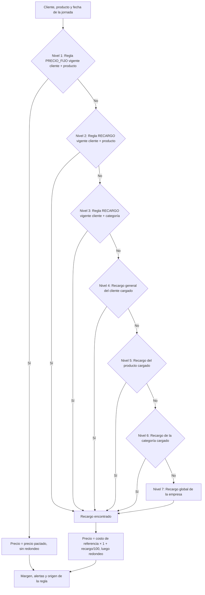
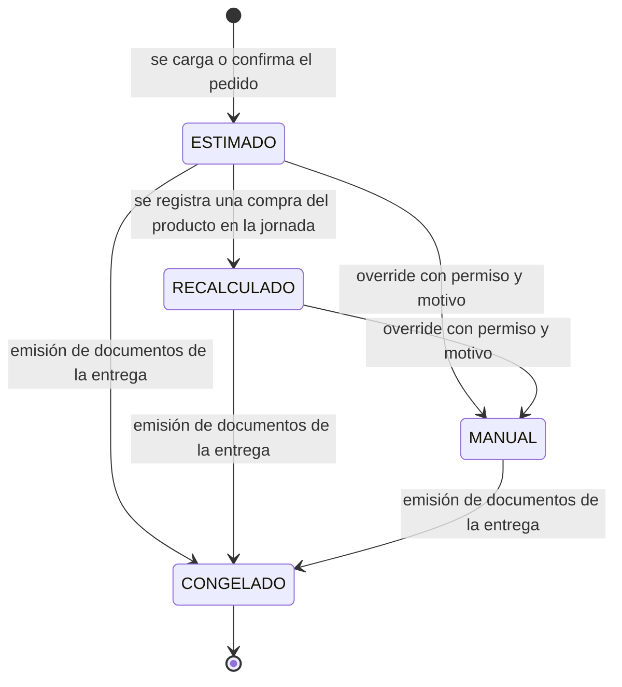

# 05 · Precios y márgenes

> **Propósito:** definir cómo se registran y actualizan los precios de compra de cada proveedor, cómo se compara cuánto cuesta comprar cada producto, y cómo se calcula, se muestra, se congela y se controla el precio de venta a cada cliente (costo + porcentaje de ganancia).

## Contenido

1. [Conceptos y vocabulario](#1-conceptos-y-vocabulario)
2. [Sistema de actualización de precios de compra](#2-sistema-de-actualización-de-precios-de-compra)
3. [Comparación de precios entre proveedores](#3-comparación-de-precios-entre-proveedores)
4. [Costo de referencia](#4-costo-de-referencia)
5. [Cálculo del precio de venta](#5-cálculo-del-precio-de-venta)
6. [Recargo vs. margen](#6-recargo-vs-margen)
7. [Ciclo de vida del precio](#7-ciclo-de-vida-del-precio)
8. [Alertas de margen y de precio](#8-alertas-de-margen-y-de-precio)
9. [Consulta y edición de recargos](#9-consulta-y-edición-de-recargos)
10. [Ejemplo numérico completo: tomate](#10-ejemplo-numérico-completo-tomate)

Datos de ejemplo: los del escenario de `04-procesos-y-flujos.md` §2. Reglas citadas: `07-reglas-de-negocio.md`.

---

## 1. Conceptos y vocabulario

| Término | Definición | Ejemplo |
|---|---|---|
| Unidad base | Unidad en la que se hace todo cálculo interno del producto. | Tomate: kg. Lechuga: unidad. |
| Presentación | Forma de comprar o vender el producto, con su `factor_a_base`. | "Cajón 18 kg" → factor 18. |
| Precio de compra | Lo que cobra el proveedor por una presentación (oferta vigente en `proveedor_producto`). | $16.200 el cajón. |
| Costo por unidad base | Precio de compra ÷ `factor_a_base`. Permite comparar presentaciones distintas. | $16.200 ÷ 18 = $900/kg. |
| Costo de referencia | Costo por unidad base que usa el cálculo del precio de venta (estrategia de la empresa o costo real de la jornada). | $900/kg estimado; $925/kg real. |
| Recargo ("porcentaje de ganancia") | Porcentaje que se suma **sobre el costo**. Es el porcentaje que carga el usuario. | 25 %. |
| Precio de venta | Costo de referencia × (1 + recargo/100), redondeado según la regla de la empresa. | $925 × 1,25 = $1.156,25 → $1.160. |
| Ganancia unitaria | Precio de venta − costo. | $1.160 − $925 = $235/kg. |
| Margen sobre venta | (Precio de venta − costo) ÷ precio de venta. Se muestra en reportes. | $235 ÷ $1.160 = 20,26 %. |
| Origen de la regla | Cuál de los 7 niveles de precedencia definió el precio. Siempre visible. | "Recargo del producto (nivel 5)". |

---

## 2. Sistema de actualización de precios de compra

### 2.1 La lista general de precios de compra

Es la pantalla (y el documento `DOC-06`) donde se ve y se actualiza **qué cuesta cada producto en cada proveedor**. Una fila = una oferta vigente (proveedor + producto + presentación). La disposición visual la define `08-pantallas-y-acciones.md`; aquí se define qué información muestra y por qué.

| Columna | Contenido | Por qué está |
|---|---|---|
| Producto y categoría | Nombre, categoría, unidad base | Buscar y agrupar. |
| Proveedor | Nombre; estrella si es el preferido del producto | El mismo producto aparece una vez por proveedor: la comparación es inmediata. |
| Presentación | Nombre y factor ("Cajón 18 kg") | Los proveedores cotizan por presentación. |
| Precio de compra | Precio por presentación, **editable en la misma celda** | Es el dato que se actualiza todos los días. |
| Costo por unidad base | Precio ÷ factor, con 2 decimales | Única forma de comparar un cajón de 18 kg con una bolsa de 20 kg. |
| Diferencia vs. mejor precio | % sobre el menor costo por unidad base del producto; la mejor oferta resaltada | Ver de un vistazo cuánto más caro es cada proveedor. |
| Precio anterior y variación | Último precio distinto y variación % | Detectar subas y errores de carga. |
| Última actualización | Fecha, "hace N días", usuario y origen del último cambio (manual, compra, importación) | Saber si el precio es confiable; indicador de desactualizado (RN-069). |
| Crédito del proveedor | Semáforo y disponible (ver `06-creditos-y-pagos.md`) | A quién conviene comprar hoy. |
| Disponible hoy | Marca `disponible` de la oferta (el proveedor hoy no lo tiene) | Queda fuera del mínimo y de las sugerencias sin desactivar la oferta. |
| Acciones | Editar · confirmar sin cambios · marcar no disponible · ver historial · marcar preferido · desactivar oferta | Todo sin salir de la lista. |

La lista se alimenta de la vista `v_oferta_vigente` de `03-modelo-de-datos.md` (precio vigente, precio anterior, variación, costo por unidad base, fecha y días desde la actualización, usuario, preferido, más barato, desactualizado).

Filtros y vistas: búsqueda por texto; por categoría; por proveedor; "solo desactualizados"; "solo mejor precio por producto"; agrupar **por producto** (para comparar) o **por proveedor** (para actualizar recorriendo el mercado). Visible solo con `precios.ver_costos` (RN-074); editable con `precios.editar_compra`.

Ejemplo (vista agrupada por producto, 23/09):

| Producto | Proveedor | Presentación | Precio | Costo/unidad base | vs. mejor | Actualizado |
|---|---|---|---|---|---|---|
| Tomate redondo | ★ A · Hnos. García | Cajón 18 kg | $16.200 | $900,00/kg | mejor | 23/09 · hace 0 días · COMPRA |
| | B · La Quinta | Cajón 18 kg | $17.100 | $950,00/kg | +5,56 % | 19/09 · hace 4 días · MANUAL |
| Papa | C · Papas del Sur | Bolsa 25 kg | $12.500 | $500,00/kg | mejor | 22/09 · hace 1 día · MANUAL |
| | A · Hnos. García | Bolsa 25 kg | $13.000 | $520,00/kg | +4,00 % | 12/09 · **hace 11 días ⚠ desactualizado** |
| Cebolla | B · La Quinta | Bolsa 20 kg | $13.600 | $680,00/kg | mejor | 22/09 · MANUAL |
| | A · Hnos. García | Cajón 18 kg | $12.600 | $700,00/kg | +2,94 % | 22/09 · MANUAL |
| | E · Mayorista Norte | Bolsa 10 kg | $7.300 | $730,00/kg | +7,35 % | 20/09 · IMPORTACION |

`DOC-06` (Lista general de precios de compra) imprime esta lista agrupada por proveedor con una columna vacía "precio nuevo" para anotar en el mercado.

### 2.2 Formas de actualizar un precio de compra

| # | Forma | Dónde | Quién | Cómo | `origen` en el historial |
|---|---|---|---|---|---|
| 1 | Edición en línea | Lista general (PC o celular) | COMPRADOR, ADMIN | Tocar la celda de precio, escribir, Enter. Tab/Enter pasa a la fila siguiente. | `MANUAL` |
| 2 | Actualización rápida en el puesto | Celular | COMPRADOR | Elegir proveedor → aparecen solo sus productos con el precio actual en grande → tocar y escribir el nuevo; botón "Sin cambios" confirma todos los que siguen igual. | `MANUAL`. "Sin cambios" solo actualiza `fecha_actualizacion` de la oferta, sin fila de historial. |
| 3 | Automática al registrar una compra | Registro de compra | COMPRADOR | Si el precio pagado difiere del vigente, se actualiza la oferta (RN-059). | `COMPRA` (con referencia al `compra_item`) |

Todas requieren `precios.editar_compra`.

Reglas comunes a todas las formas: una sola oferta vigente por proveedor + producto + presentación (RN-067); todo cambio genera historial (RN-068); una variación mayor al umbral pide confirmación (RN-070); "Confirmar sin cambios" actualiza la fecha sin cambiar el precio (RN-075).

### 2.3 Historial de precios de compra

Cada cambio agrega una fila en `historial_precio_compra` (nunca se edita ni se borra; solo se completa el `vigente_hasta` de la fila anterior):

| Dato | Ejemplo |
|---|---|
| Vigente desde (fecha y hora) | 24/09 05:25 (la fila anterior, $17.100, queda con `vigente_hasta` 24/09 05:25) |
| Proveedor, producto, presentación | B · La Quinta · Tomate redondo · Cajón 18 kg |
| Precio nuevo (de la presentación) | $17.550 |
| Variación respecto del anterior | +2,63 % |
| Costo por unidad base | $975,00/kg |
| Origen | `COMPRA` (otros: `MANUAL`, `IMPORTACION`) |
| Referencia | `compra_item` de COM-000302 (o la observación del lote masivo) |
| Usuario | `creado_por`: el comprador |

Consulta: historial por producto (evolución del precio en cada proveedor, 08 P-29).

La **última actualización** de cada oferta (`fecha_actualizacion`, `actualizado_por`, `precio_anterior`) se guarda en la propia oferta (`proveedor_producto`) para mostrarla en la lista sin consultar el historial.

### 2.4 Alertas de precios de compra

| Alerta | Condición | Parámetro (por empresa) | Dónde se ve | Efecto |
|---|---|---|---|---|
| Precio desactualizado | hoy − `fecha_actualizacion` (última carga o confirmación) > N días | `dias_alerta_precio_desactualizado`, por defecto 7 | Lista general, plan de compra, costo de referencia ("costo basado en precio de hace 11 días") | ADVIERTE (RN-069) |
| Variación brusca | \|nuevo − anterior\| ÷ anterior > X % | `variacion_brusca_pct`, por defecto 30 % | Al guardar: pide confirmación. En la lista: marca "↑ +35 %" durante 7 días | ADVIERTE (RN-058, RN-070) |
| Producto sin precio | Ningún proveedor activo tiene oferta vigente | — | Lista general, pedidos, lista de compra | ADVIERTE (RN-048) |
| Preferido caro | El proveedor preferido está más de Y % por encima del mejor precio | `preferido_caro_pct`, por defecto 10 % | Lista general | Informativa |

---

## 3. Comparación de precios entre proveedores

**Normalización:** `costo_unitario_base = precio_presentacion ÷ factor_a_base`. Siempre se compara el costo por unidad base, nunca el precio de la presentación.

**Ejemplo — cebolla (cajón 18 kg vs. bolsa 20 kg vs. bolsa 10 kg):**

| Proveedor | Presentación | Precio | Costo por kg | Ranking | vs. mejor |
|---|---|---|---|---|---|
| B · La Quinta | Bolsa 20 kg | $13.600 | $13.600 ÷ 20 = **$680,00** | 1 | — |
| A · Hnos. García | Cajón 18 kg | $12.600 | $12.600 ÷ 18 = $700,00 | 2 | +2,94 % |
| E · Mayorista Norte | Bolsa 10 kg | $7.300 | $7.300 ÷ 10 = $730,00 | 3 | +7,35 % |

El cajón de A es más barato por unidad ($12.600 < $13.600) pero más caro por kg: sin normalizar, la comparación engaña.

**"¿Cuánto cuesta comprar?"** Para una cantidad necesaria (por defecto, la necesidad de la jornada), el sistema muestra el costo de cubrirla con cada oferta, incluyendo el efecto del redondeo a bultos enteros. Para 73 kg de cebolla:

| Proveedor | Bultos | Kg comprados | Costo total | Sobrante |
|---|---|---|---|---|
| B · Bolsa 20 kg | 4 | 80 kg | $54.400 | 7 kg |
| E · Bolsa 10 kg | 8 | 80 kg | $58.400 | 7 kg |
| A · Cajón 18 kg | 5 | 90 kg | $63.000 | 17 kg |

La sugerencia de proveedor usa el costo por unidad base (`04-procesos-y-flujos.md` §5.c.2).

Consulta de referencia (en el código la hace `listaGeneralPreciosCompra`; `costo_base` = `precio_vigente / factor_a_base`, ya guardado en la oferta):

```sql
SELECT p.nombre                                   AS producto,
       pr.nombre                                  AS proveedor,
       pre.nombre                                 AS presentacion,
       pp.precio_vigente                          AS precio_presentacion,
       pp.costo_base                              AS costo_unitario_base,
       RANK() OVER (PARTITION BY p.id ORDER BY pp.costo_base)            AS ranking,
       pp.costo_base / MIN(pp.costo_base) OVER (PARTITION BY p.id) - 1   AS sobre_mejor,
       (p.proveedor_preferido_id = pp.proveedor_id)                      AS es_preferido
FROM proveedor_producto pp
JOIN producto     p   ON p.id  = pp.producto_id
JOIN proveedor    pr  ON pr.id = pp.proveedor_id AND pr.activo
JOIN presentacion pre ON pre.id = pp.presentacion_id AND pre.usable_en_compra
WHERE pp.empresa_id = :empresa_id
  AND pp.activo
  AND pp.disponible
  AND pp.precio_vigente > 0
ORDER BY p.nombre, ranking;
```

---

## 4. Costo de referencia

### 4.1 Estrategias (configurables por empresa)

| Estrategia | Cómo se calcula (por unidad base) | Cuándo conviene | Si no hay dato |
|---|---|---|---|
| `PREFERIDO` | Precio vigente del proveedor preferido del producto ÷ factor (si tiene varias presentaciones, la de menor costo por unidad base). | Se compra casi siempre al mismo puesto. | Usa `MINIMO`. |
| `MINIMO` | Menor costo por unidad base entre las ofertas vigentes de proveedores activos. | Se compra donde esté más barato. | Usa el último costo real. |
| `ULTIMO_COSTO_REAL` | Costo real promedio ponderado de la última jornada anterior con compras del producto. | Precios muy volátiles; se confía más en lo pagado que en lo cotizado. | Usa `MINIMO`. |

### 4.2 Costo real de la jornada

Cuando la jornada ya tiene compras registradas del producto, **el costo real reemplaza a la estrategia** (RN-080):

```text
costo_real(producto, jornada) = Σ compra_item.subtotal ÷ Σ compra_item.cantidad_base
    sobre los compra_item del producto en compras REGISTRADA (no anuladas) de la jornada
```

Ejemplo: tomate, 10 cajones a $16.200 + 5 cajones a $17.550 → ($162.000 + $87.750) ÷ 270 kg = $249.750 ÷ 270 = **$925,00/kg**. Una bonificación (ítem a $0) suma kilos y baja el promedio; una compra anulada deja de contar.

### 4.3 Qué pasa si no hay precio

Orden de respaldo: costo real de la jornada → estrategia de la empresa → `MINIMO` → último costo real histórico → **sin costo** (`origen_costo = SIN_DATO`).

Sin costo:
- Si hay regla `PRECIO_FIJO` para el cliente, el precio se conoce pero el margen no: alerta `SIN_COSTO`.
- Si no hay precio fijo, la línea queda **sin precio** (alerta `SIN_PRECIO`): el pedido se puede confirmar, pero no se pueden emitir los documentos de la entrega hasta resolverlo (RN-087) registrando una compra, cargando una oferta o con un override manual con permiso.

```text
función costoReferencia(empresa, producto, jornada):
    // 1. Costo real de la jornada
    si jornada no es null:
        items = compra_item del producto en compras REGISTRADA de la jornada
        si Σ items.cantidad_base > 0:
            devolver { costo: Σ items.subtotal / Σ items.cantidad_base,
                       origen: REAL_JORNADA, estimado: false }
    ofertas = proveedor_producto del producto con activo, disponible, proveedor activo y precio_vigente > 0
    // 2. Estrategia de la empresa
    si empresa.estrategia_costo = PREFERIDO:
        o = oferta de producto.proveedor_preferido con menor costo_base
        si o: devolver { costo: o.costo_base, origen: PREFERIDO,
                         estimado: true, desactualizado: o.desactualizada }
    si empresa.estrategia_costo = ULTIMO_COSTO_REAL:
        c = costo_real(producto, última jornada anterior con compras del producto)
        si c: devolver { costo: c, origen: ULTIMO_COSTO_REAL, estimado: true }
    // 3. Respaldo MINIMO
    si ofertas no vacío:
        o = oferta con menor costo_base
        devolver { costo: o.costo_base, origen: MINIMO,
                   estimado: true, desactualizado: o.desactualizada }
    // 4. Respaldo: último costo real histórico
    c = costo_real(producto, última jornada con compras del producto)
    si c: devolver { costo: c, origen: ULTIMO_COSTO_REAL, estimado: true }
    devolver { costo: null, origen: SIN_DATO }
```

Los valores de `origen` son los del enum `origen_costo` de `03-modelo-de-datos.md` (`PREFERIDO`, `MINIMO`, `ULTIMO_COSTO_REAL`, `REAL_JORNADA`, `SIN_DATO`); la vista `v_costo_referencia_producto` expone los tres costos para que esta función aplique los respaldos.

El costo se guarda y se calcula con 4 decimales (`numeric(14,4)`) y se muestra con 2.

**Alcance del costo:** en el MVP el costo es el precio de la mercadería. Gastos de compra como flete o changarines no se suman al costo; no se prorratean.

---

## 5. Cálculo del precio de venta

### 5.1 Fórmula

```text
precio_sin_redondeo = costo_referencia × (1 + recargo / 100)
precio_venta        = redondear(precio_sin_redondeo, multiplo, modo)      // salvo precio fijo
ganancia_unitaria   = precio_venta − costo_referencia
margen_sobre_venta  = ganancia_unitaria / precio_venta
```

El "porcentaje de ganancia" que carga el usuario es un **recargo sobre el costo** (RN-076). Los reportes muestran además el margen sobre la venta (§6).

### 5.2 Precedencia de reglas (gana la primera vigente que exista)



| Nivel | Fuente | Dato | Uso típico |
|---|---|---|---|
| 1 | `regla_precio` tipo `PRECIO_FIJO`, cliente + producto | Precio por unidad base, con vigencia | Licitación hospitalaria, precio pactado |
| 2 | `regla_precio` tipo `RECARGO`, cliente + producto | % con vigencia | Cliente que exige mejor precio en un producto puntual |
| 3 | `regla_precio` tipo `RECARGO`, cliente + categoría | % con vigencia | "A este restaurante, frutas con 28 %" |
| 4 | `cliente.recargo_default` | % (opcional) | Recargo general del cliente |
| 5 | `producto.recargo_default` | % (opcional) | Productos delicados o con mucha merma llevan más recargo |
| 6 | `categoria.recargo_default` | % (opcional) | Recargo por familia de productos |
| 7 | Recargo global de la empresa | % (obligatorio) | Valor por defecto de todo el sistema |

El sistema **siempre muestra el origen** del precio (RN-077): nivel, descripción y, si es una regla, su vigencia (ej.: "Recargo del cliente (nivel 4): 35 %"). Se guarda con el enum `origen_precio_venta` (`PRECIO_FIJO_CLIENTE_PRODUCTO`, `RECARGO_CLIENTE_PRODUCTO`, `RECARGO_CLIENTE_CATEGORIA`, `RECARGO_CLIENTE`, `RECARGO_PRODUCTO`, `RECARGO_CATEGORIA`, `RECARGO_GLOBAL`, `MANUAL`).

### 5.3 Un ejemplo de cada nivel

Costo de referencia de la banana: $1.200/kg (caja 20 kg de D a $24.000, estrategia `PREFERIDO`, jornada 25/09 todavía sin compras). Redondeo de la empresa: $10 hacia arriba. Recargo global 25 %. Categoría Frutas con recargo 32 %. Banana con recargo del producto 35 %. (Parrilla El Fogón y Hotel Plaza son clientes adicionales para el ejemplo.)

| Nivel | Cliente | Producto | Qué reglas tiene el cliente | Cálculo | Precio | Margen |
|---|---|---|---|---|---|---|
| 1 | Hospital San Martín | Banana | `PRECIO_FIJO` $1.450/kg "Licitación 2026" vigente 01/03/2026–28/02/2027 | Precio pactado, sin redondeo | **$1.450** | (1.450 − 1.200) ÷ 1.450 = 17,24 % |
| 2 | Restaurante La Esquina | Banana | `RECARGO` cliente + banana 30 %; además recargo del cliente 35 % (pierde) | 1.200 × 1,30 = 1.560,00 | **$1.560** | 23,08 % |
| 3 | Parrilla El Fogón | Banana | `RECARGO` cliente + categoría Frutas 28 % | 1.200 × 1,28 = 1.536,00 → | **$1.540** | 22,08 % |
| 4 | Hotel Plaza | Banana | Recargo del cliente 22 % | 1.200 × 1,22 = 1.464,00 → | **$1.470** | 18,37 % |
| 5 | Verdulería Don Pepe | Banana | Ninguna | Recargo de la banana 35 %: 1.200 × 1,35 = 1.620,00 | **$1.620** | 25,93 % |
| 6 | Verdulería Don Pepe | Kiwi (costo $2.500/kg, sin recargo propio) | Ninguna | Recargo de Frutas 32 %: 2.500 × 1,32 = 3.300,00 | **$3.300** | 24,24 % |
| 7 | Verdulería Don Pepe | Huevo blanco, maple 30 u (costo $4.800/maple; categoría Almacén sin recargo) | Ninguna | Recargo global 25 %: 4.800 × 1,25 = 6.000,00 | **$6.000** | 20,00 % |

### 5.4 Vigencias por fecha

- Las reglas `regla_precio` tienen `vigente_desde` y `vigente_hasta` (vacío = sin fin) y una `referencia` ("Licitación 45/2026", "acuerdo por volumen").
- La vigencia se evalúa con la **fecha de la jornada** (fecha de entrega), no con la fecha de carga del pedido (RN-078). Un pedido cargado el 30/09 para el 01/10 usa las reglas vigentes el 01/10.
- No puede haber dos reglas vigentes superpuestas del mismo tipo para el mismo cliente y el mismo producto (o categoría) (RN-079). Para cambiar un precio pactado desde una fecha: se cierra la regla actual el día anterior y se crea la nueva; el sistema ofrece hacerlo en un paso ("Nuevo precio desde…").
- Cambios programados: una regla con `vigente_desde` futuro se aplica sola cuando llega la fecha.
- Los recargos de niveles 4 a 7 no tienen vigencia: rige el valor actual y cada cambio queda en `auditoria` (RN-091).
- Aviso de vencimiento: un precio fijo que vence en 15 días o menos genera la alerta `PRECIO_FIJO_POR_VENCER`.

### 5.5 Precio fijo

- Se carga por unidad base; la pantalla permite ingresarlo por presentación de venta y lo convierte (÷ factor, 4 decimales).
- No se redondea ni depende del costo (RN-081). Si el costo sube, el margen baja: las alertas de §8 avisan.
- Se muestra el **recargo equivalente** = (precio fijo ÷ costo − 1) × 100, informativo (ej.: $1.150 sobre $925 = 24,32 %).

### 5.6 Reglas de redondeo configurables

Configuración por empresa (`03-modelo-de-datos.md`): `empresa.redondeo_multiplo` (valores habituales $0,50, $1, $5, $10) y `empresa.redondeo_modo` ∈ {`NINGUNO`, `ARRIBA`, `CERCANO`, `ABAJO`}. Lo pedido es hacia arriba o al más cercano; `ABAJO` queda disponible en el modelo. En `CERCANO` la mitad va hacia arriba. El valor por defecto del modelo es `CERCANO` a $1; la empresa de los ejemplos usa `ARRIBA` a $10. Se aplica al precio en la unidad en que se vende (RN-081, RN-082).

```text
función redondear(valor, multiplo, modo):
    si modo = NINGUNO: devolver redondear2(valor)               // 2 decimales
    q = valor / multiplo                                         // aritmética decimal exacta
    si modo = ARRIBA:  devolver techo(q) × multiplo
    si modo = CERCANO: devolver piso(q + 0,5) × multiplo
    si modo = ABAJO:   devolver piso(q) × multiplo
```

| Múltiplo | 1.248,75 · ARRIBA | 1.248,75 · CERCANO | 1.156,25 · ARRIBA | 1.156,25 · CERCANO |
|---|---|---|---|---|
| `NINGUNO` | 1.248,75 | 1.248,75 | 1.156,25 | 1.156,25 |
| $0,50 | 1.249,00 | 1.249,00 | 1.156,50 | 1.156,50 |
| $1 | 1.249 | 1.249 | 1.157 | 1.156 |
| $5 | 1.250 | 1.250 | 1.160 | 1.155 |
| $10 | 1.250 | 1.250 | 1.160 | 1.160 |

**Venta por presentación** (RN-082): si la línea del pedido usa una presentación de venta, se redondea el precio de la presentación y el precio por unidad base se guarda con 4 decimales. Ejemplo: tomate a costo $925 con recargo 25 %, vendido por cajón de 18 kg → 925 × 1,25 × 18 = $20.812,50 → $20.820 el cajón → $1.156,6667/kg. Si se vendiera por kg sería $1.160/kg ($20.880 los 18 kg): el redondeo por kg encarece $60 el cajón. Por eso los precios unitarios se guardan con 4 decimales.

### 5.7 IVA

| Parámetro | Dónde | Valores |
|---|---|---|
| Alícuota del producto | `producto.alicuota_iva` (sugerida desde `empresa.alicuota_iva_default`) | Ej.: Argentina 0 %, 10,5 %, 21 %; Uruguay 0 % (exento), 10 %, 22 % |
| Precios de venta con IVA incluido | `empresa.precios_incluyen_iva` | Sí / No |
| Precios de compra con IVA incluido | `empresa.precios_compra_incluyen_iva` | Sí / No (solo si la empresa computa el IVA de compras como crédito fiscal) |

Reglas (RN-083):

1. El recargo se aplica siempre sobre el **costo neto**. Si los precios de compra incluyen IVA: costo neto = precio ÷ (1 + alícuota). Si la empresa no recupera el IVA de compras, se configura "No" y el costo es lo que se paga.
2. Precios de venta **sin** IVA incluido: el precio calculado es neto; los documentos valorizados suman el IVA por línea (`iva = redondear2(total_neto × alícuota)`).
3. Precios de venta **con** IVA incluido: se redondea el precio final y el neto se deriva: `neto = final ÷ (1 + alícuota)` (4 decimales). Ejemplo: costo $925, recargo 35 %, IVA 10,5 % → 925 × 1,35 = 1.248,75 → × 1,105 = 1.379,87 → redondeo $10 arriba = **$1.380** final → neto $1.248,8688.
4. Un precio fijo se carga en la misma convención que la empresa (con o sin IVA).
5. Totales: `total_linea = redondear2(cantidad × precio_unitario)`; el total general es la suma de las líneas. Ejemplo con precios sin IVA incluido: 36 kg × $1.250 = $45.000 neto; IVA 10,5 % = $4.725; total **$49.725**. Con precios con IVA incluido: `neto_linea = redondear2(total_linea ÷ (1 + alícuota))` e `iva_linea = total_linea − neto_linea`.
6. En el MVP el comprobante es interno y no fiscal: el IVA se muestra si la empresa lo configura, y se exporta al contador discriminado por alícuota (`04-procesos-y-flujos.md` §5.g.3).

### 5.8 Pseudocódigo: `calcularPrecioVenta`

```text
función calcularPrecioVenta(empresa, cliente, producto, fecha, jornada, presentacion_venta = null):
    alertas   = []
    fecha_ref = (jornada ≠ null) ? jornada.fecha : fecha                   // RN-078
    c         = costoReferencia(empresa, producto, jornada)                 // §4, neto, por unidad base
    costo     = c.costo
    iva       = producto.alicuota_iva / 100
    factor    = (presentacion_venta ≠ null) ? presentacion_venta.factor_a_base : 1
    multiplo, modo = empresa.redondeo_multiplo, empresa.redondeo_modo
    recargo_equivalente = null

    // Nivel 1: precio fijo
    r = reglaVigente(cliente, PRECIO_FIJO, producto, fecha_ref)
    si r ≠ null:
        precio_base = empresa.precios_incluyen_iva ? r.valor / (1 + iva) : r.valor
        recargo     = null                                                  // no se guarda recargo en precio fijo
        recargo_equivalente = (costo ≠ null) ? (precio_base / costo − 1) × 100 : null   // informativo
        origen      = { codigo: PRECIO_FIJO_CLIENTE_PRODUCTO, nivel: 1, regla_id: r.id,
                        texto: "Precio fijo " + r.referencia + " (" + r.vigente_desde + " – " + r.vigente_hasta + ")" }
        si r.vigente_hasta ≠ null y r.vigente_hasta − fecha_ref ≤ 15 días: alertas += PRECIO_FIJO_POR_VENCER
    sino:
        // Niveles 2 a 7
        (recargo, origen) = primerRecargo(empresa, cliente, producto, fecha_ref)
        si costo = null:
            devolver { precio_unitario: null, costo_unitario: null, origen_costo: SIN_DATO,
                       recargo_aplicado: recargo, origen_regla: origen, alertas: [SIN_PRECIO] }
        valor = costo × (1 + recargo / 100) × factor                        // por presentación si corresponde
        si empresa.precios_incluyen_iva:
            final       = redondear(valor × (1 + iva), multiplo, modo)
            precio_base = final / (1 + iva) / factor
        sino:
            precio_base = redondear(valor, multiplo, modo) / factor

    // Margen y alertas (§8)
    si costo ≠ null:
        margen = (precio_base − costo) / precio_base
        si precio_base < costo:                            alertas += MARGEN_NEGATIVO
        sino si margen < empresa.margen_minimo_pct / 100:  alertas += MARGEN_BAJO
    sino:
        margen = null ; alertas += SIN_COSTO
    si c.estimado y c.desactualizado: alertas += COSTO_DESACTUALIZADO

    devolver {
        precio_unitario:     redondear4(precio_base),          // por unidad base, neto de IVA
        precio_presentacion: redondear2(precio_base × factor), // si hay presentación de venta
        precio_con_iva:      redondear4(precio_base × (1 + iva)),
        costo_unitario:      costo,         origen_costo: c.origen,   costo_estimado: c.estimado,
        recargo_aplicado:    recargo,       recargo_equivalente: recargo_equivalente,
        margen:              margen,        origen_regla: origen,     alertas: alertas
    }

función primerRecargo(empresa, cliente, producto, fecha):
    r = reglaVigente(cliente, RECARGO, producto, fecha)
    si r: devolver (r.valor, { codigo: RECARGO_CLIENTE_PRODUCTO, nivel: 2, regla_id: r.id })
    r = reglaVigente(cliente, RECARGO, producto.categoria, fecha)
    si r: devolver (r.valor, { codigo: RECARGO_CLIENTE_CATEGORIA, nivel: 3, regla_id: r.id })
    si cliente.recargo_default ≠ null:            devolver (cliente.recargo_default,            { codigo: RECARGO_CLIENTE,   nivel: 4 })
    si producto.recargo_default ≠ null:           devolver (producto.recargo_default,           { codigo: RECARGO_PRODUCTO,  nivel: 5 })
    si producto.categoria.recargo_default ≠ null: devolver (producto.categoria.recargo_default, { codigo: RECARGO_CATEGORIA, nivel: 6 })
    devolver (empresa.recargo_global, { codigo: RECARGO_GLOBAL, nivel: 7 })

función reglaVigente(cliente, tipo, producto_o_categoria, fecha):
    devolver la regla_precio activa de la empresa con ese cliente, tipo y producto (o categoría)
             tal que vigente_desde ≤ fecha y (vigente_hasta es null o fecha ≤ vigente_hasta)
    // RN-079 garantiza que hay como máximo una
```

La función es pura (no escribe nada) y se usa en: carga de pedidos, recálculo tras compras, precios de venta, lista de precios del cliente y emisión de documentos (donde el resultado se congela en `entrega_item`). Los códigos de `origen_regla` son los del enum `origen_precio_venta` de `03-modelo-de-datos.md` (más `MANUAL` para el override). En `03-modelo-de-datos.md` esta misma función se menciona como `resolverPrecioVenta`: es una sola implementación.

---

## 6. Recargo vs. margen

El usuario piensa en "le gano un 20 %": el sistema lo toma como **recargo sobre el costo**. El margen sobre la venta siempre es menor:

```text
margen  = recargo / (100 + recargo) × 100
recargo = margen  / (100 − margen)  × 100
```

| Recargo sobre costo | Margen sobre venta | Ejemplo con costo $1.000 |
|---|---|---|
| 10 % | 9,09 % | vende $1.100, gana $100 |
| 15 % | 13,04 % | vende $1.150, gana $150 |
| 20 % | 16,67 % | vende $1.200, gana $200 |
| 25 % | 20,00 % | vende $1.250, gana $250 |
| 30 % | 23,08 % | vende $1.300, gana $300 |
| 35 % | 25,93 % | vende $1.350, gana $350 |
| 40 % | 28,57 % | vende $1.400, gana $400 |
| 50 % | 33,33 % | vende $1.500, gana $500 |
| 60 % | 37,50 % | vende $1.600, gana $600 |
| 75 % | 42,86 % | vende $1.750, gana $750 |
| 100 % | 50,00 % | vende $2.000, gana $1.000 |

Reglas prácticas: para ganar 20 % sobre lo que se vende hay que cargar 25 % de recargo. El margen real después del redondeo puede diferir un poco del teórico (tomate: recargo 25 % → margen teórico 20,00 %, real 20,26 % por redondear $1.156,25 a $1.160); los reportes muestran el real.

---

## 7. Ciclo de vida del precio



(Son etapas del precio de una línea, no estados de una entidad.)

| Etapa | Cuándo | Costo que usa | Dónde se guarda | ¿Puede cambiar? |
|---|---|---|---|---|
| `ESTIMADO` | Al cargar o confirmar el pedido | Estrategia de la empresa (§4.1) | `pedido_item`: `precio_estimado`, `costo_estimado`, `origen_costo_estimado`, `recargo_estimado`, `origen_regla_estimada`, `precio_calculado_en` | Sí: si cambian reglas, recargos u ofertas vigentes |
| `RECALCULADO` | Al registrar o anular compras del producto en la jornada (RN-088) | Costo real de la jornada (§4.2) | `pedido_item`, con marca "con costo real" | Sí: con nuevas compras o anulaciones |
| `MANUAL` | Override de un usuario con `precios.override_linea` (RN-090) | — | `pedido_item.precio_manual` + `motivo_precio_manual`, o `entrega_item.es_override` + `motivo_override`; más `auditoria` (`OVERRIDE_PRECIO`: precio anterior, nuevo, motivo, usuario, fecha) | Solo con otro override; los recálculos no lo pisan |
| `CONGELADO` | Primera emisión de documentos de la entrega (RN-089); queda la fecha en `entrega.precios_congelados_en` | El vigente en ese momento | `entrega_item`: `costo_unitario`, `origen_costo`, `recargo_aplicado`, `origen_regla`, `regla_precio_id`, `precio_unitario`, `alicuota_iva` | No. Las reemisiones por diferencias mantienen el precio. Cambios de reglas posteriores no afectan documentos emitidos. |

**Recálculo:** se hace en la misma transacción del evento que lo dispara (compra registrada o anulada, cambio de regla o de recargo, cambio de oferta) para las líneas **no congeladas** de las jornadas afectadas. El volumen es chico (decenas a cientos de líneas por jornada), por lo que no requiere procesos en segundo plano.

**Override manual:**
- Permiso `precios.override_linea`; motivo obligatorio (ej.: "acuerdo telefónico con el jefe de compras del hospital").
- Antes de la emisión se hace sobre la línea del pedido o de la entrega. Después de emitidos los documentos y mientras la entrega esté `SIN_FACTURAR`, un override es una corrección: genera nueva versión y reemisión de `DOC-02` y `DOC-03`.
- El origen de la línea pasa a "Manual — usuario, fecha, motivo" y las alertas de margen se siguen calculando.

---

## 8. Alertas de margen y de precio

| Alerta | Condición | Dónde se muestra | Efecto |
|---|---|---|---|
| `MARGEN_BAJO` | margen < margen mínimo de la empresa (por defecto 15 %) | Pedido (a quien ve costos), precios de venta, emisión, resumen de jornada | ADVIERTE (RN-085) |
| `MARGEN_NEGATIVO` | precio < costo (ej.: precio fijo menor que el costo real) | Mismos lugares, en rojo | ADVIERTE; al emitir documentos pide confirmación explícita (RN-086) |
| `SIN_COSTO` | Hay precio fijo pero ningún costo | Pedido, emisión | ADVIERTE: margen desconocido |
| `SIN_PRECIO` | Ni costo ni precio fijo | Pedido, lista de compra, emisión | BLOQUEA la emisión de documentos (RN-087) |
| `COSTO_DESACTUALIZADO` | El costo estimado sale de una oferta con más de N días | Pedido | ADVIERTE |
| `PRECIO_FIJO_POR_VENCER` | Un precio fijo vence en 15 días o menos | Ficha del cliente, tablero del ADMIN | ADVIERTE |
| `RECARGO_ATIPICO` | Al editar: recargo < 0 % o > 300 % | Edición de recargos y reglas | Pide confirmación y AUDITA (RN-084) |

Reporte "Líneas con alerta de margen" por jornada y por período: cliente, producto, costo, precio, margen, origen de la regla, para decidir renegociar precios fijos o cambiar recargos.

---

## 9. Consulta y edición de recargos

La pantalla **Precios de venta** (08, P-32) muestra la ganancia general, la de cada categoría, producto y cliente, y los **especiales** (precio fijo o ganancia de un cliente en un producto o una categoría, con vigencia). Cada precio dice de qué nivel sale. En la ficha de cada cliente está su lista de precios del día. Editar requiere `precios.editar_reglas` y todo cambio queda en `auditoria` (`CAMBIO_RECARGO` o `CAMBIO_REGLA_PRECIO`).

Ejemplo de cómo se resuelve un precio: Restaurante La Esquina × Banana, jornada 25/09, 10 kg.

| Nivel | ¿Existe? | Valor |
|---|---|---|
| 1 · Precio fijo cliente + producto | No | — |
| 2 · Recargo cliente + producto | **Sí — gana** | **30 %** |
| 3 · Recargo cliente + categoría Frutas | No | — |
| 4 · Recargo del cliente | Sí | 35 % |
| 5 · Recargo del producto | Sí | 35 % |
| 6 · Recargo de la categoría Frutas | Sí | 32 % |
| 7 · Recargo global | Sí | 25 % |

Costo de referencia $1.200/kg (`PREFERIDO`: D · Frutas Tropicales) → 1.200 × 1,30 = $1.560,00 → redondeo $10 arriba = **$1.560/kg**. Margen 23,08 %. 10 kg: venta $15.600, costo $12.000, ganancia $3.600.


---

## 10. Ejemplo numérico completo: tomate

Jornada 24/09. Necesidad: Hospital 180 kg, Restaurante 36 kg, Verdulería 54 kg = 270 kg = 15 cajones de 18 kg. Empresa: estrategia `PREFERIDO`, redondeo $10 hacia arriba, margen mínimo 15 %, precios sin IVA incluido.

Reglas que aplican al tomate:

| Cliente | Regla que gana | Nivel |
|---|---|---|
| Hospital San Martín | `PRECIO_FIJO` $1.150/kg "Licitación 2026" | 1 |
| Restaurante La Esquina | Recargo del cliente 35 % | 4 |
| Verdulería Don Pepe | Recargo del producto tomate 25 % | 5 |

**Paso 1 — Precio estimado al confirmar los pedidos (23/09).** Costo de referencia = proveedor preferido A: $16.200 ÷ 18 = $900,00/kg.

| Cliente | Cálculo | Precio estimado | Margen estimado |
|---|---|---|---|
| Hospital | Precio fijo | $1.150 | (1.150 − 900) ÷ 1.150 = 21,74 % |
| Restaurante | 900 × 1,35 = 1.215,00 → | $1.220 | (1.220 − 900) ÷ 1.220 = 26,23 % |
| Verdulería | 900 × 1,25 = 1.125,00 → | $1.130 | (1.130 − 900) ÷ 1.130 = 20,35 % |

**Paso 2 — Compras en el mercado (24/09).**

| Hora | Compra | Proveedor | Cantidad | Precio | Subtotal | Costo real acumulado |
|---|---|---|---|---|---|---|
| 05:10 | COM-000301 | A · Hnos. García | 10 cajones (180 kg) | $16.200 | $162.000 | 162.000 ÷ 180 = $900,00/kg |
| 05:25 | COM-000302 | B · La Quinta | 5 cajones (90 kg) | $17.550 (antes $17.100: +2,63 %, se actualiza la oferta de B) | $87.750 | 249.750 ÷ 270 = **$925,00/kg** |

Después de COM-000301 los precios quedan `RECALCULADO` con costo real $900 (sin cambios). Después de COM-000302 se recalculan con $925.

**Paso 3 — Precio recalculado con el costo real ($925/kg).**

| Cliente | Cálculo | Precio | Ganancia/kg | Margen | Alertas |
|---|---|---|---|---|---|
| Hospital | Precio fijo (recargo equivalente 1.150 ÷ 925 − 1 = 24,32 %) | $1.150 | $225 | 225 ÷ 1.150 = 19,57 % | — |
| Restaurante | 925 × 1,35 = 1.248,75 → | $1.250 | $325 | 325 ÷ 1.250 = 26,00 % | — |
| Verdulería | 925 × 1,25 = 1.156,25 → | $1.160 | $235 | 235 ÷ 1.160 = 20,26 % | — |

**Paso 4 — Emisión de documentos: precios congelados en `entrega_item`** (suponiendo entrega completa; en `04-procesos-y-flujos.md` §5.f.4 el ejemplo sigue con un rechazo parcial de la verdulería).

| Cliente | kg | Precio congelado | Origen | Total venta | Costo (kg × 925) | Ganancia |
|---|---|---|---|---|---|---|
| Hospital | 180 | $1.150 | Nivel 1 · precio fijo | $207.000 | $166.500 | $40.500 |
| Restaurante | 36 | $1.250 | Nivel 4 · recargo del cliente 35 % | $45.000 | $33.300 | $11.700 |
| Verdulería | 54 | $1.160 | Nivel 5 · recargo del producto 25 % | $62.640 | $49.950 | $12.690 |
| **Total** | **270** | | | **$314.640** | **$249.750** | **$64.890** |

Margen del tomate en la jornada: 64.890 ÷ 314.640 = **20,62 %** sobre la venta (recargo efectivo 64.890 ÷ 249.750 = 25,98 %).

**Paso 5 — ¿Qué pasaría si…?**

| Situación | Efecto |
|---|---|
| El costo real hubiera sido $1.100/kg (semana cara) | Hospital: (1.150 − 1.100) ÷ 1.150 = 4,35 % → alerta `MARGEN_BAJO`. Restaurante: 1.100 × 1,35 = 1.485 → $1.490. Verdulería: 1.100 × 1,25 = 1.375 → $1.380. |
| El costo real hubiera sido $1.200/kg | Hospital: (1.150 − 1.200) ÷ 1.150 = −4,35 % → alerta `MARGEN_NEGATIVO`; al emitir se pide confirmación explícita. Es la señal para renegociar la licitación. |
| El 25/09 se sube el recargo del tomate de 25 % a 30 % | Los documentos del 24/09 no cambian (precio congelado $1.160). Los pedidos del 25/09 en adelante no congelados se recalculan. |
| El ADMIN hace un override a $1.200 para la verdulería antes de emitir | Origen "Manual", motivo obligatorio, registro en `auditoria`; los recálculos no lo modifican. |

**Paso 6 — Verificación aritmética**

- 10 × 16.200 = 162.000; 5 × 17.550 = 87.750; 162.000 + 87.750 = 249.750; 249.750 ÷ 270 = 925. ✔
- 180 × 1.150 = 207.000; 36 × 1.250 = 45.000; 54 × 1.160 = 62.640; suma = 314.640. ✔
- 180 × 925 = 166.500; 36 × 925 = 33.300; 54 × 925 = 49.950; suma = 249.750 (= total comprado: no hay sobrante de tomate). ✔
- 40.500 + 11.700 + 12.690 = 64.890 = 314.640 − 249.750. ✔

