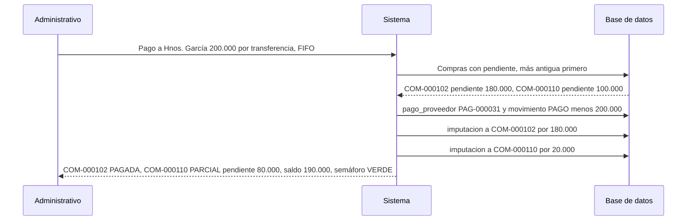
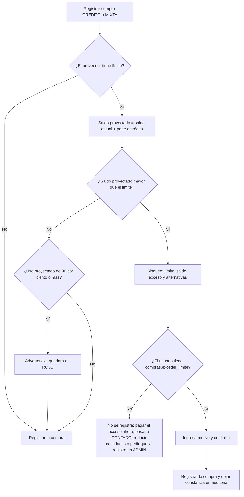

# 06 · Créditos y pagos

> **Propósito:** especificar cómo el sistema administra las compras a crédito, lo adeudado a cada proveedor, los pagos, el límite de crédito y su semáforo, de modo que siempre se sepa con claridad qué está pagado, qué está pendiente, qué está vencido y cuánto crédito queda.

## Contenido

1. [Conceptos y vocabulario](#1-conceptos-y-vocabulario)
2. [Cuenta corriente como libro de movimientos](#2-cuenta-corriente-como-libro-de-movimientos)
3. [Compras y condición de pago](#3-compras-y-condición-de-pago)
4. [Pagos e imputación](#4-pagos-e-imputación)
5. [Ajustes y saldo inicial](#5-ajustes-y-saldo-inicial)
6. [Anulaciones](#6-anulaciones)
7. [Vencimientos y deuda vencida](#7-vencimientos-y-deuda-vencida)
8. [Cálculos exactos](#8-cálculos-exactos)
9. [Control del límite de crédito](#9-control-del-límite-de-crédito)
10. [Pagado vs. pendiente en cada vista](#10-pagado-vs-pendiente-en-cada-vista)
11. [Historial y estado de cuenta (DOC-05)](#11-historial-y-estado-de-cuenta-doc-05)
12. [Ejemplo numérico completo](#12-ejemplo-numérico-completo)

Reglas citadas: `07-reglas-de-negocio.md` (RN-092 a RN-110 y relacionadas). Proceso de compra: `04-procesos-y-flujos.md` §5.d.

---

## 1. Conceptos y vocabulario

| Término | Significado |
|---|---|
| Cuenta corriente del proveedor | Libro de todos los movimientos de dinero con un proveedor (`movimiento_cuenta_proveedor`). El saldo sale de sumarlos. |
| Cargo | Movimiento que **aumenta** la deuda (una compra). |
| Pago | Movimiento que **disminuye** la deuda (dinero entregado al proveedor). |
| Saldo neto | Suma de cargos − suma de pagos y créditos. Positivo = le debemos; negativo = saldo a favor nuestro. |
| Saldo pendiente (= crédito utilizado) | Saldo neto cuando es positivo. |
| Saldo a favor | Lo pagado de más (saldo neto negativo); se aplica a compras futuras. |
| Límite de crédito | Máximo que se le puede deber al proveedor. Vacío (`null`) = sin límite; 0 = solo contado. |
| Crédito disponible | Límite − saldo neto. |
| Imputación | Asignación de un pago (o parte) a una compra concreta. Define qué compras están pagadas. |
| Estado de pago de la compra | `PAGADA`, `PARCIAL` o `PENDIENTE`, calculado con las imputaciones. |
| Vencimiento | Fecha de la compra + `plazo_pago_dias` del proveedor. |

---

## 2. Cuenta corriente como libro de movimientos

### 2.1 Tipos de movimiento

Cada movimiento guarda un **importe con signo**: positivo aumenta la deuda, negativo la disminuye (RN-094). Nunca se edita ni se borra un movimiento: los errores se corrigen con un movimiento compensatorio (RN-092).

| Tipo | Signo | Se genera cuando | Referencia |
|---|---|---|---|
| `CARGO_COMPRA` | + total de la compra | Se registra una compra (cualquier condición de pago) | `compra` |
| `PAGO` | − monto | Se registra un pago (incluido el pago automático de una compra `CONTADO` y la parte pagada de una `MIXTA`) | `pago_proveedor` |
| `ANULACION_COMPRA` | − total de la compra | Se anula una compra | `compra` |
| `ANULACION_PAGO` | + monto | Se anula un pago (error, cheque rechazado) | `pago_proveedor` |
| `AJUSTE_DEBITO` | + monto | Ajuste manual a favor del proveedor (diferencia de precio reclamada, recargo por mora) | motivo; compra relacionada opcional |
| `AJUSTE_CREDITO` | − monto | Ajuste manual a nuestro favor (bonificación, devolución de mercadería, nota de crédito del proveedor, saldo a favor previo al sistema) | motivo; compra relacionada opcional |
| `SALDO_INICIAL` | + monto | Al empezar a usar el sistema con deudas previas; va acompañado de una `compra` de tipo `SALDO_INICIAL` (sin líneas ni jornada) | `compra` de saldo inicial |

Todo movimiento guarda además: proveedor, fecha, descripción legible ("Compra COM-000302"), motivo (obligatorio en ajustes y anulaciones), el movimiento que compensa (en anulaciones), la fecha de vencimiento (en cargos), usuario y fecha de creación. Los campos exactos están en `03-modelo-de-datos.md` §10.5.

### 2.2 Partidas e imputaciones

Para saber **qué compra está pagada** no alcanza con el saldo: hace falta imputar.

- **Partidas deudoras** (lo que se debe, imputables): compras `REGISTRADA` (incluidas las compras de tipo `SALDO_INICIAL`) y ajustes de débito (`AJUSTE_DEBITO`).
- **Partidas acreedoras** (lo que cancela deuda): pagos `REGISTRADO` y ajustes de crédito (`AJUSTE_CREDITO`).
- Una **imputación** (`imputacion_pago_proveedor`) asigna un importe de una partida acreedora a una partida deudora. Invariantes: Σ imputaciones activas de una partida acreedora ≤ su importe; Σ imputaciones activas de una partida deudora ≤ su importe.
- Las imputaciones no se borran: se desactivan (`activa = false`, con fecha y motivo) y se crean nuevas.
- **Ajustes:** un ajuste de crédito con compra relacionada se imputa a esa compra y baja su pendiente (cambia su estado de pago); sin compra relacionada se imputa FIFO como un pago. Un ajuste de débito es una partida pendiente más, que los pagos cancelan por FIFO (campos en `03-modelo-de-datos.md` §10.4).

**Invariante** (se verifica con un control nocturno y en las pruebas automáticas):

```text
saldo_neto(proveedor) = Σ pendiente(partidas deudoras)
                      − Σ no_imputado(partidas acreedoras)
```

### 2.3 Consulta del saldo

```sql
-- Saldo neto, crédito disponible y uso por proveedor
SELECT pr.id,
       pr.nombre,
       pr.limite_credito,
       COALESCE(SUM(m.importe), 0)                               AS saldo_neto,
       GREATEST(COALESCE(SUM(m.importe), 0), 0)                  AS saldo_pendiente,
       GREATEST(-COALESCE(SUM(m.importe), 0), 0)                 AS saldo_a_favor,
       pr.limite_credito - COALESCE(SUM(m.importe), 0)           AS credito_disponible,
       CASE WHEN pr.limite_credito > 0
            THEN GREATEST(COALESCE(SUM(m.importe), 0), 0) * 100 / pr.limite_credito
       END                                                       AS porcentaje_uso
FROM proveedor pr
LEFT JOIN movimiento_cuenta_proveedor m
       ON m.proveedor_id = pr.id AND m.empresa_id = pr.empresa_id
WHERE pr.empresa_id = :empresa_id
GROUP BY pr.id, pr.nombre, pr.limite_credito;
```

En el modelo esta consulta es la vista `v_saldo_proveedor` (`03-modelo-de-datos.md` §17.7), que agrega el semáforo y la deuda vencida. Si con el volumen hiciera falta, se puede cachear el saldo en una columna del proveedor actualizada en la misma transacción que cada movimiento y conciliada por el control nocturno; la fuente de verdad es siempre el libro.

---

## 3. Compras y condición de pago

| Condición | Qué se registra (en una sola transacción) | Efecto en el saldo | Estado de pago inicial |
|---|---|---|---|
| `CONTADO` | `compra` + `CARGO_COMPRA` (+total) + `pago_proveedor` automático por el total (medio por defecto: efectivo) + `PAGO` (−total) + imputación del pago a la compra | Ninguno | `PAGADA` |
| `CREDITO` | `compra` + `CARGO_COMPRA` (+total) | Aumenta en el total | `PENDIENTE` (o `PARCIAL`/`PAGADA` si se aplicó saldo a favor) |
| `MIXTA` | `compra` + `CARGO_COMPRA` (+total) + `pago_proveedor` por lo pagado en el momento + `PAGO` + imputación | Aumenta en total − pagado | `PARCIAL` |

- La condición propuesta al registrar es `proveedor.condicion_pago_habitual`; lo pagado en el momento y su medio quedan en `compra.monto_pagado_en_el_acto` y `compra.medio_pago_en_el_acto`, y el pago automático se crea con `origen = EN_COMPRA`.
- `MIXTA` exige 0 < pagado en el momento < total (RN-062).
- **Saldo a favor:** si el proveedor tiene saldo a favor, al registrar una compra `CREDITO` o `MIXTA` el sistema imputa automáticamente lo no imputado de pagos anteriores (el más antiguo primero), si la empresa tiene activado "aplicar saldo a favor automáticamente" (por defecto sí, RN-098). En una compra `CONTADO` el sistema avisa: *"Tenés $30.000 a favor con este proveedor. ¿Pagar solo $15.000 y usar el saldo a favor?"* (si acepta, la compra pasa a `MIXTA`).
- El control de límite (§9) se aplica a `CREDITO` y `MIXTA`; una compra `CONTADO` no cambia el saldo y no se controla.
- La fecha de vencimiento de la compra se calcula al registrarla (§7).

---

## 4. Pagos e imputación

### 4.1 Registro de un pago

Quién: ADMINISTRATIVO o ADMIN (`pagos.registrar`); el COMPRADOR registra solo los pagos en el momento de la compra.

| Dato | Obligatorio | Detalle |
|---|---|---|
| Proveedor | Sí | Activo o desactivado (a un proveedor desactivado con deuda se le puede pagar, RN-108). |
| Fecha | Sí | No futura (RN-095). |
| Monto | Sí | > 0. |
| Medio | Sí | `EFECTIVO`, `TRANSFERENCIA`, `CHEQUE`, `TARJETA`, `OTRO` (con descripción: billetera virtual, compensación, etc.). |
| Referencia | No (uso interno, 2026-09-27) | `TRANSFERENCIA`: número de operación o comprobante. `CHEQUE`: número, banco y fecha de cobro. `OTRO`: descripción. Se recomienda cargarla, pero no se exige. (En el modelo: `referencia`, más `cheque_banco` y `cheque_fecha_cobro` para cheques.) |
| Imputación | Sí | Automática FIFO (por defecto) o manual. |
| Observaciones | No | Texto libre. |

Número `PAG-xxxxxx` desde `secuencia`. El pago genera un movimiento `PAGO` por el monto total, sin importar cómo se impute.

**Cheque diferido:** el pago se registra en la fecha en que se entrega el cheque (desde ese día el proveedor considera cancelada la deuda). La fecha de cobro queda como dato informativo. Si el cheque es rechazado se anula el pago con motivo "cheque rechazado" (§6.2).

### 4.2 Imputación automática FIFO (por defecto)

```text
función imputarFIFO(partida_acreedora, proveedor):
    restante = no_imputado(partida_acreedora)
    pendientes = partidas deudoras del proveedor con pendiente > 0,
                 ordenadas por fecha, luego por número (la más antigua primero)       // RN-096
    para cada d en pendientes mientras restante > 0:
        importe = min(pendiente(d), restante)
        crear imputacion_pago_proveedor(pago = partida_acreedora, compra = d, monto = importe, activa = true)
        restante −= importe
    // si restante > 0 queda como saldo a favor (no imputado)                           // RN-098
    devolver restante
```

### 4.3 Imputación manual

El usuario marca las compras a cancelar y el importe de cada una. Validaciones (RN-097): cada importe ≤ pendiente de esa compra; la suma ≤ monto del pago. Lo no asignado queda como saldo a favor. Uso típico: el proveedor pide cancelar una compra puntual ("pagame la del martes").

### 4.4 Saldo a favor

Un pago mayor a la deuda deja la diferencia sin imputar. Se muestra en la ficha del proveedor como "Saldo a favor: $30.000" (en verde), aumenta el crédito disponible y se aplica a la próxima compra `CREDITO` o `MIXTA` (§3). También puede imputarse manualmente desde el pago.

### 4.5 Reimputación

Si una imputación fue mal hecha: "Reimputar pago" desactiva las imputaciones activas de ese pago (`activa = false`, con motivo) y permite imputar de nuevo. El saldo del proveedor no cambia (solo cambia qué compras figuran pagadas). Queda en `auditoria`.



---

## 5. Ajustes y saldo inicial

**Ajustes** (`pagos.ajustar`, ADMIN o ADMINISTRATIVO; motivo obligatorio; `auditoria`, RN-102):

| Caso | Tipo | Ejemplo |
|---|---|---|
| El proveedor descuenta mercadería en mal estado | `AJUSTE_CREDITO` | "2 cajones de tomate podridos de COM-000125: −$32.400". Baja el saldo de la cuenta. Si se indica la compra relacionada, se imputa a ella y baja su pendiente; si no, se imputa FIFO (§2.2). |
| Nota de crédito del proveedor por devolución | `AJUSTE_CREDITO` | Igual que el anterior. |
| Saldo a favor nuestro anterior al sistema | `AJUSTE_CREDITO` | "Saldo a favor al 31/08: −$20.000". |
| El proveedor reclama una diferencia de precio | `AJUSTE_DEBITO` | "+$5.000 diferencia en COM-000118". Sube el saldo de la cuenta y queda como partida pendiente (con vencimiento opcional) que el próximo pago cancela por FIFO. |
| Recargo por pago fuera de término | `AJUSTE_DEBITO` | "+$3.000 interés". |

**Saldo inicial** (RN-110): al empezar a usar el sistema, por cada proveedor con deuda previa se registra una `compra` de tipo `SALDO_INICIAL` (sin líneas ni jornada, con su fecha y vencimiento) y su movimiento `SALDO_INICIAL` (+). Si se quiere controlar el vencimiento de cada deuda anterior, se carga una compra de saldo inicial por cada boleta pendiente. Como son compras, participan de la imputación FIFO y de los vencimientos igual que las demás. Se pueden cargar varias (una por boleta) con `pagos.ajustar`; cada una queda auditada (decisión de uso interno, 2026-09-27: no se exige ADMIN para la segunda).

---

## 6. Anulaciones

### 6.1 Anulación de una compra

Permiso `compras.anular`, motivo obligatorio (RN-065). Siempre se crea `ANULACION_COMPRA` (−total) y la compra queda `ANULADA`. Luego, según el caso (RN-101):

| Caso | Qué hace el sistema | Resultado en el saldo |
|---|---|---|
| Compra `CREDITO` sin pagos imputados | Solo el movimiento compensatorio | Baja en el total |
| Compra con pagos imputados (parciales o totales) | Desactiva las imputaciones a esa compra; ese dinero queda como saldo a favor y se reimputa FIFO a otras compras pendientes (si la empresa lo tiene activado) | Baja en el total; si no hay otras deudas queda saldo a favor |
| Compra `CONTADO` | Pregunta: **"¿El proveedor devolvió el dinero?"** · Sí → también anula el pago automático (`ANULACION_PAGO` +total): efecto neto 0. · No → el pago queda como saldo a favor | Sí: 0 · No: saldo a favor por el total |

Ejemplo (`CONTADO` de $120.000): `CARGO_COMPRA` +120.000, `PAGO` −120.000 → saldo 0. Se anula la compra: `ANULACION_COMPRA` −120.000 → saldo −120.000 (a favor). Si el proveedor devolvió el dinero: `ANULACION_PAGO` +120.000 → saldo 0.

Además, la anulación recalcula la lista de compra y el costo real de la jornada (`04-procesos-y-flujos.md` §5.d.6).

### 6.2 Anulación de un pago

Permiso `pagos.anular`, motivo obligatorio (RN-100). Se crea `ANULACION_PAGO` (+monto), se desactivan todas sus imputaciones y las compras afectadas vuelven a `PARCIAL` o `PENDIENTE`. Si el pago era el automático de una compra `CONTADO`, el sistema avisa: *"La compra COM-000101 quedará como deuda pendiente de $120.000"*. Si la anulación hace superar el límite de crédito, se advierte (no se bloquea: la deuda existe igual) y queda en `auditoria`.

---

## 7. Vencimientos y deuda vencida

```text
fecha_vencimiento(compra) = compra.fecha_compra + proveedor.plazo_pago_dias   // se fija al registrar (RN-106)
                            (sin plazo cargado → sin vencimiento)
vencida(compra)           = pendiente(compra) > 0 y hoy > fecha_vencimiento
dias_atraso(compra)       = hoy − fecha_vencimiento   (si vencida)
deuda_vencida(proveedor)  = Σ pendiente(compra) de sus compras vencidas
por_vencer(proveedor, N)  = Σ pendiente(compra) con hoy ≤ fecha_vencimiento ≤ hoy + N días
```

- El vencimiento se congela en la compra: si después cambia el plazo del proveedor, afecta solo a compras nuevas.
- Alertas (RN-107): aviso en el tablero con "Deuda vencida" (rojo, días de atraso) y "Vence en los próximos N días" (ámbar; `empresa.dias_aviso_vencimiento`, por defecto 3). El semáforo de límite y la deuda vencida son indicadores distintos: un proveedor puede estar en `VERDE` y tener una compra vencida.

---

## 8. Cálculos exactos

Todos los montos en `numeric(14,2)`, aritmética decimal exacta (nunca flotantes).

### 8.1 Fórmulas por proveedor

| Indicador | Fórmula |
|---|---|
| Total comprado (período) | Σ `compra.total` de compras `REGISTRADA` con fecha en el período (las anuladas no cuentan) |
| Total pagado (período) | Σ `pago_proveedor.monto` de pagos no anulados con fecha en el período (los ajustes se informan aparte) |
| Saldo neto | Σ `movimiento_cuenta_proveedor.importe` (histórico completo) |
| Saldo pendiente (= crédito utilizado) | max(saldo neto, 0) |
| Saldo a favor | max(−saldo neto, 0) |
| Crédito disponible | límite − saldo neto (si hay saldo a favor, supera al límite; si hay exceso, es negativo). Sin límite: no aplica. |
| Porcentaje de uso | saldo pendiente ÷ límite × 100 |
| Deuda vencida | Ver §7 |

### 8.2 Estado de pago de una compra

```text
función estadoPago(compra):                                   // RN-099
    si compra.estado = ANULADA: devolver null                  // no aplica
    pagado    = Σ monto de imputaciones activas a la compra (vista v_compra_estado_pago)
    pendiente = compra.total − pagado
    si pendiente = 0:  devolver PAGADA
    si pagado = 0:     devolver PENDIENTE
    devolver PARCIAL
```

### 8.3 Indicadores y semáforo del proveedor

```text
función indicadoresProveedor(proveedor, hoy):
    saldo_neto      = Σ importe de movimiento_cuenta_proveedor del proveedor
    saldo_pendiente = max(saldo_neto, 0)
    saldo_a_favor   = max(−saldo_neto, 0)
    si proveedor.limite_credito es null:
        disponible = null ; uso = null ; semaforo = SIN_LIMITE          // RN-103
    sino si proveedor.limite_credito = 0:                                // solo contado
        disponible = −saldo_neto
        uso        = (saldo_pendiente > 0) ? infinito : 0
        semaforo   = (saldo_pendiente > 0) ? EXCEDIDO : VERDE
    sino:
        disponible = proveedor.limite_credito − saldo_neto
        uso        = saldo_pendiente / proveedor.limite_credito × 100
        semaforo   = semaforoPorUso(uso)
    vencida = Σ pendiente(c) para compras c con pendiente > 0 y hoy > c.fecha_vencimiento
    devolver { saldo_neto, saldo_pendiente, saldo_a_favor, disponible, uso, semaforo, vencida }

función semaforoPorUso(uso):                                            // RN-104
    // umbrales por empresa: semaforo_amarillo_pct = 70, semaforo_rojo_pct = 90
    si uso > 100:                            devolver EXCEDIDO
    si uso ≥ empresa.semaforo_rojo_pct:      devolver ROJO          // 90 % a 100 % inclusive
    si uso ≥ empresa.semaforo_amarillo_pct:  devolver AMARILLO      // 70 % a < 90 %
    devolver VERDE                                    // < 70 %
```

| Semáforo | Rango de uso | Color e ícono | Significado para el usuario |
|---|---|---|---|
| `VERDE` | < 70 % | Verde, círculo lleno | Crédito holgado |
| `AMARILLO` | 70 % a < 90 % | Ámbar, triángulo | Se acerca al límite: planificar un pago |
| `ROJO` | 90 % a 100 % | Rojo, triángulo con signo de exclamación | Casi sin crédito: nuevas compras a crédito probablemente bloqueadas |
| `EXCEDIDO` | > 100 % | Rojo sólido, octógono con texto "EXCEDIDO" | Se debe más que el límite |
| `SIN_LIMITE` | — | Gris | Proveedor sin límite cargado: se muestra solo el saldo |

El semáforo siempre se muestra con **color + ícono + texto + porcentaje** (no solo color), para que se entienda en cualquier pantalla y para personas con dificultad para distinguir colores.

---

## 9. Control del límite de crédito

### 9.1 Cuándo se verifica

| Momento | Tipo de control |
|---|---|
| Al registrar una compra `CREDITO` o `MIXTA` | BLOQUEA si el saldo proyectado supera el límite; ADVIERTE si queda en `ROJO` (RN-063). |
| Al generar o regenerar la lista de compra | Influye en la sugerencia de proveedor (§9.4). |
| Al anular un pago | ADVIERTE si el saldo pasa a superar el límite (RN-100). |
| Al registrar un ajuste de débito | ADVIERTE si supera el límite. |
| Al bajar el límite de un proveedor | ADVIERTE si queda por debajo del saldo actual (§9.5). |

### 9.2 Cálculo al registrar una compra

```text
función verificarLimite(proveedor, total_compra, pagado_en_momento, usuario):
    si proveedor.limite_credito es null: devolver OK
    // dentro de la transacción, con bloqueo de la fila del proveedor (RN-109)
    saldo_actual     = saldoNeto(proveedor)          // SELECT … FOR UPDATE sobre proveedor
    a_credito        = total_compra − pagado_en_momento
    si a_credito ≤ 0: devolver OK                    // CONTADO: no cambia la deuda
    saldo_proyectado = saldo_actual + a_credito
    si saldo_proyectado > proveedor.limite_credito:       // con límite 0 toda compra a crédito entra acá
        exceso = saldo_proyectado − proveedor.limite_credito
        si usuario tiene permiso compras.exceder_limite y indicó motivo:
            compra.excede_limite = true ; compra.motivo_exceso_limite = motivo
            compra.exceso_autorizado_por = usuario
            registrar auditoria(EXCESO_LIMITE, proveedor, límite, saldo_actual, compra, exceso, motivo)
            devolver OK_CON_EXCESO
        devolver BLOQUEO { exceso, pagar_ahora_para_no_exceder: exceso }
    uso_proyectado = saldo_proyectado / proveedor.limite_credito × 100   // límite > 0 aquí
    si uso_proyectado ≥ empresa.semaforo_rojo_pct: devolver ADVERTENCIA("quedará en ROJO: " + uso_proyectado + " %")
    devolver OK
```

### 9.3 Qué ve el usuario y cómo se confirma

Mensaje de bloqueo en el celular (ejemplo del §12, paso 7):

> **Límite de crédito superado — Hnos. García**
> Límite $500.000 · Saldo actual $470.000 (94 %, ROJO) · Esta compra a crédito $60.000
> Saldo después: **$530.000 (106 %)** · Exceso: **$30.000**
> [Pagar $30.000 ahora (MIXTA)] [Pagar todo (CONTADO)] [Confirmar igual — requiere permiso]



- El botón "Pagar $30.000 ahora (MIXTA)" calcula exactamente el pago mínimo en el momento para no superar el límite.
- Un COMPRADOR sin el permiso no puede confirmar: la compra la registra un usuario con permiso (el ADMIN).
- Cada exceso autorizado queda en `auditoria` con límite, saldo anterior, monto, exceso, motivo y usuario.

### 9.4 Influencia en la sugerencia de proveedor de la lista de compra

Al generar la lista (`04-procesos-y-flujos.md` §5.c.2) el sistema mantiene un **disponible proyectado** por proveedor (disponible actual − lo ya asignado en el plan). Si la línea no entra en el disponible del mejor candidato, pasa al siguiente y deja la alerta `CREDITO_INSUFICIENTE` con el ahorro que se perdería ("Pagando contado a D ahorrás $5.000"). El plan por proveedor muestra el semáforo proyectado de cada uno después de comprar todo lo asignado.

### 9.5 Bajar el límite por debajo del saldo actual

Se permite (`proveedores.editar_limite`), porque la deuda ya existe. El sistema:

1. Advierte: *"El saldo actual ($470.000) supera el nuevo límite ($400.000). El proveedor quedará EXCEDIDO (117,5 %)."*
2. Registra el cambio en `auditoria` (límite anterior, nuevo, saldo en ese momento, usuario, motivo).
3. Desde ese momento el proveedor figura `EXCEDIDO`; toda nueva compra a crédito queda bloqueada (salvo `compras.exceder_limite`); las compras `CONTADO` y los pagos siguen normalmente. Al pagar y bajar el saldo, el semáforo se recalcula solo.

### 9.6 Concurrencia

Dos compradores pueden estar registrando compras al mismo proveedor a la vez. La verificación y el registro se hacen en la misma transacción con bloqueo de la fila del proveedor (`SELECT … FOR UPDATE`), de modo que la segunda compra ve el saldo que dejó la primera (RN-109).

---

## 10. Pagado vs. pendiente en cada vista

Convención visual única en todo el sistema: **pagado = verde**, **pendiente = ámbar**, **vencido = rojo con ícono de reloj**, **saldo a favor = verde con signo "a favor"**. Siempre con texto, nunca solo color. Permisos: la cuenta corriente requiere `pagos.ver`; límite, disponible y semáforo, `proveedores.ver_credito`.

| Vista | Cómo se diferencia lo pagado de lo pendiente |
|---|---|
| **Ficha del proveedor** (cuenta corriente) | Cabecera con cuatro cifras grandes: *Total comprado* (período), *Total pagado* (período), *Saldo pendiente* (o *Saldo a favor*) y *Crédito disponible* con barra del semáforo y porcentaje. Debajo, deuda vencida y próximo vencimiento. Pestañas: **Compras pendientes** (columnas Total · Pagado · Pendiente · Vence · Estado), **Movimientos** (libro con Debe · Haber · Saldo acumulado), **Pagos** (monto, medio, referencia, a qué compras se imputó). |
| **Detalle de una compra** | Tres cifras: *Total*, *Pagado*, *Pendiente*; chip de estado `PAGADA` (verde) / `PARCIAL` (ámbar) / `PENDIENTE` (ámbar o rojo si vencida); lista de imputaciones (pago, fecha, importe); vencimiento y días de atraso. |
| **Resumen general de deudas** | Una fila por proveedor: Límite · Saldo pendiente · Disponible · % de uso (barra) · Semáforo · Vencido · Próximo vencimiento · Último pago. Totales al pie: deuda total, vencida, por vencer en 7 días. Filtros: "solo con deuda", "solo vencidos", "ROJO y EXCEDIDO". Orden por defecto: EXCEDIDO, ROJO, vencidos primero. |
| **Registro de compra (celular)** | Antes de confirmar: saldo actual → saldo después, con el semáforo de ambos. |
| **Listado de compras** | Columnas Total · Pagado · Pendiente y chip de estado de pago; filtro por estado de pago. |

Ejemplo de fila del resumen general (proveedor A al 13/09, datos del §12):

| Proveedor | Límite | Saldo pendiente | Disponible | Uso | Semáforo | Vencido | Próx. vencimiento | Último pago |
|---|---|---|---|---|---|---|---|---|
| A · Hnos. García | $500.000 | $170.000 | $330.000 | 34,0 % | VERDE | **$170.000 (1 día)** | — | 09/09 $300.000 |

---

## 11. Historial y estado de cuenta (DOC-05)

**Historial de créditos y pagos** del proveedor, con filtros:

- Período (desde / hasta).
- Tipo de movimiento (compras, pagos, ajustes, anulaciones).
- Estado de pago de las compras (`PAGADA`, `PARCIAL`, `PENDIENTE`, vencidas).
- Medio de pago.
- Incluir o no documentos anulados (por defecto se muestran tachados con su compensación).
- Jornada.

**Contenido del estado de cuenta `DOC-05`** (el formato de impresión lo define `09-documentos-imprimibles.md`; imprimir requiere `documentos.imprimir_cuenta`):

1. Encabezado: empresa, proveedor, período, fecha de emisión, usuario.
2. Resumen: saldo al inicio del período, total comprado, total pagado, ajustes, saldo al cierre, límite, disponible, semáforo, deuda vencida.
3. Movimientos del período en orden cronológico: fecha · tipo · comprobante (COM-/PAG-) · detalle · Debe (cargos) · Haber (pagos y créditos) · saldo acumulado.
4. Compras con saldo pendiente al cierre: número, fecha, total, pagado, pendiente, vencimiento, días de atraso.
5. Pagos del período con su imputación.

El **saldo al inicio del período** es la suma de todos los movimientos anteriores a la fecha "desde". Todo el estado de cuenta se reconstruye desde el libro, por lo que emitirlo dos veces para el mismo período da siempre el mismo resultado.

---

## 12. Ejemplo numérico completo

Proveedor **A · Hnos. García**: límite $500.000, plazo de pago 7 días, umbrales 70 % / 90 %, imputación FIFO, saldo a favor automático. Parte sin deuda el 31/08.

| # | Fecha | Operación | Movimientos | Saldo neto | Disponible | Uso | Semáforo | Detalle |
|---|---|---|---|---|---|---|---|---|
| 0 | 31/08 | Situación inicial | — | $0 | $500.000 | 0,0 % | VERDE | |
| 1 | 01/09 | COM-000101 `CONTADO` $120.000 | `CARGO_COMPRA` +120.000 · `PAGO` (PAG-000029, automático) −120.000 | $0 | $500.000 | 0,0 % | VERDE | El saldo no cambia; compra `PAGADA`. |
| 2 | 01/09 | COM-000102 `CREDITO` $180.000 | `CARGO_COMPRA` +180.000 | $180.000 | $320.000 | 36,0 % | VERDE | Vence 08/09. |
| 3 | 02/09 | COM-000110 `MIXTA` $150.000, paga $50.000 en efectivo | `CARGO_COMPRA` +150.000 · `PAGO` (PAG-000030) −50.000 | $280.000 | $220.000 | 56,0 % | VERDE | `PARCIAL`, pendiente $100.000, vence 09/09. |
| 4 | 03/09 | COM-000118 `CREDITO` $110.000 | `CARGO_COMPRA` +110.000 | $390.000 | $110.000 | 78,0 % | AMARILLO | Vence 10/09. Aviso "se acerca al límite". |
| 5 | 04/09 | PAG-000031 transferencia $200.000, FIFO | `PAGO` −200.000 | $190.000 | $310.000 | 38,0 % | VERDE | COM-000102: 180.000 → `PAGADA`. COM-000110: 20.000 → `PARCIAL`, pendiente $80.000. |
| 6 | 05/09 | COM-000125 `CREDITO` $280.000 | `CARGO_COMPRA` +280.000 | $470.000 | $30.000 | 94,0 % | ROJO | Advertencia al registrar: "quedará en ROJO (94 %)". Vence 12/09. |
| 7 | 06/09 | COM-000130 `CREDITO` $60.000 | `CARGO_COMPRA` +60.000 | $530.000 | −$30.000 | 106,0 % | EXCEDIDO | **Bloqueo** (exceso $30.000). El ADMIN confirma con `compras.exceder_limite`, motivo "único puesto con tomate perita"; `auditoria`. |
| 8 | 07/09 | Anulación de COM-000130 (el proveedor no entregó la mercadería) | `ANULACION_COMPRA` −60.000 | $470.000 | $30.000 | 94,0 % | ROJO | Sin pagos imputados: solo el movimiento compensatorio. |
| 9 | 09/09 | PAG-000035 efectivo $300.000, FIFO | `PAGO` −300.000 | $170.000 | $330.000 | 34,0 % | VERDE | COM-000110: 80.000 → `PAGADA`. COM-000118: 110.000 → `PAGADA`. COM-000125: 110.000 → `PARCIAL`, pendiente $170.000. |
| 10 | 13/09 | Consulta (sin movimientos) | — | $170.000 | $330.000 | 34,0 % | VERDE | **Deuda vencida $170.000**: COM-000125 venció el 12/09 (1 día de atraso). Semáforo verde pero con alerta de vencido. |
| 11 | 15/09 | PAG-000040 transferencia $200.000, FIFO | `PAGO` −200.000 | −$30.000 | $530.000 | 0,0 % | VERDE | COM-000125: 170.000 → `PAGADA`. Sobran $30.000: **saldo a favor**. Disponible supera el límite. |
| 12 | 16/09 | COM-000140 `CREDITO` $45.000 | `CARGO_COMPRA` +45.000 | $15.000 | $485.000 | 3,0 % | VERDE | Se imputan automáticamente los $30.000 no imputados de PAG-000040 → `PARCIAL`, pendiente $15.000, vence 23/09. |

**Estado de las compras al 16/09**

| Compra | Fecha | Total | Pagado | Pendiente | Vence | Estado de pago | Imputaciones |
|---|---|---|---|---|---|---|---|
| COM-000101 | 01/09 | $120.000 | $120.000 | $0 | 08/09 | `PAGADA` | PAG-000029 $120.000 |
| COM-000102 | 01/09 | $180.000 | $180.000 | $0 | 08/09 | `PAGADA` | PAG-000031 $180.000 |
| COM-000110 | 02/09 | $150.000 | $150.000 | $0 | 09/09 | `PAGADA` | PAG-000030 $50.000 · PAG-000031 $20.000 · PAG-000035 $80.000 |
| COM-000118 | 03/09 | $110.000 | $110.000 | $0 | 10/09 | `PAGADA` | PAG-000035 $110.000 |
| COM-000125 | 05/09 | $280.000 | $280.000 | $0 | 12/09 | `PAGADA` (pagada 3 días tarde) | PAG-000035 $110.000 · PAG-000040 $170.000 |
| COM-000130 | 06/09 | $60.000 | — | — | — | `ANULADA` | — |
| COM-000140 | 16/09 | $45.000 | $30.000 | $15.000 | 23/09 | `PARCIAL` | PAG-000040 $30.000 |
| **Total vigente** | | **$885.000** | **$870.000** | **$15.000** | | | |

**Verificación aritmética**

- Cargos: 120.000 + 180.000 + 150.000 + 110.000 + 280.000 + 60.000 + 45.000 = 945.000. Anulación: −60.000. Cargos netos = 885.000. ✔
- Pagos: 120.000 + 50.000 + 200.000 + 300.000 + 200.000 = 870.000. ✔
- Saldo neto = 885.000 − 870.000 = **15.000** = Σ pendientes de compras (invariante del §2.2). ✔
- Imputaciones de PAG-000031: 180.000 + 20.000 = 200.000; de PAG-000035: 80.000 + 110.000 + 110.000 = 300.000; de PAG-000040: 170.000 + 30.000 = 200.000. ✔
- Usos: 180/500 = 36 %; 280/500 = 56 %; 390/500 = 78 %; 190/500 = 38 %; 470/500 = 94 %; 530/500 = 106 %; 170/500 = 34 %; 15/500 = 3 %. ✔

Este proveedor llega al escenario de `04-procesos-y-flujos.md` §2 con saldo $15.000; después de la compra del 24/09 (COM-000301, $162.000 a crédito) queda en $177.000 (35,4 %, VERDE).

