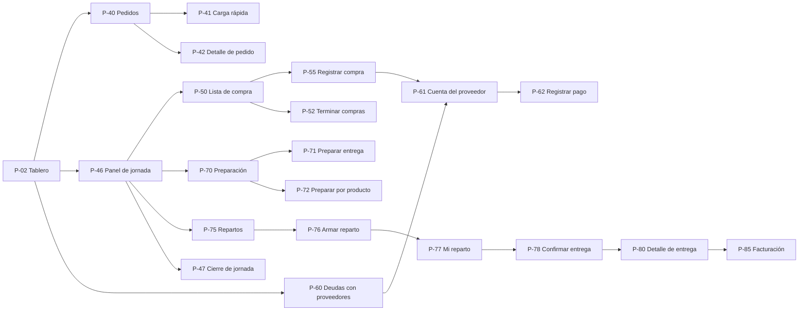

# 08 · Pantallas y acciones

> **Propósito:** definir qué pantallas tiene el sistema, para quién es cada una, qué muestra, qué acciones permite (con el permiso y la regla que controla cada acción) y cómo se navega entre ellas, en el celular y en la computadora. Cubre R15 (facilidad de uso) y la parte de interfaz de R4 a R14.

## Contenido

1. [Principios de diseño](#1-principios-de-diseño)
2. [Estructura de navegación](#2-estructura-de-navegación)
3. [Mapa de pantallas](#3-mapa-de-pantallas)
4. [Componentes comunes](#4-componentes-comunes)
5. [Detalle de pantallas](#5-detalle-de-pantallas)
   - [5.1 Acceso, inicio y cuenta](#51-acceso-inicio-y-cuenta)
   - [5.2 Catálogo de productos](#52-catálogo-de-productos)
   - [5.3 Clientes](#53-clientes)
   - [5.4 Proveedores](#54-proveedores)
   - [5.5 Precios de compra](#55-precios-de-compra)
   - [5.6 Precios de venta y márgenes](#56-precios-de-venta-y-márgenes)
   - [5.7 Pedidos y jornada](#57-pedidos-y-jornada)
   - [5.8 Lista de compra y compras](#58-lista-de-compra-y-compras)
   - [5.9 Cuentas corrientes de proveedores](#59-cuentas-corrientes-de-proveedores)
   - [5.10 Preparación](#510-preparación)
   - [5.11 Repartos y entregas](#511-repartos-y-entregas)
   - [5.12 Facturación](#512-facturación)
   - [5.13 Reportes y documentos](#513-reportes-y-documentos)
   - [5.14 Configuración, usuarios y auditoría](#514-configuración-usuarios-y-auditoría)
6. [Matriz pantalla × rol](#6-matriz-pantalla--rol)
7. [Mensajes de error y advertencia](#7-mensajes-de-error-y-advertencia)
8. [Metas de usabilidad y cómo se verifican](#8-metas-de-usabilidad-y-cómo-se-verifican)
9. [Pantallas de fases posteriores (PROPUESTO)](#9-pantallas-de-fases-posteriores-propuesto)

Documentos relacionados: `01-tipo-de-aplicacion-y-arquitectura.md` (enfoque mobile-first / desktop-first, rutas, rendimiento), `02-usuarios-roles-y-permisos.md` (permisos y visibilidad por campo), `04-procesos-y-flujos.md` (qué hace cada paso), `05-precios-y-margenes.md` (lista general de precios, matriz y simulador), `06-creditos-y-pagos.md` (cómo se muestra pagado y pendiente), `07-reglas-de-negocio.md` (RN-xxx), `09-documentos-imprimibles.md` (DOC-01 a DOC-08).

---

## 1. Principios de diseño

| # | Principio | Cómo se aplica |
|---|---|---|
| 1 | **Dos enfoques, un solo sistema** | Las pantallas operativas (carga rápida de pedidos, lista de compra en el mercado, registrar compra, actualización rápida de precios, preparación, mi reparto, confirmar entrega) se diseñan primero para un celular de 390 × 844 px. Las administrativas (precios, márgenes, cuentas corrientes, facturación, reportes, configuración) se diseñan primero para una PC de 1366 × 768 px y se reacomodan en el celular (tablas → tarjetas). |
| 2 | **El servidor decide qué se ve** | Cada pantalla recibe del servidor un objeto ya filtrado por los permisos del usuario (02 §8). Si una columna no se puede ver, no se envía ni se deja el hueco: la columna no existe para ese usuario. |
| 3 | **Operativas sin precios, siempre** | Preparación, mi reparto, confirmar entrega y los documentos DOC-02, DOC-04 y DOC-07 leen solo vistas `v_op_*`. No muestran precios, costos, márgenes ni deudas aunque las abra el ADMIN (02 §1, principio 3). |
| 4 | **Pocas acciones, grandes y al alcance del pulgar** | En el celular: botones de al menos 48 px de alto, texto base de 16 px, acción principal fija en la parte inferior, teclado numérico para cantidades y precios (`inputmode="decimal"`), sin menús anidados. Meta: una línea de compra en 3 toques o menos (RNF-05). |
| 5 | **La jornada siempre a la vista** | La fecha de la jornada con la que se trabaja se muestra grande en la barra superior, con su estado. Cambiarla es explícito, para no cargar un pedido en el día equivocado. |
| 6 | **Nada se borra** | En documentos el botón es "Anular" o "Cancelar" y abre el diálogo de motivo; en maestros es "Desactivar". No existe un botón "Eliminar", salvo líneas de un pedido en `BORRADOR` (03 §1.5). |
| 7 | **Estados y semáforos con color, ícono y texto** | Nunca solo color (06 §8.3). El mismo estado se ve igual en todas las pantallas y documentos. |
| 8 | **El precio dice de dónde sale** | Todo precio de venta visible lleva su origen ("Recargo del cliente, nivel 4") y, si todavía puede cambiar, la etiqueta **estimado** (05 §7). |
| 9 | **Confirmar solo cuando la regla lo pide** | Los avisos de tipo ADVIERTE se muestran en línea; solo piden un toque extra de confirmación cuando la regla lo exige (variación brusca, margen negativo al emitir, exceso de límite, etc.). Así el usuario no se acostumbra a aceptar sin leer. |
| 10 | **Guardado seguro** | Pedidos: borrador automático local mientras se escribe. Compras, pagos y confirmaciones de entrega: `clave_idempotencia` generada en el celular (un doble toque no duplica). Edición de maestros y documentos: concurrencia optimista; si otro usuario cambió el registro, se muestra "Esto cambió mientras lo editabas" con los datos nuevos (RN-150). |
| 11 | **Idioma** | Español, con voseo en los mensajes (como en los ejemplos de 04 y 06), números en formato es-AR / es-UY (01 §18). Los nombres técnicos (enums) se muestran traducidos: `EN_COMPRA` → "En compra". |

---

## 2. Estructura de navegación

### 2.1 Disposición general

| Elemento | En la PC | En el celular |
|---|---|---|
| Menú principal | Lateral izquierdo, plegable, agrupado según el circuito (§2.2). | Barra inferior con 4 accesos según el rol más "Más" (§2.3). |
| Barra superior | Selector de jornada, buscador global, avisos, usuario. | Selector de jornada (fecha grande) y avisos; el buscador se abre con un ícono. |
| Buscador global | `Ctrl + K`: busca clientes, productos, proveedores y números de documento (`PED-`, `COM-`, `ENT-`, `FAC-`...). Solo devuelve lo que el usuario puede abrir. | Igual, a pantalla completa. |
| Avisos | Campana con las alertas del tablero (§5.1, P-02) y notificaciones puntuales ("la lista de compra cambió", "entrega con diferencias"). | Igual. |
| Impresión | Botón **Imprimir** en cada pantalla que tiene documento: abre la vista A4 (`/imprimir/...`) y el diálogo del navegador. | **Compartir PDF** (WhatsApp, correo) como acción principal; imprimir queda como secundaria (RT-08). |

### 2.2 Menú por grupos (PC)

**Simplificado el 29/09/2026 (pedido del usuario: sacar lo que no se usa a diario):** cada entrada lleva un dibujo, la pantalla en la que se está queda marcada y **Nuevo pedido** es un botón destacado.

| Grupo | Pantallas | Visible si el usuario tiene… |
|---|---|---|
| Día de trabajo | Tablero de pedidos · **Nuevo pedido** · Viaje de entrega · Mi reparto (solo para quien no maneja todos los repartos) · Actividad y notas | Sesión · `pedidos.crear` · `repartos.ver` · `repartos.ver_propios` sin `repartos.gestionar` · Sesión |
| Registros | Clientes · Productos · Proveedores | `clientes.ver` · `productos.ver` · `proveedores.ver` |
| Cuentas | Balance · Deudas con proveedores · Facturación | `reportes.ver` · `pagos.ver` · `facturacion.ver` |
| Más opciones (plegado) | El día paso a paso · Todos los días · Lista de pedidos · Lista de compra · Compras · Preparación · Repartos · Entregas · Precios de compra · Precios de venta · Movimientos · Reportes · Documentos emitidos · Usuarios · Empresa · Auditoría | El permiso de ver de cada pantalla |

**Versión anterior (28/09/2026, uso interno):** la pantalla principal es **Hoy** (P-02), que lleva el día de trabajo paso a paso; los datos que se cargan de vez en cuando (clientes, productos, proveedores, precios) van aparte en **Registros**, y las cuentas con el balance en su propio grupo. Cada paso del día sigue teniendo su pantalla, en un grupo plegado para ir directo.

| Grupo | Pantallas | Visible si el usuario tiene… |
|---|---|---|
| Día de trabajo | Hoy · Mi reparto · Todos los días (jornadas) | Sesión · `repartos.ver_propios` · `jornada.ver` |
| Registros | Clientes · Productos · Proveedores · Precios de compra · Precios de venta | `clientes.ver` · `productos.ver` · `proveedores.ver` · `precios.ver_costos` · `precios.ver_margenes` |
| Cuentas y balance | Balance · Movimientos · Deudas con proveedores · Facturación · Reportes | `reportes.ver` · `reportes.ver` · `pagos.ver` · `facturacion.ver` · `reportes.ver` |
| Cada paso por separado (plegado) | Pedidos · Lista de compra · Compras · Preparación · Repartos · Entregas · Documentos emitidos | El permiso de ver de cada pantalla |
| Configuración | Empresa · Usuarios · Auditoría | `configuracion.ver` · `usuarios.administrar` · `auditoria.ver` |

Los grupos sin ninguna pantalla visible no aparecen. (Menú original del plan: Inicio · Operación del día · Comercial · Proveedores · Administración · Configuración.) En **modo usuario único** (02 §9.2) el grupo "Operación del día" se muestra primero y en el orden del circuito: Pedidos → Lista de compra → Compras → Preparación → Entregas → Documentos → Pagos.

### 2.3 Barra inferior del celular por rol

| Rol principal | Accesos (izquierda a derecha) | Pantalla al abrir la app |
|---|---|---|
| ADMIN | Inicio · Pedidos · Lista de compra · Compras · Más | P-02 Tablero |
| VENDEDOR | Inicio · Pedidos · **+ Pedido** · Clientes · Más | P-02 Tablero |
| COMPRADOR | Inicio · Lista de compra · **+ Compra** · Precios · Más | P-50 Lista de compra de la jornada |
| PREPARADOR | Preparación · Entregas · Más | P-70 Preparación de la jornada |
| REPARTIDOR | Mi reparto · Más | P-77 Mi reparto |
| ADMINISTRATIVO | Inicio · Cuentas · Facturación · Reportes · Más | P-02 Tablero |

Con varios roles, la barra toma los accesos del rol de mayor jerarquía en este orden: ADMIN, ADMINISTRATIVO, COMPRADOR, VENDEDOR, PREPARADOR, REPARTIDOR; el resto queda en "Más". El usuario puede fijar hasta 4 accesos propios (se guardan en `usuario.preferencias`).

### 2.4 Diagrama de navegación principal



---

## 3. Mapa de pantallas

Enfoque: **M** = mobile-first; **D** = desktop-first (usable en celular); **M/D** = ambos por igual. Clases de datos (02 §7): O operativo, V precio de venta, C costo, M margen y reglas, F financiero, P personal y seguridad. "+X" = la pantalla muestra además datos de la clase X si el usuario tiene el permiso correspondiente.

| ID | Pantalla | Ruta | Módulo | Enfoque | Permiso para abrir | Datos | Fase |
|---|---|---|---|---|---|---|---|
| P-01 | Ingreso y configuración inicial | `/login`, `/configuracion-inicial` | M18 | M/D | Pública | — | MVP |
| P-02 | Hoy: tablero de pedidos y día paso a paso | `/inicio`, `/inicio?fecha=`, `?vista=pasos`, `?pedido=` | M06/M16 | M/D | Sesión | O +V +C +F | MVP |
| P-03 | Mi cuenta | `/mi-cuenta` | M18 | M/D | Sesión | P (propios) | MVP |
| P-10 | Productos | `/productos` | M01 | D | `productos.ver` | O | MVP |
| P-10b | Nuevo producto (guiado) | `/productos/nuevo` | M01 | M/D | `productos.editar` | O +M | MVP (uso interno) |
| P-11 | Ficha de producto | `/productos/[id]` | M01 | D | `productos.ver` | O +C +V +M | MVP |
| P-12 | Categorías | `/productos/categorias` | M01 | D | `productos.ver` | O +M | MVP |
| P-15 | Clientes | `/clientes` | M02 | M/D | `clientes.ver` | O | MVP |
| P-16 | Ficha de cliente | `/clientes/[id]` | M02 | M/D | `clientes.ver` | O +V +M | MVP |
| P-20 | Proveedores | `/proveedores` | M03 | D | `proveedores.ver` | O +F | MVP |
| P-21 | Ficha de proveedor | `/proveedores/[id]` | M03/M04 | D | `proveedores.ver` | O +C +F | MVP |
| P-25 | Lista general de precios de compra | `/precios/compra` | M04 | D | `precios.ver_costos` | C +F | MVP |
| P-26 | Actualización rápida en el puesto | `/precios/compra/rapida` | M04 | M | `precios.editar_compra` | C | MVP |
| P-27 | Actualización masiva | `/precios/compra/masiva` | M04 | D | `precios.editar_compra` | C | MVP |
| P-28 | Importar planilla de precios | `/precios/compra/importar` | M04 | D | `precios.editar_compra` | C | MVP |
| P-29 | Historial de precios de compra | `/precios/compra/historial` | M04 | D | `precios.ver_costos` | C | MVP |
| P-30 | Comparador rápido | `/precios/compra/comparar/[producto]` | M04 | M | `precios.ver_costos` | C +F | MVP |
| P-32 | Matriz de recargos | `/precios/venta` | M05 | D | `precios.ver_margenes` | M +V +C | MVP |
| P-33 | Reglas de precio del cliente | `/clientes/[id]/precios` | M05 | D | `precios.ver_margenes` | M +V +C | MVP |
| P-34 | Simulador de precio | `/precios/venta/simulador` | M05 | M/D | `precios.ver_margenes` | M +V +C | MVP |
| P-40 | Pedidos | `/pedidos` | M06 | M/D | `pedidos.ver` | O +V | MVP |
| P-41 | Carga rápida de pedido | `/pedidos/nuevo`, `/pedidos/[id]/editar` | M06 | M | `pedidos.crear` o `pedidos.editar` | O +V +C +M | MVP |
| P-42 | Detalle de pedido | `/pedidos/[id]` | M06 | M/D | `pedidos.ver` | O +V +C +M | MVP |
| P-45 | Jornadas | `/jornadas` | M07 | M/D | `jornada.ver` | O | MVP |
| P-46 | Panel de la jornada | `/jornadas/[fecha]` | M07 | M/D | `jornada.ver` | O +V +C | MVP |
| P-47 | Cierre de jornada | `/jornadas/[fecha]/cierre` | M07 | D | `jornada.cerrar` | O V C M F | MVP |
| P-50 | Lista de compra | `/jornadas/[fecha]/lista-compra` | M07 | M | `lista_compra.ver` | O +C +F | MVP |
| P-51 | Diferencias entre versiones de la lista | `/jornadas/[fecha]/lista-compra/diferencias` | M07 | M/D | `lista_compra.ver` | O +C | MVP |
| P-52 | Terminar compras (conciliación) | `/jornadas/[fecha]/lista-compra/conciliacion` | M07 | M | `lista_compra.editar` | O +C | MVP |
| P-55 | Registrar compra | `/compras/nueva` | M08 | M | `compras.registrar` | C +F | MVP |
| P-56 | Compras | `/compras` | M08 | D | `compras.ver` | C +F | MVP |
| P-57 | Detalle de compra | `/compras/[id]` | M08 | M/D | `compras.ver` | C +F | MVP |
| P-60 | Deudas con proveedores | `/cuentas-proveedores` | M09 | D | `pagos.ver` | F | MVP |
| P-61 | Cuenta corriente del proveedor | `/cuentas-proveedores/[id]` | M09 | D | `pagos.ver` | F C | MVP |
| P-62 | Registrar pago | `/cuentas-proveedores/[id]/pago` | M09 | D | `pagos.registrar` | F | MVP |
| P-63 | Ajuste y saldo inicial | `/cuentas-proveedores/[id]/ajuste` | M09 | D | `pagos.ajustar` | F | MVP |
| P-64 | Detalle de pago | `/cuentas-proveedores/pagos/[id]` | M09 | D | `pagos.ver` | F | MVP |
| P-70 | Preparación de la jornada | `/preparacion/[fecha]` | M10 | M | `preparacion.ver` | O | MVP |
| P-71 | Preparar entrega | `/preparacion/[fecha]/entrega/[id]` | M10 | M | `preparacion.registrar` | O | MVP |
| P-72 | Preparar por producto | `/preparacion/[fecha]/producto/[id]` | M10 | M | `preparacion.registrar` | O | MVP |
| P-73 | Faltantes de la jornada | `/preparacion/[fecha]/faltantes` | M10 | M/D | `preparacion.ver` | O | MVP |
| P-75 | Repartos de la jornada | `/repartos` | M11 | D | `repartos.ver` | O | MVP |
| P-76 | Armar reparto | `/repartos/[id]` | M11 | D | `repartos.gestionar` | O | MVP |
| P-77 | Mi reparto | `/repartos/mios` | M11 | M | `repartos.ver_propios` | O | MVP |
| P-78 | Confirmar entrega | `/repartos/mios/entrega/[id]` | M11 | M | `entregas.confirmar` | O | MVP |
| P-78b | Viaje de entrega (recorrido y GPS) | `/viaje`, `/viaje?fecha=` | M11 | M/D | `repartos.ver` | O | MVP (uso interno) |
| P-79 | Entregas de la jornada | `/entregas` | M11 | M/D | `entregas.ver` | O +V | MVP |
| P-80 | Detalle de entrega | `/entregas/[id]` | M11/M12 | D | `entregas.ver` | O +V +C +M | MVP |
| P-85 | Facturación | `/facturacion` | M13 | D | `facturacion.ver` | V | MVP |
| P-86 | Facturar período | `/facturacion/periodo` | M13 | D | `facturacion.emitir` | V | MVP |
| P-87 | Detalle de comprobante | `/facturacion/[id]` | M13 | D | `facturacion.ver` | V | MVP |
| P-88 | Exportar para el contador | `/facturacion/exportar` | M13 | D | `facturacion.exportar` | V C F | MVP |
| P-90 | Reportes | `/reportes`, `/reportes/[codigo]` | M16 | D | `reportes.ver` | según reporte | MVP básico |
| P-91 | Balance (gráficos en el tiempo) | `/balance` | M16 | D | `reportes.ver` | V C M F | MVP (uso interno) |
| P-93 | Movimientos (registro) | `/balance/movimientos` | M16 | D | `reportes.ver` | V C F | MVP (uso interno) |
| P-94 | Actividad y notas | `/actividad`, `?ver=notas`, `?persona=` | M20 | M/D | Sesión (cada entrada, según el permiso de ver lo que nombra) | O | MVP (uso interno) |
| P-92 | Documentos emitidos | `/documentos` | M12 | D | Algún permiso `documentos.imprimir_*` | según documento | MVP |
| P-95 | Configuración de la empresa | `/configuracion` | M17 | D | `configuracion.ver` | M | MVP |
| P-96 | Usuarios y roles | `/usuarios` | M18 | D | `usuarios.administrar` | P | MVP |
| P-97 | Accesos y sesiones de un usuario | `/usuarios/[id]/accesos` | M18 | D | `usuarios.administrar` | P | MVP |
| P-98 | Auditoría | `/auditoria` | M19 | D | `auditoria.ver` | P + todas | MVP |

Las vistas de impresión (`/imprimir/...`) y la generación de PDF (`/api/documentos/...`) se definen en `09-documentos-imprimibles.md`.

---

## 4. Componentes comunes

| ID | Componente | Comportamiento |
|---|---|---|
| C-01 | **Selector de jornada** | Muestra "Jue 24/09" en grande y el estado de la jornada. Propone la jornada no `CERRADA` más próxima con fecha ≥ hoy (01 §18). Al cambiarla pide confirmar si hay un formulario con datos sin guardar. Una jornada `CERRADA` se muestra con candado y todas las pantallas quedan en solo lectura (RN-041). |
| C-02 | **Chip de estado** | Texto traducido + color + ícono. Gris: `BORRADOR`, `PLANIFICADO`. Azul: `CONFIRMADO`, `ABIERTA`, `PENDIENTE`. Ámbar: estados en curso (`EN_COMPRA`, `COMPRANDO`, `PARCIAL`, `EN_PREPARACION`, `PREPARANDO`, `EN_REPARTO`, `REPARTIENDO`, `EN_CURSO`). Verde claro: `PREPARADO`, `PREPARADA`, `COMPRADO`. Verde: finales (`ENTREGADO`/`ENTREGADA`, `CERRADA`, `FINALIZADO`, `REGISTRADA`, `EMITIDA`, `FACTURADA`, `PAGADA`). Rojo tachado: `CANCELADO`, `ANULADA`/`ANULADO`, `NO_CONSEGUIDO`. Insignia naranja adicional "Con diferencias" (`entrega.con_diferencias`). |
| C-03 | **Semáforo de crédito** | Color + ícono + texto + porcentaje, según 06 §8.3 (VERDE círculo, AMARILLO triángulo, ROJO triángulo con "!", EXCEDIDO octógono, SIN_LIMITE gris). Variante compacta (punto + %) para listas y variante con barra para fichas. Solo con `proveedores.ver_credito`. |
| C-04 | **Buscador de producto** | Autocompletar por nombre, código o nombre corto ("tom" → Tomate redondo) con índice de trigramas (03 §16). En un pedido, primero los productos que ese cliente compra habitualmente; en una compra, primero los que ese proveedor ofrece. Productos desactivados no aparecen (RN-007). |
| C-05 | **Cantidad con unidad** | Botones de unidad (`kg` y las presentaciones permitidas: de venta en pedidos, de compra en compras), campo numérico grande y la equivalencia en unidad base al instante ("3 bolsas = 75 kg"). Enteros si el producto no admite fracción (RN-009). |
| C-06 | **Precio con origen** | Precio con 2 decimales, etiqueta **estimado** hasta que se congela, y el origen de la regla en una línea ("Precio fijo — Licitación 2026, nivel 1"). Al tocarlo se despliega costo y recargo (solo con `precios.ver_costos` / `precios.ver_margenes`). Alertas de margen como íconos (`MARGEN_BAJO` ámbar, `MARGEN_NEGATIVO` rojo, `SIN_PRECIO` rojo). |
| C-07 | **Diálogo de motivo** | Para anular, cancelar, override de precio, exceso de límite, reabrir jornada, corregir entrega, marcar no conseguido. Texto obligatorio de al menos 5 caracteres (03 §1.3) y, donde aplica, una lista de motivos frecuentes. Si el último ingreso tiene más de 12 horas y la acción es crítica, pide la contraseña (02 §11). |
| C-08 | **Advertencia con confirmación** | Muestra el aviso de la regla (código RN visible en un "¿por qué?" desplegable) y un botón de confirmación con un texto que obliga a leer ("Sí, el precio es $1.620"). |
| C-09 | **Banner de estado** | Franja arriba del contenido para condiciones que afectan toda la pantalla: "Lista de compra desactualizada — Regenerar", "Jornada cerrada — solo lectura", "Sin conexión" (fase 2), "Viendo como PREPARADOR". |
| C-10 | **Barra de documento** | Imprimir · Descargar PDF · Compartir · Enviar por correo · Versiones. Cada botón aparece solo si el usuario tiene el permiso del documento (09 §3). |
| C-11 | **Tabla administrativa** | Orden, filtros, búsqueda, selección de columnas y exportación (con `reportes.exportar` o el permiso de exportación del módulo). Paginación o virtualización por encima de 200 filas (01 §16). En el celular se convierte en tarjetas. |
| C-12 | **Foto y firma** | Cámara del navegador para la foto del remito o de la boleta (se comprime en el celular: máximo 1600 px, calidad 0,7) y firma con el dedo en un recuadro. Si la subida falla, reintenta sin perder lo cargado. |
| C-13 | **Resultado de acción** | Aviso breve con el número del documento creado ("Compra COM-000302 registrada") y un enlace para abrirlo. No hay "deshacer": los documentos se corrigen anulando. |
| C-14 | **Estado vacío** | Explica qué falta y ofrece la acción siguiente ("Todavía no hay pedidos para el jueves 24/09. **+ Nuevo pedido**"). |

---

## 5. Detalle de pantallas

Formato de cada pantalla: **quién la usa**, **qué muestra** y una tabla de **acciones** (botón o gesto → permiso → reglas → resultado). Los permisos son las claves de `02-usuarios-roles-y-permisos.md`; si una acción no indica permiso, alcanza con el de abrir la pantalla.

### 5.1 Acceso, inicio y cuenta

#### P-01 Ingreso y configuración inicial

- Ingreso con "usuario o correo" y contraseña (02 §10.2).
- Configuración inicial (solo mientras el sistema no está configurado, 02 §10.1): nombre del negocio, nombre, usuario y contraseña del dueño.
- Sin invitaciones ni recuperación por correo (decisión del 26/09/2026): el ADMIN crea las cuentas y pone contraseñas nuevas.
- Después del primer ingreso en el celular: sugerencia de **instalar la app** (PWA) con instrucciones para Android y iPhone.

#### P-02 Hoy (día de trabajo paso a paso)

**Más grande y despejado (29/09/2026):** es la pantalla principal ("Tablero de pedidos" en el menú). Listas de 340 px con tarjetas grandes: dibujo del tipo de cliente, nombre en letra grande, **lo que lleva a la vista** (hasta 4 productos con su dibujo y cantidad, "y N más") y los indicadores más grandes; una tarjeta sin productos lo dice ("Sin productos todavía · tocá para cargarlos") y lleva directo a cargarlos. Arriba, el botón **＋ Nuevo pedido** (en el celular, flotante abajo a la derecha) y los avisos como píldoras compactas. La tarjeta abierta ocupa más (hasta 1024 px): primero **Lo que lleva** en recuadros con **✏️ Cambiar productos**, después dónde se entrega, la nota, las notas entre ustedes y el historial; al costado, botones grandes (confirmar, cambiar productos, agregar a la lista, prioridad, quién se encarga y horario).

**Tablero de pedidos (28/09/2026, segunda versión, pedido del usuario: "tipo Trello").** "Hoy" abre en el **tablero**; la pestaña "☰ Paso a paso" muestra los siete pasos de abajo. El tablero imita la presentación y la mecánica de Trello: fondo de color, listas grises con tarjetas blancas, etiquetas de colores, fecha de vencimiento, miembros y la tarjeta que se abre encima.

- **Listas (columnas):** Por confirmar (borradores) · Confirmados · En la lista de compra · Preparando · En camino · Entregados. Los cancelados, plegados abajo. En el celular, chips para saltar a cada lista.
- **Tarjeta:** franja con las etiquetas (tipo de cliente, "Urgente" o "Sin apuro", "Llegó tarde"), cliente y número, y abajo los indicadores: ⏰ plazo (rojo vencido, amarillo pronto — 2 h o menos —, verde listo), 💬 notas con punto si hay sin leer, ☑ avance (comprado o preparado de N líneas), 🧺 cantidad de productos, total estimado (con `precios.ver_venta`) y el avatar de quien se encarga. Ordenadas por prioridad, plazo y número.
- **Arrastrar** una tarjeta a otra lista hace la acción que corresponde: a Confirmados confirma, a "En la lista de compra" la agrega a la lista, y de ahí a Confirmados la saca. Lo demás avanza con su paso.
- **Elegir pedidos:** "☑ Elegir pedidos" pone casillas en las tarjetas y "Elegir todos" en cada lista; "🛒 Elegir todo lo que falta comprar" marca de una vez los confirmados que no están en la lista. Con pedidos elegidos aparece una barra fija: **armar la lista de compra con estos**, confirmar, sacar de la lista, cambiar la prioridad o quién se encarga.
- **La lista de compra por pedidos elegidos:** se arma con los pedidos que se eligen (o todos los confirmados); los que se confirman después quedan "fuera de la lista" y el paso 2 lo avisa. La lista queda desactualizada solo si cambia un pedido que ya está en ella.
- **Filtros:** por persona (avatares) y "Urgentes". **"+ Agregar un pedido"** al pie de Por confirmar crea el borrador con el cliente elegido.
- **Tarjeta abierta** (`?pedido=`, se cierra con Esc o tocando afuera): quién se encarga, etiquetas, plazo, dónde se entrega (con Google Maps y Waze), observaciones, los productos como lista de control con su avance, las **notas** (escribir una "para" alguien) y el historial con el nombre de cada persona. Al costado: prioridad, miembro, plazo (desde/hasta), confirmar, agregar o sacar de la lista y abrir el pedido completo. Abrirla marca sus notas como leídas.
- Arriba siguen los avisos (notas sin leer, pedidos de acceso, deuda vencida o por vencer).

**Como quedó construida (28/09/2026, uso interno).** Es la pantalla con la que arranca el día. Arriba, los avisos (personas esperando acceso, deuda vencida o por vencer con proveedores); después, los días cercanos para elegir (ayer, hoy, mañana y las jornadas sin cerrar), el día elegido con su barra de avance, y los **siete pasos** en orden:

| Paso | Hecho cuando… | Acción principal desde "Hoy" |
|---|---|---|
| 1. Pedidos | hay pedidos confirmados y ninguno en borrador | **Cargar pedido** (elegir el cliente y abre el pedido) · ver los pedidos |
| 2. Lista de compra | la lista está armada y al día | **Armar / actualizar la lista** · ver · imprimir (DOC-01) |
| 3. Compras en el mercado | todas las líneas de la lista están compradas o no conseguidas | **Registrar una compra** · lista por puesto · precios en el puesto |
| 4. Preparación | todas las entregas están preparadas | **Empezar a preparar** o seguir · hoja de preparación (DOC-07) |
| 5. Remitos | todas las entregas tienen DOC-02 y DOC-03 de su versión vigente | **Hacer los que faltan** · imprimir todos los remitos juntos (`/entregas/remitos`, una o dos copias) o todas las listas contables |
| 6. Reparto y entrega | todas las entregas están entregadas | **Armar el reparto** · confirmar entregas |
| 7. Cierre del día | la jornada está cerrada | **Revisar y cerrar el día** · ver el resumen |

El paso que toca ("Ahora") se muestra abierto, con una explicación corta y sus botones; los demás, en una línea con su estado (Listo, En curso, Falta, Salteado) y se abren al tocarlos. Un paso que nunca se empezó cuando ya arrancó uno posterior figura como **salteado** (por ejemplo, preparar sin haber armado la lista); uno que quedó a medias sigue **en curso** pero deja de ser el que toca si ya se terminó uno posterior. Sin elegir fecha, se muestra la jornada más temprana desde ayer que ya arrancó o tiene pedidos confirmados y no está cerrada; si no hay, el día para el que se toman pedidos. La lógica está en `src/dominio/jornadas/pasos.ts`.

**Plan original (referencia).** Una sola pantalla que cambia según los permisos. Se arma con vistas (no depende de la tarea programada, 01 §6.4).

| Bloque | Contenido | Quién lo ve |
|---|---|---|
| Qué falta hoy | Lista de tareas de la jornada seleccionada según su estado: pedidos en `BORRADOR`, lista de compra sin generar o desactualizada, líneas `PENDIENTE`/`PARCIAL`, entregas sin preparar, entregas `PREPARADA` sin documentos, repartos sin salir, entregas sin confirmar, entregas con diferencias sin revisar, jornada lista para cerrar. Cada tarea lleva a su pantalla. | Cada tarea, a quien tiene el permiso de resolverla. En modo usuario único es el bloque principal. |
| Pedidos de la próxima jornada | Cantidad por estado; **clientes habituales sin pedido** (clientes que pidieron el mismo día de la semana en alguna de las últimas 4 semanas y todavía no tienen pedido). | `pedidos.ver` |
| Compra del día | Progreso de la lista (12 de 15 líneas compradas), comprado hasta ahora, desvío contra lo estimado. | `lista_compra.ver` (+ importes con `precios.ver_costos`) |
| Proveedores | Proveedores en `ROJO` o `EXCEDIDO`, deuda vencida, vencimientos de los próximos `dias_aviso_vencimiento` días, excesos de límite autorizados (hasta que el proveedor vuelve al límite). | `proveedores.ver_credito`, `pagos.ver` |
| Precios | Ofertas desactualizadas, variaciones bruscas de los últimos 7 días, precios fijos por vencer (`PRECIO_FIJO_POR_VENCER`), preferidos caros. | `precios.ver_costos`, `precios.ver_margenes` |
| Márgenes | Líneas con `MARGEN_NEGATIVO`, `MARGEN_BAJO` o `SIN_PRECIO` de las jornadas abiertas. | `precios.ver_margenes` |
| Preparación y reparto | Entregas por estado; mi reparto de hoy (para el REPARTIDOR). | `preparacion.ver`, `repartos.ver_propios` |
| Facturación | Entregas `ENTREGADA` y `SIN_FACTURAR` por cliente; períodos por facturar según la periodicidad. | `facturacion.ver` |
| Cifras del día | Vendido (estimado hasta que se congela), comprado, pagado en el momento, deuda generada, margen. | Cada cifra según su clase de datos |

```text
┌──────────────────────────────────────────────────────────────────────────────┐
│ ☰  Jornada: JUE 24/09 · Comprando ▾        🔍 Buscar (Ctrl+K)      🔔 5   Juan │
├──────────────────────────────────────────────────────────────────────────────┤
│ QUÉ FALTA HOY                                  │ PROVEEDORES                   │
│ ✔ 3 pedidos confirmados                        │ ⏰ Hnos. García vencido $15.000│
│ ⚠ Lista de compra desactualizada  [Regenerar]  │    (1 día)          [Pagar]   │
│ ● 3 de 5 líneas compradas         [Ver lista]  │ ● La Quinta VERDE 69,6 %      │
│ ○ Preparación sin iniciar                      │   (cerca de AMARILLO)         │
│                                                ├───────────────────────────────┤
│ CIFRAS DEL DÍA                                 │ MÁRGENES                      │
│ Vendido (estimado)  $806.370                   │ ⚠ Banana → Hospital 13,8 %    │
│ Comprado            $653.050                   │   (mínimo 15 %)               │
│ Deuda generada      $415.550                   │ PRECIOS                       │
│                                                │ 2 ofertas desactualizadas     │
└──────────────────────────────────────────────────────────────────────────────┘
```

#### P-03 Mi cuenta

**Construida (28/09/2026):** **Tu perfil** — nombre y color del avatar con los que te ven los demás en las tarjetas, las notas y la actividad (con vista previa; los colores que ya usa otra persona llevan sus iniciales; sin elegir, a cada uno le toca uno distinto) — y cambio de contraseña. Plan original: Datos propios, cambio de contraseña, activar MFA, tamaño de letra (normal / grande, útil en el mercado), accesos fijados en la barra inferior, instalar la app, cerrar sesión en este dispositivo.

---

### 5.2 Catálogo de productos

#### P-10 Productos

**Construida (28/09/2026):** tarjetas agrupadas por categoría ("▦ Tarjetas | ☰ Lista"): dibujo del producto, código, en qué se cuenta, envase de compra, "Desde $X el kg" y cuántos proveedores (con `precios.ver_costos`) y el preferido. **+ Nuevo producto** abre P-10b.

#### P-10b Nuevo producto (guiado, 28/09/2026)

Cuatro preguntas con la tarjeta de "Así va a quedar" al costado: 1) nombre y categoría (el código se arma solo; "Poner otro" para elegirlo); 2) en qué se cuenta, con botones grandes (kilo, unidad, atado, maple, bandeja, docena, paquete, litro) y si se puede pedir en partes; 3) cómo se compra, con envases sugeridos según la unidad ("Cajón 18 kg", "Bolsa 25 kg"…) y la explicación "1 cajón 18 kg = 18 kg"; 4) la ganancia sobre el costo (vacío = la de la categoría o la general) con una cuenta de ejemplo: "si el cajón te cuesta $12.000 → el kg te sale $667 y lo vendés a $900". Al crear, lleva a la ficha, donde los envases se ven como tarjetas ("1 cajón = 18 kg", para comprar / para vender) y se cargan los proveedores.

Plan original — tabla: código, nombre, categoría, unidad base, presentaciones (cantidad), proveedor preferido, estado. Filtros: categoría, grupo (FRUTA / VERDURA / OTRO), activos o desactivados, "sin proveedor", "sin precio".

| Acción | Permiso | Reglas | Resultado |
|---|---|---|---|
| Nuevo producto | `productos.editar` | RN-001, RN-004, RN-005, RN-006 | Crea el producto y su presentación de unidad base (factor 1). |
| Desactivar / reactivar | `productos.editar` | RN-007 | Advierte si tiene pedidos en curso. |
| Exportar | `reportes.exportar` | — | CSV/Excel. |

#### P-11 Ficha de producto (consulta central, R14)

Es la pantalla pedida para "administrar cada producto de forma central". Pestañas:

| Pestaña | Contenido | Datos |
|---|---|---|
| Datos | Código, nombre, nombre corto, categoría y grupo, unidad base, admite fracción, alícuota de IVA, observaciones, imagen. | O |
| Presentaciones | Nombre, factor a unidad base, uso en compra y venta, orden; presentación de venta y de compra por defecto. El factor de una presentación usada no se edita: "Reemplazar presentación" crea una nueva y desactiva la anterior (RN-003). | O |
| Proveedores y precios de compra | Una fila por oferta: proveedor (★ si es el preferido), presentación, precio, costo por unidad base, diferencia contra el mejor, última actualización, disponible. Gráfico de evolución del costo por unidad base por proveedor (últimos 90 días, desde `historial_precio_compra`). Costo preferido, mínimo, último costo real y costo de referencia según la estrategia (`v_costo_referencia_producto`). | C (+F: semáforo del proveedor) |
| Precio de venta | Recargo general del producto y su origen (producto, categoría o global), precio de venta general con el costo de referencia actual, y la tabla de clientes con regla propia (nivel, precio, margen). | V, M |
| Clientes | Clientes que compran el producto: entregas, cantidad total, cantidad de los últimos 30 días, promedio por entrega, última entrega (`v_producto_clientes`); último precio y venta total con `precios.ver_venta`; pedidos pendientes para próximas jornadas. | O (+V) |
| Historial | Cambios del producto en `auditoria`. | P (con `auditoria.ver`) |

| Acción | Permiso | Reglas | Resultado |
|---|---|---|---|
| Editar datos y presentaciones | `productos.editar` | RN-001 a RN-009 | Guarda con concurrencia optimista; audita. |
| Marcar proveedor preferido | `productos.editar` | RN-073 | Un solo preferido por producto. |
| Editar recargo del producto | `precios.editar_reglas` | RN-084, RN-091 | Cambia `producto.recargo_default`; recalcula precios no congelados (RN-088); audita `CAMBIO_RECARGO`. |
| Actualizar un precio de compra | `precios.editar_compra` | RN-067 a RN-070 | Edición en la celda, igual que en P-25. |
| Simular precio para un cliente | `precios.ver_margenes` | — | Abre P-34 con el producto elegido. |

#### P-12 Categorías

Lista con nombre, grupo, orden (define el orden de recorrido en el mercado y en el depósito) y recargo de la categoría (visible con `precios.ver_margenes`, editable con `precios.editar_reglas`). Crear, editar, reordenar arrastrando y desactivar con `productos.editar`.

---

### 5.3 Clientes

#### P-15 Clientes

**Construida (28/09/2026):** tarjetas agrupadas por tipo (hospital, restaurante, comercio…) con dirección, "Sin ubicación en el mapa" si falta, horario, teléfono y el próximo pedido; también como lista. En la ficha, cada punto de entrega tiene **Cómo llegar** (Google Maps y Waze) y **Marcar en el mapa** ("Estoy en el lugar" con el GPS, buscar la dirección o pegar un enlace de Google Maps), y la ficha tiene notas.

Plan original — lista (tarjetas en el celular): nombre, tipo, puntos de entrega, prioridad para faltantes, periodicidad de facturación, último pedido, estado. Búsqueda por nombre o identificador fiscal. **+ Nuevo cliente** con `clientes.editar`.

#### P-16 Ficha de cliente

| Pestaña | Contenido |
|---|---|
| Datos | Nombre, tipo, contacto, teléfono de pedidos, datos fiscales, `email_contable`, prioridad para faltantes (1 a 5), periodicidad de facturación, requiere orden de compra, acepta sustituciones, requiere firma, observaciones. |
| Puntos de entrega | Nombre, dirección, localidad, referencias, ubicación en el mapa, contacto de recepción, horario, días de entrega, instrucciones; uno marcado principal. |
| Pedidos | Pedidos recientes con estado; **productos habituales** con cantidad promedio (base de la carga rápida y de "Duplicar"). |
| Precios | Resumen de reglas vigentes y enlace a P-33 (con `precios.ver_margenes`). |
| Ventas | Entregas y comprobantes recientes con importes (con `precios.ver_venta` / `facturacion.ver`). Cuenta corriente del cliente: PROPUESTO (§9). |

| Acción | Permiso | Reglas | Resultado |
|---|---|---|---|
| Nuevo cliente / editar | `clientes.editar` | RN-010, RN-011, RN-013, RN-014, RN-015 | Guardar sin punto de entrega se permite, pero con aviso: no se le pueden confirmar pedidos (RN-010). Identificador fiscal repetido: bloquea y ofrece abrir el existente. |
| Agregar / desactivar punto de entrega | `clientes.editar` | RN-016 | No se desactiva un punto con entregas no finalizadas. |
| Desactivar cliente | `clientes.editar` | RN-012 | Muestra sus pedidos futuros y permite cancelarlos (con `pedidos.cancelar`) o mantenerlos. |
| Nuevo pedido para este cliente | `pedidos.crear` | — | Abre P-41 con el cliente elegido. |
| Duplicar último pedido | `pedidos.crear` | RN-033 | Crea un `BORRADOR` en la jornada que se elija. |

---

### 5.4 Proveedores

#### P-20 Proveedores

**Construida (28/09/2026):** tarjetas separadas en "Con deuda" y "Al día", con una franja arriba del color del semáforo de crédito, lugar en el mercado, condición de pago, cuántos productos vende y "Se le debe $X" con el semáforo y el % de uso; también como lista. La ficha tiene notas.

Plan original — lista: nombre, ubicación en el mercado, teléfono, condición de pago habitual, cantidad de productos ofrecidos; con `proveedores.ver_credito`: límite, saldo, semáforo compacto, deuda vencida. **+ Nuevo proveedor** con `proveedores.editar`.

#### P-21 Ficha de proveedor

| Pestaña | Contenido |
|---|---|
| Datos | Nombre, razón social, identificación fiscal, contacto, teléfono (botón WhatsApp), ubicación en el mercado, dirección, datos bancarios, condición de pago habitual, observaciones. |
| Productos y precios | Sus ofertas: producto, presentación, precio, costo por unidad base, diferencia contra el mejor precio del producto, última actualización, disponible hoy. Acciones en línea de P-25. |
| Crédito | Límite, plazo de pago, saldo, disponible, semáforo con barra, deuda vencida y próximo vencimiento; enlace a la cuenta corriente P-61. |

| Acción | Permiso | Reglas | Resultado |
|---|---|---|---|
| Editar datos / nueva oferta | `proveedores.editar` (el precio de la oferta requiere `precios.editar_compra`) | RN-067 | Una oferta por proveedor + producto + presentación. |
| Cambiar límite o plazo | `proveedores.editar_limite` | RN-105 | Si el límite nuevo queda por debajo del saldo, advierte "quedará EXCEDIDO (117,5 %)"; motivo obligatorio; audita `CAMBIO_LIMITE_CREDITO`. |
| Desactivar | `proveedores.editar` | RN-108 | Advierte si el saldo es distinto de 0; sigue admitiendo pagos y ajustes. |
| Registrar compra a este proveedor | `compras.registrar` | — | Abre P-55 con el proveedor elegido. |

---

### 5.5 Precios de compra

#### P-25 Lista general de precios de compra

Contenido y columnas definidos en `05-precios-y-margenes.md` §2.1 (fuente `v_oferta_vigente`). Disposición:

- Selector de agrupación: **por producto** (comparar; la mejor oferta resaltada) o **por proveedor** (actualizar recorriendo el mercado, en el orden de `ubicacion_mercado`).
- Filtros: texto, categoría, proveedor, "solo desactualizados", "solo mejor precio", "no disponibles".
- La celda de precio es editable (Enter guarda y baja a la fila siguiente; Esc cancela). Al guardar muestra la variación; si supera `variacion_brusca_pct` pide confirmación (RN-070).
- Marca "↑ +35 %" durante 7 días en las filas con variación brusca; "hace 11 días ⚠" en las desactualizadas (RN-069).

| Acción | Permiso | Reglas | Resultado |
|---|---|---|---|
| Editar precio en la celda | `precios.editar_compra` | RN-067, RN-068, RN-070 | Actualiza la oferta, agrega historial `MANUAL`, audita `CAMBIO_PRECIO_COMPRA`, recalcula precios no congelados (RN-088). |
| Confirmar sin cambios (fila o selección) | `precios.editar_compra` | RN-075 | Actualiza `fecha_actualizacion`; no crea historial. |
| Marcar no disponible hoy | `precios.editar_compra` | RN-075 | `disponible = false`: sale del mínimo y de las sugerencias. |
| Marcar preferido | `productos.editar` | RN-073 | — |
| Ver historial | `precios.ver_costos` | — | Abre P-29 filtrado. |
| Desactivar oferta | `proveedores.editar` | — | La oferta deja de ofrecerse; su historial queda. |
| Actualización masiva / Importar | `precios.editar_compra` | RN-071, RN-072 | Abre P-27 / P-28. |
| Imprimir DOC-06 | `documentos.imprimir_compra` | RN-053 | Vista A4 agrupada por proveedor con columna "precio nuevo" vacía (09, DOC-06). |

#### P-26 Actualización rápida en el puesto (celular)

Pensada para recorrer el mercado de madrugada (05 §2.2, forma 2).

```text
┌──────────────────────────────┐
│ ← Actualizar precios         │
│ B · La Quinta (Puesto 32)  ▾ │
├──────────────────────────────┤
│ Tomate redondo · Cajón 18 kg │
│ Actual $17.100   hace 4 días │
│ [  17.550  ]   +2,63 %       │
├──────────────────────────────┤
│ Lechuga criolla · Jaula 12 u │
│ Actual $9.600    hoy         │
│ [          ]                 │
├──────────────────────────────┤
│ Cebolla · Bolsa 20 kg        │
│ Actual $13.600   hace 1 día  │
│ [          ]  ○ No hay hoy   │
├──────────────────────────────┤
│ [ SIN CAMBIOS EN EL RESTO ]  │
│ [        GUARDAR          ]  │
└──────────────────────────────┘
```

- Elegir proveedor (recientes primero) → aparecen solo sus ofertas, en el orden de categorías.
- Tocar un precio y escribir el nuevo; el campo vacío significa "sin cambios". "No hay hoy" marca la oferta no disponible.
- **Guardar** aplica todos los cambios en una transacción; **Sin cambios en el resto** confirma las ofertas no tocadas (RN-075).
- Permiso: `precios.editar_compra`.

#### P-27 Actualización masiva

Filtro (proveedor y/o categoría), porcentaje (positivo o negativo), redondeo opcional del precio de compra ($10 o $100), **vista previa obligatoria** con precio actual, nuevo y variación por fila (RN-071), casillas para excluir filas, confirmar. Resultado: historial por fila con origen `MANUAL` y la observación del lote, un evento en `auditoria` con el filtro y el porcentaje.

#### P-28 Importar planilla de precios

1. Descargar plantilla (columnas de 05 §2.2) con los precios actuales del filtro elegido.
2. Subir el archivo editado (XLSX o CSV).
3. Vista previa: filas válidas, filas con variación mayor al umbral (casilla "confirmo" por fila), combinaciones inexistentes (opción "crear oferta nueva") y filas con error (motivo).
4. Aplicar: solo filas válidas y confirmadas (RN-072). Resumen final: aplicadas, omitidas, con error; descarga del informe de errores.

#### P-29 Historial de precios de compra

Filtros: producto, proveedor, período, origen (`MANUAL`, `COMPRA`, `IMPORTACION`). Gráfico de líneas del costo por unidad base (una serie por proveedor) y tabla con vigente desde / hasta, precio, costo por unidad base, variación, origen, referencia (compra o lote) y usuario.

#### P-30 Comparador rápido (celular)

Para decidir en el mercado "¿a quién le compro?". Producto → ofertas ordenadas por costo por unidad base: proveedor y ubicación, presentación, precio, costo por unidad base, % sobre el mejor, última actualización, semáforo del proveedor (con `proveedores.ver_credito`). Debajo, **"¿Cuánto cuesta comprar?"**: para la necesidad pendiente de la jornada, bultos, kilos comprados, costo total y sobrante con cada oferta (05 §3). Botón **Comprar acá** → P-55 con proveedor y producto precargados.

---

### 5.6 Precios de venta y márgenes

#### P-32 Matriz de recargos

Qué permite, en `05-precios-y-margenes.md` §9.1. Disposición:

- Filas: productos agrupados por categoría (fila de encabezado de grupo). Columnas: los clientes elegidos (selector con búsqueda; por defecto los 10 con más ventas del último mes).
- Celda: recargo efectivo, precio resultante con el costo de referencia actual y un número de nivel (1 a 7) con color: niveles 1 a 3 (excepciones del cliente) resaltados; 4 a 7 en tono neutro. Ícono de alerta de margen.
- Encabezado de fila = recargo del producto; encabezado de columna = recargo del cliente; encabezado de grupo = recargo de la categoría (o regla cliente + categoría si se edita dentro de la columna de un cliente).
- Pestañas de vistas derivadas: **Por cliente** (lista de precios de un cliente: todos los productos con precio, origen y margen) y **Por producto** (todos los clientes con precio, cantidad vendida en el período y margen).

| Acción | Permiso | Reglas | Resultado |
|---|---|---|---|
| Editar celda (recargo) | `precios.editar_reglas` | RN-079, RN-084, RN-091 | Crea o modifica una regla `RECARGO` cliente + producto con vigencia desde hoy; recalcula precios no congelados; audita. |
| Fijar precio | `precios.editar_reglas` | RN-079, RN-081 | Crea una regla `PRECIO_FIJO` con vigencia, referencia y precio por unidad base (se puede ingresar por presentación). |
| Quitar excepción | `precios.editar_reglas` | RN-091 | Cierra la vigencia de la regla (ayer). No se borra. |
| Editar encabezados | `precios.editar_reglas` | RN-084, RN-091 | Cambia `producto`, `cliente` o `categoria.recargo_default`. |
| Acción masiva ("sumar 2 puntos a Frutas del cliente X", "copiar reglas de un cliente a otro") | `precios.editar_reglas` | RN-079 | Vista previa obligatoria; audita un evento por lote. |
| Filtros "solo excepciones", "solo con alerta" | — | — | — |

#### P-33 Reglas de precio del cliente

Lista de `regla_precio` del cliente: tipo, producto o categoría, valor, vigencia, referencia ("Licitación 45/2026"), estado (vigente, programada, vencida). Acciones con `precios.editar_reglas`: nueva regla, **Nuevo precio desde…** (cierra la vigente el día anterior y crea la nueva en un paso, 05 §5.4), cerrar vigencia, desactivar. Alertas de precios fijos por vencer.

#### P-34 Simulador "¿A cuánto le vendo X a Y?"

Entradas y salida definidas en 05 §9.2. Muestra la cascada de 7 niveles como una lista vertical con "existe / no existe / **gana**", el costo con su origen, precio sin redondear, redondeado y con IVA, margen, ganancia para la cantidad, alertas y el rango de precios del producto a otros clientes. **Guardar como regla** con `precios.editar_reglas`.

---

### 5.7 Pedidos y jornada

#### P-40 Pedidos

Lista de la jornada seleccionada (se puede cambiar a "todas" con filtro de fechas): número, cliente, punto de entrega, canal, cantidad de líneas, estado, tardío, total estimado (con `precios.ver_venta`), alertas de precio (con `precios.ver_margenes`). Filtros por estado y cliente. Acciones rápidas: **+ Nuevo pedido**, confirmar seleccionados (`pedidos.confirmar`), duplicar.

#### P-41 Carga rápida de pedido (celular)

**Construida como carga visual (29/09/2026, pedido del usuario: "más fácil, intuitiva y visual, con recuadros"; los pedidos los cargan siempre las mismas dos personas).** `/pedidos/nuevo` (desde el botón **Nuevo pedido** del tablero, del menú, de la ficha del cliente o del paso a paso) y `/pedidos/[id]/cambiar` (**Cambiar productos**, la misma pantalla con lo que el pedido ya lleva):

1. **¿Para quién es?** Recuadros grandes con el dibujo del tipo de cliente, el nombre y la dirección, y un buscador. Si el cliente tiene varios lugares de entrega, se elige con botones.
2. **¿Para qué día?** Botones con los próximos 7 días (Hoy, Mañana, Jueves…; los días cerrados, deshabilitados) y "Otro día". Si el cliente ya tiene un pedido ese día, lo avisa con el botón **Cambiar el PED-…** para sumarle productos a ese en vez de cargar otro.
3. **¿Qué lleva?** Recuadros de productos con su dibujo, por categoría; arriba **⭐ Lo que suele pedir** (sus productos más pedidos) y **↺ Repetir su último pedido**. Al tocar un recuadro se agrega con cantidad 1 y se agranda: − y + grandes, la cantidad para escribir (con coma), en qué se pide (por kilo o por envase), cantidades rápidas (1, 2, 5, 10, 20 o 1, 2, 3, 5 envases) y una nota para ese producto.
4. **El pedido** (al costado en la PC, abajo en el celular con una barra fija "Revisar y guardar"): lo elegido, **¿Es urgente?** (Urgente, Normal, Sin apuro), **¿Tiene un horario?** (Sin horario, Antes de las 8, 10 o 12, u Otro con desde y hasta), la nota del pedido (sale en el remito) y **✓ Guardar y confirmar** o **Guardar sin confirmar**.

Se guarda todo junto en una sola operación (`cargarPedido` / `cambiarProductosDePedido`): **nunca queda un pedido vacío** a medias. Antes de guardar la pantalla revisa y marca en rojo lo que falta, con la explicación ("Lechuga criolla se pide en unidades enteras: poné una cantidad sin coma."). Al terminar muestra ✅ con el número, el total estimado y **＋ Cargar otro pedido** (para cargar varios seguidos), **Ver en el tablero** o **Cambiar algo de este pedido**. Al cambiar un pedido confirmado o en la lista de compra, lo que se saca queda cancelado con el motivo y la lista de compra se marca para actualizar.

Plan original:

Proceso en `04-procesos-y-flujos.md` §5.b.1. Meta: 5 líneas en menos de un minuto; 10 líneas en menos de 2 minutos (RNF-05).

```text
┌──────────────────────────────┐
│ ← Nuevo pedido               │
│ Para: JUE 24/09  (mañana) ▾  │
├──────────────────────────────┤
│ Cliente: Restaurante La Esq… │
│ Punto: Local (único)         │
│ Canal: [Tel][WhatsApp][Mail] │
├──────────────────────────────┤
│ 🔍 Agregar producto…          │
│ Habituales: Tomate · Papa ·  │
│ Lechuga · Cebolla            │
├──────────────────────────────┤
│ Tomate redondo      36 kg  ✎ │
│   $1.220/kg estimado         │
│ Papa                50 kg  ✎ │
│ Lechuga criolla     20 u   ✎ │
│ Cebolla             15 kg  ✎ │
├──────────────────────────────┤
│ Total estimado  $113.320     │
│ [Guardar borrador][CONFIRMAR]│
└──────────────────────────────┘
```

Al tocar un producto se abre la hoja de cantidad (C-05): botones de unidad, cantidad, equivalencia en unidad base, observación de la línea ("si no hay redondo, perita") y **Agregar**.

| Acción | Permiso | Reglas | Resultado |
|---|---|---|---|
| Elegir jornada | — | RN-017, RN-031 | Propone mañana (o la siguiente si pasó la hora de corte). Jornada `CERRADA` o fecha pasada: bloqueado. Jornada `PREPARANDO` o `REPARTIENDO`: requiere `pedidos.editar_en_curso` (RN-030). |
| Elegir cliente | — | RN-010, RN-012, RN-022 | Si tiene un solo punto de entrega se completa. Si ya tiene pedido para esa jornada y punto: aviso y opción "agregar al pedido existente". |
| Agregar línea | `pedidos.crear` / `pedidos.editar` | RN-019, RN-020, RN-021, RN-023 | Producto repetido: ofrece sumar. Cantidad atípica: pide confirmar. Precio estimado al instante (C-06). |
| Referencia del cliente (orden de compra) | — | RN-017 | Obligatoria para confirmar si el cliente la requiere. |
| Guardar borrador | `pedidos.crear` | — | Pedido `BORRADOR` (no entra en la lista de compra). |
| Confirmar | `pedidos.confirmar` | RN-017, RN-018, RN-029 | Pedido `CONFIRMADO` con número `PED-`; si la lista ya existía, queda marcada desactualizada (RN-052) y el pedido tardío (RN-029). |
| Precio manual de una línea | `precios.override_linea` | RN-090 | Diálogo de motivo; origen "Manual"; audita. |
| Cancelar línea (pedido confirmado) | `pedidos.cancelar` | RN-028 | Motivo obligatorio. |

Editar un pedido existente usa la misma pantalla; si el pedido está `EN_COMPRA` o `EN_PREPARACION` se muestra el banner "Este cambio afecta la compra/preparación en curso" y exige `pedidos.editar_en_curso` (RN-026, RN-027).

#### P-42 Detalle de pedido

**Agregado (29/09/2026):** botones **✏️ Cambiar productos** (abre la carga visual) y **Ver en el tablero**. Plan original: Cabecera (número, cliente, punto, jornada, canal, referencia, estado, tardío, quién lo tomó y cuándo). Líneas con cantidad pedida, unidad base, observación y, según permisos, precio estimado con origen, costo y recargo (02 §7.2). Pestañas **Entrega** (a qué entrega pertenecen sus líneas y su estado) e **Historial** (auditoría).

| Acción | Permiso | Reglas | Resultado |
|---|---|---|---|
| Editar | `pedidos.editar` / `pedidos.editar_en_curso` | RN-025 a RN-027 | Abre P-41. |
| Confirmar | `pedidos.confirmar` | RN-018 | — |
| Cancelar pedido | `pedidos.cancelar` | RN-028 | Solo desde `BORRADOR`, `CONFIRMADO` o `EN_COMPRA`; motivo obligatorio salvo en `BORRADOR`. Lo ya comprado queda como sobrante previsto. |
| Cambiar de jornada | `pedidos.editar` | 04 §5.b (excepciones) | Permitido en `BORRADOR` y `CONFIRMADO`; en `EN_COMPRA` se ofrece "cancelar y duplicar en la jornada correcta". |
| Duplicar | `pedidos.crear` | RN-033 | — |
| Recalcular precios | `pedidos.editar` | RN-088 | Recalcula el estimado de las líneas no congeladas. |

#### P-45 Jornadas

Calendario/lista de jornadas con estado, cantidad de pedidos y entregas, y (con permisos) vendido y comprado. **Crear jornada** manual (`pedidos.crear` o `jornada.gestionar`) para una fecha sin pedidos todavía (RN-035).

#### P-46 Panel de la jornada

Vista de control del día: línea de estados de la jornada (`ABIERTA` → `COMPRANDO` → `PREPARANDO` → `REPARTIENDO` → `CERRADA`) con la hora de cada paso, y cuatro bloques: Pedidos, Compra, Preparación, Reparto, cada uno con su progreso y acceso a su pantalla.

| Acción | Permiso | Reglas | Resultado |
|---|---|---|---|
| Cerrar pedidos y generar lista de compra | `lista_compra.generar` | RN-034, RN-037, RN-043 a RN-049 | Lista los `BORRADOR` para confirmarlos o dejarlos fuera; genera la lista; jornada → `COMPRANDO`. |
| Iniciar preparación | `preparacion.registrar` o `jornada.gestionar` | RN-038, RN-111 | Advierte líneas `PENDIENTE`/`PARCIAL`; crea las entregas; jornada → `PREPARANDO`. |
| Pasar a repartiendo (manual) | `jornada.gestionar` | RN-039 | Normalmente es automático con la salida del primer reparto. |
| Cerrar jornada | `jornada.cerrar` | RN-040 | Abre P-47. |
| Reabrir jornada | `jornada.reabrir` | RN-041 | Motivo obligatorio y contraseña si el último ingreso tiene más de 12 h; audita `REAPERTURA_JORNADA`. |

#### P-47 Cierre de jornada

Pantalla de dos pasos (04 §5.h):

1. **Validaciones** (RN-040): lista de bloqueos (entregas sin confirmar, pedidos sin terminar, documentos sin emitir), cada uno con acceso directo para resolverlo, y de advertencias (líneas sin justificar con el botón "Marcar no conseguido: cerrada al cierre de jornada", compras sin conciliar, márgenes negativos u overrides para revisar).
2. **Resumen del día** (tabla de 04 §5.h: comprado, pagado, deuda generada, vendido, costo, margen, sobrantes y devoluciones, resultado, saldo con proveedores, alertas). Sobrantes por producto para confirmar. Botón **Cerrar jornada** (`jornada.cerrar`): jornada `CERRADA`, resumen congelado en `jornada.resumen`, todo en solo lectura.

Cada cifra del resumen se muestra solo si el usuario puede ver su clase de datos; por eso la pantalla completa es para ADMIN y ADMINISTRATIVO.

---

### 5.8 Lista de compra y compras

#### P-50 Lista de compra (celular, modo mercado)

Proceso en `04-procesos-y-flujos.md` §5.c y §5.d.

```text
┌──────────────────────────────┐
│ ← Lista de compra  LC-000024 │
│ JUE 24/09 · versión 2        │
│ ⚠ Cambió: +10 kg Cebolla     │
│   (La Esquina, tardío)       │
├──────────────────────────────┤
│ [Por proveedor][Por producto]│
│ [Mis líneas]  Pendientes ▾   │
├──────────────────────────────┤
│ A · Hnos. García  Puesto 14  │
│ ● VERDE 3,0 %  disp $485.000 │
│ ┌──────────────────────────┐ │
│ │ ○ Tomate   15 cajón 18kg │ │
│ │   270 kg · $16.200 c/u   │ │
│ └──────────────────────────┘ │
│ B · La Quinta     Puesto 32  │
│ ● 37,5 % → ▲ 76,1 % después  │
│ ┌──────────────────────────┐ │
│ │ ◐ Lechuga  9 jaula 12u   │ │
│ │   comprado 5 · faltan 4  │ │
│ │ ○ Cebolla  5 bolsa 20kg  │ │
│ └──────────────────────────┘ │
├──────────────────────────────┤
│ 3/5 compradas  [TERMINAR]    │
│          [ + COMPRA ]        │
└──────────────────────────────┘
```

- Pestañas: **Por proveedor** (el plan de compra: proveedor, ubicación, semáforo actual y proyectado, disponible hoy → después, subtotal), **Por producto** (necesidad, comprado, pendiente, estado) y **Mis líneas** (si hay `comprador_asignado_id`).
- Cada línea: estado (○ pendiente, ◐ parcial, ● comprado, ✕ no conseguido), cantidad en presentaciones y en unidad base, sobrante previsto, alertas (`SIN_PROVEEDOR`, `CREDITO_INSUFICIENTE`, `PRECIO_DESACTUALIZADO`, `necesidad_modificada`) y, con `precios.ver_costos`, precio sugerido y costo estimado.
- Sin `precios.ver_costos` la pantalla muestra solo cantidades y proveedor (02 §7.2).

| Acción | Permiso | Reglas | Resultado |
|---|---|---|---|
| Tocar una línea → **Registrar compra** | `compras.registrar` | — | P-55 con proveedor y línea precargados. |
| Cambiar proveedor de la línea | `lista_compra.editar` | RN-050 | Marca `asignacion_manual`; recalcula costo y disponible proyectado. |
| Ajustar cantidad a comprar | `lista_compra.editar` | RN-050 | Motivo obligatorio (`ajuste_manual`). |
| Asignar comprador | `lista_compra.editar` | — | — |
| Marcar no conseguido | `lista_compra.editar` | RN-051 | Motivo obligatorio. |
| Regenerar | `lista_compra.generar` | RN-049, RN-052 | Nueva versión; abre P-51 con las diferencias. Nunca modifica compras. |
| Comparar precios del producto | `precios.ver_costos` | — | P-30. |
| Imprimir o compartir DOC-01 | `documentos.imprimir_compra` | RN-053 | Con precios solo si tiene `precios.ver_costos`; opción "sin precios". |
| Terminar compras | `lista_compra.editar` | RN-051, RN-061 | Abre P-52. |

La lista se actualiza sola cuando otro comprador registra una compra o cuando cambian los pedidos (el aviso de cambios aparece en el banner, C-09).

#### P-51 Diferencias entre versiones de la lista

Tabla por producto: necesidad antes y ahora, diferencia, ya comprado, a comprar ahora y efecto en costo (04 §5.c.4). Filtro "solo cambios". Se abre automáticamente después de regenerar.

#### P-52 Terminar compras (conciliación)

Por producto: necesidad, comprado, diferencia, estado. Para cada línea `PENDIENTE` o `PARCIAL`: **No conseguido** (motivo) o **Dejar pendiente**. Destaca excedentes mayores a un bulto y compras sin pedido (RN-060, RN-061). Resultado: la preparación ya sabe qué repartir.

#### P-55 Registrar compra (celular)

Proceso en `04-procesos-y-flujos.md` §5.d.1; control de crédito en `06-creditos-y-pagos.md` §9.

```text
┌──────────────────────────────┐
│ ← Nueva compra   JUE 24/09   │
│ B · La Quinta (Puesto 32)  ▾ │
│ ● VERDE 37,5 % · disp $250.000│
├──────────────────────────────┤
│ Del plan:                    │
│ Tomate  5 cajón 18kg         │
│   [ 17.550 ] vig. $17.100    │
│   +2,63 %     = $87.750      │
│ Lechuga 9 jaula 12u          │
│   [  9.600 ]  = $86.400      │
│ Cebolla 4 bolsa 20kg         │
│   [ 13.600 ]  = $54.400      │
│ + Agregar producto           │
├──────────────────────────────┤
│ Pago: [Contado][Crédito][MIXTA]│
│ Ahora: [ 100.000 ] Efectivo ▾ │
│ 📷 Foto boleta   N° ______    │
├──────────────────────────────┤
│ Total          $228.550      │
│ A crédito      $128.550      │
│ Saldo $150.000 → $278.550    │
│ ● VERDE 69,6 %               │
│ [   REGISTRAR COMPRA   ]     │
└──────────────────────────────┘
```

- Al elegir el proveedor se ven semáforo, saldo, disponible y saldo a favor (con `proveedores.ver_credito`), y se precargan las líneas del plan asignadas a él (cantidad sugerida y último precio). Tres toques por línea: tocar la línea, escribir el precio si cambió, aceptar.
- Cada línea muestra la variación contra el precio vigente; si supera el umbral, pide confirmación "Sí, el precio es $X" (RN-058). Precio $0: confirma bonificación (RN-056).
- Condición de pago: propone `condicion_pago_habitual`. `MIXTA` pide el monto pagado ahora (0 < pagado < total, RN-062) y el medio. Si hay saldo a favor, lo ofrece (06 §3).
- El resumen inferior muestra total, parte a crédito, saldo actual → saldo después y el semáforo proyectado.

| Acción | Permiso | Reglas | Resultado |
|---|---|---|---|
| Registrar compra | `compras.registrar` | RN-054 a RN-063, RN-109 | Una transacción: compra e ítems, `CARGO_COMPRA`, pago en el momento con imputación y `PAGO`, actualización de ofertas e historial, estados de la lista, costo real y recálculo de precios. Muestra "COM-000302 registrada · saldo $278.550 · VERDE 69,6 %". Quedar en `ROJO` advierte. |
| Límite superado | — | RN-063 | Diálogo de bloqueo de 06 §9.3 con **Pagar $X ahora (MIXTA)**, **Pagar todo (CONTADO)** y **Confirmar igual** (solo con `compras.exceder_limite`, pide motivo y audita `EXCESO_LIMITE`). Sin el permiso, el botón no aparece y se explica quién puede registrarla. |
| Agregar producto sin pedido | `compras.registrar` | RN-060 | La línea se marca "sin pedido" y se agrega a la lista con necesidad 0. |
| Adjuntar foto de la boleta | `compras.registrar` | — | `foto_comprobante_path`. |

#### P-56 Compras

Tabla: número, fecha y hora, jornada, proveedor, condición, total, pagado, pendiente, estado de pago (chip verde / ámbar / rojo si vencida), vencimiento, excedió límite, estado. Filtros: jornada, proveedor, estado de pago, vencidas, anuladas. Totales al pie.

#### P-57 Detalle de compra

Tres cifras grandes (Total, Pagado, Pendiente) y el chip de estado de pago (06 §10); líneas con presentación, cantidad, cantidad en unidad base, precio, costo por unidad base, subtotal y si actualizó el precio de lista; imputaciones recibidas (pago, fecha, importe); vencimiento y días de atraso; foto de la boleta; exceso de límite (quién autorizó y motivo); historial.

| Acción | Permiso | Reglas | Resultado |
|---|---|---|---|
| Corregir | `compras.anular` y `compras.registrar` | RN-064, RN-065 | Anula con motivo y abre P-55 con los datos precargados; ambas cosas quedan vinculadas. |
| Anular | `compras.anular` | RN-065, RN-101 | Motivo obligatorio. Si era `CONTADO`, pregunta "¿El proveedor devolvió el dinero?". Recalcula lista, costo real y precios. |
| Registrar pago de esta compra | `pagos.registrar` | RN-097 | P-62 con imputación manual a esta compra. |

---

### 5.9 Cuentas corrientes de proveedores

Convención visual de 06 §10: pagado verde, pendiente ámbar, vencido rojo con reloj, saldo a favor verde con la leyenda "a favor"; siempre con texto.

#### P-60 Deudas con proveedores

Una fila por proveedor: límite, saldo pendiente (o a favor), disponible, % de uso con barra, semáforo, vencido (con días), próximo vencimiento, último pago. Totales al pie: deuda total, vencida y por vencer en 7 días. Filtros: "solo con deuda", "solo vencidos", "ROJO y EXCEDIDO". Orden por defecto: EXCEDIDO, ROJO, vencidos. Acciones por fila: **Pagar** (P-62), **Cuenta** (P-61), **Estado de cuenta** (DOC-05).

#### P-61 Cuenta corriente del proveedor

```text
┌──────────────────────────────────────────────────────────────────────────────┐
│ A · Hnos. García                                     [Registrar pago] [DOC-05] │
│ Comprado (sep) $885.000   Pagado (sep) $870.000   Saldo $15.000   Disponible  │
│                                                                    $485.000   │
│ ● VERDE 3,0 % ▕▏────────────────────────  Vencido: —   Próximo: 23/09 $15.000 │
├──────────────────────────────────────────────────────────────────────────────┤
│ [Compras pendientes] [Movimientos] [Pagos] [Ajustes]      Período: 01/09–16/09 │
│ Compra      Fecha   Total     Pagado    Pendiente  Vence   Estado             │
│ COM-000140  16/09   $45.000   $30.000   $15.000    23/09   PARCIAL            │
└──────────────────────────────────────────────────────────────────────────────┘
```

Pestañas: **Compras pendientes** (Total · Pagado · Pendiente · Vence · Estado), **Movimientos** (libro con Debe · Haber · Saldo acumulado; anulados tachados junto a su compensación), **Pagos** (monto, medio, referencia, a qué compras se imputó, saldo sin imputar), **Ajustes**. Filtros del historial de 06 §11 (período, tipo, estado de pago, medio, incluir anulados, jornada).

| Acción | Permiso | Reglas | Resultado |
|---|---|---|---|
| Registrar pago | `pagos.registrar` | RN-095 a RN-098 | P-62. |
| Registrar ajuste o saldo inicial | `pagos.ajustar` | RN-102, RN-110 | P-63. |
| Estado de cuenta (DOC-05) | `documentos.imprimir_cuenta` | — | Vista A4 del período filtrado. |
| Cambiar límite o plazo | `proveedores.editar_limite` | RN-105 | Igual que en P-21. |

#### P-62 Registrar pago

Campos de 06 §4.1: proveedor, fecha (no futura), monto, medio, referencia (opcional; para cheque: número, banco y fecha de cobro), comprobante (foto o PDF), observaciones, imputación **FIFO** (por defecto, `empresa.imputacion_pagos_default`) o **Manual**.

- Con FIFO, la vista previa muestra qué compras quedarían pagadas y el saldo a favor resultante antes de confirmar.
- Con Manual, lista de compras pendientes con un campo de importe por compra; valida cada importe ≤ pendiente y la suma ≤ monto (RN-097).
- Resultado: `PAG-` con su movimiento `PAGO`, imputaciones, semáforo actualizado.

#### P-63 Ajuste y saldo inicial

- **Ajuste:** tipo (`AJUSTE_DEBITO` / `AJUSTE_CREDITO`), monto, motivo obligatorio, compra relacionada (opcional; un ajuste de crédito con compra relacionada se imputa a ella). Advierte si un débito hace superar el límite.
- **Saldo inicial:** una fila por boleta pendiente anterior al sistema (fecha de origen, número, importe, vencimiento) o una sola por el total; crea compras de tipo `SALDO_INICIAL` con su movimiento (RN-110). Se pueden cargar varias para el mismo proveedor (una por boleta).
- Permiso: `pagos.ajustar`; todo queda en `auditoria`.

#### P-64 Detalle de pago

Datos del pago, comprobante adjunto, imputaciones activas e históricas (desactivadas, con motivo). Acciones: **Reimputar** (`pagos.anular`: desactiva las imputaciones con motivo y abre la imputación manual; el saldo no cambia, 06 §4.5) y **Anular** (`pagos.anular`, motivo, RN-100; si era el pago automático de una compra `CONTADO`, avisa que la compra quedará pendiente; si el saldo supera el límite, advierte).

---

### 5.10 Preparación

Todas las pantallas de preparación leen solo `v_op_*` y no tienen ningún importe (RN-119, RN-124).

#### P-70 Preparación de la jornada

Dos vistas con un selector arriba:

- **Por cliente:** tarjetas de entregas ordenadas por orden de reparto y horario de recepción: cliente, punto, número de entrega, estado, líneas preparadas / total, marca de faltantes y sustituciones. Tocar → P-71.
- **Por producto:** productos en el orden de categorías (recorrido del depósito): disponible (comprado), necesidad, preparado hasta ahora, sobrante previsto o faltante. Tocar → P-72.

Acciones: **Imprimir DOC-07** (por cliente o por producto, `documentos.imprimir_entrega`), **Faltantes** (P-73), **Ver sobrantes** (comprado − Σ preparado por producto).

#### P-71 Preparar entrega (celular o tablet)

```text
┌──────────────────────────────┐
│ ← Hospital San Martín        │
│ Cocina central · ENT-000411  │
│ Reparto 1 · recibe 06:30–08:00│
│ 📝 "Dejar en cámara de frío"  │
├──────────────────────────────┤
│ Tomate redondo               │
│ Pedido 180 kg (10 cajones)   │
│ Preparado [ 181,2 ] kg  ✔0,7%│
├──────────────────────────────┤
│ Lechuga criolla              │
│ Pedido 48 u · A preparar 48  │
│ Preparado [    ] u  [= 48]   │
├──────────────────────────────┤
│ Banana                       │
│ Pedido 60 kg                 │
│ Preparado [  0  ]  ⚠ Faltante│
│ [Sustituir] Motivo: No cons. │
├──────────────────────────────┤
│ Bultos [ 22 ]                │
│ 4/5 líneas   [MARCAR PREPARADA]│
└──────────────────────────────┘
```

| Acción | Permiso | Reglas | Resultado |
|---|---|---|---|
| Abrir la entrega | `preparacion.registrar` | — | `BORRADOR` → `EN_PREPARACION`; pedidos → `EN_PREPARACION`. |
| Cargar cantidad preparada | `preparacion.registrar` | RN-112, RN-113 | Peso real o unidades. Botón **= pedido** (un toque) completa con la cantidad propuesta. Diferencia dentro de la tolerancia: ✔ con el %; fuera: pide confirmar y marca la línea. |
| Faltante (0 o menos de lo pedido) | `preparacion.registrar` | RN-113, RN-118 | Motivo obligatorio (`NO_CONSEGUIDO`, `FALTANTE`, `ERROR_PREPARACION`, `OTRO`). |
| Sustituir | `preparacion.registrar` | RN-117 | Elegir producto sustituto y cantidad; si el cliente no acepta sustituciones, pide quién autorizó y por qué medio. Crea la línea "en reemplazo de …". |
| Bultos | `preparacion.registrar` | — | `entrega.cantidad_bultos` (se imprime en DOC-04). |
| Marcar PREPARADA | `preparacion.registrar` | RN-114, RN-118 | Solo con todas las líneas completas. Si la empresa emite al preparar (`emitir_documentos_al_preparar`), emite DOC-02 y DOC-03 (09 §4) y ofrece **Imprimir lista de entrega (DOC-02)**. Una línea sin precio bloquea la emisión (RN-087): la entrega queda `PREPARADA` con el aviso "Documentos pendientes: falta precio de Kale" para el ADMIN; el preparador no ve el precio, solo que falta. |
| Corregir después de preparada | `preparacion.registrar` | RN-128 | Mientras no salió el reparto: editar cantidades; si ya había documentos, se reemiten con versión nueva. |

#### P-72 Preparar por producto

Un producto a la vez: disponible, lista de entregas que lo llevan (cliente, pedido, propuesta, campo de preparado). Útil para pesar todo el tomate de una vez. Muestra "Quedan 3,4 kg" a medida que se reparte. Mismas reglas que P-71.

#### P-73 Faltantes de la jornada

Productos donde lo disponible no alcanza: disponible, necesidad, política aplicada (`PRIORIDAD_CLIENTE`, `PROPORCIONAL`, `MANUAL`) y el reparto propuesto por cliente con su prioridad (04 §5.e.1). Con `preparacion.asignar_faltantes`: editar las cantidades asignadas (la suma no puede superar lo disponible sin confirmar RN-114) y **Aplicar** (audita quién ajustó, RN-116).

---

### 5.11 Repartos y entregas

#### P-75 Repartos de la jornada

Lista de repartos: número, repartidor, vehículo, salida prevista y real, paradas, bultos, estado. **+ Nuevo reparto** con `repartos.gestionar`. Indicador de entregas `PREPARADA` todavía sin reparto.

#### P-76 Armar reparto

Dos columnas en la PC: a la izquierda las entregas de la jornada sin reparto (primero las `PREPARADA`; con ventana horaria, zona y bultos); a la derecha el reparto (repartidor, vehículo, salida prevista) con sus paradas ordenadas.

| Acción | Permiso | Reglas | Resultado |
|---|---|---|---|
| Agregar / quitar entregas | `repartos.gestionar` | RN-123 | Una entrega está en un solo reparto. |
| Proponer orden | `repartos.gestionar` | — | Ordena por inicio de ventana de recepción y localidad; se ajusta arrastrando. |
| Imprimir hoja de ruta (DOC-04) | `documentos.imprimir_entrega` | RN-124 | Vista A4 sin precios. |
| Emitir documentos pendientes | `entregas.emitir_documentos` | RN-120, RN-121 | Emite DOC-02 y DOC-03 de las entregas del reparto que no los tienen de su versión vigente. |
| Salir | `repartos.gestionar`, o el repartidor asignado desde P-77 | RN-122, RN-039 | Exige repartidor y documentos emitidos de la versión vigente de todas las entregas. Reparto → `EN_CURSO`; entregas y pedidos → `EN_REPARTO`; jornada → `REPARTIENDO` si es el primero. |
| Anular reparto | `repartos.gestionar` | 03 §15.8 | Solo sin entregas `ENTREGADA`; motivo; las entregas quedan sin reparto. |

#### P-78b Viaje de entrega (28/09/2026, pedido del usuario)

Calcula el viaje para no tener que pensarlo: las entregas del día que falta llevar, el mejor orden y el GPS para ir.

- **De dónde salen los repartos:** el depósito o el mercado (`empresa.latitud/longitud`), marcado con el GPS, buscando la dirección o con un enlace de Google Maps. También se puede salir de "donde estoy ahora".
- **Calcular el viaje:** "Empezar por" una parada elegida o "la que quede más cómoda", y "volver al depósito". El orden es el de menos kilómetros (exacto hasta 8 paradas; con más, el vecino más cercano mejorado con 2-opt). Cada tramo muestra kilómetros y minutos aproximados (línea recta × 1,3 por las calles, a 25 km/h) y el total. Sin orden guardado, la pantalla ya abre con el mejor recorrido. Las paradas sin ubicación van al final con un aviso.
- **Ajuste a mano** con ↑ ↓. **GPS:** "Ir ▶" (Google Maps) y Waze por parada, 📞 llamar, y "Abrir todo el viaje en Google Maps" (de a 10 paradas por enlace, el máximo de Google; sale desde donde esté el celular).
- **Armar el reparto con este orden** (queda a cargo de quien lo arma) o, si ya hay reparto, **Guardar este orden**. La misma tarjeta "Recorrido y GPS" está en P-76.
- La búsqueda de direcciones usa OpenStreetMap (Nominatim) desde el servidor, solo cuando alguien toca "Buscar"; no se envían datos personales.

#### P-77 Mi reparto (celular del repartidor)

**Agregado (28/09/2026):** por parada, 🧭 **Ir** (Google Maps) y **Waze**; todo el recorrido en Google Maps y "Cambiar el orden".

Solo los repartos asignados al usuario (RN-131; un reparto ajeno responde "no encontrado"). Lista de paradas en orden: cliente, punto, dirección, ventana horaria, bultos, estado (pendiente / entregada / con diferencias). Por parada: **Llamar** al contacto, **Abrir mapa** (latitud/longitud o dirección), **Entregar** (P-78). Botones del reparto: **Imprimir o compartir hoja de ruta (DOC-04)**, **Salir** (si todavía está `PLANIFICADO`) y **Regresé** (pasa a `FINALIZADO` y registra `regreso_en`; también automático al confirmar la última parada).

#### P-78 Confirmar entrega (celular)

Proceso en `04-procesos-y-flujos.md` §5.f.3.

```text
┌──────────────────────────────┐
│ ← Parada 2 de 3              │
│ Verdulería Don Pepe · Local  │
│ Av. Rivadavia 2250 · 07–10 h │
│ [📞 Llamar]   [🗺 Mapa]       │
├──────────────────────────────┤
│ [ ENTREGADO COMPLETO ]       │
│ [   CON DIFERENCIAS   ]      │
├──────────────────────────────┤
│ Tomate      54 kg → [ 50 ]   │
│  Motivo: Rechazo calidad ▾   │
│  "4 kg golpeados"            │
│ Papa        75 kg ✔          │
│ Lechuga     30 u  ✔          │
├──────────────────────────────┤
│ Recibió: [ Pepe          ]   │
│ Cargo:   [ dueño         ]   │
│ ✍ Firma   📷 Foto del remito  │
│ [   CONFIRMAR ENTREGA   ]    │
└──────────────────────────────┘
```

| Acción | Permiso | Reglas | Resultado |
|---|---|---|---|
| Entregado completo | `entregas.confirmar` | RN-125 | Iguala lo entregado a lo preparado en todas las líneas; pide solo quién recibió (y firma o foto si el cliente la requiere). Meta: 3 toques más el nombre. |
| Con diferencias | `entregas.confirmar` | RN-126, RN-134 | Por línea: cantidad entregada (≤ preparada), motivo y detalle (obligatorio con `OTRO`). "Cliente cerrado / no recibe" pone todas las líneas en 0 con motivo. |
| Confirmar entrega | `entregas.confirmar` | RN-125 a RN-130, RN-135, RN-143 | Entrega `ENTREGADA`; hora del servidor; foto y firma a Storage; pedidos `ENTREGADO`; si hubo diferencias, versión nueva y reemisión de DOC-02 y DOC-03, y aviso al ADMINISTRATIVO. Para clientes `POR_ENTREGA` con facturación automática, se emite el comprobante interno. El repartidor ve "Parada confirmada" y pasa a la siguiente; nunca ve importes. |

Sin señal (MVP): el botón queda deshabilitado con el aviso "Sin conexión: confirmá cuando vuelva la señal; la foto y la firma quedan guardadas en este celular". La hora registrada es la de confirmación (04 §5.f, excepciones).

#### P-79 Entregas de la jornada

Lista: número y versión, cliente, punto, reparto y orden, estado, con diferencias, facturación, documentos (vigentes / pendientes) y total (con `precios.ver_venta`). Filtros: estado, reparto, con diferencias, sin documentos, sin facturar.

#### P-80 Detalle de entrega

Pantalla mixta (DTO por permisos, 02 §8 capa 4).

| Pestaña | Contenido | Datos |
|---|---|---|
| Líneas | Producto (y "en reemplazo de"), pedida, propuesta, preparada, entregada, motivos; con permisos: precio unitario congelado, origen de la regla, importe, costo, margen y alertas. | O (+V, +C, +M) |
| Documentos | Versiones de DOC-02 y DOC-03 con fecha, usuario, evento (emisión o reimpresión) y estado (`VIGENTE`, `REEMPLAZADO`, `ANULADO`); abrir cada PDF (DOC-03 solo con `documentos.imprimir_contable`). | O / V |
| Recepción | Quién recibió, cargo, hora, firma, foto del remito, observaciones. | O |
| Pedidos | Pedidos incluidos y su estado. | O |
| Historial | Auditoría de la entrega. | P |

| Acción | Permiso | Reglas | Resultado |
|---|---|---|---|
| Emitir documentos | `entregas.emitir_documentos` | RN-087, RN-120, RN-121, RN-086 | Congela precios en la primera emisión; con margen negativo pide confirmación explícita; genera DOC-02 y DOC-03 de la versión vigente. Si ya existen para esa versión, ofrece reimprimir (RN-133). |
| Override de precio de una línea | `precios.override_linea` | RN-090 | Motivo; si ya había documentos, nueva versión y reemisión (05 §7). |
| Corregir entrega | `entregas.corregir` | RN-128, RN-138 | Solo `SIN_FACTURAR` y jornada no cerrada: editar cantidades entregadas con motivo; nueva versión y reemisión; audita `CORRECCION_ENTREGA`. |
| Confirmar desde la oficina | `entregas.confirmar` | RN-125 | Para cuando el repartidor no pudo confirmar (04 §5.h, excepciones): queda registrado quién confirmó. |
| Enviar DOC-03 por correo | `documentos.imprimir_contable` | — | Al `email_contable` del cliente; registra `enviado_a`. |
| Anular entrega | `entregas.anular` | RN-132 | Solo `SIN_FACTURAR`; motivo; documentos → `ANULADO`; las líneas de pedido quedan libres para otra entrega. |

---

### 5.12 Facturación

#### P-85 Facturación

Pestañas:

- **Sin facturar:** entregas `ENTREGADA` y `SIN_FACTURAR` agrupadas por cliente, con periodicidad, cantidad de entregas, período y total (última versión). Selección → **Emitir comprobante** (`facturacion.emitir`).
- **Comprobantes:** número, fecha, cliente, período, entregas, total, estado (`EMITIDA` / `ANULADA`), exportado. Estado de cobro solo si el módulo Cobranzas está habilitado (PROPUESTO).
- **Ventas por entrega:** registro de venta de cada entrega confirmada (fecha, cliente, entrega y versión, total, facturación).

#### P-86 Facturar período

Pasos de 04 §5.g.2: elegir período y, opcionalmente, periodicidad o cliente → el sistema propone un comprobante por cliente con sus entregas pendientes (RN-141) → revisar, excluir entregas → **Emitir** (`facturacion.emitir`). Resultado: comprobantes `FAC-` (DOC-08), entregas `FACTURADA`. Advierte clientes sin identificador fiscal; excluye entregas con total $0 (RN-136).

#### P-87 Detalle de comprobante

Datos del cliente (snapshot), período, entregas incluidas (número, versión, fecha, total), neto, IVA por alícuota, total, estado, exportación. Acciones: **Imprimir DOC-08** (`documentos.imprimir_contable`), **Enviar por correo**, **Anular** (`facturacion.anular`, motivo, contraseña si el último ingreso tiene más de 12 h; las entregas vuelven a `SIN_FACTURAR`, RN-139).

#### P-88 Exportar para el contador

Período (desde / hasta) → vista previa de las hojas de 04 §5.g.3 (ventas, ventas detalle, entregas sin facturar, compras, pagos, saldos de proveedores) con cantidad de filas y totales → **Descargar XLSX** o **CSV (zip)**. Marca `factura.exportada_en`; audita `EXPORTACION` (RN-142). Exportar dos veces el mismo período da el mismo resultado.

---

### 5.13 Reportes y documentos

#### P-90 Reportes (MVP básico)

Cada reporte tiene filtros de período y dimensión, tabla, gráfico simple cuando ayuda, total, **Imprimir** y **Exportar** (`reportes.exportar`). Las columnas de importes respetan las clases de datos del usuario (02 §5, observaciones).

| Código | Reporte | Contenido | Datos |
|---|---|---|---|
| R-01 | Ventas | Por período, cliente, producto y jornada: cantidad, venta, ticket promedio. | V |
| R-02 | Margen | Venta, costo, margen $ y % por cliente, producto, categoría y jornada (`v_margen_entrega_item`, `v_venta_entrega`). | V C M |
| R-03 | Líneas con alerta de margen | Cliente, producto, costo, precio, margen, origen de la regla (05 §8). | V C M |
| R-04 | Resumen de jornadas | Los `jornada.resumen` congelados, uno por fila, con totales del período. | V C M F |
| R-05 | Compras | Por proveedor, producto y jornada: cantidad, total, costo promedio por unidad base, condición de pago. | C |
| R-06 | Comprado vs. estimado | Por jornada y producto: costo estimado de la lista contra lo realmente pagado; desvío por precio y por cantidad. | C |
| R-07 | Deuda con proveedores | Antigüedad (no vencido, 1–7, 8–15, 16–30, más de 30 días), vencimientos próximos, excesos de límite. | F |
| R-08 | Precios de compra | Ofertas desactualizadas, variaciones del período, preferidos caros. | C |
| R-09 | Faltantes, sobrantes y diferencias | Productos no conseguidos, faltantes por cliente, sobrantes por jornada (cantidad; valorizado al costo con `precios.ver_costos`), diferencias y rechazos por motivo. | O (+C) |
| R-10 | Productos y clientes | Para cada producto: clientes, cantidades y frecuencia (la consulta de R14). | O (+V) |
| R-11 | Pedidos | Por cliente, canal y día de la semana; pedidos tardíos; clientes habituales sin pedido. | O |

#### P-91 Balance (uso interno, 28/09/2026)

Lo vendido, lo comprado, la ganancia y la deuda con proveedores a lo largo del tiempo. Filtros en una fila: últimos 30 días, este mes, últimos 3 meses, este año, o desde/hasta, y agrupar por día, semana (de lunes a domingo) o mes (se sugiere según el largo del período).

- **Cifras:** vendido (entregas confirmadas, por su día de entrega), ganancia y % sobre lo vendido, comprado (mercadería de las jornadas), pagado a proveedores en el período, deuda con proveedores hoy y lo entregado sin facturar.
- **Gráficos**, cada uno con su tabla ("Ver tabla") y un recuadro con los valores al pasar el dedo o el mouse: ventas y compras (dos líneas en el mismo eje), ganancia por período (columnas: azul si ganó, rojo si perdió), deuda con proveedores al final de cada período (línea), clientes que más compraron y productos más vendidos (barras con lo que ganó cada uno).
- Cada importe respeta los permisos de precios (sin `precios.ver_venta` no se ve lo vendido; la ganancia pide `precios.ver_costos` y `precios.ver_margenes`; la deuda, `proveedores.ver_credito`).

#### P-93 Movimientos (uso interno, 28/09/2026)

Registro de lo que pasó en el período, del más nuevo al más viejo: ventas (entregas confirmadas), compras, pagos a proveedores y ajustes de sus cuentas, sin lo anulado. Filtro por tipo y fechas, totales por tipo arriba, cada fila lleva a su documento, e **Imprimir**. Muestra hasta 500 filas.

#### P-94 Actividad y notas (uso interno, 28/09/2026)

Lo que hizo cada persona en el sistema y las notas que se dejaron, por día y del más nuevo al más viejo ("María confirmó el pedido PED-000012 de Restaurante La Esquina"). Arriba, una tarjeta por persona con lo que hizo hoy, en la semana y lo último. Filtros: todo o solo notas, y por persona. Cada entrada lleva a lo que nombra; solo se muestran las que la persona puede ver según sus permisos. **Marcar todas las notas como leídas.** La 🔔 del encabezado cuenta las notas sin leer dirigidas a vos (o a todos) y lleva acá.

Las notas se dejan en las tarjetas de pedido y en las fichas de clientes, proveedores y productos: se elige "Para" quién es, se borran solo por quien las escribió y no se editan.

#### P-92 Documentos emitidos

Registro de `documento_emitido`: tipo, número visible y versión, entidad, evento, estado, fecha, usuario, enviado a. Filtros por tipo, fecha y entidad. Cada usuario ve solo los tipos que puede imprimir (09 §3); DOC-03 y DOC-08 requieren `documentos.imprimir_contable`. Acción **Anular documento** (`documentos.anular`, motivo): el documento queda `ANULADO` sin borrarse.

---

### 5.14 Configuración, usuarios y auditoría

#### P-95 Configuración de la empresa

Secciones (campos de `empresa`, 03 §4.1). Ver: `configuracion.ver`. Editar: `configuracion.editar`, con contraseña si el último ingreso tiene más de 12 h; cada cambio audita `CAMBIO_CONFIGURACION`.

| Sección | Campos |
|---|---|
| Datos de la empresa | Nombre, razón social, identificación y condición fiscal, dirección, teléfono, correo, logo (vista previa del encabezado de documentos). |
| Región | País, moneda y símbolo, zona horaria. La moneda no se puede cambiar una vez registrados documentos. |
| Precios de venta | Recargo global, estrategia de costo, redondeo (modo y múltiplo, con una tabla de ejemplo como la de 05 §5.6), precios con IVA incluido, alícuota por defecto, margen mínimo, días de aviso de precio fijo. |
| Compras y crédito | Umbrales del semáforo (con validación `0 < amarillo < rojo ≤ 100`), variación brusca, días para precio desactualizado, preferido caro, días de aviso de vencimiento, imputación por defecto, aplicar saldo a favor automáticamente, precios de compra con IVA. |
| Pedidos | Hora de corte, cantidad atípica (multiplicador y semanas). |
| Preparación, entregas y facturación | Tolerancia de peso, política de faltantes, emitir documentos al preparar, facturar automáticamente clientes `POR_ENTREGA`. |
| Numeración | Prefijo y dígitos por tipo de documento (solo lectura una vez usado el tipo). |
| Módulos | Módulos habilitados (`COBRANZAS`, `STOCK`, `OFFLINE`, `FACTURACION_FISCAL`, `PORTAL_CLIENTES`): solo los que existan en la versión instalada. |

#### P-96 Usuarios y roles

- **Uso real (26/09/2026):** dos personas, las dos ADMIN. La pantalla muestra nombre y usuario de cada una (y "Todavía no eligió su contraseña" si corresponde), con "Darle una clave provisoria" y "Quitarle el acceso", y "Agregar una persona" con nombre y usuario (sin roles: es ADMIN; el sistema da la clave provisoria). Lo que sigue queda para cuando haga falta alguien con acceso limitado.
- **Usuarios:** nombre, nombre de usuario o correo, roles, estado (activo, desactivado). Acciones: crear con nombre de usuario o correo (la contraseña inicial, elegida o generada, se muestra una sola vez), cambiar roles, poner una contraseña nueva, desactivar / reactivar (siempre queda al menos un ADMIN activo; nadie se desactiva a sí mismo; cuando existan, pide reasignar repartos y líneas de compra asignadas) (02 §10).
- **Roles:** roles de sistema y personalizados con su lista de permisos agrupados por módulo y marcados por clase de datos (O, V, C, M, F, P). En PREPARADOR y REPARTIDOR los permisos prohibidos aparecen deshabilitados con la explicación (02 §6). El rol ADMIN no se edita.
- **Ver como…:** vista previa de las pantallas operativas como las verá un PREPARADOR o un REPARTIDOR (02 §9.2), con el banner "Viendo como PREPARADOR" (C-09). Es de solo lectura.

Todo con `usuarios.administrar` y contraseña si el último ingreso tiene más de 12 h; cada cambio audita `CAMBIO_PERMISOS`.

#### P-97 Accesos y sesiones de un usuario

Último acceso, dispositivos recientes (user agent), sesiones abiertas e ingresos de los últimos 90 días; **Cerrar todas las sesiones** (celular perdido).

#### P-98 Auditoría

Filtros: fecha, usuario, acción (`accion_auditoria`), entidad y número de documento. Tabla: fecha y hora, usuario, acción, entidad, resumen legible, motivo; al abrir una fila, valores antes y después. Exportar con `reportes.exportar`. Solo lectura (RN-148).

---

## 6. Matriz pantalla × rol

Acceso con los permisos **por defecto** de cada rol (02 §5). **Sí** = acceso completo según su rol; **Lectura** = puede ver pero no ejecutar las acciones principales; **Parcial** = ve la pantalla sin algunas columnas o bloques; **Opc.** = solo si el ADMIN le agrega el permiso opcional; **—** = no accede. ADMIN accede a todo.

| Pantalla | VENDEDOR | COMPRADOR | PREPARADOR | REPARTIDOR | ADMINISTRATIVO |
|---|---|---|---|---|---|
| P-02 Tablero | Parcial (pedidos, ventas estimadas) | Parcial (compra, proveedores, precios) | Parcial (preparación) | Parcial (mi reparto) | Parcial (deudas, facturación, cifras) |
| P-10/P-11 Productos | Parcial (sin costos) | Parcial (sin precios de venta) | Opc. (datos básicos) | — | Parcial (sin márgenes salvo Opc.) |
| P-15/P-16 Clientes | Sí | — | — | — | Sí |
| P-20/P-21 Proveedores | — | Sí | — | — | Sí |
| P-25 a P-30 Precios de compra | — | Sí | — | — | Lectura (P-25, P-29, P-30) |
| P-32 a P-34 Precios de venta | — | — | — | — | Opc. |
| P-40 a P-42 Pedidos | Sí | Opc. (lectura) | — | — | Lectura (edición Opc.) |
| P-45/P-46 Jornadas | Lectura | Sí (generar lista) | Sí (iniciar preparación) | Lectura | Lectura |
| P-47 Cierre de jornada | — | — | — | — | Sí |
| P-50 a P-52 Lista de compra | Opc. (lectura) | Sí | Opc. (lectura) | — | Opc. (lectura) |
| P-55 a P-57 Compras | — | Sí | — | — | Sí |
| P-60 a P-64 Cuentas de proveedores | — | Opc. | — | — | Sí |
| P-70 a P-73 Preparación | — | Opc. (lectura) | Sí | — | — |
| P-75/P-76 Repartos | Opc. (lectura) | — | Opc. | — | Sí |
| P-77/P-78 Mi reparto y confirmar | — | — | — | Sí | Opc. (confirmar) |
| P-79/P-80 Entregas | Parcial (sin costos ni márgenes) | — | Parcial (operativo; emite documentos) | Parcial (operativo) | Sí |
| P-85 a P-88 Facturación | Opc. (lectura) | — | — | — | Sí |
| P-90 Reportes | Opc. (ventas) | Opc. (compras) | — | — | Sí |
| P-92 Documentos emitidos | Parcial (DOC-02/04/07) | Parcial (DOC-01/06) | Parcial (DOC-02/04/07) | Parcial (sus DOC-02/04) | Sí |
| P-95 Configuración | — | — | — | — | Opc. (lectura) |
| P-96/P-97 Usuarios | — | — | — | — | — |
| P-98 Auditoría | — | — | — | — | Opc. |

---

## 7. Mensajes de error y advertencia

El servidor responde con un código (01 §10.2, convención 3); la interfaz lo traduce. Los mensajes dicen qué pasó, por qué y qué se puede hacer.

**Regla del 29/09/2026 (pedido del usuario: "si pasa algo, que explique bien cómo solucionarlo"):**

- Todo mensaje nombra **qué** (el pedido, el cliente o el producto) y dice **cómo seguir** en palabras ("Restaurante La Esquina (PED-000009): este pedido todavía no tiene productos: agregale al menos uno y después confirmalo.").
- Cuando hay una pantalla donde se arregla, el aviso trae **el botón** para ir ("Agregar productos →", "Cargar la dirección →", "Abrir la ficha del cliente →"): el error de negocio lo manda en `detalle.enlace` y los formularios, los botones y los avisos del tablero lo muestran.
- Los códigos internos de reglas y referencias al plan ("(RN-018)", "(04 §5.b.4)") **no se muestran**: se sacan al pasar el mensaje a la pantalla (`textoParaPersona`).
- Si algo falla por un problema del sistema (la base no responde, un error de programación), no aparece el error técnico: "No se pudo completar por un problema del sistema (no es un error tuyo). Probá de nuevo en un momento; si vuelve a pasar, avisale a Facundo qué estabas haciendo." Si falla una pantalla entera, una página con **Probar de nuevo** e **Ir al tablero**.
- Mejor que avisar es no dejar que pase: la carga visual no permite guardar un pedido sin productos, el tablero no deja confirmar ni mandar a la lista una tarjeta vacía (la abre para cargarle los productos) y "Elegir todo lo que falta comprar" deja afuera las vacías diciendo cuáles son.

| Código | Mensaje al usuario (ejemplo) | Acción ofrecida |
|---|---|---|
| `NO_AUTENTICADO` | "Tu sesión terminó. Ingresá de nuevo." | Ir al ingreso; lo que se estaba cargando queda como borrador local (pedidos). |
| `SIN_PERMISO` | "No tenés permiso para anular compras. Pedíselo a un administrador." | — |
| `VALIDACION` | Mensaje junto al campo: "La cantidad tiene que ser mayor que 0." | Corregir el campo. |
| `TRANSICION_INVALIDA` | "El pedido PED-000246 ya está en preparación: no se puede cancelar." | Enlace a la alternativa (registrar la diferencia en la entrega). |
| `JORNADA_CERRADA` | "La jornada del 24/09 está cerrada. Los cambios requieren reabrirla." | Reabrir (si tiene `jornada.reabrir`). |
| `LIMITE_CREDITO_EXCEDIDO` | Diálogo de 06 §9.3 con límite, saldo, compra, saldo después y exceso. | Pagar el exceso ahora, pasar a contado, reducir cantidades o confirmar con permiso. |
| `PRECIO_SIN_COSTO` | "No se pueden emitir los documentos: Kale no tiene precio. Registrá la compra, cargá una oferta o fijá el precio." | Enlaces a las tres acciones (con permiso). |
| `DOCUMENTO_EMITIDO` | "La entrega ENT-000413 está facturada (FAC-000512). Para corregirla hay que anular el comprobante." | Abrir el comprobante. |
| `SIN_DOCUMENTOS` | "No se puede salir: 2 entregas no tienen emitidos los documentos de su última versión." | Emitir documentos pendientes. |
| `CONFLICTO_VERSION` | "Otra persona modificó este pedido mientras lo editabas." | Ver los cambios y volver a aplicar lo propio. |
| `DUPLICADO` | No se muestra como error: si una compra, pago o confirmación ya se había registrado con la misma `clave_idempotencia`, se muestra el resultado original ("Compra COM-000302 ya registrada"). | Abrir el documento. |
| `SIN_CONEXION` | "Sin conexión. Revisá los datos móviles; no se perdió lo cargado." | Reintentar. |

Advertencias frecuentes (ADVIERTE, 07): variación brusca de precio, bonificación a $0, cantidad atípica, posible pedido duplicado, pedidos en borrador al generar la lista, líneas pendientes al iniciar la preparación, diferencia de peso fuera de tolerancia, preparado mayor que lo comprado, quedará en ROJO, margen bajo o negativo, límite por debajo del saldo, proveedor o cliente desactivado con saldo o pedidos.

---

## 8. Metas de usabilidad y cómo se verifican

| Tarea | Meta | Pantalla | Verificación |
|---|---|---|---|
| Registrar una línea de compra que estaba en el plan | 3 toques o menos | P-55 | Prueba e2e en 390 × 844 que cuenta interacciones; prueba con el comprador real en el piloto. |
| Cargar un pedido de 10 líneas | Menos de 2 minutos | P-41 | Prueba con el vendedor real (cronometrada). |
| Confirmar una entrega sin diferencias | 3 toques + nombre de quien recibe | P-78 | e2e. |
| Cargar el peso de una línea igual a lo pedido | 1 toque (**= pedido**) | P-71 | e2e. |
| Actualizar 10 precios en el puesto | Menos de 1 minuto | P-26 | Prueba con el comprador real. |
| Encontrar la deuda vencida de un proveedor | 2 clics desde el tablero | P-02 → P-61 | Prueba con el ADMINISTRATIVO. |
| Tiempos de respuesta | Objetivos de 01 §16 | Pantallas operativas | Speed Insights y Lighthouse en CI. |
| Accesibilidad | WCAG AA, 48 px, teclado en pantallas administrativas | Todas | axe en CI (RNF-06). |
| Fuga de precios | Ningún precio en respuestas de pantallas operativas | P-70 a P-73, P-77, P-78 | Prueba automática de 02 §8, capa 8. |

---

## 9. Pantallas de fases posteriores (PROPUESTO)

| Pantalla | Fase | Descripción |
|---|---|---|
| Cola sin conexión | 2 | Indicador "3 compras pendientes de enviar" y detalle de la cola (01 §17). |
| Stock y sobrantes | 2 | Sobrantes por producto, mermas, devoluciones, uso de sobrantes en la lista de compra (`ajuste_stock`). |
| Cuenta corriente de clientes y cobranzas | 2 | Espejo de P-60 a P-64 para clientes: deudas, cobros, imputaciones, antigüedad (06 §13). |
| Cobro en la entrega | 2 | En P-78, total a cobrar de la entrega (sin precios unitarios) y registro del cobro; requiere un permiso nuevo (06 §13). |
| Pedidos habituales | 2 | Plantillas de pedido por cliente y día de la semana ("todos los lunes lo mismo"). |
| Autorización remota de exceso de límite | 2 | El comprador pide y el ADMIN aprueba desde una notificación (06 §9.3). |
| Pegar pedido de WhatsApp | 3 | Pegar el texto del mensaje y que el sistema proponga las líneas (04 §5.b.1). |
| Portal de clientes | 3 | El cliente carga su pedido y descarga sus documentos. |
| Facturación fiscal electrónica | 3 | Emisión fiscal desde P-87, notas de crédito (04 §5.g.4). |
| Optimización de compra combinada | 3 | Combinar presentaciones de distintos proveedores para reducir sobrante (05 §3). |
