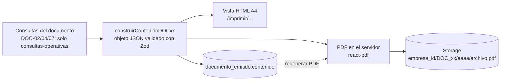

# 09 · Documentos imprimibles

> **Propósito:** definir cada documento que el sistema imprime o entrega en PDF: para qué sirve, quién lo puede sacar, de dónde salen sus datos, qué contiene y en qué orden, cómo se numera y versiona, y cómo se garantiza que los documentos sin precios nunca lleven precios. Cubre R5, R7, R10, R11 y R12.

## Contenido

1. [Principios](#1-principios)
2. [Catálogo de documentos](#2-catálogo-de-documentos)
3. [Permisos y visibilidad](#3-permisos-y-visibilidad)
4. [Emisión, versiones y registro](#4-emisión-versiones-y-registro)
5. [Elementos comunes de diseño](#5-elementos-comunes-de-diseño)
6. [Detalle de cada documento](#6-detalle-de-cada-documento)
   - [DOC-01 Lista de compra](#doc-01-lista-de-compra)
   - [DOC-02 Lista de entrega (sin precios)](#doc-02-lista-de-entrega-sin-precios)
   - [DOC-03 Lista contable (remito valorizado)](#doc-03-lista-contable-remito-valorizado)
   - [DOC-04 Hoja de ruta de reparto](#doc-04-hoja-de-ruta-de-reparto)
   - [DOC-05 Estado de cuenta de proveedor](#doc-05-estado-de-cuenta-de-proveedor)
   - [DOC-06 Lista general de precios de compra](#doc-06-lista-general-de-precios-de-compra)
   - [DOC-07 Hoja de preparación por cliente (sin precios)](#doc-07-hoja-de-preparación-por-cliente-sin-precios)
   - [DOC-08 Comprobante interno de venta](#doc-08-comprobante-interno-de-venta)
7. [Implementación técnica](#7-implementación-técnica)
8. [Casos de prueba de documentos](#8-casos-de-prueba-de-documentos)
9. [Documentos de fases posteriores (PROPUESTO)](#9-documentos-de-fases-posteriores-propuesto)

Documentos relacionados: `01-tipo-de-aplicacion-y-arquitectura.md` (vistas de impresión y PDF en el servidor, Storage), `02-usuarios-roles-y-permisos.md` (permisos `documentos.*`, ocultamiento de precios), `03-modelo-de-datos.md` (`documento_emitido`, vistas `v_op_*`, snapshots), `04-procesos-y-flujos.md` (cuándo se emite cada documento), `06-creditos-y-pagos.md` §11 (contenido de DOC-05), `08-pantallas-y-acciones.md` (desde qué pantalla se imprime cada uno).

Los ejemplos usan el escenario de `04-procesos-y-flujos.md` §2 (jornada del jueves 24/09/2026). Números de entrega del ejemplo: ENT-000411 Hospital San Martín, ENT-000412 Restaurante La Esquina, ENT-000413 Verdulería Don Pepe; reparto REP-000088. Direcciones y teléfonos son ficticios.

---

## 1. Principios

| # | Principio | Consecuencia |
|---|---|---|
| 1 | **Un documento, dos salidas idénticas** | Cada documento tiene una vista HTML para imprimir en el momento (botón **Imprimir**, CSS `@media print`, A4) y un PDF generado en el servidor para archivar, descargar o compartir. Ambas se dibujan a partir del **mismo contenido** (§7.1), por eso muestran lo mismo (RNF-12). |
| 2 | **A4 vertical, legible en blanco y negro** | Ningún dato depende del color: estados, alertas y semáforos llevan texto. Letra mínima de 9 pt. |
| 3 | **Sin precios quiere decir sin precios en el servidor** | DOC-02, DOC-04 y DOC-07 se arman solo con las vistas operativas `v_op_*`; su contenido guardado no tiene ningún campo de precio, costo, margen ni deuda, y así lo verifica una prueba automática (RN-124; 02 §8). No alcanza con no dibujarlos. |
| 4 | **Lo emitido no cambia** | El contenido exacto de cada emisión se guarda en `documento_emitido.contenido` y el PDF en Storage con su huella SHA-256. Si algo cambia después, se emite una versión nueva; la anterior queda como `REEMPLAZADO` (03 §11.4). |
| 5 | **La misma entrega, la misma versión** | DOC-02 y DOC-03 se emiten siempre juntos, de la misma entrega y con el mismo número de versión (RN-120). |
| 6 | **Nada se borra** | Un documento emitido se anula (`ANULADO`, con motivo), nunca se elimina; el PDF se conserva. |
| 7 | **Lo imprime quien tiene permiso, y solo lo que puede ver** | Cada documento exige su permiso `documentos.*` (§3). Las columnas de costos o crédito de DOC-01 y DOC-06 aparecen solo si el usuario además puede verlas. |

---

## 2. Catálogo de documentos

| ID | Documento | Para qué sirve | Quién lo usa | Entidad | Desde qué pantalla | Fase |
|---|---|---|---|---|---|---|
| DOC-01 | Lista de compra | Llevar al mercado qué comprar, cuánto, a quién y (opcional) a qué precio; anotar lo comprado. | COMPRADOR, ADMIN | `lista_compra` | P-50 | MVP |
| DOC-02 | Lista de entrega (sin precios) | Acompañar la mercadería; el cliente firma lo que recibe. | PREPARADOR, REPARTIDOR, cliente | `entrega` | P-71, P-76, P-77, P-80 | MVP |
| DOC-03 | Lista contable (remito valorizado) | Informar al cliente y a contaduría qué se entregó, a qué precio y el total. | ADMINISTRATIVO, ADMIN, cliente (contaduría) | `entrega` | P-80, P-87 | MVP |
| DOC-04 | Hoja de ruta de reparto | Orden de las paradas con dirección, horario, contacto, instrucciones y bultos. | REPARTIDOR | `reparto` | P-76, P-77 | MVP |
| DOC-05 | Estado de cuenta de proveedor | Conciliar con el proveedor lo comprado, pagado y adeudado en un período. | ADMINISTRATIVO, ADMIN | `proveedor` | P-60, P-61 | MVP |
| DOC-06 | Lista general de precios de compra | Ver y actualizar en papel los precios de cada proveedor recorriendo el mercado. | COMPRADOR, ADMIN | `empresa` | P-25 | MVP |
| DOC-07 | Hoja de preparación por cliente (sin precios) | Armar la mercadería de cada cliente y anotar el peso real. | PREPARADOR | `jornada` | P-70 | MVP |
| DOC-08 | Comprobante interno de venta | Registrar la venta de una o varias entregas en un comprobante no fiscal (04 §5.g.2). | ADMINISTRATIVO, ADMIN, cliente | `factura` | P-86, P-87 | MVP |
| DOC-09 | Estado de cuenta de cliente | Ver §9. | ADMINISTRATIVO | `cliente` | — | PROPUESTO |
| DOC-10 | Recibo de cobro | Ver §9. | ADMINISTRATIVO, REPARTIDOR | `cobro_cliente` | — | PROPUESTO |

DOC-08 se agrega al catálogo del contrato de diseño (DOC-01 a DOC-07) porque `04-procesos-y-flujos.md` §5.g.2 y RN-140 piden un comprobante interno imprimible; el enum `tipo_documento` de `03-modelo-de-datos.md` ya preveía agregar `DOC_08` en adelante desde este documento.

Los **reportes** (P-90) también se pueden imprimir con la misma infraestructura, pero no son documentos: no se numeran ni se registran en `documento_emitido`.

---

## 3. Permisos y visibilidad

| Documento | Permiso para imprimir o descargar | Datos que incluye | Condiciones adicionales |
|---|---|---|---|
| DOC-01 | `documentos.imprimir_compra` | O; C (precio sugerido y costo) solo con `precios.ver_costos`; F (semáforo y disponible) solo con `proveedores.ver_credito` | Opción "imprimir sin precios" para cualquiera (RN-053). |
| DOC-02 | `documentos.imprimir_entrega` | Solo O | REPARTIDOR: solo entregas de sus repartos (RN-131). |
| DOC-03 | `documentos.imprimir_contable` | O, V | PREPARADOR y REPARTIDOR nunca (403 sin datos, 02 §8 capa 6). |
| DOC-04 | `documentos.imprimir_entrega` | Solo O | REPARTIDOR: solo sus repartos. |
| DOC-05 | `documentos.imprimir_cuenta` | F, C (importes de compras) | — |
| DOC-06 | `documentos.imprimir_compra` | O; C solo con `precios.ver_costos`; F solo con `proveedores.ver_credito` | Sin `precios.ver_costos` sale como "lista de productos por proveedor" (sin precios), útil para anotar. |
| DOC-07 | `documentos.imprimir_entrega` | Solo O | REPARTIDOR: solo entregas de sus repartos. |
| DOC-08 | `documentos.imprimir_contable` | O, V | — |

Documento × rol con los permisos por defecto (02 §5). **Sí** = lo imprime; **Sí\*** = lo imprime sin columnas de costos o crédito; **Propios** = solo de sus repartos; **Opc.** = si el ADMIN le agrega el permiso; **—** = no.

| Documento | ADMIN | VENDEDOR | COMPRADOR | PREPARADOR | REPARTIDOR | ADMINISTRATIVO |
|---|---|---|---|---|---|---|
| DOC-01 | Sí | — | Sí | — | — | Opc. |
| DOC-02 | Sí | Sí | — | Sí | Propios | Sí |
| DOC-03 | Sí | Opc. | — | Nunca | Nunca | Sí |
| DOC-04 | Sí | Sí | — | Sí | Propios | Sí |
| DOC-05 | Sí | — | Opc. | Nunca | Nunca | Sí |
| DOC-06 | Sí | — | Sí | — | — | Opc. (Sí\* sin `proveedores.ver_credito`) |
| DOC-07 | Sí | Sí | — | Sí | Propios | Sí |
| DOC-08 | Sí | Opc. | — | Nunca | Nunca | Sí |

---

## 4. Emisión, versiones y registro

### 4.1 Qué se registra de cada documento

Cada impresión o descarga deja una fila en `documento_emitido` (03 §11.4) con el contenido impreso. Para las entidades que tienen versión propia, `version` es esa versión; para las demás es un **número correlativo de emisión** por entidad (1, 2, 3…), de modo que la restricción `unique (empresa_id, tipo, entidad_id, version) where evento = 'EMISION'` se cumple siempre.

| Documento | `entidad` | `version` | Nueva **EMISION** cuando… | **REIMPRESION** cuando… | PDF en Storage |
|---|---|---|---|---|---|
| DOC-01 | `lista_compra` | `lista_compra.version` | Se imprime por primera vez una versión de la lista. | Se vuelve a imprimir la misma versión. | Al descargar o compartir. |
| DOC-02 | `entrega` | `entrega.version` | Se emiten los documentos de la entrega (junto con DOC-03). | Se vuelve a imprimir la versión vigente. | Siempre (al emitir). |
| DOC-03 | `entrega` | `entrega.version` | Ídem DOC-02, en la misma transacción. | Ídem. | Siempre (al emitir). |
| DOC-04 | `reparto` | Correlativo | Se imprime por primera vez o cambió el reparto (paradas, orden, repartidor o vehículo) desde la última emisión. | Sin cambios desde la última emisión. | Al descargar o compartir. |
| DOC-05 | `proveedor` | Correlativo | Cada generación (el período y los filtros quedan en `contenido`). | — | Siempre. |
| DOC-06 | `empresa` | Correlativo | Cada generación (filtros y agrupación en `contenido`). | — | Al descargar o compartir. |
| DOC-07 | `jornada` | Correlativo | Cada generación (entregas incluidas y vista por cliente o por producto en `contenido`). | — | Al descargar o compartir. |
| DOC-08 | `factura` | 1 (un comprobante no se versiona: se anula y se emite otro) | Al emitir el comprobante. | Cada nueva impresión. | Siempre. |

La impresión HTML registra la fila con su `contenido` y sin `pdf_path`; si luego se descarga el PDF de esa misma emisión, se genera desde ese `contenido` y se completan `pdf_path` y `pdf_sha256`. Las reimpresiones de DOC-02, DOC-03, DOC-07 y DOC-08 se auditan (02 §4.6).

### 4.2 Emisión de los documentos de una entrega (DOC-02 y DOC-03)

`entrega.version` vale 0 mientras no hay documentos (03 §11.2). La primera emisión la lleva a 1; **cada** cambio posterior a una emisión (corrección de preparación, sustitución, pedido tardío, diferencias al entregar, override de precio, corrección administrativa) incrementa la versión y reemite los dos documentos en la misma transacción que el cambio (RN-128).

```text
función emitirDocumentosEntrega(entrega, usuario, confirma_margen_negativo = false):
    requiere entrega.estado ∈ {PREPARADA, EN_REPARTO, ENTREGADA}
    requiere jornada(entrega).estado ≠ CERRADA                       // RN-041
    requiere entrega.estado_facturacion = SIN_FACTURAR                // RN-138
    requiere permiso entregas.emitir_documentos,
             o que la emisión la dispare "Marcar PREPARADA" con empresa.emitir_documentos_al_preparar

    si entrega.version > 0 y existe documento_emitido(DOC_02, entrega, entrega.version, EMISION):
        devolver REIMPRESION                                           // RN-133: no se emite de nuevo

    si entrega.version = 0: entrega.version = 1

    para cada línea sin precio congelado:                             // 05 §7, RN-089
        congelar costo, origen_costo, recargo, origen_regla, regla_precio_id, precio_unitario, alicuota_iva
        (si la línea del pedido tiene precio_manual: se usa, es_override = true)
    si alguna línea queda sin precio: BLOQUEAR con PRECIO_SIN_COSTO   // RN-087
    si alguna línea tiene MARGEN_NEGATIVO y no confirma_margen_negativo:
        devolver PEDIR_CONFIRMACION                                    // RN-086
    si entrega.precios_congelados_en es null: entrega.precios_congelados_en = ahora
    recalcular importes de líneas y totales; guardar snapshots de cliente y dirección

    c02 = construirContenidoDOC02(entrega)       // solo v_op_entrega y v_op_entrega_item
    c03 = construirContenidoDOC03(entrega)       // entrega_item con precios congelados
    pdf02 = renderizarPDF(c02) ; pdf03 = renderizarPDF(c03)
    subir ambos PDFs a Storage y calcular su SHA-256
    insertar documento_emitido(DOC_02, version, EMISION, VIGENTE, c02, pdf02)
    insertar documento_emitido(DOC_03, version, EMISION, VIGENTE, c03, pdf03)
    marcar REEMPLAZADO los DOC_02 y DOC_03 VIGENTE de versiones anteriores
    auditar EMISION_DOCUMENTO

    devolver DOC-02 al usuario; DOC-03 solo si tiene documentos.imprimir_contable

función registrarCambioEntrega(entrega, cambio, usuario):          // llamada por las acciones que modifican
    aplicar el cambio (cantidades, líneas, override…)
    si entrega.version > 0:                                         // ya había documentos
        entrega.version += 1
        emitirDocumentosEntrega(entrega, usuario)                   // misma transacción
```

Todo corre en el servidor con el rol normal de la aplicación, también cuando lo dispara un PREPARADOR o un REPARTIDOR: el PDF de DOC-03 se guarda, pero a ellos se les devuelve solo DOC-02 (02 §8 capa 2; 03 §17.12).

### 4.3 Ejemplo de versiones

| Hora | Hecho | `entrega.version` | Documentos |
|---|---|---|---|
| 24/09 07:40 | Marta marca PREPARADA la entrega de la verdulería (ENT-000413). | 0 → 1 | DOC-02 v1 y DOC-03 v1 `VIGENTE` (total $227.410). |
| 24/09 08:10 | Carlos reimprime la lista de entrega. | 1 | Fila `REIMPRESION` de DOC-02 v1. |
| 24/09 08:25 | Carlos confirma con diferencias: tomate 50 de 54 kg, `RECHAZO_CALIDAD`. | 1 → 2 | DOC-02 v2 y DOC-03 v2 `VIGENTE` (total $222.770); los de v1 pasan a `REEMPLAZADO`. |
| 24/09 08:30 | Comprobante automático (cliente `POR_ENTREGA`). | 2 | DOC-08 FAC-000512 sobre ENT-000413 v2. |

---

## 5. Elementos comunes de diseño

### 5.1 Encabezado y pie

```text
┌───────────────────────────────────────────────────────────────────────────┐
│ [LOGO]  DISTRIBUIDORA EJEMPLO                 LISTA DE ENTREGA            │
│         CUIT 30-00000000-0 · Resp. Inscripto  N° ENT-000412 · versión 1   │
│         Mercado Central, Nave 2 · 11 5555-0000 Entrega: jueves 24/09/2026 │
├───────────────────────────────────────────────────────────────────────────┤
│                               (cuerpo)                                    │
├───────────────────────────────────────────────────────────────────────────┤
│ Emitido 24/09/2026 07:40 por Marta · Huella 3F9A21C0 · Página 1 de 1      │
│ Documento sin valores.                                                    │
└───────────────────────────────────────────────────────────────────────────┘
```

| Elemento | Contenido |
|---|---|
| Encabezado izquierdo | Logo, `empresa.nombre`, identificación y condición fiscal, dirección y teléfono (si están cargados). |
| Encabezado derecho | Nombre del documento en mayúsculas, número visible y versión, fecha principal (jornada, período o fecha de emisión). |
| Pie | Fecha y hora de emisión (zona de la empresa), usuario, primeros 8 caracteres de la huella SHA-256 (solo en PDF), página X de Y, leyendas del documento. |
| Marca de agua | `REEMPLAZADO — ver versión N` al reimprimir una versión vieja; `ANULADO` en documentos anulados; `VISTA PREVIA` cuando se imprime algo que todavía no se emitió (p. ej. una entrega en preparación). |

### 5.2 Formatos

| Dato | Formato | Ejemplo |
|---|---|---|
| Montos | Símbolo de la empresa, separador de miles ".", 2 decimales "," | $114.400,00 |
| Precios unitarios | 2 decimales al mostrar (se guardan con 4) | $1.156,67 |
| Cantidades | Unidad base; hasta 3 decimales solo si hay fracción; enteros para unidades | 36,4 kg · 20 u |
| Cantidad pedida en presentación | Unidad base y, entre paréntesis, la presentación | 75 kg (3 bolsas 25 kg) |
| Fechas y horas | dd/mm/aaaa, 24 h | 24/09/2026 07:40 |
| Estados | Texto traducido, nunca solo color | Pendiente · Parcial · Comprado |

### 5.3 Reglas de impresión (vista HTML)

- `@page { size: A4 portrait; margin: 12mm; }`; letra sans-serif del sistema, 10,5 pt; números con cifras tabulares y alineados a la derecha.
- El encabezado de las tablas se repite en cada página (`thead { display: table-header-group }`); una fila no se parte entre páginas (`break-inside: avoid`); en DOC-02, DOC-03, DOC-07 y DOC-08 cada entrega o cliente empieza en una página nueva cuando se imprimen varios juntos.
- Casillas para anotar a mano (☐, líneas `______`) con alto mínimo de 7 mm.
- La vista de impresión no carga el menú ni scripts de la aplicación; el botón **Imprimir** llama a `window.print()`.
- Numeración de páginas: exacta en el PDF; en la vista HTML se usa el pie del navegador.

---

## 6. Detalle de cada documento

### DOC-01 Lista de compra

| Campo | Definición |
|---|---|
| Cuándo | Después de generar o regenerar la lista (04 §5.c, paso 9); se reimprime a demanda. |
| Fuente | `lista_compra`, `lista_compra_item`, `proveedor` (nombre y `ubicacion_mercado`), `producto`, `presentacion`; `v_saldo_proveedor` solo con `proveedores.ver_credito`. |
| Agrupación | Por proveedor sugerido (plan de compra), en el orden de `ubicacion_mercado`; dentro, por orden de categoría y nombre. Al final, "Sin proveedor" (alerta `SIN_PROVEEDOR`). Variantes: **por producto** y **solo líneas de un comprador** (`comprador_asignado_id`). |
| Filtro por defecto | Líneas `PENDIENTE` y `PARCIAL`; opción "incluir compradas". |

**Contenido**

1. Encabezado: "LISTA DE COMPRA", `LC-` número y versión, jornada, fecha y hora de generación y quién la generó, comprador (si se filtró). Si la lista está desactualizada al imprimir: franja "DESACTUALIZADA: los pedidos cambiaron después de esta versión" (RN-052).
2. Por cada proveedor: nombre, ubicación en el mercado, teléfono; con `proveedores.ver_credito`: semáforo actual, disponible hoy → después de este plan.
3. Líneas: casilla ☐ · producto (y observaciones de los pedidos: "2 clientes piden bien maduro") · a comprar (cantidad de presentaciones y presentación) · equivalente en unidad base · necesidad · ya comprado · sobrante previsto · alertas en texto · con `precios.ver_costos`: precio sugerido y costo estimado · columnas vacías **Precio pagado** y **Comprado** para anotar.
4. Subtotal por proveedor y total general (solo con `precios.ver_costos`).
5. Pie: "Lo comprado se registra en el sistema desde el celular. Si no hay señal, anotá acá y cargalo al volver." (RT-01).

**Ejemplo** (versión 1, con precios; datos de 04 §5.c.3):

```text
LISTA DE COMPRA                         LC-000024 · versión 1 · Jornada jueves 24/09/2026
Generada 23/09/2026 20:00 por Juan

A · HNOS. GARCÍA — Puesto 14 · 11 5555-0101     VERDE 3,0 % → 51,6 % · disp. $485.000 → $242.000
 ☐ Producto         Comprar            Base    Necesidad  Ya compr.  Sobra  Precio sug.  Costo est.  Pagado  Compr.
 ☐ Tomate redondo   15 cajón 18 kg     270 kg  270 kg     0 kg       0 kg   $16.200      $243.000    ______  ______
                                                                                    Subtotal $243.000

B · LA QUINTA — Puesto 32 · 11 5555-0102        VERDE 37,5 % → AMARILLO 72,7 % · disp. $250.000 → $109.200
 ☐ Lechuga criolla  9 jaula 12 u       108 u   98 u       0 u        10 u   $9.600       $86.400     ______  ______
 ☐ Cebolla          4 bolsa 20 kg      80 kg   73 kg      0 kg       7 kg   $13.600      $54.400     ______  ______
                                                                                    Subtotal $140.800

C · PAPAS DEL SUR — Nave 3                      Sin límite
 ☐ Papa             11 bolsa 25 kg     275 kg  265 kg     0 kg       10 kg  $12.500      $137.500    ______  ______

E · MAYORISTA NORTE — Nave 1                    VERDE 13,3 % → 55,0 % · disp. $260.000 → $135.000
 ☐ Banana           5 caja 20 kg       100 kg  100 kg     0 kg       0 kg   $25.000      $125.000    ______  ______
   ⚠ Crédito insuficiente con D · Frutas Tropicales (disp. $90.000): pagando contado a D ahorrás $5.000.

                                                                              TOTAL ESTIMADO $646.300
```

(Semáforo actual de E: $40.000 / $300.000 = 13,3 %.)

### DOC-02 Lista de entrega (sin precios)

| Campo | Definición |
|---|---|
| Cuándo | Al emitir los documentos de la entrega (§4.2), normalmente al marcarla `PREPARADA`; se reemite con cada versión nueva. |
| Fuente | **Solo** `v_op_entrega` y `v_op_entrega_item` (03 §17.12). |
| Copias | Se recomienda imprimir dos: **ORIGINAL — CLIENTE** y **DUPLICADO — EMPRESA** (vuelve firmado). La vista de impresión ofrece "2 copias" y agrega el rótulo a cada una. |

**Contenido**

1. Encabezado: "LISTA DE ENTREGA", número de entrega (`ENT-`) y versión, fecha de entrega (jornada). Si la versión es mayor a 1: "Versión N — reemplaza a la versión N−1".
2. Datos de entrega: cliente y punto de entrega (snapshot), dirección, franja de recepción, contacto y teléfono, referencia del cliente (orden de compra), pedidos incluidos (`PED-`), reparto y número de parada, bultos, instrucciones de entrega y observaciones del pedido.
3. Líneas: número · producto (con "en reemplazo de …" si es sustitución) · cantidad preparada en unidad base y presentación pedida entre paréntesis · observación de la línea · columna vacía **Recibido** para que el cliente anote si recibe otra cantidad.
4. Totales: cantidad de líneas y bultos. **Ningún importe.**
5. Recepción: recuadros para nombre, cargo, firma, hora y observaciones de quien recibe.
6. Pie: "Documento sin valores. La valorización figura en la lista contable de la misma entrega y versión."

Si la entrega ya está confirmada al imprimir (versión posterior a la entrega), la columna de cantidad muestra la **cantidad entregada** y se agrega "Recibido por: Pepe (dueño), 24/09/2026 08:25".

**Ejemplo** (restaurante, versión 1):

```text
LISTA DE ENTREGA                                  N° ENT-000412 · versión 1
                                                  Entrega: jueves 24/09/2026
Cliente: Restaurante La Esquina                   Recepción: 09:00 a 11:00
Punto de entrega: Local (puerta de servicio)      Reparto REP-000088 · parada 3
Dirección: Av. Corrientes 3400, CABA              Bultos: 8
Contacto: Sergio (cocina) · 11 5555-0301          Pedido: PED-000246
Instrucciones: ingresar por la puerta de servicio, sobre calle lateral.

 #  Producto            Cantidad          Recibido    Observaciones
 1  Tomate redondo      36 kg             ________
 2  Papa                50 kg             ________
 3  Lechuga criolla     20 u              ________
 4  Cebolla             15 kg             ________
                                           Líneas: 4 · Bultos: 8

Recibí conforme — Nombre: ______________  Cargo: __________  Firma: __________  Hora: ______
Observaciones: ______________________________________________________________________

Documento sin valores. La valorización figura en la lista contable ENT-000412 v1.
```

### DOC-03 Lista contable (remito valorizado)

| Campo | Definición |
|---|---|
| Cuándo | Siempre junto con DOC-02, misma entrega y versión (RN-120). El vigente de la última versión es el que se factura (04 §5.f.5). |
| Fuente | `entrega` (snapshots de cliente y dirección, importes) y `entrega_item` (cantidades y precios congelados). |
| Destino | Contaduría del cliente (impreso con la entrega o enviado a `cliente.email_contable` desde P-80) y archivo de la empresa. |

**Contenido**

1. Encabezado: "LISTA CONTABLE (REMITO VALORIZADO)", `ENT-` y versión, fecha de entrega; si la versión es mayor a 1: "Versión N — reemplaza a la versión N−1" y el motivo resumido ("diferencias en la entrega").
2. Cliente: nombre, razón social, identificación fiscal, punto de entrega y dirección (snapshots), referencia del cliente (orden de compra), pedidos incluidos.
3. Líneas: número · producto (con "en reemplazo de …") · cantidad · unidad · precio unitario · **total por producto**. Cantidad = `cantidad_entregada` si la entrega está confirmada; si no, `cantidad_preparada` (RN-129). Si la línea se pidió por presentación, se muestra también el equivalente ("36 kg = 2 cajones"). Con `empresa.precios_incluyen_iva = false` y alícuotas distintas de 0, se agrega la columna de alícuota.
4. Totales: subtotal neto, IVA discriminado por alícuota (si corresponde, 05 §5.7) y **total general** (`entrega.importe_total`).
5. Recepción (si ya está confirmada): recibió, cargo, fecha y hora.
6. Pie: "Documento no válido como factura." (RN-140) y "Los precios de este documento quedaron fijados el 24/09/2026 07:40 y no cambian aunque cambien las listas de precios." (RN-089).

No incluye costos, recargos, márgenes ni el origen de la regla: son datos internos.

**Ejemplo** (restaurante, versión 1; precios de 04 §5.f.2):

```text
LISTA CONTABLE (REMITO VALORIZADO)                N° ENT-000412 · versión 1
                                                  Entrega: jueves 24/09/2026
Cliente: Restaurante La Esquina — La Esquina Gastronomía S.A. — CUIT 30-00000000-1
Punto de entrega: Local (puerta de servicio) · Av. Corrientes 3400, CABA · Pedido PED-000246

 #  Producto            Cantidad   Unidad   Precio unitario        Total
 1  Tomate redondo        36       kg             $1.250,00    $45.000,00
 2  Papa                  50       kg               $680,00    $34.000,00
 3  Lechuga criolla       20       u              $1.080,00    $21.600,00
 4  Cebolla               15       kg               $920,00    $13.800,00
                                               Subtotal neto  $114.400,00
                                               IVA                  $0,00
                                               TOTAL          $114.400,00

Documento no válido como factura.
Precios fijados el 24/09/2026 07:40; no cambian aunque cambien las listas de precios.
```

### DOC-04 Hoja de ruta de reparto

| Campo | Definición |
|---|---|
| Cuándo | Al armar el reparto (P-76) o antes de salir (P-77). |
| Fuente | **Solo** `v_op_reparto` y `v_op_entrega` (sin precios; los datos de contacto y horario se leen del punto de entrega vigente, 03 §18). |

**Contenido**

1. Encabezado: "HOJA DE RUTA", `REP-` número, jornada, repartidor, vehículo, salida prevista, cantidad de paradas y bultos totales.
2. Paradas en orden: orden · cliente y punto de entrega · dirección y localidad (con referencias) · franja de recepción · contacto y teléfono · bultos · número de entrega y versión · instrucciones de entrega · columnas vacías **Llegada** y **Recibió**.
3. Opcional (PDF): código QR por parada que abre el mapa con la ubicación.
4. Pie: "Documento sin valores." y "Devolver al finalizar el reparto con los duplicados firmados."

**Ejemplo** (orden y horarios de 04 §5.f.1):

```text
HOJA DE RUTA                                                   N° REP-000088
Jornada: jueves 24/09/2026 · Repartidor: Carlos · Vehículo: camioneta AB123CD
Salida prevista: 07:00 · Paradas: 3 · Bultos: 42

 Ord  Cliente / punto               Dirección                    Recepción    Contacto              Bultos  Entrega        Llegada  Recibió
 1    Hospital San Martín           Av. San Martín 1500, CABA    06:30–08:00  Graciela (cocina)       22    ENT-000411 v1  ______   ________
      Cocina central                ↳ Puerta de proveedores, calle lateral, andén 2 · 11 5555-0201
 2    Verdulería Don Pepe           Av. Rivadavia 2250, CABA     07:00–10:00  Pepe                    12    ENT-000413 v1  ______   ________
      Local                         ↳ 11 5555-0401
 3    Restaurante La Esquina        Av. Corrientes 3400, CABA    09:00–11:00  Sergio (cocina)          8    ENT-000412 v1  ______   ________
      Local (puerta de servicio)    ↳ Ingresar por la puerta de servicio · 11 5555-0301

Documento sin valores. Devolver al finalizar el reparto con los duplicados firmados.
```

### DOC-05 Estado de cuenta de proveedor

| Campo | Definición |
|---|---|
| Cuándo | A demanda, para un período (por defecto, el mes en curso). |
| Fuente | `movimiento_cuenta_proveedor` (saldo inicial y movimientos), `v_compra_estado_pago`, `pago_proveedor` e `imputacion_pago_proveedor`, `v_saldo_proveedor`. |
| Contenido | Las cinco secciones de `06-creditos-y-pagos.md` §11. Se reconstruye siempre desde el libro: emitirlo dos veces para el mismo período da el mismo resultado. |

**Contenido**

1. Encabezado: "ESTADO DE CUENTA", proveedor (razón social e identificación fiscal), período, fecha de emisión y usuario.
2. Resumen: saldo al inicio del período, total comprado, total pagado, ajustes, saldo al cierre (pendiente o **a favor**), límite, disponible, semáforo en texto, deuda vencida.
3. Movimientos del período en orden cronológico: fecha · tipo · comprobante · detalle · **Debe** (cargos) · **Haber** (pagos y créditos) · saldo acumulado. Los movimientos anulados se muestran con su compensación.
4. Compras con saldo pendiente al cierre: número, fecha, total, pagado, pendiente, vencimiento, días de atraso.
5. Pagos del período con su imputación.
6. Pie: "Saldo según nuestros registros al 16/09/2026. Por favor, informe cualquier diferencia."

**Ejemplo** (datos de 06 §12):

```text
ESTADO DE CUENTA — A · HNOS. GARCÍA                           Período 01/09/2026 al 16/09/2026
Emitido 16/09/2026 18:00 por Laura

RESUMEN
Saldo al 31/08 $0,00 · Comprado $885.000,00 · Pagado $870.000,00 · Ajustes $0,00
Saldo al 16/09 $15.000,00 (pendiente) · Límite $500.000,00 · Disponible $485.000,00 · VERDE 3,0 % · Vencido $0,00

MOVIMIENTOS
 Fecha  Tipo              Comprobante  Detalle                                 Debe         Haber         Saldo
 01/09  Compra            COM-000101   Contado                            $120.000,00                $120.000,00
 01/09  Pago              PAG-000029   Pago en el acto COM-000101                      $120.000,00         $0,00
 01/09  Compra            COM-000102   Crédito, vence 08/09               $180.000,00                $180.000,00
 02/09  Compra            COM-000110   Mixta, vence 09/09                 $150.000,00                $330.000,00
 02/09  Pago              PAG-000030   Efectivo, en el acto COM-000110                  $50.000,00   $280.000,00
 03/09  Compra            COM-000118   Crédito, vence 10/09               $110.000,00                $390.000,00
 04/09  Pago              PAG-000031   Transferencia                                   $200.000,00   $190.000,00
 05/09  Compra            COM-000125   Crédito, vence 12/09               $280.000,00                $470.000,00
 06/09  Compra            COM-000130   Crédito (excedió límite, autorizada) $60.000,00                $530.000,00
 07/09  Anulación compra  COM-000130   No entregó la mercadería                         $60.000,00   $470.000,00
 09/09  Pago              PAG-000035   Efectivo                                        $300.000,00   $170.000,00
 15/09  Pago              PAG-000040   Transferencia                                   $200.000,00   −$30.000,00 (a favor)
 16/09  Compra            COM-000140   Crédito, vence 23/09                $45.000,00                 $15.000,00
                                                                   Totales $945.000,00 $930.000,00

COMPRAS CON SALDO PENDIENTE AL 16/09
 COM-000140  16/09  Total $45.000,00  Pagado $30.000,00  Pendiente $15.000,00  Vence 23/09  Atraso —

PAGOS DEL PERÍODO E IMPUTACIÓN
 PAG-000029  01/09  $120.000,00  → COM-000101 $120.000,00
 PAG-000030  02/09   $50.000,00  → COM-000110 $50.000,00
 PAG-000031  04/09  $200.000,00  → COM-000102 $180.000,00 · COM-000110 $20.000,00
 PAG-000035  09/09  $300.000,00  → COM-000110 $80.000,00 · COM-000118 $110.000,00 · COM-000125 $110.000,00
 PAG-000040  15/09  $200.000,00  → COM-000125 $170.000,00 · COM-000140 $30.000,00

Saldo según nuestros registros al 16/09/2026. Por favor, informe cualquier diferencia.
```

(Comprado del resumen = compras `REGISTRADA` del período; la anulada se ve en los movimientos con su compensación. Debe − Haber = $15.000 = saldo al cierre.)

### DOC-06 Lista general de precios de compra

| Campo | Definición |
|---|---|
| Cuándo | A demanda desde P-25, normalmente la noche anterior para recorrer el mercado. |
| Fuente | `v_oferta_vigente` (y `v_saldo_proveedor` con `proveedores.ver_credito`). |
| Agrupación | **Por proveedor** (por defecto, en el orden de `ubicacion_mercado`, 05 §2.1) o **por producto** (comparativa, mejor oferta marcada). Respeta los filtros de P-25. |

**Contenido**

1. Encabezado: "LISTA GENERAL DE PRECIOS DE COMPRA", fecha y hora, agrupación y filtros aplicados.
2. Por proveedor: nombre, ubicación, teléfono, (semáforo y disponible con `proveedores.ver_credito`).
3. Líneas: producto · presentación · precio vigente · costo por unidad base · diferencia contra el mejor precio del producto · última actualización ("19/09 · hace 4 días") · marca **DESACTUALIZADO** · ☐ **Disponible** · columna vacía **Precio nuevo**.
4. Sin `precios.ver_costos`: mismas filas sin precio, costo ni diferencia (lista de productos por proveedor para anotar).

**Ejemplo** (por proveedor, 23/09; datos de 05 §2.1):

```text
LISTA GENERAL DE PRECIOS DE COMPRA — por proveedor                 23/09/2026 20:10

A · HNOS. GARCÍA — Puesto 14 · 11 5555-0101
 Producto         Presentación    Precio     $/u. base   vs. mejor  Actualizado                 Disp.  Precio nuevo
 Tomate redondo   Cajón 18 kg     $16.200    $900,00/kg  mejor      23/09 · hoy                  ☐     __________
 Papa             Bolsa 25 kg     $13.000    $520,00/kg  +4,00 %    12/09 · hace 11 días DESACT. ☐     __________
 Cebolla          Cajón 18 kg     $12.600    $700,00/kg  +2,94 %    22/09 · hace 1 día           ☐     __________

B · LA QUINTA — Puesto 32 · 11 5555-0102
 Tomate redondo   Cajón 18 kg     $17.100    $950,00/kg  +5,56 %    19/09 · hace 4 días          ☐     __________
 Lechuga criolla  Jaula 12 u      $9.600     $800,00/u   mejor      22/09 · hace 1 día           ☐     __________
 Cebolla          Bolsa 20 kg     $13.600    $680,00/kg  mejor      22/09 · hace 1 día           ☐     __________
```

### DOC-07 Hoja de preparación por cliente (sin precios)

| Campo | Definición |
|---|---|
| Cuándo | Al iniciar la preparación o en cualquier momento de la jornada `PREPARANDO` (P-70). |
| Fuente | **Solo** `v_op_hoja_preparacion` (03 §17.12). |
| Variantes | **Por cliente** (una hoja por entrega, en el orden del reparto) y **por producto** (una hoja por producto con el reparto entre clientes, útil para pesar a granel y para faltantes). |

**Contenido (por cliente)**

1. Encabezado: "HOJA DE PREPARACIÓN", jornada, cliente y punto de entrega, número de entrega, reparto y parada, franja de recepción.
2. Observaciones de la entrega destacadas en un recuadro ("Dejar en cámara de frío").
3. Líneas en el orden de categorías (recorrido del depósito): ☐ · producto · pedido (unidad base y presentación) · **a preparar** (propuesta del sistema; distinta de lo pedido si hubo reparto de faltantes) · columna vacía **Preparado** (peso real o unidades) · observaciones de la línea · sustituciones ya registradas.
4. Pie: recuadros para **Bultos**, **Preparó**, **Hora**; "Documento sin valores."

**Contenido (por producto):** producto, disponible (comprado en la jornada), necesidad total y, por cliente en orden de prioridad: pedido, a preparar y columna vacía **Preparado**.

**Ejemplo** (por cliente, hospital):

```text
HOJA DE PREPARACIÓN                                   Jornada jueves 24/09/2026 · emisión 1
Hospital San Martín — Cocina central                  ENT-000411 · Reparto REP-000088, parada 1
Recepción 06:30 a 08:00
┌───────────────────────────────────────────────┐
│ Dejar en cámara de frío. Pedido con OC 8812.  │
└───────────────────────────────────────────────┘
 ☐ Producto          Pedido                   A preparar   Preparado     Observaciones
 ☐ Tomate redondo    180 kg (10 cajón 18 kg)  180 kg       ___________   bien firme
 ☐ Papa              140 kg                   140 kg       ___________
 ☐ Cebolla           40 kg                    40 kg        ___________
 ☐ Lechuga criolla   48 u                     48 u         ___________   sin raíz
 ☐ Banana            60 kg                    60 kg        ___________

Bultos: ______   Preparó: ______________   Hora: ______
Documento sin valores.
```

**Ejemplo** (por producto, variante con faltante de 04 §5.e.1: se consiguieron 84 lechugas para 98 pedidas):

```text
HOJA DE PREPARACIÓN POR PRODUCTO — Lechuga criolla          Jornada jueves 24/09/2026
Disponible: 84 u · Necesidad: 98 u · Faltante: 14 u (reparto por prioridad)
 Prior.  Cliente                   Pedido   A preparar   Preparado
 1       Hospital San Martín       48 u     48 u         ________
 2       Verdulería Don Pepe       30 u     22 u         ________
 2       Restaurante La Esquina    20 u     14 u         ________
```

### DOC-08 Comprobante interno de venta

| Campo | Definición |
|---|---|
| Cuándo | Al emitir un comprobante (`factura` `EMITIDA`): automático al confirmar la entrega para clientes `POR_ENTREGA` si la empresa lo configura (RN-143), o desde "Facturar período" (P-86). |
| Fuente | `factura` (snapshots del cliente, importes), `factura_entrega` (entregas y versión facturada) y, para el detalle opcional, `entrega_item` de esas versiones. |

**Contenido**

1. Encabezado: "COMPROBANTE INTERNO DE VENTA", `FAC-` número, fecha de emisión, período (si agrupa entregas de un período).
2. Cliente: nombre, razón social, identificación y condición fiscal, dirección fiscal (snapshots).
3. Entregas incluidas: fecha de entrega · número y versión · punto de entrega · referencia del cliente · total de la entrega.
4. Detalle por producto (opcional, por defecto sí para `POR_ENTREGA` y no para comprobantes de período): producto · cantidad · unidad · precio unitario · total.
5. Totales: neto, IVA por alícuota, **total** (= Σ totales de las entregas, RN-137).
6. Pie: leyenda destacada **"DOCUMENTO NO VÁLIDO COMO FACTURA"** (RN-140); "Los remitos valorizados de cada entrega respaldan este comprobante."
7. Anulado: marca de agua `ANULADO` y motivo.

**Ejemplo** (verdulería, cliente `POR_ENTREGA`; total de 04 §5.f.4):

```text
COMPROBANTE INTERNO DE VENTA                                     N° FAC-000512
                                                                 Fecha: 24/09/2026
Cliente: Verdulería Don Pepe — José Pérez — CUIT 20-00000000-2 — Monotributo
Dirección fiscal: Av. Rivadavia 2250, CABA

 Entrega          Fecha      Punto   Referencia        Total
 ENT-000413 v2    24/09/2026 Local   —           $222.770,00

                                       Neto     $222.770,00
                                       IVA            $0,00
                                       TOTAL    $222.770,00

DOCUMENTO NO VÁLIDO COMO FACTURA
Los remitos valorizados de cada entrega respaldan este comprobante.
```

---

## 7. Implementación técnica

### 7.1 Un contenido, dos dibujos



1. **Constructor de contenido** (`src/documentos/<doc>/contenido.ts`): una función del servidor por documento que consulta los datos y devuelve un objeto con todo lo que se imprime, ya formateado en lo que no depende del medio (textos de estado, equivalencias de presentación). Su esquema Zod es estricto: un campo no previsto hace fallar la emisión.
2. Los constructores de DOC-02, DOC-04 y DOC-07 solo pueden importar `consultas-operativas.ts` (regla de dependencias en la CI, 01 §8) y sus esquemas **no tienen** campos de precio.
3. **Dos dibujos del mismo contenido:** un componente React para la vista HTML (`app/imprimir/...`) y una plantilla `@react-pdf/renderer` para el PDF (`src/documentos/<doc>/pdf.tsx`). Comparten los componentes de formato (moneda, cantidades, fechas).
4. El contenido es lo que se guarda en `documento_emitido.contenido`; con él se puede **regenerar** un PDF idéntico si se pierde el archivo (01 §14).

### 7.2 Rutas

| Ruta | Qué hace | Controles |
|---|---|---|
| `/imprimir/lista-compra/[id]` | DOC-01 HTML | `documentos.imprimir_compra`; columnas C y F según permisos. |
| `/imprimir/entrega/[id]/sin-precios` | DOC-02 HTML de la versión vigente (o `?version=N`) | `documentos.imprimir_entrega`; REPARTIDOR: solo sus repartos (404 si no). |
| `/imprimir/entrega/[id]/contable` | DOC-03 HTML | `documentos.imprimir_contable`; si no, 403 sin datos. |
| `/imprimir/reparto/[id]` | DOC-04 HTML | `documentos.imprimir_entrega`; REPARTIDOR: solo sus repartos. |
| `/imprimir/proveedor/[id]/estado-cuenta?desde=&hasta=` | DOC-05 HTML | `documentos.imprimir_cuenta`. |
| `/imprimir/precios-compra?agrupar=&filtros` | DOC-06 HTML | `documentos.imprimir_compra`; columnas según permisos. |
| `/imprimir/preparacion/[fecha]?vista=cliente\|producto&entregas=` | DOC-07 HTML | `documentos.imprimir_entrega`. |
| `/imprimir/factura/[id]` | DOC-08 HTML | `documentos.imprimir_contable`. |
| `/api/documentos/[tipo]/[id]/pdf` | Devuelve el PDF: si ya existe la emisión, desde Storage; si no, lo genera, lo guarda y registra la emisión. | Mismos permisos que la vista; respuesta `no-store`; URL firmada de 5 minutos para descargar desde Storage. |

### 7.3 Compartir y enviar

- **Compartir** (celular): Web Share API con el archivo PDF (WhatsApp, correo, etc.). Si el navegador no lo permite, descarga el archivo.
- **Enviar por correo** (PC): a `cliente.email_contable` (DOC-03, DOC-08) o al correo del proveedor (DOC-05), con el PDF adjunto, desde el SMTP transaccional (01 §5). Se registra `documento_emitido.enviado_a`. El envío automático de DOC-03 al confirmar cada entrega queda **PROPUESTO** (decisión pendiente en `10-plan-de-implementacion.md`).
- Los enlaces a Storage nunca se comparten: vencen a los 5 minutos (01 §12).

### 7.4 Almacenamiento

- Ruta: `empresa_id/DOC_xx/aaaa/<numero_visible>.pdf`, por ejemplo `…/DOC_03/2026/ENT-000413-v2.pdf`, `…/DOC_05/2026/PROV-hnos-garcia-e3.pdf`.
- Bucket privado; políticas que verifican el prefijo `empresa_id/` (01 §11).
- Los PDFs emitidos no se borran nunca (la tarea de limpieza solo borra exportaciones temporales, 01 §6.4). Tamaño estimado: 30–80 KB por documento.

### 7.5 Rendimiento

- Vistas HTML: se sirven como Server Components sin JavaScript de la aplicación; una hoja de ruta de 40 paradas o una hoja de preparación de 30 clientes se dibuja en menos de 1 segundo.
- PDF: bajo demanda; para lotes grandes (hojas de preparación de toda la jornada) se genera un solo PDF con una página por entrega; si tarda más de 10 segundos, se ofrece la vista HTML (RT-07).

---

## 8. Casos de prueba de documentos

Se automatizan (integración y e2e) y son criterio de aceptación del MVP junto con los de 02 §12.

| # | Caso | Resultado esperado |
|---|---|---|
| 1 | Emitir los documentos de ENT-000412 del escenario. | DOC-02 y DOC-03 versión 1 en la misma transacción; total de DOC-03 $114.400,00; dos filas `EMISION` `VIGENTE`; `entrega.version` = 1; precios congelados. |
| 2 | Buscar en el `contenido` y en el texto del PDF de DOC-02, DOC-04 y DOC-07 las claves `precio`, `costo`, `importe`, `total` (como importe), `recargo`, `margen`, `saldo` y el símbolo de moneda seguido de un número. | Ninguna coincidencia (02 §8, capa 8). |
| 3 | PREPARADOR marca PREPARADA una entrega con emisión automática. | Recibe solo DOC-02; DOC-03 existe en Storage; la respuesta no contiene datos de DOC-03. |
| 4 | PREPARADOR abre `/imprimir/entrega/[id]/contable` o `/api/documentos/DOC_03/[id]/pdf`. | 403 sin datos. |
| 5 | REPARTIDOR abre la hoja de ruta de un reparto ajeno. | 404. |
| 6 | Confirmar ENT-000413 con 4 kg de tomate rechazados. | Versión 2; DOC-03 v2 total $222.770,00; los de versión 1 `REEMPLAZADO`; reimprimir la v1 muestra la marca de agua `REEMPLAZADO — ver versión 2`. |
| 7 | Reimprimir DOC-02 de una versión vigente. | Fila `REIMPRESION`, sin versión nueva (RN-133). |
| 8 | Emitir con una línea sin precio. | Bloqueo `PRECIO_SIN_COSTO`; no se crea ninguna fila ni PDF. |
| 9 | Emitir con una línea con margen negativo sin confirmar / confirmando. | Pide confirmación / emite y audita. |
| 10 | Intentar emitir o reimprimir documentos de una entrega `FACTURADA` para corregirla. | Bloqueo `DOCUMENTO_EMITIDO` (RN-138); la reimpresión de la versión vigente sí se permite. |
| 11 | Generar DOC-05 de Hnos. García del 01/09 al 16/09 dos veces. | Mismo contenido (salvo fecha de emisión); saldo al cierre $15.000,00; Debe − Haber = saldo. |
| 12 | Imprimir DOC-01 y DOC-06 con un usuario sin `precios.ver_costos`. | Sin columnas de precio ni costo; el `contenido` guardado tampoco las tiene. |
| 13 | Comparar el texto extraído del PDF con el de la vista HTML de cada documento del escenario. | Mismos datos (RNF-12). |
| 14 | Regenerar el PDF de una emisión a partir de `contenido` después de borrar el archivo en un entorno de prueba. | PDF con los mismos datos. |
| 15 | Emitir DOC-08 de un período de un cliente `MENSUAL`. | Total = Σ totales de la última versión de cada entrega; leyenda "Documento no válido como factura". |

---

## 9. Documentos de fases posteriores (PROPUESTO)

| ID | Documento | Fase | Contenido previsto |
|---|---|---|---|
| DOC-09 | Estado de cuenta de cliente | 2 (Cobranzas) | Espejo de DOC-05 para clientes: saldo inicial, comprobantes, cobros, ajustes, saldo, comprobantes pendientes con antigüedad (06 §13). |
| DOC-10 | Recibo de cobro | 2 (Cobranzas) | Número, fecha, cliente, monto, medio, referencia, comprobantes cancelados. Si lo emite el REPARTIDOR al cobrar en la entrega, solo muestra el total cobrado. |
| — | Comprobante fiscal electrónico | 3 | Lo emite el organismo o el proveedor autorizado (ARCA/AFIP o DGI/CFE) con su formato legal (QR, CAE o datos del CFE). DOC-08 queda como documento interno de respaldo. |
| — | Etiquetas de bultos | 3 | Etiqueta por bulto con cliente, entrega, parada y número de bulto ("3 de 22"), para impresoras térmicas (RT-08). |
