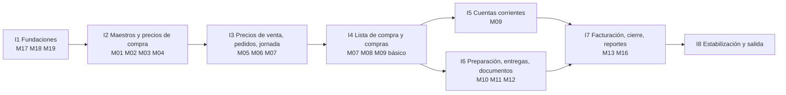
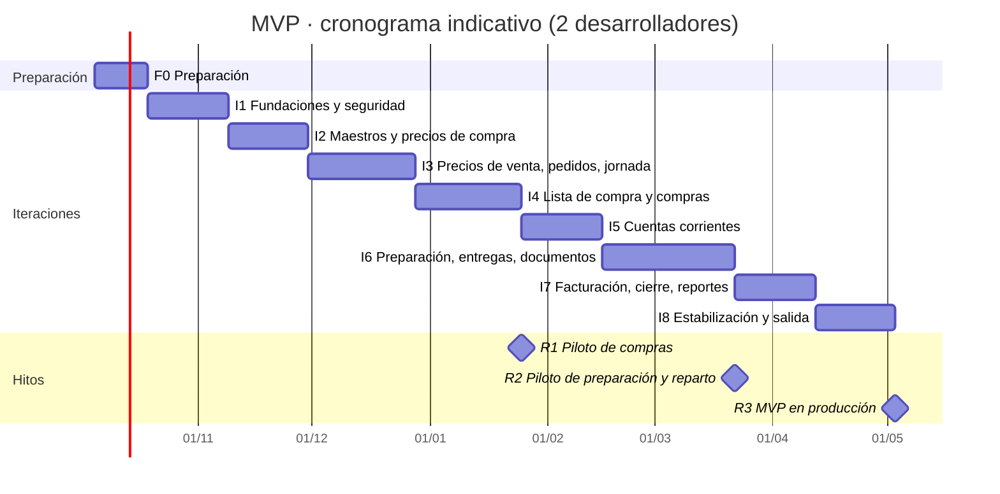

# 10 · Plan de implementación

> **Propósito:** ordenar la construcción del sistema en fases e iteraciones que entreguen algo usable lo antes posible, con criterios de aceptación verificables, una estrategia de pruebas, la puesta en marcha con datos reales y las decisiones que el dueño tiene que tomar antes de cada etapa. Cubre la parte de "fases" y "costos de desarrollo" de R16.

## Contenido

1. [Resumen](#1-resumen)
2. [Supuestos y equipo](#2-supuestos-y-equipo)
3. [Alcance por fase](#3-alcance-por-fase)
4. [Fase 0: preparación](#4-fase-0-preparación)
5. [Fase 1 (MVP): iteraciones](#5-fase-1-mvp-iteraciones)
6. [Cronograma](#6-cronograma)
7. [Estrategia de pruebas](#7-estrategia-de-pruebas)
8. [Migración de datos y puesta en marcha](#8-migración-de-datos-y-puesta-en-marcha)
9. [Fases posteriores (PROPUESTO)](#9-fases-posteriores-propuesto)
10. [Esfuerzo y costos de desarrollo](#10-esfuerzo-y-costos-de-desarrollo)
11. [Decisiones pendientes y cuándo se necesitan](#11-decisiones-pendientes-y-cuándo-se-necesitan)
12. [Riesgos del proyecto](#12-riesgos-del-proyecto)
13. [Después de la puesta en marcha](#13-después-de-la-puesta-en-marcha)

Documentos relacionados: `01-tipo-de-aplicacion-y-arquitectura.md` (módulos M01 a M19, entornos, costos de infraestructura, riesgos técnicos RT-xx), `02` a `07` (qué construir), `08-pantallas-y-acciones.md` (pantallas P-xx), `09-documentos-imprimibles.md` (DOC-xx), `PARAMETROS-DEL-PROYECTO.md` (decisiones fijas).

---

## 1. Resumen

| Tema | Plan |
|---|---|
| Estrategia | Construir el MVP en **8 iteraciones** de 3 a 5 semanas, en el orden del circuito del negocio, y ponerlo en uso **por partes**: primero pedidos, lista de compra y compras (hito R1), después preparación y reparto (R2), por último facturación y cierre (R3 = MVP completo). |
| Duración estimada del MVP | Unas **30 semanas** (≈ 7 meses) con 2 desarrolladores, incluida una fase 0 de 2 semanas. Con 1 desarrollador, 12 a 16 meses. |
| Esfuerzo estimado del MVP | **1.620 a 2.220 horas** de desarrollo (§10). |
| Primer uso real | Al final de la iteración 4 (≈ semana 16): pedidos, lista de compra y compras en el mercado, en paralelo con el papel. |
| Validación | Demo al dueño al final de cada iteración con el escenario de ejemplo del 24/09 (04 §2) y, desde R1, con datos reales. |
| Fases posteriores | Fase 2: offline en el mercado, stock y sobrantes, cuenta corriente de clientes y cobranzas, pedidos habituales. Fase 3: facturación fiscal electrónica, portal de clientes, WhatsApp, reportes avanzados. Todas PROPUESTO. |

---

## 2. Supuestos y equipo

**Supuestos**

1. El plan (documentos 01 a 10) está aprobado por el dueño y las decisiones que bloquean la fase 0 están tomadas (§11).
2. Stack y arquitectura de `01-tipo-de-aplicacion-y-arquitectura.md` sin cambios: Next.js + TypeScript, Supabase (PostgreSQL, Auth, Storage), Drizzle, Zod, Vercel.
3. Un solo cliente (una empresa) en producción; el sistema queda preparado para varias (RLS desde el día 1).
4. El dueño dedica unas **4 horas por semana** a revisar demos, contestar dudas y reunir los datos maestros.
5. Las estimaciones son de **orden de magnitud** (±25 %): se ajustan al terminar la fase 0 y después de cada iteración con la velocidad real.
6. Las semanas son hábiles: el calendario real agrega feriados y vacaciones.

**Equipo recomendado**

| Rol | Dedicación | Responsabilidades |
|---|---|---|
| Desarrollador 1 (senior, líder técnico) | Completa | Base de datos, migraciones, RLS y roles de base, capa de dominio, seguridad, revisiones de código, despliegues. |
| Desarrollador 2 (full-stack) | Completa | Pantallas, formularios, documentos imprimibles, pruebas de punta a punta. |
| Diseño de interfaz (UX) | Parcial (≈ 60 h en total, sobre todo fase 0 a iteración 3) | Bocetos de las pantallas operativas, pruebas de usabilidad en el mercado y en el depósito. |
| Dueño (referente de negocio) | ≈ 4 h por semana | Prioridades, validación de cada demo, datos maestros, decisiones pendientes, piloto. |
| Usuarios clave | Durante el piloto | Un comprador, un preparador y un repartidor que prueban las pantallas operativas en su trabajo real. |

No hay un rol de QA separado: las pruebas automáticas son parte de cada tarea (§7) y la aceptación funcional la da el dueño.

---

## 3. Alcance por fase

| Fase | Contenido | Módulos (01 §7) | Estado |
|---|---|---|---|
| 0 · Preparación | Decisiones, cuentas y entornos, repositorio, CI, relevamiento de datos, bocetos. | — | Pedido para arrancar |
| 1 · MVP | Todo lo pedido explícitamente: catálogo, clientes, proveedores, precios de compra y venta con márgenes, pedidos, jornada, lista de compra, compras, créditos y pagos con límite, preparación, repartos, entregas, documentos DOC-01 a DOC-08, comprobante interno, exportación al contador, cierre de jornada, reportes básicos, usuarios y permisos, auditoría. | M01 a M13, M16 a M19 | Pedido |
| 2 | Offline en el mercado, stock y sobrantes, cuenta corriente de clientes y cobranzas, pedidos habituales, autorización remota de excesos de límite, cobro en la entrega. | M14, M15 y mejoras | PROPUESTO |
| 3 | Facturación fiscal electrónica, portal de clientes, integración con WhatsApp, reportes avanzados, optimización de compra combinada, multi-empresa comercial, impresoras térmicas. | M13 fiscal y nuevos | PROPUESTO |

---

## 4. Fase 0: preparación

Duración: **2 semanas**. Esfuerzo: 60 a 100 h.

| # | Tarea | Resultado |
|---|---|---|
| 1 | Tomar las decisiones que bloquean el arranque (§11: D-01, D-02, D-08, D-10). | País, moneda, nombre, dominio, volumen del negocio y equipo definidos. |
| 2 | Crear cuentas y proyectos: GitHub (organización y repositorio), Vercel Pro, Supabase Pro (proyectos de staging y producción en São Paulo), dominio, correo transaccional, Sentry. | Accesos a nombre de la empresa del dueño (no de los desarrolladores). |
| 3 | Inicializar el repositorio con la estructura de 01 §9, Next.js, Tailwind, shadcn/ui, Drizzle, Vitest, Playwright; configuración de lint, formato y tipos estrictos. | Proyecto que compila y se publica en una URL de preview. |
| 4 | CI en GitHub Actions: tipos, lint, pruebas, migraciones contra una base efímera, reglas de dependencias entre módulos (dependency-cruiser), Lighthouse y axe. | Un Pull Request no se puede unir si falla algo. |
| 5 | Supabase local (Docker) y semillas vacías; convención de migraciones (una por cambio, revisadas). | Cualquier desarrollador levanta todo con un comando. |
| 6 | Relevamiento de datos maestros con el dueño: planillas modelo (§8.1) y fecha objetivo de carga. | Planillas entregadas; responsable de completarlas. |
| 7 | Bocetos navegables de las pantallas operativas (P-41, P-50, P-55, P-71, P-78) y prueba rápida con el comprador y un preparador. | Ajustes de diseño antes de programar. |
| 8 | Tablero del proyecto (tareas por iteración con referencia a P-xx, DOC-xx y RN-xxx) y definición de "terminado" (§7.4). | Plan de la iteración 1 listo. |

---

## 5. Fase 1 (MVP): iteraciones

Cada iteración termina con: código publicado en staging, pruebas automáticas en verde, demo al dueño con el escenario de ejemplo y lista de ajustes. Las reglas RN-xxx indicadas deben tener al menos una prueba automática cada una.

### I1 · Fundaciones y seguridad (3 semanas · 180 a 240 h)

| Entregables | Detalle |
|---|---|
| Datos | `empresa`, `usuario`, `rol`, `usuario_rol`, `secuencia`, `auditoria`; enums base; campos comunes y trigger de `actualizado_en`. |
| Seguridad | Supabase Auth (correo y nombre de usuario), sesión, middleware, `autorizar` y `auditar`, catálogo de permisos y roles de sistema (02 §4 y §5), plantilla de política RLS por tabla, rol de base sin `BYPASSRLS`, fijación de `app.empresa_id` por transacción (01 §11). |
| Dominio | `dinero` (decimal), fechas en la zona de la empresa (`hoyEnEmpresa`), numeración desde `secuencia`. |
| Pantallas | P-01, P-02 (estructura), P-03, P-95, P-96, P-97, P-98; menú y barra inferior según permisos (08 §2). |
| Operación | Entornos (local, preview, producción), Sentry, backups diarios, respaldo lógico semanal (01 §14), ventana de publicación. |
| Reglas | RN-144 a RN-152 (base). |

**Aceptación:** casos 10 a 14 de 02 §12; prueba con dos empresas en la que ningún listado muestra datos de la otra; la auditoría no se puede modificar ni borrar con el rol de la aplicación; invitación por correo y alta sin correo funcionando.

### I2 · Catálogo, clientes, proveedores y precios de compra (3 semanas · 200 a 260 h)

| Entregables | Detalle |
|---|---|
| Datos | `categoria`, `producto`, `presentacion`, `cliente`, `punto_entrega`, `proveedor`, `proveedor_producto`, `historial_precio_compra`; vistas `v_oferta_vigente`, `v_comparador_precios` (sin crédito todavía), `v_costo_referencia_producto` (parcial). |
| Dominio | `aUnidadBase`, `costoPorUnidadBase`. |
| Pantallas | P-10, P-11 (datos, presentaciones, proveedores y precios), P-12, P-15, P-16, P-20, P-21, P-25 a P-30. |
| Documentos | DOC-06. |
| Tareas programadas | `precios-desactualizados`. |
| Semillas | Escenario de 04 §2 completo (productos, clientes, proveedores, ofertas). |
| Reglas | RN-001 a RN-016, RN-067 a RN-075. |

**Aceptación:** la lista general con el escenario coincide con 05 §2.1 (incluida la marca de desactualizado de la papa de A); la comparación de la cebolla da el orden de 05 §3; una importación con filas erróneas aplica solo las válidas; actualizar 10 precios en el puesto lleva menos de 1 minuto (08 §8).

### I3 · Precios de venta, pedidos y jornada (4 semanas · 220 a 300 h)

| Entregables | Detalle |
|---|---|
| Datos | `regla_precio` (con restricciones de exclusión), `jornada`, `pedido`, `pedido_item`. |
| Dominio | `costoReferencia`, `resolverPrecioVenta` (= `calcularPrecioVenta` de 05 §5.8), `redondearPrecio`, `margenSobreVenta`, IVA, `transicionPermitida` (pedido y jornada). |
| Pantallas | P-11 (pestañas de precio de venta y clientes), P-32, P-33, P-34, P-40, P-41, P-42, P-45, P-46 (bloque de pedidos). |
| Reglas | RN-017 a RN-036 (pedidos y jornada), RN-076 a RN-091. |

**Aceptación:** los 7 niveles de 05 §5.3 dan exactamente los precios del ejemplo; el paso 1 de 05 §10 (precios estimados del tomate) coincide; caso 6 de 02 §12; un pedido de 10 líneas se carga en menos de 2 minutos en un celular de gama media; el VENDEDOR no recibe costos ni recargos en ninguna respuesta.

### I4 · Lista de compra y compras (4 semanas · 200 a 280 h) → hito R1

| Entregables | Detalle |
|---|---|
| Datos | `lista_compra`, `lista_compra_item`, `compra`, `compra_item`, `pago_proveedor` (solo pagos en el acto), `imputacion_pago_proveedor`, `movimiento_cuenta_proveedor`; vistas `v_necesidad_jornada`, `v_costo_real_jornada`, `v_saldo_proveedor`, `v_compra_estado_pago`. |
| Dominio | `presentacionesNecesarias`, generación de la lista y sugerencia de proveedor (04 §5.c), `costoRealPonderado`, `verificarLimite`, `semaforo`, `creditoDisponible`, `estadoPagoCompra`; recálculo de precios no congelados (RN-088). |
| Pantallas | P-46 (compra), P-50, P-51, P-52, P-55, P-56, P-57, P-60 (lectura), bloques de compra y proveedores de P-02. |
| Documentos | DOC-01. |
| Reglas | RN-043 a RN-066, RN-103, RN-104, RN-106, RN-109. |

**Aceptación:** la lista del 24/09 coincide con 04 §5.c.3 (total $646.300; banana sugerida a E con la alerta de crédito de D); las compras del 24/09 dan $653.050 y el costo real del tomate $925/kg; casos 7 y 8 de 02 §12; dos compras simultáneas al mismo proveedor no superan juntas el límite (RT-05); un doble toque en "Registrar" no duplica la compra (RT-06); una línea de compra del plan se registra en 3 toques.

**Hito R1 — piloto de compras:** con datos reales, el vendedor carga los pedidos y el comprador usa la lista y registra las compras en el mercado, en paralelo con el método actual durante 2 semanas. En este hito se decide si hace falta adelantar el modo offline (D-09).

### I5 · Cuentas corrientes de proveedores (3 semanas · 160 a 220 h)

| Entregables | Detalle |
|---|---|
| Datos y vistas | Pagos posteriores, ajustes, saldo inicial, anulaciones de compras y pagos; `v_partida_deudora_proveedor`; caché `proveedor.saldo_actual` y control nocturno de consistencia. |
| Dominio | `imputarFIFO`, imputación manual, reimputación, `saldoProveedor`, vencimientos. |
| Pantallas | P-60 a P-64, P-21 (pestaña crédito), alertas de P-02. |
| Documentos | DOC-05. |
| Tareas programadas | `alertas-deuda`. |
| Reglas | RN-092 a RN-110. |

**Aceptación:** los 12 pasos de 06 §12 dan exactamente los saldos, estados de pago e imputaciones de la tabla; se cumple el invariante de 06 §2.2 después de cada paso; caso 11 de 09 §8 (DOC-05); caso 14 de 02 §12.

### I6 · Preparación, repartos, entregas y documentos (5 semanas · 280 a 380 h) → hito R2

| Entregables | Detalle |
|---|---|
| Datos | `entrega`, `entrega_item`, `reparto`, `documento_emitido`; vistas `v_op_*`; rol de base `app_operativo` con permisos por columna; triggers de importes `SECURITY DEFINER`. |
| Dominio | `asignarFaltantes`, `totalesEntrega`, congelamiento de precios, versiones y emisión (09 §4.2). |
| Documentos | Constructores de contenido, vistas HTML y PDF de DOC-02, DOC-03, DOC-04 y DOC-07; Storage; compartir y enviar por correo. |
| Pantallas | P-46 (preparación y reparto), P-70 a P-73, P-75 a P-80, P-92. |
| Captura | Foto del remito y firma en pantalla (C-12). |
| Reglas | RN-111 a RN-134. |

**Aceptación:** casos 1 a 5 y 9 de 02 §12; casos 1 a 10, 13 y 14 de 09 §8; el reparto del faltante de lechuga da 48 / 22 / 14 (04 §5.e.1); la entrega de la verdulería pasa a versión 2 con $222.770 (04 §5.f.4); la prueba de fuga de precios recorre todas las pantallas y documentos operativos sin encontrar importes; confirmar una entrega completa lleva 3 toques más el nombre.

**Hito R2 — piloto de preparación y reparto:** el preparador trabaja con P-71 o DOC-07 y el repartidor confirma en su celular durante 2 semanas; los clientes reciben DOC-02 y DOC-03 del sistema.

### I7 · Facturación, exportación, cierre de jornada y reportes (3 semanas · 180 a 240 h) → hito R3

| Entregables | Detalle |
|---|---|
| Datos | `factura`, `factura_entrega`; `jornada.resumen`. |
| Pantallas | P-47, P-85 a P-88, P-90 (reportes R-01 a R-11), bloques de facturación y cifras de P-02. |
| Documentos | DOC-08. |
| Exportación | XLSX y CSV con las hojas de 04 §5.g.3. |
| Reglas | RN-040, RN-041, RN-135 a RN-143. |

**Aceptación:** el resumen de la jornada del 24/09 coincide con 04 §5.h (vendido $806.370, margen $174.780, resultado $153.320, saldo con proveedores $680.550); FAC-000512 automático para la verdulería; "Facturar período" agrupa según la periodicidad; caso 15 de 09 §8; exportar dos veces el mismo período da archivos iguales.

### I8 · Estabilización y puesta en marcha (3 semanas · 140 a 200 h)

| Tarea | Detalle |
|---|---|
| Rendimiento y capacidad | Prueba de carga con datos sintéticos (RNF-03: 30 usuarios, 500 pedidos y 5.000 líneas por día); objetivos de 01 §16 en Lighthouse móvil. |
| Seguridad | Revisión de políticas RLS, permisos por columna, cabeceras, secretos; prueba de fuga completa; revisión de dependencias. |
| Recuperación | Simulacro de restauración de backup y de PDFs (RNF-10). |
| Migración | Carga de datos maestros y saldos iniciales reales (§8). |
| Capacitación | Por rol (§8.3). |
| Salida | Puesta en marcha completa (§8.4). |

**Aceptación (MVP terminado):** todos los casos de 02 §12 y 09 §8 en verde; cada RN-001 a RN-152 con su prueba; 5 jornadas reales seguidas sin errores bloqueantes; saldos de proveedores iguales a los del registro del dueño; el dueño firma la aceptación.

### 5.9 Orden de módulos y dependencias

I5 e I6 dependen solo de I4: con dos desarrolladores pueden solaparse parcialmente (uno termina cuentas corrientes mientras el otro empieza los documentos), lo que puede acortar el calendario 2 o 3 semanas.

---

## 6. Cronograma

Indicativo, con inicio el lunes 05/10/2026 y 2 desarrolladores, sin feriados ni vacaciones.

| Hito | Semana | Fecha indicativa |
|---|---|---|
| Fin de la fase 0 | 2 | 16/10/2026 |
| R1 · Piloto de compras | 16 | 22/01/2027 |
| R2 · Piloto de preparación y reparto | 24 | 19/03/2027 |
| R3 · MVP en producción | 30 | 30/04/2027 |

---

## 7. Estrategia de pruebas

### 7.1 Niveles

| Nivel | Herramienta | Qué cubre | Meta |
|---|---|---|---|
| Unitarias del dominio | Vitest | Todas las funciones de 01 §10.1 con los ejemplos numéricos de 04 a 07 como casos. | 100 % de `src/dominio` (RNF-11). |
| Integración | Vitest con PGlite (PostgreSQL en memoria, mismas migraciones; ver `docs/tecnico/base-de-datos.md`) y una pasada contra el proyecto de staging antes de cada publicación | RLS con dos empresas, permisos por columna de `app_operativo`, transacciones completas (registrar compra, emitir documentos, cerrar jornada), triggers de inmutabilidad, vistas, concurrencia e idempotencia. | Cada RN-xxx con al menos una prueba (unitaria o de integración). |
| Fuga de precios | Integración + e2e | Inicia sesión como PREPARADOR y REPARTIDOR, recorre pantallas, acciones y PDFs, y busca claves y montos (02 §8, capa 8). | Cero coincidencias; se ejecuta en cada Pull Request. |
| Punta a punta | Playwright en 390 × 844 y 1366 × 768 | El circuito completo del escenario: pedido → lista → compra → preparación → documentos → reparto → confirmación → factura → cierre. | Flujo principal y excepciones de 04 en verde. |
| Documentos | Integración | Casos de 09 §8; comparación de texto HTML vs. PDF. | En verde. |
| Rendimiento y accesibilidad | Lighthouse, axe, prueba de carga | Objetivos de 01 §16 y RNF-03, RNF-06. | En CI (Lighthouse, axe) y en I8 (carga). |
| Usabilidad | Pruebas con usuarios reales | Metas de 08 §8. | En los pilotos R1 y R2. |

### 7.2 Semilla del escenario

Una semilla reproduce el escenario completo de 04 §2 (y el de 06 §12 para la cuenta de Hnos. García). Las pruebas de aceptación comparan contra los números publicados en 04 a 07: si un número del plan cambia, cambia la prueba y viceversa.

### 7.3 Trazabilidad

Cada prueba lleva en su nombre el código de la regla o el caso que cubre (`RN-063`, `02-caso-7`, `09-caso-2`). Un informe de la CI lista las RN sin prueba; el MVP no se da por terminado mientras haya alguna.

### 7.4 Definición de "terminado" para cada tarea

1. Código revisado por el otro desarrollador.
2. Tipos, lint y pruebas en verde; cobertura del dominio al 100 %.
3. Permisos verificados en el servidor y probados (incluida la prueba de fuga si toca datos sensibles).
4. Auditoría escrita en la misma transacción cuando la regla lo pide.
5. Pantalla probada en celular y en PC.
6. Si cambió una decisión del plan: documento del plan y `PARAMETROS-DEL-PROYECTO.md` actualizados.

---

## 8. Migración de datos y puesta en marcha

### 8.1 Planillas de carga inicial

| # | Planilla | Columnas principales | Fuente habitual |
|---|---|---|---|
| 1 | Configuración | Datos de la empresa y parámetros de 03 §4.1 | Dueño |
| 2 | Usuarios | Nombre, correo o nombre de usuario, roles | Dueño |
| 3 | Categorías y productos | Categoría, grupo, código, nombre, unidad base, admite fracción, alícuota de IVA, recargo | Lista de precios actual del negocio |
| 4 | Presentaciones | Producto, nombre, factor, uso en compra y en venta | Dueño y comprador |
| 5 | Proveedores | Nombre, ubicación en el mercado, teléfono, límite de crédito, plazo de pago, condición habitual | Comprador y cuaderno de deudas |
| 6 | Ofertas vigentes | Proveedor, producto, presentación, precio, preferido | Comprador (última semana) |
| 7 | Clientes y puntos de entrega | Datos, prioridad, periodicidad, requiere orden de compra, puntos con dirección, horario e instrucciones | Vendedor |
| 8 | Reglas de precio | Cliente, producto o categoría, tipo, valor, vigencia, referencia (licitaciones) | Dueño |
| 9 | Saldos iniciales de proveedores | Proveedor, boleta, fecha, importe, vencimiento (una fila por boleta pendiente) | Cuaderno de deudas, al cierre del día anterior a la salida |

La carga usa las mismas validaciones que las pantallas (importación de 05 §2.2 para ofertas; P-63 para saldos iniciales) y deja todo en `auditoria` como carga inicial.

### 8.2 Orden de carga y verificación

1. Configuración y usuarios → 2. Categorías, productos y presentaciones → 3. Proveedores → 4. Ofertas → 5. Clientes y puntos → 6. Reglas de precio → 7. Saldos iniciales (el último día hábil antes de la salida).
2. Verificación con el dueño: saldo de cada proveedor igual al de su registro; precios de venta de una muestra de 20 productos para 3 clientes iguales a los que cobra hoy (si no, se ajustan recargos antes de salir).

### 8.3 Capacitación

| Rol | Duración | Contenido | Material |
|---|---|---|---|
| VENDEDOR | 1 h | Carga rápida, duplicar, estados, precio estimado. | Hoja de una página con los pasos. |
| COMPRADOR | 1,5 h (una en el mercado) | Lista de compra, registrar compra, límite y semáforo, actualización rápida de precios, qué hacer sin señal. | Hoja de una página + DOC-01 de práctica. |
| PREPARADOR | 1 h (en el depósito) | Preparar entrega, peso real, faltantes, sustituciones, imprimir DOC-02 y DOC-07. | Hoja de una página. |
| REPARTIDOR | 45 min | Mi reparto, llamar, mapa, entregado completo, con diferencias, foto y firma. | Hoja de una página. |
| ADMINISTRATIVO | 2 h | Pagos, imputación, ajustes, DOC-05, facturación, exportación, cierre de jornada. | Guía corta. |
| ADMIN | 3 h | Todo lo anterior + precios, márgenes, configuración, usuarios, auditoría. | Guía corta. |

### 8.4 Estrategia de salida

| Paso | Detalle |
|---|---|
| Pilotos parciales | R1 (compras) y R2 (preparación y reparto) en paralelo con el método actual, 2 semanas cada uno (§5). |
| Día de salida | Empezar con una jornada de volumen bajo de la semana, con los desarrolladores disponibles desde la madrugada (mercado) hasta el cierre. |
| Criterio de éxito | 5 jornadas seguidas sin errores bloqueantes; saldos de proveedores cuadran; los clientes aceptan DOC-02 y DOC-03 (hospitales: con número de orden de compra). |
| Vuelta atrás | Si algo bloquea la operación, se sigue en papel con los DOC-01 y DOC-02 ya impresos por el sistema; lo cargado no se pierde y se completa después. |
| Acompañamiento | 4 semanas con respuesta rápida a problemas (§13). |

---

## 9. Fases posteriores (PROPUESTO)

Ninguna de estas funciones fue pedida explícitamente; se ordenan según su valor esperado. El orden final se decide con lo aprendido en los pilotos.

### Fase 2 (≈ 3 a 4 meses con 2 desarrolladores · 600 a 900 h)

| ID | Función | Valor | Depende de | Diseño |
|---|---|---|---|---|
| F2-01 | **Offline en el mercado**: lista de compra y ofertas en el celular, cola de compras sin señal. | Alto si el piloto R1 confirma el problema de señal (RT-01). | I4 | 01 §17; `compra.registrada_sin_conexion`, `exceso_sin_autorizacion`. |
| F2-02 | **Stock y sobrantes**: sobrantes y mermas en `ajuste_stock`, descuento en la lista de compra siguiente. | Alto: reduce compras de más. | I6, I7 | 03 §13; RN-045; 04 §5.e.3. |
| F2-03 | **Cuenta corriente de clientes y cobranzas**, con DOC-09 y DOC-10. | Alto para clientes con facturación mensual (hospitales). | I7 | 06 §13; `cobranzas.*`. |
| F2-04 | **Pedidos habituales** ("todos los lunes lo mismo"). | Medio. | I3 | 04 §5.b.1. |
| F2-05 | **Autorización remota de excesos de límite** y recordatorio de jornada sin lista. | Medio. | I4 | 06 §9.3; 01 §6.4. |
| F2-06 | **Cobro en la entrega** (el repartidor ve solo el total a cobrar). | Medio; requiere un permiso nuevo. | F2-03 | 06 §13, regla 3. |

### Fase 3 (según prioridades del negocio)

| ID | Función | Condición |
|---|---|---|
| F3-01 | Facturación fiscal electrónica (ARCA/AFIP en Argentina o DGI/CFE en Uruguay) mediante un proveedor autorizado; notas de crédito. | Requiere D-01 (país) y el dato de la condición fiscal de la empresa (04 §5.g.4). |
| F3-02 | Portal de clientes (carga de pedidos, descarga de documentos). | Canal `PORTAL`, módulo `PORTAL_CLIENTES`. |
| F3-03 | Integración con WhatsApp: pegar pedido, enviar DOC-03 y avisos. | Proveedor de la API oficial de WhatsApp Business. |
| F3-04 | Reportes avanzados y tableros de rentabilidad. | Datos de al menos 3 meses de uso. |
| F3-05 | Optimización de compra combinada (menor sobrante con varios proveedores). | 05 §3. |
| F3-06 | Multi-empresa comercial (ofrecer el sistema a otros distribuidores): alta de empresas, facturación del servicio, soporte. | Base multi-empresa ya lista (01 §11). |
| F3-07 | Impresoras térmicas y etiquetas de bultos empaquetando la PWA con Capacitor. | RT-08; 09 §9. |

---

## 10. Esfuerzo y costos de desarrollo

| Etapa | Semanas (2 desarrolladores) | Horas (rango) |
|---|---|---|
| F0 Preparación | 2 | 60 – 100 |
| I1 Fundaciones y seguridad | 3 | 180 – 240 |
| I2 Maestros y precios de compra | 3 | 200 – 260 |
| I3 Precios de venta, pedidos y jornada | 4 | 220 – 300 |
| I4 Lista de compra y compras | 4 | 200 – 280 |
| I5 Cuentas corrientes | 3 | 160 – 220 |
| I6 Preparación, entregas y documentos | 5 | 280 – 380 |
| I7 Facturación, cierre y reportes | 3 | 180 – 240 |
| I8 Estabilización y salida | 3 | 140 – 200 |
| **MVP** | **30** | **1.620 – 2.220** |
| Fase 2 completa | 12 – 16 | 600 – 900 |
| Facturación fiscal (F3-01) | 4 – 6 | 200 – 400 |

- **Costo de desarrollo** = horas × tarifa horaria del equipo contratado. Se agrega el diseño de interfaz (≈ 60 h) y la dedicación del dueño (no facturada).
- **Infraestructura:** US$ 50 a 70 por mes en la fase 1 (01 §20); desde la fase 0 ya corren Vercel Pro y Supabase Pro para staging y producción.
- **Mantenimiento después de la salida:** 20 a 40 h por mes (§13).
- La estimación se recalcula al terminar la fase 0 (con el volumen real de datos y las decisiones tomadas) y al final de cada iteración.

---

## 11. Decisiones pendientes y cuándo se necesitan

| ID | Decisión | Necesaria antes de | Qué bloquea | Propuesta del plan |
|---|---|---|---|---|
| D-01 | País de operación y moneda | Inicio de I1 | Formatos, zona horaria, IVA, facturación fiscal (fase 3) | **Resuelta:** Argentina, `ARS` (24/09/2026). |
| D-02 | Nombre comercial del sistema y dominio | Fin de F0 | Dominio, correos, encabezado de documentos | **Resuelta:** sin nombre comercial, sistema de uso interno (24/09/2026). |
| D-03 | Valores por defecto de los parámetros (PARAMETROS §11) | Inicio de I3 (precios) e I4 (compras) | Cálculo de precios y alertas | Los de 03 §4.1 (recargo global 30 %, estrategia `PREFERIDO`, redondeo al $1 más cercano, margen mínimo 15 %, precios sin IVA, 7 días, 30 %). |
| D-04 | Precios de venta con o sin IVA; alícuotas por producto; si el IVA de compras se computa | Inicio de I3 | Cálculo de precios y totales de DOC-03 y DOC-08 | Consultar con el contador. |
| D-05 | Cancelar un pedido que ya está en preparación (caso 33 de 07) | Inicio de I6 | Estados del pedido | Mantener el contrato (entrega con cantidad 0) en el MVP; evaluar un permiso específico después del piloto. |
| D-06 | Envío automático de DOC-03 por correo al confirmar cada entrega | Inicio de I6 | Configuración y correo | Envío manual en el MVP (09 §7.3); automático PROPUESTO. |
| D-07 | Copias de DOC-02 (una u dos) | Inicio de I6 | Impresión | Dos copias: original para el cliente y duplicado firmado para la empresa (09, DOC-02). |
| D-08 | Volumen real: clientes, productos, proveedores, pedidos por día, usuarios | F0 | Dimensionamiento y estimación | — |
| D-09 | Adelantar el modo offline a una fase 1b | Hito R1 | Calendario de la fase 2 | Decidir con los datos del piloto de compras. |
| D-10 | Equipo de desarrollo y presupuesto | F0 | Todo el calendario | Equipo de §2. |

Cada decisión tomada se registra en `PARAMETROS-DEL-PROYECTO.md` y en el documento del plan afectado.

---

## 12. Riesgos del proyecto

Complementan los riesgos técnicos RT-01 a RT-13 de `01-tipo-de-aplicacion-y-arquitectura.md` §21.

| # | Riesgo | Probabilidad | Impacto | Mitigación |
|---|---|---|---|---|
| RP-01 | El alcance crece durante el desarrollo (funciones PROPUESTO que se piden antes). | Alta | Alto | Todo pedido nuevo se anota y se prioriza para la fase 2; solo entra al MVP si reemplaza algo de igual tamaño. |
| RP-02 | El dueño no tiene tiempo para validar demos o reunir datos. | Media | Alto | Demos cortas y fijas (1 h cada 2 semanas); planillas simples; un responsable de datos por área. |
| RP-03 | Datos maestros incompletos o desactualizados (precios, saldos, presentaciones). | Alta | Medio | Carga temprana (desde I2) con los datos del piloto; verificación de §8.2. |
| RP-04 | El personal operativo no adopta las pantallas del celular. | Media | Alto | Bocetos probados en F0, pilotos por partes, capacitación en el lugar de trabajo, documentos impresos desde el primer día (RT-11). |
| RP-05 | Decisiones pendientes que llegan tarde (país, IVA). | Media | Medio | Fechas límite de §11; las propuestas del plan permiten avanzar y cambiar después por configuración. |
| RP-06 | Estimación optimista. | Media | Medio | Recalcular con la velocidad real después de I1 e I2; los hitos R1 y R2 entregan valor aunque el calendario se corra. |
| RP-07 | Dependencia de un solo desarrollador clave. | Media | Alto | Revisión de código cruzada, documentación del plan como fuente de verdad, repositorio y cuentas a nombre de la empresa. |
| RP-08 | Cambios fiscales o de facturación obligatoria antes de la fase 3. | Media | Medio | Modelo de `factura` preparado (03 §12.1); adelantar F3-01 si se vuelve obligatorio. |

---

## 13. Después de la puesta en marcha

| Tema | Plan |
|---|---|
| Acompañamiento (4 semanas) | Respuesta en el día a problemas bloqueantes; revisión diaria de errores en Sentry; ajuste de pantallas según el uso real. |
| Mantenimiento mensual (20 a 40 h) | Correcciones, actualización de dependencias y parches de seguridad, monitoreo de rendimiento y costos, control de backups. |
| Publicaciones | Solo entre las 15:00 y las 18:00 (nunca entre 02:00 y 13:00, 01 §15); aviso previo a los usuarios cuando cambia una pantalla operativa. |
| Recuperación | Simulacro de restauración trimestral (01 §14). |
| Revisión del plan | A los 3 meses de uso: métricas (tiempo de carga de pedidos, compras registradas desde el celular, entregas con diferencias, alertas de margen) y priorización de la fase 2. |
