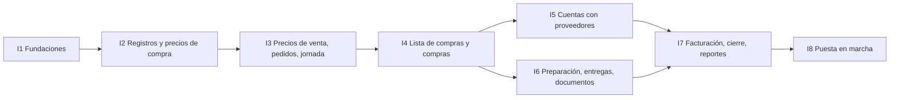

# 10 · Plan de implementación

> **Propósito:** el orden en que se construyó el sistema, qué quedó hecho, cómo se prueba, cómo se cargan los datos reales y qué falta para empezar a usarlo en el negocio. Es un sistema de uso interno (lo desarrolla el hermano del dueño con Claude): no hay equipo, fechas, costos ni aprobaciones formales.

## Contenido

1. [Estado](#1-estado)
2. [Iteraciones construidas](#2-iteraciones-construidas)
3. [Iteración 8: puesta en marcha](#3-iteración-8-puesta-en-marcha)
4. [Pruebas](#4-pruebas)
5. [Carga de los datos reales](#5-carga-de-los-datos-reales)
6. [Decisiones tomadas](#6-decisiones-tomadas)
7. [Pendientes e ideas](#7-pendientes-e-ideas)

---

## 1. Estado

| Iteración | Contenido | Estado |
|---|---|---|
| I1 | Fundaciones y seguridad | Hecha |
| I2 | Catálogo, clientes, proveedores y precios de compra | Hecha |
| I3 | Precios de venta, pedidos y jornada | Hecha |
| I4 | Lista de compras y compras | Hecha |
| I5 | Cuentas con proveedores | Hecha |
| I6 | Preparación, repartos, entregas y documentos | Hecha |
| I7 | Facturación interna, cierre del día y reportes | Hecha |
| — | Interfaz para el uso diario: tablero de pedidos, paso a paso, carga visual de pedidos, lista de compras con "✓ Lo compré", preparación por cliente, "Sale ahora", etapas del día en el menú, remitos del día, planilla de productos | Hecha |
| — | Afinado del 06 y 07/10: código y dibujo automáticos de cada producto, productos y pedidos en Excel (subir y bajar), tablero de colores vivos con arrastre nuevo y tildes de compra en la tarjeta, lista de compras con cartel del día, "para quién" y descarga a Excel, balance con barras y balance del día, campanita de avisos | Hecha |
| — | Segundo afinado del 07/10: un solo checklist de productos (tarjeta cerrada, tarjeta abierta y preparación), precio y puesto en cada renglón de la lista de compras, Nuevo pedido con una sola lista y la cantidad fácil de cambiar, fechas grandes, obligatorios en rojo; **A cobrar**, **Gastos e ingresos** y el balance del dinero real, pendiente y total; y la aplicación mucho más rápida (pocas idas a la base) | Hecha |
| — | Tercer afinado del 07/10: letra más grande en todo el sistema, botones centrados, menú con el Tablero destacado, "Guardar" siempre a la vista en Nuevo pedido, detalle del pedido de más a menos, "$" de precio y proveedor en la tarjeta abierta, tarjetas que vuelven un paso atrás y reabrir el día desde el tablero, pago a proveedores eligiendo las compras con el importe precargado, y la lista de compras con lo que sale cada producto y el total | Hecha |
| — | Afinado del 08/10: el recorrido del día en una sola lista que se arrastra (con destinos extra, favoritos y "calcular el mejor recorrido" al final), el reparto con esa misma lista, quién recibió con un toque, el rubro Café, el menú que se guarda (cajón en el celular), el tablero sin desplazar la página (deslizando de costado en el celular) y el botón de precio que se oscurece cuando ya se cargó | Hecha |
| — | Afinado del 08 al 10/10: el tablero en el celular al estilo de Trello (columnas que se deslizan, etapas del día para saltar entre columnas, opciones en una hoja que sube, botón flotante de Nuevo pedido), lo agregado primero en Nuevo pedido, el cartel del día (gastado, ganancia cobrada y a cobrar), más días y un calendario para elegir el día, el día elegido compartido con las demás pantallas y el menú, la tarjeta abierta quieta con la ✕ flotante, Pagado / A cuenta en cada renglón de la lista de compras, los números de A cobrar y A pagar en el menú, mapas en Tucumán, las pantallas que se ponen al día solas, la app instalable, el celular más compacto, los buscadores con ✕ y el modelo de remito nuevo | Hecha |
| — | Pedidos del 10/10: datos de prueba borrados, "Comprado" pasa a "Retiro", el cartel con Ganancias / Gastos / A cobrar y el día en grande, el día del menú con ‹ ›, tarjetas que se minimizan, la lista de compras por puesto o por grupo con el puesto de cada renglón, compras sin puesto (efectivo) y con puesto (a cuenta), destildar compras anotadas, la hoja impresa más simple, precio sobre la marcha, eliminar y recuperar pedidos, quitar todos los productos, quién se encarga de cada paso, la campanita en Avisos / Actividad / Notificaciones, productos por cajón o bolsa sin kilos, búsqueda que filtra mientras se escribe y la ubicación que se completa sola (Tucumán) | Hecha |
| — | Pedidos del 10/10 (tercero): el **resumen balance** arriba del tablero (Gastos = Pagado + Crédito, y la Caja inicial que se carga por día, con aviso en rojo y en la campanita si los gastos la superan), "Tablero / Paso a paso" a la izquierda de "Elegir pedidos", la columna **Retiro guardada** (de Lista de compras se pasa directo a Preparando), el nombre del cliente que ya no se parte en las tarjetas angostas, el celular con letra normal (14 px) y usado como una app (sin zoom, sin que la página se mueva, sin franjas), el menú que cambia de día en el momento y las lecturas que acompañan al tablero y a la tarjeta abierta con pocas idas a la base | Hecha |
| I8 | Puesta en marcha | En curso (§3) |

El orden siguió el circuito del negocio; cada iteración quedó usable antes de pasar a la siguiente.

---

## 2. Iteraciones construidas

Cada una se da por terminada con sus pruebas automáticas en verde y los números del ejemplo del plan (04 §2, la jornada del 24/09) reproducidos exactamente.

| Iteración | Qué incluye | Cómo se verificó |
|---|---|---|
| I1 · Fundaciones | Tablas de seguridad, RLS forzado por empresa, roles de base (`app_servidor`, `app_negocio`, `app_operativo`, `app_alta`), permisos `modulo.accion`, auditoría, numeración, configuración inicial desde la app, ingreso con usuario o Google y pedidos de acceso. | Dos empresas: ningún listado muestra datos de la otra; la auditoría no se puede tocar con el rol de la aplicación. |
| I2 · Registros y precios de compra | Productos con sus envases, clientes con sus direcciones, proveedores, precios por puesto con historial, lista general de precios (DOC-06). | La lista general y la comparación de la cebolla dan lo de 05 §2.1 y §3. |
| I3 · Precios de venta y pedidos | Los 7 niveles de precio de venta, redondeo, alertas de margen, pedidos y jornada. | Los precios del ejemplo de 05 §5.3 y §10 salen exactos. |
| I4 · Lista de compras y compras | Lista del día con envases completos y el puesto que conviene, compras de contado, a crédito o mixtas con límite de crédito, costo real del día (DOC-01). | Lista de $646.300 y compras por $653.050; tomate a $925/kg. |
| I5 · Cuentas con proveedores | Pagos con imputación automática o elegida, saldo a favor, ajustes, anulaciones, vencimientos (DOC-05). | Los 12 pasos de 06 §12 dan los mismos saldos e imputaciones. |
| I6 · Preparación y entregas | Preparación por cliente con reparto de faltantes, peso real, reemplazos, remitos sin precios y con precios congelados (DOC-02, DOC-03), repartos, confirmación en el celular (DOC-04, DOC-07). | Faltante de lechuga 48/22/14; la verdulería pasa a $222.770 en la versión 2; ningún documento sin precios lee precios. |
| I7 · Facturación y cierre | Comprobante interno no fiscal (DOC-08) automático o por período, exportación al contador (Excel o CSV), cierre del día con resumen, reportes básicos, balance con gráficos. | Resumen del 24/09: vendido $806.370, margen $174.780, resultado $153.320, deuda $680.550. |
| Interfaz de uso diario | Tablero de pedidos (Pedidos → Lista de compras → Preparando → En camino → Entregados; la columna Retiro está guardada por ahora) con el resumen balance arriba, el día paso a paso, carga visual de pedidos, lista de compras para el mercado con "✓ Lo compré", preparación por cliente con "Está todo" o "Falta algo" y el motivo, el recorrido del día con GPS (destinos que se arrastran, destinos extra y favoritos), notas y actividad, pagar cada compra en un toque con los datos para transferir a la vista, balance con tarjetas de colores y comparación con el período anterior. Las etapas del día en curso en el menú de la izquierda, "🚚 Sale ahora" desde Preparando (arrastrando, eligiendo o con el botón) que arma el reparto y lo hace salir, la preparación explicada en tres pasos, los remitos del día en una pantalla para verlos o imprimirlos, la ubicación de los clientes en un mapa en la computadora, y los productos cargados de una vez desde la planilla modelo, con categorías que se arrastran. | Recorridas en el navegador con datos de ejemplo, en celular y computadora, sin errores en la consola; "Sale ahora" y la planilla con pruebas de integración. |
| La plata y la velocidad | Lo que debe cada cliente ("A cobrar") con cobros en un toque, gastos e ingresos generales por rubro, y el balance con el dinero real, el pendiente y el total, las compras pagadas y a pagar y las ventas cobradas y a cobrar. Cada pantalla y cada botón del día hacen pocas idas a la base (`docs/tecnico/base-de-datos.md`, "Velocidad"). | Pruebas de `tests/integracion/plata.test.ts` y `tests/dominio/cuentas-y-dinero.test.ts`; `tests/integracion/velocidad.test.ts` fija el máximo de idas de cada paso. Medido contra la base real desde la computadora de desarrollo: el tablero del día pasó de 2,5 s a 0,2 s; guardar un pedido, de 49 idas a 5; "Sale ahora", de 65 a 17. |

Los pedidos no se confirman a mano: se cargan completos y, al mandarlos a la lista de compras o al empezar a preparar, los que quedaron sin terminar pero tienen productos se completan solos.

---

## 3. Iteración 8: puesta en marcha

| Tarea | Estado |
|---|---|
| Cabeceras de seguridad (sin iframes, sin adivinar tipos, HSTS, permisos del navegador) | Hecha |
| Pantallas de error amables (la página y la aplicación entera) | Hecha |
| Ícono y manifiesto para instalarla ("📲 Instalar la app" en el menú, o "Agregar a inicio" en el iPhone) y abrirla sin nada del navegador, con atajos a Nuevo pedido, Lista de compras y Logística | Hecha |
| Configuración del negocio desde la app (datos para los documentos, redondeo, margen mínimo, avisos de precios, colores y avisos de deuda, hora de corte de pedidos, tolerancia de peso) | Hecha |
| Revisión de permisos y RLS | Hecha: las pruebas de integración recorren los permisos con dos empresas y el rol sin precios |
| Base de producción: el proyecto de Supabase que ya existía (`sistema-juan-dev`), con las migraciones 0000 a 0027 aplicadas. Desde el 09/10/2026 tiene **datos reales**: ya no se reinicia y las migraciones nuevas solo agregan. Pasar a un proyecto aparte queda para cuando haga falta separar pruebas de datos reales | Hecha |
| Publicar en Vercel (dominio gratuito de Vercel): importar el repositorio `Facumirande/sistema-juan` desde vercel.com, cargar las variables `NEXT_PUBLIC_SUPABASE_URL`, `NEXT_PUBLIC_SUPABASE_PUBLISHABLE_KEY`, `SUPABASE_SECRET_KEY` y `DATABASE_URL` (las de `.env.local`) y desplegar. `vercel.json` ya fija la región São Paulo (`gru1`), la misma de la base. Después, en Supabase → Authentication → URL Configuration, poner la dirección de Vercel como Site URL y en Redirect URLs (para entrar con Google) | Hecha (09/10/2026, por el usuario) |
| Activar "Entrar con Google" (el botón ya está en el ingreso y en Crear una cuenta; mientras no se active, avisa que falta y ofrece entrar con usuario): en Google Cloud, crear un cliente OAuth "Aplicación web" con la dirección de retorno `https://<ref>.supabase.co/auth/v1/callback`; en Supabase, Authentication → Sign In / Providers → Google con ese Client ID y Client Secret, y en URL Configuration agregar `https://<dominio>/auth/callback` (y `http://localhost:3000/auth/callback` para probar). Hacerlo en el proyecto de desarrollo y repetirlo en el de producción | Pendiente (lo hace el usuario: necesita su cuenta de Google Cloud) |
| Primer uso en producción: configuración inicial, y habilitar al dueño y a su esposa desde Usuarios | Hecha |
| Cargar los datos reales (§5) | En curso: ya están los productos, los proveedores y los primeros clientes de Tucumán |
| Usar un día completo en paralelo con el papel y corregir lo que aparezca | Pendiente |

**Si algo falla el día que se empieza:** se sigue en papel con la lista de compras y los remitos ya impresos por el sistema; lo cargado no se pierde y se completa después.

---

## 4. Pruebas

| Nivel | Herramienta | Qué cubre |
|---|---|---|
| Dominio | Vitest | Todos los cálculos de `src/dominio` (dinero, precios, créditos, faltantes, pasos del día), con los ejemplos numéricos de 04 a 07. Cobertura del 100 %. |
| Integración | Vitest con PGlite (PostgreSQL en memoria con las mismas migraciones; `docs/tecnico/base-de-datos.md`) | RLS con dos empresas, rol sin precios, transacciones completas (registrar compra, preparar, emitir documentos, cerrar el día), inmutabilidad, idempotencia. |
| Fuga de precios | Integración | Los documentos y pantallas de preparación y reparto se arman con consultas que no leen precios. |
| Velocidad | Integración (`tests/integracion/velocidad.test.ts`) | Cuántas idas a la base hace cada paso del día y cada pantalla; falla si un cambio vuelve a poner consultas una detrás de otra. |
| Conexión | `tests/seguridad/conexion.test.ts`, con el cliente real de postgres.js contra PGlite por un socket | Transacciones sin esperar el `begin` ni el `commit` de las que solo leen, vuelta atrás ante un error y conexiones cortadas. |
| Pantallas | Navegador, con una base local de ejemplo | Recorrido en celular y computadora de lo que cambia. |

Cada prueba lleva en su nombre la regla o el caso que cubre (`RN-063`, `06 §12`). Antes de dar algo por terminado: `pnpm typecheck`, `pnpm lint` y `pnpm test`.

---

## 5. Carga de los datos reales

**Datos de prueba borrados (10/10/2026, a pedido del usuario):** con un respaldo previo (`.respaldos/2026-10-10-antes-de-limpiar`, fuera de git) se borraron los días hasta el 11/10 (3 pedidos con sus compras, entregas, remitos, repartos y el comprobante), los 4 clientes de ejemplo con sus cobros, los 3 puestos de ejemplo con sus compras y pagos y 4 productos de ejemplo que nadie usaba; antes y después se verificó que lo real quedó igual (clientes, puestos, productos, los pedidos del 14/10 con sus 35 compras y la deuda con los puestos). Quedaron como productos reales 8 que eran de ejemplo pero ya se usan en pedidos o se renombraron (Papa, Naranja, Pera, Banana, Cebolla morada, Perejil, Tomate redondo, Lechuga crespa). La base ya no se reinicia.

| # | Qué | De dónde sale | Dónde se carga |
|---|---|---|---|
| 1 | Datos del negocio y valores por defecto | Dueño | Mi cuenta → Configuración del negocio |
| 2 | Productos con sus envases de compra y venta | Lista de precios actual | Productos → 📄 Cargar desde una planilla: bajar la planilla modelo, escribir los nombres uno debajo del otro (lo demás es opcional) y subirla; el sistema arma el código y el dibujo, propone la categoría y avisa lo importante que falta. De a uno, Productos → Nuevo producto |
| 3 | Proveedores (puesto, teléfono, límite de crédito, días para pagar) | Cuaderno de deudas | Proveedores → Nuevo proveedor |
| 4 | Precios de cada puesto | Última semana de compras | Precios de hoy (o "💲 Precio y puesto" en la lista de compras, que los actualiza) |
| 5 | Clientes con su dirección, horario y cada cuánto se les factura | Cuaderno de pedidos | Clientes → Nuevo cliente |
| 6 | Precios pactados y ganancias especiales | Dueño | Precios de venta y ficha del cliente |
| 7 | Deuda con cada proveedor al día de arranque (una boleta por fila) | Cuaderno de deudas, el día anterior | A pagar → el proveedor → Ajuste o deuda anterior |
| 8 | Lo que debe cada cliente al día de arranque | Cuaderno de fiados, el día anterior | Clientes → el cliente → 🤝 Su cuenta → "¿Ya debía plata antes de empezar a usar el sistema?" |

**Verificación con el dueño:** el saldo de cada proveedor y lo que debe cada cliente iguales a los de su cuaderno, y el precio de venta de una muestra de productos para 3 clientes igual al que cobra hoy (si no, se ajustan las ganancias antes de empezar).

---

## 6. Decisiones tomadas

Todas cerradas; cualquiera se revisa si el uso real lo pide. El detalle está en `PARAMETROS-DEL-PROYECTO.md` §13.

| ID | Decisión |
|---|---|
| D-01 | Argentina, pesos argentinos. |
| D-02 | Sin nombre comercial; el dominio es el que dé el hosting. |
| D-03 | Valores por defecto de `PARAMETROS-DEL-PROYECTO.md` §11, cambiables desde Configuración. |
| D-04 | Precios sin IVA (son los que se cobran); el IVA de compras no se computa. |
| D-05 | Cancelar un pedido que ya se está preparando deja su entrega en 0. |
| D-06 | La lista con precios no se manda sola: se imprime o se comparte a mano. |
| D-07 | Dos copias del remito sin precios (una firmada queda en el negocio). |
| D-08 | Negocio chico: no se releva el volumen. |
| D-09 | Sin modo offline por ahora; se revisa si falta señal en el mercado. |
| D-10 | Sin equipo ni presupuesto: desarrollo propio. |

---

## 7. Pendientes e ideas

**Para decidir (pedido del usuario, 10/10/2026): si vuelve la columna Retiro.** Está guardada "por ahora": el tablero va de Lista de compras directo a Preparando (RN-195). Para volver a mostrarla alcanza con poner `RETIRO_A_LA_VISTA = true` en `src/dominio/pedidos/tablero.ts` (el tablero, el botón verde, el paso atrás, los responsables y las pruebas ya contemplan las dos formas).

**Para revisar en Vercel (10/10/2026): la variable `DATABASE_POOL_MAX`.** La guía decía que en Vercel convenía 1; con 1, todo lo que una pantalla pide a la vez hace fila en una sola conexión y demora. Si está cargada en el proyecto de Vercel, hay que sacarla (el valor por defecto ahora es 10). No se puede ver ni cambiar desde el código: lo tiene que mirar el usuario en Vercel → Settings → Environment Variables.

**Pendiente de probar en los celulares del negocio (10/10/2026, tercero):** el celular como app (que no se agrande con dos dedos, que la página no se mueva ni rebote, que no queden franjas arriba ni abajo, y que al volver atrás se retome donde se estaba), sobre todo instalada desde "Agregar a inicio"; la letra más chica; y cargar la caja inicial con el teclado del celular. Se recorrió en la computadora, en tamaño de celular y de escritorio (1366 y 1536 px, con el menú abierto y guardado), con datos de ejemplo. El bloqueo del zoom depende del aparato: en la computadora no se puede comprobar.

**Idea (10/10/2026): abrir la tarjeta sin ir al servidor.** Al abrir una tarjeta del tablero todavía se pide la pantalla entera (por eso se ve un instante la silueta del tablero antes de la tarjeta). Se podría abrir en el momento con lo que la tarjeta ya tiene y pedir aparte el resto (notas, historial, precios); es un cambio grande de esa pantalla.

**Pendiente (pedido del usuario, 05/10/2026): facturación legal.** La factura válida es la electrónica de ARCA con CAE; hoy el sistema emite un comprobante interno. Para conectarlo con ARCA falta saber si el negocio es monotributista (Factura C, compatible con precios sin IVA) o responsable inscripto (A/B con IVA, cambia D-04), su CUIT con clave fiscal nivel 3, un punto de venta para web service y el certificado digital (la solicitud la prepara el sistema). Se prueba primero en el entorno de homologación de ARCA.

**Pendiente de probar con el uso real (06/10/2026):** el arrastre de tarjetas con el dedo (se levanta manteniendo apretado un instante) se probó en la computadora; falta usarlo en los celulares del negocio y ajustar la espera si resulta corta o larga (`ESPERA_AL_TOCAR` en `app/(app)/inicio/tablero.tsx`). Las notificaciones fuera de la pestaña solo funcionan en la computadora: en el celular haría falta instalar un servicio de notificaciones (push), que no está hecho.

**Pendiente de probar en los celulares del negocio (07/10/2026):** ordenar la lista de compras arrastrando con el dedo, la compra producto por producto en el mercado y los tildes de "separado" en las tarjetas del tablero. Están probados en la computadora y con las pruebas automáticas.

**Para decidir con el uso (07/10/2026):** desde Excel se cargan productos y pedidos; cargar clientes, proveedores o los precios de cada puesto desde una planilla no está hecho. La planilla de productos solo crea productos nuevos: no cambia los que ya existen.

**Pendiente: activar "Entrar con Google"** en Supabase y Google Cloud (pasos en §3). Lo tiene que hacer el usuario porque necesita su cuenta de Google Cloud; el sistema ya está listo.

**Pendiente de probar con el uso real (07/10/2026):** las pantallas nuevas (A cobrar, Gastos e ingresos, el balance del dinero, "💲 Precio y puesto" en la lista y el checklist en Preparación) se recorrieron en la computadora con datos de ejemplo; falta usarlas en los celulares del negocio. Los rubros de gastos predefinidos se crean la primera vez que se abre la pantalla: conviene revisarlos ese día y dar de baja los que no se usen.

**Para decidir con el uso (07/10/2026):** lo que falta cobrar no tiene vencimiento ni aviso (el plazo de cobro del cliente no se usa); un gasto a pagar más adelante se anota recién cuando se paga; y "A cobrar" cuenta toda entrega confirmada, tenga o no hecho su comprobante. La velocidad se midió desde la computadora de desarrollo (unos 50 ms por ida a la base); publicado en Vercel, en la misma región que la base, cada ida baja a pocos milisegundos.
**Corregido el 07/10/2026 (por si reaparece algo parecido):** "Registrar pago" con el importe vacío mostraba "problema del sistema" en vez de avisar que faltaba el importe; el mismo defecto estaba en los otros formularios con un número obligatorio (cantidad de una compra, ajuste, lo preparado, etc.). Se arregló en un solo lugar (`numeroObligatorio`, RN-175) y quedó con su prueba.

**Pendiente de probar con el uso real (07/10/2026):** volver atrás una tarjeta arrastrándola con el dedo en el celular, y la letra más grande en los celulares del negocio (se revisó en la computadora, en ventana grande y chica). "Reabrir el día" desde el tablero se probó con las pruebas automáticas, no en pantalla.

**A tener en cuenta:** el mapa para marcar ubicaciones usa los mapas gratuitos de OpenStreetMap, que piden no abusar (un negocio chico está muy lejos del límite). Si algún día se cortan, las ubicaciones se siguen marcando desde el celular (estando ahí, buscando la dirección o pegando un enlace de Google Maps).

**Pendiente del usuario (10/10/2026): marcar de dónde salen los repartos.** El lugar que estaba marcado quedaba en Posadas (Misiones) y se sacó al llevar todo a Tucumán; hasta que se marque el depósito o el mercado (Logística → 🏬 De dónde salen los repartos), el mejor recorrido se calcula desde donde está el celular o desde la dirección que se elija. Varios clientes reales tienen como dirección una esquina ("Lavalle y Colón"): OpenStreetMap no encuentra bien las esquinas, así que conviene marcarlos en el mapa.

**Pendiente del usuario (10/10/2026): datos del negocio para el remito.** El remito nuevo muestra la razón social, el domicilio, el CUIT y la condición de IVA del negocio (Mi cuenta → Configuración del negocio) y el CUIT y la condición de IVA de cada cliente (su ficha); lo que no esté cargado no aparece. El logo es el ícono del sistema: un logo propio del negocio no está hecho.

**Pendiente de probar con el uso real (10/10/2026, segundo pedido):** la dirección que se completa sola usa el servicio gratuito Photon (de OpenStreetMap); si algún día no responde, se sigue marcando en el mapa, con el GPS o pegando un enlace. Las calles de Tucumán que no estén cargadas en OpenStreetMap no van a aparecer: ahí, marcar en el mapa. Los productos que ya existen por kilo siguen por kilo (cómo se vende no se cambia después del alta): si alguno conviene contarlo por cajón, se lo da de alta de nuevo así. El gasto de $23.000 de "Ayudantes y jornales" del 08/10 quedó cargado (lo anotó Juan Manuel, no es un ejemplo): si fue de prueba, se anula desde Gastos e ingresos. Los 4 pedidos del 14/10 se cargaron el 08 y 09/10: si también eran de prueba, se eliminan desde su tarjeta (🗑 Eliminar el pedido).

**Pendiente de probar en los celulares del negocio (10/10/2026):** instalar la app (en Android desde "📲 Instalar la app"; en el iPhone, Compartir → Agregar a inicio) y usarla así; que las pantallas se pongan al día solas con las dos personas trabajando a la vez; el calendario para elegir el día; el interruptor Pagado / A cuenta en el mercado; y el tablero más compacto. Se recorrieron con las pruebas automáticas y en la computadora.

**Pendiente de probar en los celulares del negocio (08/10/2026):** arrastrar los destinos del recorrido con el dedo, el menú como cajón, el tablero deslizando de costado y los botones de quién recibió. Se recorrieron en la computadora (ventana grande y tamaño de celular) con datos de ejemplo y con las pruebas automáticas (`tests/integracion/recorrido.test.ts`). "Calcular el mejor recorrido" no cambió su cuenta (la misma de antes, con sus pruebas); falta verlo con ubicaciones reales.

**Ideas** (no pedidas; solo si el uso real las justifica):

- Consultar la lista de compras y anotar compras sin señal en el mercado.
- Sobrantes y mermas que se descuenten de la compra siguiente.
- Vencimiento y avisos de lo que falta cobrar a cada cliente.
- Pedidos habituales ("todos los lunes lo mismo").

