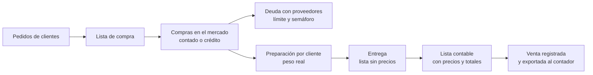

# Plan del sistema de gestión para distribuidores de frutas y verduras

Índice del plan de diseño de "Sistema Juan" (sistema de uso interno, sin nombre comercial). Las decisiones fijas del proyecto están resumidas en [`PARAMETROS-DEL-PROYECTO.md`](../../PARAMETROS-DEL-PROYECTO.md); estos documentos tienen el detalle completo.

**Estado:** plan completo (documentos 01 a 10), pendiente de revisión y aprobación del dueño. Todavía no hay código.
**Última actualización:** 24/09/2026.

---

## Qué resuelve el sistema

Un distribuidor compra frutas y verduras en el mercado y las lleva a sus clientes (hospitales, restaurantes, comercios). El sistema acompaña el circuito completo del día:

Es una aplicación web que se instala en el celular (PWA): las pantallas del mercado, el depósito y el reparto están pensadas para el celular; las de precios, cuentas y reportes, para la computadora.

---

## Documentos

| # | Documento | De qué trata | Para quién es más útil |
|---|---|---|---|
| 01 | [Tipo de aplicación y arquitectura](01-tipo-de-aplicacion-y-arquitectura.md) | Por qué una web instalable, tecnología, módulos M01 a M19, seguridad, respaldos, rendimiento, costos de infraestructura, riesgos técnicos. | Dueño (secciones 1 a 4 y 20), desarrolladores |
| 02 | [Usuarios, roles y permisos](02-usuarios-roles-y-permisos.md) | Los 6 roles, el catálogo de permisos `modulo.accion`, qué ve cada uno y cómo se garantiza que preparación y reparto nunca vean precios. | Dueño, desarrolladores |
| 03 | [Modelo de datos](03-modelo-de-datos.md) | Todas las tablas, campos, estados, restricciones, índices y vistas. **Fuente de verdad de nombres.** | Desarrolladores |
| 04 | [Procesos y flujos](04-procesos-y-flujos.md) | El circuito de 12 pasos, la jornada y cada proceso paso a paso, con excepciones. | Dueño, todo el equipo |
| 05 | [Precios y márgenes](05-precios-y-margenes.md) | Precios de compra y su actualización, comparación entre proveedores, costo de referencia, precio de venta con 7 niveles de reglas, redondeo, IVA, alertas. | Dueño, desarrolladores |
| 06 | [Créditos y pagos](06-creditos-y-pagos.md) | Cuenta corriente de proveedores, pagos e imputación, límite de crédito y semáforo, vencimientos; cobranzas de clientes (PROPUESTO). | Dueño, administración, desarrolladores |
| 07 | [Reglas de negocio](07-reglas-de-negocio.md) | Catálogo RN-001 a RN-152, 38 casos borde resueltos, parámetros por empresa. | Dueño (para validar), desarrolladores (para probar) |
| 08 | [Pantallas y acciones](08-pantallas-y-acciones.md) | Las pantallas P-01 a P-98, navegación por rol, bocetos de las pantallas del celular, acciones con su permiso y regla, reportes. | Dueño, diseño, desarrolladores |
| 09 | [Documentos imprimibles](09-documentos-imprimibles.md) | DOC-01 a DOC-08: contenido, permisos, versiones, ejemplos impresos y cómo se generan. | Dueño, desarrolladores |
| 10 | [Plan de implementación](10-plan-de-implementacion.md) | Fases, 8 iteraciones del MVP, cronograma, pruebas, migración de datos, puesta en marcha, esfuerzo, decisiones pendientes. | Dueño, líder técnico |

### Cómo leerlo

- **Dueño del negocio (primera lectura, ≈ 1 hora):** este índice → 04 §3 (los 12 pasos) → 04 §4.4 (un día típico) → 08 §5.8, §5.10 y §5.11 (pantallas del mercado, el depósito y el reparto) → 09 DOC-02 y DOC-03 (los dos documentos de cada entrega) → 10 §1 y §11 (plazos y decisiones que tiene que tomar).
- **Para validar las reglas:** 07 completo; cada regla tiene un número y los casos borde tienen ejemplo.
- **Desarrolladores:** 01 → 03 → 02 → 04 → 05 → 06 → 07 → 08 → 09 → 10.

---

## Vocabulario básico

| Término | Significado |
|---|---|
| Jornada | La fecha de entrega. Agrupa los pedidos, la lista de compra, las compras, la preparación y las entregas de ese día. |
| Unidad base | Unidad en la que se hacen todos los cálculos de un producto (kg, unidad, atado…). |
| Presentación | Cómo se compra o vende (cajón 18 kg, bolsa 25 kg, jaula 12 u) y cuántas unidades base contiene. |
| Recargo | El "porcentaje de ganancia": se suma sobre el costo. Precio = costo × (1 + recargo/100), redondeado. |
| Margen | (Precio − costo) ÷ precio. Se muestra en los reportes. |
| Precio congelado | El precio de venta queda fijo al emitir los documentos de la entrega; después no cambia. |
| Semáforo de crédito | Uso del límite con cada proveedor: VERDE < 70 %, AMARILLO 70 % a < 90 %, ROJO 90 % a 100 %, EXCEDIDO > 100 %. |
| PROPUESTO | Función sugerida por el diseño pero no pedida: queda para fases posteriores. |

Identificadores usados en todo el plan: módulos **M01–M19** (01), permisos **`modulo.accion`** (02), reglas **RN-001–RN-152** (07), pantallas **P-01–P-98** (08), componentes **C-01–C-14** (08), documentos **DOC-01–DOC-10** (09), riesgos **RT-xx** (01) y **RP-xx** (10), decisiones pendientes **D-01–D-10** (10), funciones de fases posteriores **F2-xx** y **F3-xx** (10).

---

## Ejemplos numéricos

Los documentos 04 a 10 usan el mismo escenario: la jornada del jueves 24/09/2026 con Hospital San Martín, Restaurante La Esquina y Verdulería Don Pepe, y los proveedores A a E (04 §2). Los números se pueden seguir de un documento a otro y son la base de las pruebas de aceptación (10 §7.2). El documento 03 §19 usa un escenario propio más chico (Hospital Central, Puesto Don Carlos, Hortícola Los Hermanos) para mostrar cómo quedan las filas de cada tabla; no hay que combinar sus números con los de 04.

---

## Nombres canónicos

Cuando dos documentos nombran distinto lo mismo, vale:

- **Tablas, campos, enums y vistas:** `03-modelo-de-datos.md`.
- **Permisos:** el catálogo de `02-usuarios-roles-y-permisos.md` §4.
- **Estados:** los de `PARAMETROS-DEL-PROYECTO.md` §6.

En la revisión del 24/09/2026 se unificaron los nombres que diferían:

| Antes (en algún documento) | Nombre canónico |
|---|---|
| `jornadas.gestionar`, `jornadas.reabrir` | `jornada.gestionar` (avanzar a mano), `jornada.cerrar` (cerrar), `jornada.reabrir` |
| `pagos.ajustar_cuenta` | `pagos.ajustar` |
| `proveedores.editar_credito` | `proveedores.editar_limite` |
| Emitir documentos con `entregas.gestionar` | `entregas.emitir_documentos` (`entregas.gestionar` arma entregas y las pasa a `EN_REPARTO`) |
| `COSTO_REAL_JORNADA` | `REAL_JORNADA` (enum `origen_costo`) |
| Motivos `MAL_ESTADO`, `CALIBRE_O_CALIDAD`, etc. | Enum `motivo_diferencia`: `RECHAZO_CALIDAD`, `FALTANTE`, `NO_CONSEGUIDO`, `ERROR_PREPARACION`, `CAMBIO_CLIENTE`, `OTRO` |
| Imputaciones con `estado = 'VIGENTE'` y `movimiento_ajuste_id` | `activa` (booleano), `movimiento_acreedor_id` (ajuste de crédito) y `movimiento_deudor_id` (ajuste de débito) |
| Lista de compra "una fila por versión, una vigente" | Una fila por jornada que incrementa `version` |
| `entrega.documentos_version` | No existe: `entrega.version` = 0 sin documentos; la primera emisión la lleva a 1 (09 §4.2) |
| `empresa.dias_precio_desactualizado` | `empresa.dias_alerta_precio_desactualizado` |

---

## Decisiones pendientes

Las que el dueño tiene que tomar, con la fecha en que hacen falta, están en `10-plan-de-implementacion.md` §11 (D-01 a D-10). País y moneda (Argentina, ARS) y nombre comercial (no hace falta) ya están resueltas. Las principales que quedan: confirmar los valores por defecto de los parámetros, tratamiento del IVA y si se permite cancelar un pedido que ya está en preparación.
